```mermaid
graph TB
    subgraph "Application Layer"
        Server[Server Entry Point]
        Config[Configuration Management]
    end
    
    subgraph "Business Layer"
        CloudControl[CloudControl Bus]
        subgraph "Business Managers"
            JWTManager[JWT Manager]
            StatsManager[Stats Manager]
            NodeManager[Node Manager]
            AnonymousManager[Anonymous Manager]
            SearchManager[Search Manager]
            ConnectionManager[Connection Manager]
            ConfigManager[Config Manager]
            CleanupManager[Cleanup Manager]
        end
    end
    
    subgraph "Data Layer"
        subgraph "Repositories"
            UserRepo[User Repository]
            ClientRepo[Client Repository]
            MappingRepo[Port Mapping Repository]
            NodeRepo[Node Repository]
            ConnectionRepo[Connection Repository]
        end
        
        subgraph "Storage Abstraction"
            MemoryStorage[Memory Storage]
            RedisStorage[Redis Storage]
            CustomStorage[Custom Storage]
        end
    end
    
    subgraph "Infrastructure Layer"
        subgraph "Distributed Services"
            IDGenerator[Distributed ID Generator]
            DistributedLock[Distributed Lock]
        end
        
        subgraph "Protocol Layer"
            TCPAdapter[TCP Adapter]
            WebSocketAdapter[WebSocket Adapter]
            UDPAdapter[UDP Adapter]
            QUICAdapter[QUIC Adapter]
        end
    end
    
    Server --> CloudControl
    CloudControl --> JWTManager
    CloudControl --> StatsManager
    CloudControl --> NodeManager
    CloudControl --> AnonymousManager
    CloudControl --> SearchManager
    CloudControl --> ConnectionManager
    CloudControl --> ConfigManager
    CloudControl --> CleanupManager
    
    JWTManager --> UserRepo
    StatsManager --> UserRepo
    NodeManager --> NodeRepo
    AnonymousManager --> ClientRepo
    SearchManager --> UserRepo
    ConnectionManager --> ConnectionRepo
    
    UserRepo --> MemoryStorage
    ClientRepo --> MemoryStorage
    MappingRepo --> MemoryStorage
    NodeRepo --> MemoryStorage
    ConnectionRepo --> MemoryStorage
    
    CloudControl --> IDGenerator
    CloudControl --> DistributedLock
    
    Server --> TCPAdapter
    Server --> WebSocketAdapter
    Server --> UDPAdapter
    Server --> QUICAdapter
```

# Tunnox Core

<div align="center">


**🚀 Enterprise-Grade Cloud-Controlled Tunneling Core Framework**  
*Engineered for Performance, Scalability, and Production Excellence*

</div>

---

## 🎯 Project Overview

Tunnox Core is a **next-generation cloud-controlled tunneling framework** designed for distributed network environments. Built with **engineering excellence** and **performance-first** principles, it provides comprehensive capabilities for connection management, port mapping, authentication, statistics, and resource orchestration.

### 🌟 Core Philosophy

- **🏗️ Layered Architecture**: Clean separation of concerns with distinct layers for business logic, data access, and infrastructure
- **🔄 Resource Management**: Hierarchical Dispose tree ensuring graceful shutdown and resource cleanup
- **🛡️ Type Safety**: Strong typing with consistent naming conventions throughout
- **🧪 Testability**: 100% test coverage with isolated test environments
- **🔧 Extensibility**: Plugin-based manager architecture for easy feature expansion
- **⚡ Performance**: Zero-copy operations, memory pooling, and optimized data flow

---

## 🏗️ Architecture Overview



---

## ✨ Advanced Features & Technical Excellence

### 🔐 **Enterprise-Grade Authentication & Security**
- **🔑 JWT Token Management**: Secure token generation, validation, and refresh with automatic cleanup
- **⚡ Token Caching**: High-performance token cache with intelligent TTL management
- **👥 Role-based Access Control**: Granular permission control with hierarchical user management
- **🔒 Secure Communication**: End-to-end encrypted data transmission with TLS support
- **🛡️ Anonymous User Support**: TeamViewer-style anonymous mapping with server-assigned credentials

### 📊 **Real-time Analytics & Monitoring**
- **📈 Multi-dimensional Statistics**: Comprehensive traffic and connection analytics
- **👤 User Analytics**: Per-user and per-client performance metrics with historical trends
- **🖥️ System Monitoring**: Real-time system health monitoring with alerting capabilities
- **📊 Time-series Data**: Advanced trend analysis with configurable retention policies
- **🔍 Search & Discovery**: Full-text search across users, clients, and mappings

### 🌐 **Distributed Infrastructure**
- **🆔 Distributed ID Generation**: Conflict-free 8-digit ClientID generation across nodes
- **🔒 Distributed Locking**: Coordinated resource access with automatic cleanup
- **🖥️ Node Management**: Dynamic node registration with health monitoring and failover
- **⚖️ Load Balancing**: Intelligent traffic distribution with connection pooling
- **🔄 Auto-scaling**: Horizontal scaling support with seamless node addition/removal

### ⚡ **Performance Optimization**
- **🚀 Zero-Copy Operations**: Eliminate unnecessary memory allocations with zero-copy buffers
- **💾 Memory Pooling**: Efficient buffer management with size-specific pools
- **🔄 Connection Pooling**: Optimized connection reuse with intelligent lifecycle management
- **⚡ Rate Limiting**: Token bucket algorithm with configurable burst handling
- **🗜️ Compression**: Gzip compression with streaming support for bandwidth optimization

### 🔄 **Advanced Resource Management**
- **🌳 Dispose Tree**: Hierarchical resource cleanup with automatic cascading shutdown
- **🧹 Automatic Cleanup**: Background cleanup of expired resources with TTL management
- **💡 Memory Leak Prevention**: Systematic resource tracking and cleanup
- **⚡ Concurrent Safety**: Thread-safe operations with optimized locking strategies
- **🔄 Graceful Shutdown**: Coordinated shutdown with proper resource cleanup

### 🧩 **Extensible Architecture**
- **🔌 Manager Pattern**: Plugin-based business logic with hot-swappable components
- **🗄️ Repository Pattern**: Clean data access abstraction with multiple storage backends
- **💾 Storage Abstraction**: Pluggable storage backends (Memory, Redis, Custom)
- **🌐 Protocol Adapters**: Multi-protocol support (TCP, WebSocket, UDP, QUIC)
- **🔧 Factory Pattern**: Dynamic component creation with dependency injection

### 🚀 **Production-Ready Features**
- **📝 Comprehensive Logging**: Structured logging with configurable levels and outputs
- **🔍 Error Handling**: Rich error types with context and recovery mechanisms
- **📊 Metrics Collection**: Built-in metrics for monitoring and alerting
- **🔄 Health Checks**: Endpoint health monitoring with detailed status reporting
- **🔧 Configuration Management**: Dynamic configuration updates with validation

---

## 🚀 Quick Start

### Prerequisites

- Go 1.21 or higher
- Git

### Installation

```bash
# Clone the repository
git clone https://github.com/tunnox-net/tunnox-core.git
cd tunnox-core

# Install dependencies
go mod tidy

# Run tests
go test ./... -v

# Build the server
go build -o server cmd/server/main.go

# Run the server
./server
```

### Basic Usage

```go
package main

import (
    "context"
    "log"
    "tunnox-core/internal/cloud/managers"
    "tunnox-core/internal/cloud/storages"
)

func main() {
    // Create configuration
    config := managers.DefaultConfig()
    
    // Create storage backend
    storage := storages.NewMemoryStorage(context.Background())
    
    // Create cloud control instance
    cloudControl := managers.NewCloudControl(config, storage)
    
    // Start the service
    cloudControl.Start()
    defer cloudControl.Close()
    
    // Create a user
    user, err := cloudControl.CreateUser("john_doe", "john@example.com")
    if err != nil {
        log.Fatal(err)
    }
    
    // Create a client
    client, err := cloudControl.CreateClient(user.ID, "my-client")
    if err != nil {
        log.Fatal(err)
    }
    
    log.Printf("Created user: %s, client: %d", user.ID, client.ID)
}
```

---

## 📁 Project Structure

```
tunnox-core/
├── cmd/
│   └── server/                 # Server entry point
│       ├── main.go            # Main application
│       └── config/            # Configuration files
├── internal/
│   ├── cloud/                 # Cloud control core
│   │   ├── managers/          # Business managers
│   │   │   ├── base.go        # CloudControl core
│   │   │   ├── jwt_manager.go # JWT authentication
│   │   │   ├── stats_manager.go # Statistics
│   │   │   ├── node_manager.go # Node management
│   │   │   └── ...            # Other managers
│   │   ├── repos/             # Data repositories
│   │   ├── models/            # Data models
│   │   ├── distributed/       # Distributed services
│   │   ├── storages/          # Storage abstraction
│   │   ├── configs/           # Configuration structures
│   │   ├── constants/         # Constants
│   │   └── stats/             # Statistics structures
│   ├── protocol/              # Protocol adapters
│   ├── stream/                # Data streaming
│   └── utils/                 # Utilities
├── tests/                     # Test suite
├── docs/                      # Documentation
└── examples/                  # Usage examples
```

---

## 🔧 Configuration

### Server Configuration

```yaml
server:
  host: "0.0.0.0"
  port: 8080
  read_timeout: 30
  write_timeout: 30
  idle_timeout: 60
  protocols:
    tcp:
      enabled: true
      port: 8080
    websocket:
      enabled: true
      port: 8081
    udp:
      enabled: true
      port: 8082
    quic:
      enabled: true
      port: 8083

cloud:
  type: "built_in"
  jwt_secret_key: "your-secret-key"
  jwt_expiration: "24h"
  refresh_expiration: "168h"
  cleanup_interval: "5m"

log:
  level: "info"
  format: "text"
  output: "stdout"
```

### Environment Variables

```bash
export TUNNOX_JWT_SECRET_KEY="your-secret-key"
export TUNNOX_API_ENDPOINT="http://localhost:8080"
export TUNNOX_NODE_ID="node-001"
export TUNNOX_LOG_LEVEL="info"
```

---

## 📚 Documentation

- **[Architecture Guide](docs/architecture.md)** - Detailed architecture overview and design principles
- **[API Reference](docs/api.md)** - Complete API documentation and interfaces
- **[Usage Examples](docs/examples.md)** - Comprehensive code examples and best practices
- **[Configuration Guide](cmd/server/config/README.md)** - Configuration options and examples

---

## 🧪 Testing

### Run All Tests

```bash
go test ./... -v
```

### Run Specific Test Suites

```bash
# Cloud control tests
go test ./tests -v -run "TestCloudControl"

# Protocol tests
go test ./tests -v -run "TestProtocol"

# Resource management tests
go test ./tests -v -run "TestDispose"
```

### Test Coverage

```bash
go test ./... -cover
```

---

## 🔄 Development

### Adding New Managers

1. Create a new manager in `internal/cloud/managers/`
2. Implement the required interfaces
3. Add Dispose interface implementation
4. Register in CloudControl
5. Add comprehensive tests

### Adding New Storage Backends

1. Implement the `Storage` interface
2. Add factory method in `factories/`
3. Update configuration options
4. Add integration tests

### Code Style Guidelines

- Follow Go naming conventions
- Implement Dispose interface for all resources
- Add comprehensive error handling
- Write unit tests for all public APIs
- Use consistent logging patterns

---

## 🤝 Contributing

We welcome contributions! Please see our [Contributing Guide](docs/CONTRIBUTING.md) for details.

### Development Setup

1. Fork the repository
2. Create a feature branch
3. Make your changes
4. Add tests
5. Ensure all tests pass
6. Submit a pull request

### Code Review Process

- All changes require code review
- Tests must pass
- Documentation must be updated
- Performance impact must be considered

---

## 📄 License

This project is licensed under the MIT License - see the [LICENSE](LICENSE) file for details.

---

## 🙏 Acknowledgments

- Built with modern Go best practices
- Inspired by clean architecture principles
- Designed for production scalability
- Focused on developer experience

---

<div align="center">

**Built with ❤️ for the Go community**

[](https://github.com/tunnox-net/tunnox-core)
[](https://github.com/tunnox-net/tunnox-core)

</div>