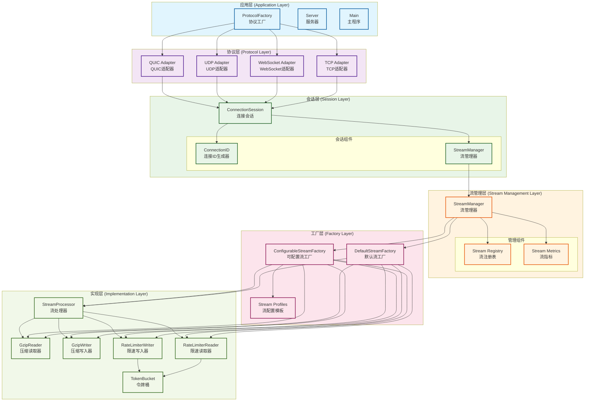

# Tunnox Core

<div align="center">


**🌐 云端隧道与连接管理核心框架**  
*专为分布式网络环境设计的轻量级隧道解决方案*

[🚀 快速开始](#-快速开始) • [🏗️ 系统架构](#️-系统架构) • [✨ 核心功能](#-核心功能) • [📦 项目结构](#-项目结构)

</div>

---

## 📋 项目概述

Tunnox Core 是一个基于 Go 语言开发的云端隧道框架，专为分布式网络环境设计。项目采用现代化的分层架构，集成了多种网络协议支持，通过内存池、零拷贝、流式处理等先进技术，为端口映射和连接管理提供高性能、低延迟的解决方案。

### 🎯 项目目标

| 目标 | 描述 | 状态 |
|------|------|------|
| **轻量隧道服务** | 提供端口映射和隧道功能框架，支持 TCP、HTTP、SOCKS 等多种协议映射 | 🔄 开发中 |
| **多协议支持** | 支持 TCP、WebSocket、UDP、QUIC 等多种传输协议，适应不同网络环境需求 | ✅ 已完成 |
| **分布式架构** | 支持集群部署和节点管理，实现高可用性和负载均衡 | 🔄 开发中 |
| **资源优化** | 通过内存池、零拷贝、连接池等技术大幅提升性能，降低资源消耗 | ✅ 已完成 |
| **可扩展性** | 模块化设计，插件化架构，便于功能扩展和定制化开发 | ✅ 已完成 |

### 🌟 技术特点

| 特性 | 描述 | 优势 |
|------|------|------|
| 🏗️ **分层架构** | 清晰的业务逻辑、数据访问和基础设施分离 | 便于维护和扩展 |
| 🏭 **工厂模式** | StreamFactory统一管理流组件创建，支持配置化工厂和预定义模板 | 统一管理和配置 |
| 🔧 **资源管理** | 基于 Dispose 模式的层次化资源清理，防止内存泄漏 | 确保优雅关闭 |
| 🛡️ **类型安全** | 强类型系统，统一的命名规范 | 提高代码质量和开发效率 |
| ⚡ **并发控制** | 线程安全的设计，优化的锁定策略 | 支持高并发场景 |
| 🚀 **性能优化** | 内存池、零拷贝、流式处理、压缩算法等技术的综合应用 | 高性能和低延迟 |
| 🔌 **协议适配** | 统一的协议适配器接口，支持多种网络协议的透明切换 | 灵活切换协议 |
| 📊 **流式处理** | 支持数据压缩、限速、分块传输等高级流处理功能 | 优化网络带宽 |
| 📈 **流管理** | StreamManager统一管理流生命周期，支持流注册、监控和指标统计 | 统一监控和管理 |

---

## 🏗️ 系统架构

```mermaid
graph TB
    subgraph "应用层"
        Server[服务器入口]
        Config[配置管理]
    end
    
    subgraph "业务层"
        CloudControl[云控总线]
        subgraph "业务管理器"
            JWTManager[JWT管理器]
            StatsManager[统计管理器 - 基础版]
            NodeManager[节点管理器 - 基础版]
            AnonymousManager[匿名管理器]
            SearchManager[搜索管理器 - 基础版]
            ConnectionManager[连接管理器 - 基础版]
            ConfigManager[配置管理器 - 基础版]
            CleanupManager[清理管理器 - 基础版]
        end
    end
    
    subgraph "数据层"
        subgraph "数据仓库"
            UserRepo[用户仓库]
            ClientRepo[客户端仓库]
            MappingRepo[端口映射仓库]
            NodeRepo[节点仓库]
            ConnectionRepo[连接仓库]
        end
        
        subgraph "存储抽象"
            MemoryStorage[内存存储 - 已实现]
            RedisStorage[Redis存储 - 待实现]
            CustomStorage[自定义存储 - 待实现]
        end
    end
    
    subgraph "基础设施层"
        subgraph "分布式服务"
            IDGenerator[ID生成器 - 基础版]
            DistributedLock[分布式锁 - 基础版]
        end
        
        subgraph "协议层"
            TCPAdapter[TCP适配器 - 框架版]
            WebSocketAdapter[WebSocket适配器 - 框架版]
            UDPAdapter[UDP适配器 - 框架版]
            QUICAdapter[QUIC适配器 - 框架版]
        end
        
        subgraph "流处理"
            StreamProcessor[流处理器 - 基础版]
            RateLimiter[限速器 - 基础版]
            Compression[压缩器 - 基础版]
            Encryption[加密器 - 待实现]
        end
    end
    
    Server --> CloudControl
    CloudControl --> JWTManager
    CloudControl --> StatsManager
    CloudControl --> NodeManager
    CloudControl --> AnonymousManager
    CloudControl --> SearchManager
    CloudControl --> ConnectionManager
    CloudControl --> ConfigManager
    CloudControl --> CleanupManager
    
    JWTManager --> UserRepo
    StatsManager --> UserRepo
    NodeManager --> NodeRepo
    AnonymousManager --> ClientRepo
    SearchManager --> UserRepo
    ConnectionManager --> ConnectionRepo
    
    UserRepo --> MemoryStorage
    ClientRepo --> MemoryStorage
    MappingRepo --> MemoryStorage
    NodeRepo --> MemoryStorage
    ConnectionRepo --> MemoryStorage
    
    CloudControl --> IDGenerator
    CloudControl --> DistributedLock
    
    Server --> TCPAdapter
    Server --> WebSocketAdapter
    Server --> UDPAdapter
    Server --> QUICAdapter
    
    TCPAdapter --> StreamProcessor
    WebSocketAdapter --> StreamProcessor
    UDPAdapter --> StreamProcessor
    QUICAdapter --> StreamProcessor
    
    StreamProcessor --> RateLimiter
    StreamProcessor --> Compression
    StreamProcessor --> Encryption
```

### 📊 整体架构图



### 📋 架构分层说明

#### 🎯 **分层设计原则**

| 原则 | 描述 | 实现方式 |
|------|------|----------|
| **依赖倒置** | 高层模块不依赖低层模块，都依赖抽象 | 通过接口进行解耦 |
| **单一职责** | 每层只负责自己的核心功能 | 明确的职责边界 |
| **开闭原则** | 对扩展开放，对修改关闭 | 工厂模式和配置化 |
| **接口隔离** | 通过接口进行解耦，降低耦合度 | 定义清晰的接口 |

#### 📋 **各层职责**

| 层级 | 职责 | 主要组件 |
|------|------|----------|
| **应用层** | 服务器入口和配置管理 | ProtocolFactory, Server, Main |
| **协议层** | 多种网络协议的适配器实现 | TCP, WebSocket, UDP, QUIC适配器 |
| **会话层** | 连接会话管理和生命周期控制 | ConnectionSession, StreamManager |
| **流管理层** | 流组件的统一管理和注册 | StreamManager, 流注册表, 指标统计 |
| **工厂层** | 流组件的创建和配置 | DefaultStreamFactory, ConfigurableStreamFactory |
| **实现层** | 具体的流处理组件实现 | StreamProcessor, 压缩器, 限速器 |


### 🔄 流处理架构分层图



---

## ✨ 核心功能

### 🔐 认证与安全

| 功能 | 描述 | 状态 |
|------|------|------|
| **JWT 令牌管理** | 支持令牌生成、验证和刷新，内置令牌缓存和自动清理机制 | ✅ 已完成 |
| **匿名用户支持** | 匿名客户端生成和管理功能 | ✅ 已完成 |
| **角色权限控制** | 基础权限控制框架（细粒度权限待实现） | 🔄 开发中 |
| **安全通信** | TLS 加密传输支持（具体实现待完善） | 🔄 开发中 |
| **加密传输选项** | 预留数据包加密标识位，支持可选的端到端加密传输 | 🔄 开发中 |

### 📊 统计与监控

| 功能 | 描述 | 状态 |
|------|------|------|
| **基础统计** | 用户、客户端、端口映射的基础统计信息 | ✅ 已完成 |
| **流量统计** | 基础的流量和连接数统计（图表数据待实现） | 🔄 开发中 |
| **系统监控** | 系统整体统计信息收集 | ✅ 已完成 |
| **性能指标** | 基础的性能指标收集框架 | ✅ 已完成 |

### 🌐 分布式支持

| 功能 | 描述 | 状态 |
|------|------|------|
| **节点管理** | 基础节点注册和心跳机制（故障转移待实现） | 🔄 开发中 |
| **ID生成** | 基础ID生成器，支持客户端、用户、节点、映射ID生成（内存版本） | ✅ 已完成 |
| **分布式锁** | 基础分布式锁实现，支持集群环境下的资源协调（内存版本） | ✅ 已完成 |
| **负载均衡** | 负载均衡框架（具体策略待实现） | 🔄 开发中 |
| **集群通信** | 节点间通信框架（具体实现待完成） | 🔄 开发中 |

### ⚡ 性能优化

| 功能 | 描述 | 状态 |
|------|------|------|
| **内存池** | 高效的缓冲区管理，减少内存分配和GC压力 | ✅ 已完成 |
| **零拷贝** | 减少内存分配开销，提升数据传输效率 | ✅ 已完成 |
| **流式处理** | 支持压缩和限速，优化网络带宽使用 | ✅ 已完成 |
| **连接池** | 连接池框架（具体优化待实现） | 🔄 开发中 |
| **异步处理** | 异步处理框架（具体机制待完善） | 🔄 开发中 |
| **数据包处理** | 支持压缩、加密标识位，灵活的数据包类型处理 | ✅ 已完成 |

### 🔄 资源管理

| 功能 | 描述 | 状态 |
|------|------|------|
| **自动清理** | 基础过期资源清理机制，防止资源泄漏 | ✅ 已完成 |
| **内存泄漏防护** | 基础资源跟踪框架，确保资源正确释放 | ✅ 已完成 |
| **优雅关闭** | 基础资源释放机制，支持优雅的服务关闭 | ✅ 已完成 |
| **资源监控** | 基础资源使用监控框架（实时监控待完善） | 🔄 开发中 |

---

## 🚀 快速开始

### 📋 环境要求

| 组件 | 版本要求 | 说明 |
|------|----------|------|
| **Go** | 1.24+ | 支持泛型、模块化等现代特性 |
| **Git** | 最新版本 | 用于代码版本控制 |

### 🛠️ 安装与运行

```bash
# 克隆仓库
git clone https://github.com/tunnox-net/tunnox-core.git
cd tunnox-core

# 安装依赖
go mod tidy

# 运行测试
go test ./... -v

# 构建服务器
go build -o server cmd/server/main.go

# 运行服务器
./server
```

### ⚙️ 配置说明

项目使用 YAML 配置文件，支持以下配置项：

| 配置类别 | 配置项 | 说明 |
|----------|--------|------|
| **服务器配置** | 监听地址、端口、超时设置、CORS 配置 | 基础服务器参数 |
| **协议配置** | TCP、WebSocket、UDP、QUIC 协议参数 | 支持独立端口配置 |
| **日志配置** | 日志级别、格式、输出位置 | 支持日志轮转和压缩 |
| **云控配置** | JWT 设置、数据清理策略、ID 生成参数 | 云控相关配置 |
| **性能配置** | 内存池、连接池参数 | 支持动态调整 |
| **监控配置** | 指标收集、健康检查 | 支持 Prometheus 格式 |
| **安全配置** | TLS 设置、API 密钥认证、管理员账户 | 安全相关配置 |
| **限流配置** | 请求频率限制、突发流量处理 | 流量控制配置 |

> **注意**：当前配置系统为静态配置，支持文件配置和环境变量覆盖，动态配置管理功能正在开发中。

详细配置示例请参考 `config.yaml` 文件，支持环境变量覆盖配置。

---

## 📦 项目结构

```
tunnox-core/
├── 📁 cmd/                    # 命令行应用
│   └── 📁 server/            # 服务器入口
├── 📁 internal/              # 内部包
│   ├── 📁 cloud/             # 云控相关
│   │   ├── 📁 managers/      # 业务管理器
│   │   └── 📁 generators/    # ID生成器
│   ├── 📁 protocol/          # 协议适配器
│   ├── 📁 stream/            # 流处理
│   │   ├── 📄 factory.go     # 流工厂实现
│   │   ├── 📄 manager.go     # 流管理器
│   │   ├── 📄 config.go      # 流配置模板
│   │   ├── 📄 interfaces.go  # 流接口定义
│   │   └── 📄 ...           # 其他流处理组件
│   ├── 📁 packet/            # 数据包定义
│   ├── 📁 utils/             # 工具函数
│   ├── 📁 errors/            # 错误定义
│   └── 📁 constants/         # 常量定义
├── 📁 docs/                  # 文档
│   └── 📄 architecture-layers.mmd  # 架构分层图
├── 📁 tests/                 # 测试文件
│   └── 📄 stream_factory_test.go   # 流工厂测试
├── 📄 config.yaml           # 配置文件
├── 📄 go.mod               # Go模块文件
└── 📄 LICENSE              # 许可证
```

---

## 🔧 技术栈

### 🏗️ 核心框架

| 技术 | 版本 | 用途 |
|------|------|------|
| **Go** | 1.24+ | 主要开发语言，支持泛型、模块化等现代特性 |
| **TCP/WebSocket/UDP/QUIC** | 最新 | 多种传输协议支持 |
| **JWT** | golang-jwt/jwt/v5 | 认证令牌，支持令牌刷新和缓存 |
| **Gorilla WebSocket** | 最新 | WebSocket支持，支持二进制和文本消息 |
| **quic-go** | 最新 | QUIC协议支持，支持 HTTP/3 和自定义协议 |

### 🛠️ 工具库

| 技术 | 版本 | 用途 |
|------|------|------|
| **Logrus** | 最新 | 结构化日志，支持多种输出格式 |
| **Testify** | 最新 | 丰富的断言和测试工具 |
| **YAML** | gopkg.in/yaml.v3 | 人类友好的配置文件格式 |
| **Gzip** | 内置 | 内置压缩算法支持 |

### ⚡ 性能优化

| 技术 | 描述 | 优势 |
|------|------|------|
| **内存池** | 自定义内存池实现，减少 GC 压力 | 减少内存分配开销 |
| **零拷贝** | 缓冲区复用，提升数据传输效率 | 提升传输性能 |
| **流式处理** | 支持压缩、限速、分块传输 | 优化网络带宽 |
| **工厂模式** | StreamFactory统一管理流组件创建 | 支持配置化优化 |
| **流管理** | StreamManager提供流生命周期管理和性能监控 | 统一监控和管理 |
| **连接池** | 连接池框架（具体复用优化待实现） | 连接复用优化 |
| **数据包处理** | 支持压缩、加密标识位，灵活的数据包类型处理 | 灵活的数据处理 |

---

## 📈 开发进度

### ✅ 已完成

| 功能模块 | 完成度 | 说明 |
|----------|--------|------|
| **基础架构设计** | 100% | 完整的分层架构设计 |
| **协议适配器框架** | 100% | TCP、WebSocket、UDP、QUIC协议框架 |
| **流处理系统** | 100% | 压缩、限速、零拷贝功能 |
| **StreamFactory架构** | 100% | 工厂模式、配置化工厂、预定义模板 |
| **StreamManager** | 100% | 流生命周期管理、指标统计 |
| **连接会话管理框架** | 100% | 会话管理和生命周期控制 |
| **JWT 认证系统** | 100% | 完整的JWT认证功能 |
| **内存池和缓冲区管理** | 100% | 高效的内存管理 |
| **日志系统** | 100% | 结构化日志系统 |
| **错误处理框架** | 100% | 统一的错误处理 |
| **基础ID生成器** | 100% | 内存版本ID生成 |
| **基础配置管理** | 100% | 文件配置和环境变量 |
| **数据模型定义** | 100% | 完整的数据模型 |
| **数据访问层** | 100% | Repository模式实现 |
| **基础统计功能** | 100% | 基础统计和监控 |

### 🚧 开发中

| 功能模块 | 进度 | 说明 |
|----------|------|------|
| **端口映射业务逻辑实现** | 30% | 核心业务逻辑开发中 |
| **数据转发机制实现** | 20% | 数据转发功能开发中 |
| **集群节点通信实现** | 15% | 节点间通信开发中 |
| **统计和监控系统完善** | 40% | 监控系统完善中 |
| **用户管理界面开发** | 10% | 管理界面开发中 |
| **API 接口实现** | 25% | RESTful API开发中 |
| **加密传输处理器实现** | 35% | 加密功能开发中 |
| **分布式ID生成器完善** | 60% | Redis/数据库支持开发中 |
| **分布式锁实现** | 50% | Redis/数据库支持开发中 |
| **动态配置管理系统** | 20% | 热重载、配置验证开发中 |
| **协议适配器具体实现** | 70% | 具体协议实现中 |
| **连接会话具体业务逻辑** | 45% | 业务逻辑完善中 |

### 📋 计划中

- [ ] 客户端 SDK
- [ ] Web 管理界面
- [ ] 移动端支持
- [ ] 插件系统
- [ ] 性能基准测试
- [ ] 部署文档
- [ ] 用户手册

---

## 🤝 贡献指南

我们欢迎社区贡献！请遵循以下步骤：

### 📝 贡献流程

1. **Fork 本仓库**
2. **创建功能分支** (`git checkout -b feature/AmazingFeature`)
3. **提交更改** (`git commit -m 'Add some AmazingFeature'`)
4. **推送到分支** (`git push origin feature/AmazingFeature`)
5. **创建 Pull Request**

### 🛠️ 开发规范

| 规范 | 要求 | 说明 |
|------|------|------|
| **代码规范** | 遵循 Go 语言编码规范 | 使用 gofmt 格式化代码 |
| **测试覆盖** | 添加适当的测试用例 | 确保代码质量 |
| **文档更新** | 更新相关文档 | 保持文档同步 |
| **测试通过** | 确保代码通过所有测试 | 验证功能正确性 |

---

## 📄 许可证

本项目采用 MIT 许可证 - 查看 [LICENSE](LICENSE) 文件了解详情。

---

## 📞 联系我们

| 联系方式 | 链接 |
|----------|------|
| **项目地址** | https://github.com/tunnox-net/tunnox-core |
| **问题反馈** | https://github.com/tunnox-net/tunnox-core/issues |
| **开发邮箱** | zhangyu.tongbin@gmail.com |

---

## 🙏 致谢

感谢所有为这个项目做出贡献的开发者和用户！

---

<div align="center">

**⭐ 如果这个项目对你有帮助，请给我一个星标！**

</div> 