# Tunnox Core

<div align="center">


**🌐 云端隧道与连接管理核心框架**  
*专为分布式网络环境设计的轻量级隧道解决方案*

</div>

---

## 📋 项目概述

Tunnox Core 是一个基于 Go 语言开发的云端隧道框架，专为分布式网络环境设计。项目采用现代化的分层架构，集成了多种网络协议支持，通过内存池、零拷贝、流式处理等先进技术，为端口映射和连接管理提供高性能、低延迟的解决方案。

### 🎯 项目目标

- **轻量隧道服务**：提供端口映射和隧道功能框架，支持 TCP、HTTP、SOCKS 等多种协议映射（具体实现待完成）
- **多协议支持**：支持 TCP、WebSocket、UDP、QUIC 等多种传输协议，适应不同网络环境需求
- **分布式架构**：支持集群部署和节点管理，实现高可用性和负载均衡
- **资源优化**：通过内存池、零拷贝、连接池等技术大幅提升性能，降低资源消耗
- **可扩展性**：模块化设计，插件化架构，便于功能扩展和定制化开发

### 🌟 技术特点

- **分层架构**：清晰的业务逻辑、数据访问和基础设施分离，便于维护和扩展
- **资源管理**：基于 Dispose 模式的层次化资源清理，防止内存泄漏，确保优雅关闭
- **类型安全**：强类型系统，统一的命名规范，提高代码质量和开发效率
- **并发控制**：线程安全的设计，优化的锁定策略，支持高并发场景
- **性能优化**：内存池、零拷贝、流式处理、压缩算法等技术的综合应用
- **协议适配**：统一的协议适配器接口，支持多种网络协议的透明切换
- **流式处理**：支持数据压缩、限速、分块传输等高级流处理功能

---

## 🏗️ 系统架构

```mermaid
graph TB
    subgraph "应用层"
        Server[服务器入口]
        Config[配置管理]
    end
    
    subgraph "业务层"
        CloudControl[云控总线]
        subgraph "业务管理器"
            JWTManager[JWT管理器]
            StatsManager[统计管理器 - 基础版]
            NodeManager[节点管理器 - 基础版]
            AnonymousManager[匿名管理器]
            SearchManager[搜索管理器 - 基础版]
            ConnectionManager[连接管理器 - 基础版]
            ConfigManager[配置管理器 - 基础版]
            CleanupManager[清理管理器 - 基础版]
        end
    end
    
    subgraph "数据层"
        subgraph "数据仓库"
            UserRepo[用户仓库]
            ClientRepo[客户端仓库]
            MappingRepo[端口映射仓库]
            NodeRepo[节点仓库]
            ConnectionRepo[连接仓库]
        end
        
        subgraph "存储抽象"
            MemoryStorage[内存存储 - 已实现]
            RedisStorage[Redis存储 - 待实现]
            CustomStorage[自定义存储 - 待实现]
        end
    end
    
    subgraph "基础设施层"
        subgraph "分布式服务"
            IDGenerator[ID生成器 - 基础版]
            DistributedLock[分布式锁 - 基础版]
        end
        
        subgraph "协议层"
            TCPAdapter[TCP适配器 - 框架版]
            WebSocketAdapter[WebSocket适配器 - 框架版]
            UDPAdapter[UDP适配器 - 框架版]
            QUICAdapter[QUIC适配器 - 框架版]
        end
        
        subgraph "流处理"
            StreamProcessor[流处理器 - 基础版]
            RateLimiter[限速器 - 基础版]
            Compression[压缩器 - 基础版]
            Encryption[加密器 - 待实现]
        end
    end
    
    Server --> CloudControl
    CloudControl --> JWTManager
    CloudControl --> StatsManager
    CloudControl --> NodeManager
    CloudControl --> AnonymousManager
    CloudControl --> SearchManager
    CloudControl --> ConnectionManager
    CloudControl --> ConfigManager
    CloudControl --> CleanupManager
    
    JWTManager --> UserRepo
    StatsManager --> UserRepo
    NodeManager --> NodeRepo
    AnonymousManager --> ClientRepo
    SearchManager --> UserRepo
    ConnectionManager --> ConnectionRepo
    
    UserRepo --> MemoryStorage
    ClientRepo --> MemoryStorage
    MappingRepo --> MemoryStorage
    NodeRepo --> MemoryStorage
    ConnectionRepo --> MemoryStorage
    
    CloudControl --> IDGenerator
    CloudControl --> DistributedLock
    
    Server --> TCPAdapter
    Server --> WebSocketAdapter
    Server --> UDPAdapter
    Server --> QUICAdapter
    
    TCPAdapter --> StreamProcessor
    WebSocketAdapter --> StreamProcessor
    UDPAdapter --> StreamProcessor
    QUICAdapter --> StreamProcessor
    
    StreamProcessor --> RateLimiter
    StreamProcessor --> Compression
    StreamProcessor --> Encryption
```



---

## ✨ 核心功能

### 🔐 认证与安全
- **JWT 令牌管理**：支持令牌生成、验证和刷新，内置令牌缓存和自动清理机制
- **匿名用户支持**：匿名客户端生成和管理功能
- **角色权限控制**：基础权限控制框架（细粒度权限待实现）
- **安全通信**：TLS 加密传输支持（具体实现待完善）
- **加密传输选项**：预留数据包加密标识位，支持可选的端到端加密传输（待实现）

### 📊 统计与监控
- **基础统计**：用户、客户端、端口映射的基础统计信息
- **流量统计**：基础的流量和连接数统计（图表数据待实现）
- **系统监控**：系统整体统计信息收集
- **性能指标**：基础的性能指标收集框架

### 🌐 分布式支持
- **节点管理**：基础节点注册和心跳机制（故障转移待实现）
- **ID生成**：基础ID生成器，支持客户端、用户、节点、映射ID生成（内存版本）
- **分布式锁**：基础分布式锁实现，支持集群环境下的资源协调（内存版本）
- **负载均衡**：负载均衡框架（具体策略待实现）
- **集群通信**：节点间通信框架（具体实现待完成）

### ⚡ 性能优化
- **内存池**：高效的缓冲区管理，减少内存分配和GC压力
- **零拷贝**：减少内存分配开销，提升数据传输效率
- **流式处理**：支持压缩和限速，优化网络带宽使用
- **连接池**：连接池框架（具体优化待实现）
- **异步处理**：异步处理框架（具体机制待完善）
- **数据包处理**：支持压缩、加密标识位，灵活的数据包类型处理

### 🔄 资源管理
- **自动清理**：基础过期资源清理机制，防止资源泄漏
- **内存泄漏防护**：基础资源跟踪框架，确保资源正确释放
- **优雅关闭**：基础资源释放机制，支持优雅的服务关闭
- **资源监控**：基础资源使用监控框架（实时监控待完善）

---

## 🚀 快速开始

### 环境要求

- Go 1.24 或更高版本
- Git

### 安装与运行

```bash
# 克隆仓库
git clone https://github.com/tunnox-net/tunnox-core.git
cd tunnox-core

# 安装依赖
go mod tidy

# 运行测试
go test ./... -v

# 构建服务器
go build -o server cmd/server/main.go

# 运行服务器
./server
```

### 配置说明

项目使用 YAML 配置文件，支持以下配置项：

- **服务器配置**：监听地址、端口、超时设置、CORS 配置
- **协议配置**：TCP、WebSocket、UDP、QUIC 协议参数，支持独立端口配置
- **日志配置**：日志级别、格式、输出位置，支持日志轮转和压缩
- **云控配置**：JWT 设置、数据清理策略、ID 生成参数
- **性能配置**：内存池、连接池参数，支持动态调整
- **监控配置**：指标收集、健康检查，支持 Prometheus 格式
- **安全配置**：TLS 设置、API 密钥认证、管理员账户、加密传输选项
- **限流配置**：请求频率限制、突发流量处理

**注意**：当前配置系统为静态配置，支持文件配置和环境变量覆盖，动态配置管理功能正在开发中。

详细配置示例请参考 `config.yaml` 文件，支持环境变量覆盖配置。

---

## 📦 项目结构

```
tunnox-core/
├── cmd/                    # 命令行应用
│   └── server/            # 服务器入口
├── internal/              # 内部包
│   ├── cloud/             # 云控相关
│   │   ├── managers/      # 业务管理器
│   │   └── generators/    # ID生成器
│   ├── protocol/          # 协议适配器
│   ├── stream/            # 流处理
│   ├── packet/            # 数据包定义
│   ├── utils/             # 工具函数
│   ├── errors/            # 错误定义
│   └── constants/         # 常量定义
├── tests/                 # 测试文件
├── config.yaml           # 配置文件
├── go.mod               # Go模块文件
└── LICENSE              # 许可证
```

---

## 🔧 技术栈

### 核心框架
- **语言**：Go 1.24+ (支持泛型、模块化等现代特性)
- **网络协议**：TCP、WebSocket、UDP、QUIC (支持多种传输协议)
- **认证**：JWT (golang-jwt/jwt/v5，支持令牌刷新和缓存)
- **WebSocket**：Gorilla WebSocket (支持二进制和文本消息)
- **QUIC**：quic-go (支持 HTTP/3 和自定义协议)

### 工具库
- **日志**：Logrus (结构化日志，支持多种输出格式)
- **测试**：Testify (丰富的断言和测试工具)
- **配置**：YAML (人类友好的配置文件格式)
- **压缩**：Gzip (内置压缩算法支持)

### 性能优化
- **内存池**：自定义内存池实现，减少 GC 压力
- **零拷贝**：缓冲区复用，提升数据传输效率
- **流式处理**：支持压缩、限速、分块传输
- **连接池**：连接池框架（具体复用优化待实现）
- **数据包处理**：支持压缩、加密标识位，灵活的数据包类型处理

---

## 📈 开发进度

### ✅ 已完成

- [x] 基础架构设计
- [x] 协议适配器框架（TCP、WebSocket、UDP、QUIC）
- [x] 流处理系统（压缩、限速、零拷贝）
- [x] 连接会话管理框架
- [x] JWT 认证系统
- [x] 内存池和缓冲区管理
- [x] 日志系统
- [x] 错误处理框架
- [x] 基础ID生成器（内存版本）
- [x] 基础配置管理（文件配置）
- [x] 数据模型定义
- [x] 数据访问层（Repository模式）
- [x] 基础统计功能

### 🚧 开发中

- [ ] 端口映射业务逻辑实现
- [ ] 数据转发机制实现
- [ ] 集群节点通信实现
- [ ] 统计和监控系统完善
- [ ] 用户管理界面开发
- [ ] API 接口实现
- [ ] 加密传输处理器实现
- [ ] 分布式ID生成器完善（Redis/数据库支持）
- [ ] 分布式锁实现（Redis/数据库支持）
- [ ] 动态配置管理系统（热重载、配置验证）
- [ ] 协议适配器具体实现
- [ ] 连接会话具体业务逻辑

### 📋 计划中

- [ ] 客户端 SDK
- [ ] Web 管理界面
- [ ] 移动端支持
- [ ] 插件系统
- [ ] 性能基准测试
- [ ] 部署文档
- [ ] 用户手册

---

## 🤝 贡献指南

我们欢迎社区贡献！请遵循以下步骤：

1. Fork 本仓库
2. 创建功能分支 (`git checkout -b feature/AmazingFeature`)
3. 提交更改 (`git commit -m 'Add some AmazingFeature'`)
4. 推送到分支 (`git push origin feature/AmazingFeature`)
5. 创建 Pull Request

### 开发规范

- 遵循 Go 语言编码规范
- 添加适当的测试用例
- 更新相关文档
- 确保代码通过所有测试

---

## 📄 许可证

本项目采用 MIT 许可证 - 查看 [LICENSE](LICENSE) 文件了解详情。

---

## 📞 联系我们

- **项目地址**：https://github.com/tunnox-net/tunnox-core
- **问题反馈**：https://github.com/tunnox-net/tunnox-core/issues
- **开发邮箱**：zhangyu.tongbin@gmail.com


---

## 🙏 致谢

感谢所有为这个项目做出贡献的开发者和用户！

---

<div align="center">

**⭐ 如果这个项目对你有帮助，请给我一个星标！**

</div> 