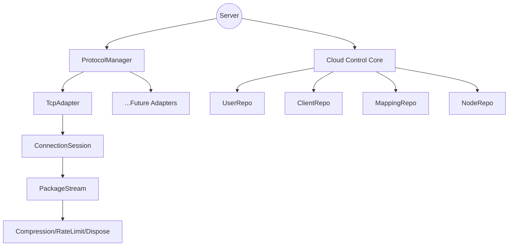

# tunnox-core

High-performance multi-protocol tunnel/relay/proxy core library supporting TCP, WebSocket, UDP, and QUIC. Unified business logic entry, easy to extend.

## Features

- 🚀 **Multi-protocol support**: TCP, WebSocket, UDP, QUIC
- 🧩 **Unified interface**: All protocol adapters implement the Adapter interface, business logic is handled by ConnectionSession
- 🔒 **Thread-safe**: All connections and streams are concurrency-safe
- 🔄 **Easy extensibility**: Add new protocols by implementing the Adapter interface
- 📦 **Rich examples and docs**: See the docs/ directory

## Quick Start

### 1. Start a multi-protocol server

```go
package main
import (
    "context"
    "log"
    "os"
    "os/signal"
    "syscall"
    "tunnox-core/internal/cloud"
    "tunnox-core/internal/protocol"
)

func main() {
    ctx := context.Background()
    cloudControl := cloud.NewBuiltInCloudControl(cloud.DefaultConfig())
    cloudControl.Start()
    defer cloudControl.Stop()

    session := &protocol.ConnectionSession{CloudApi: cloudControl}
    session.SetCtx(ctx, session.onClose)
    pm := protocol.NewManager(ctx)

    tcp := protocol.NewTcpAdapter(ctx, session)
    ws := protocol.NewWebSocketAdapter(ctx, session)
    udp := protocol.NewUdpAdapter(ctx, session)
    quic := protocol.NewQuicAdapter(ctx, session)

    tcp.ListenFrom(":8080")
    ws.ListenFrom(":8081")
    udp.ListenFrom(":8082")
    quic.ListenFrom(":8083")

    pm.Register(tcp)
    pm.Register(ws)
    pm.Register(udp)
    pm.Register(quic)
    if err := pm.StartAll(ctx); err != nil {
        log.Fatal(err)
    }
    log.Println("Server started on TCP:8080, WS:8081, UDP:8082, QUIC:8083")
    sig := make(chan os.Signal, 1)
    signal.Notify(sig, syscall.SIGINT, syscall.SIGTERM)
    <-sig
    pm.CloseAll()
}
```

### 2. Client connection example

```go
// TCP
client := protocol.NewTcpAdapter(ctx, nil)
client.ConnectTo("localhost:8080")
// WebSocket
ws := protocol.NewWebSocketAdapter(ctx, nil)
ws.ConnectTo("ws://localhost:8081")
// UDP
udp := protocol.NewUdpAdapter(ctx, nil)
udp.ConnectTo("localhost:8082")
// QUIC
quic := protocol.NewQuicAdapter(ctx, nil)
quic.ConnectTo("localhost:8083")
```

### 3. Unified business logic entry

All protocol connections are handled by ConnectionSession:
```go
func (s *ConnectionSession) AcceptConnection(reader io.Reader, writer io.Writer) {
    // Business logic here, protocol-agnostic
}
```

## Protocol Comparison

| Protocol   | Reliability | Performance | Firewall Friendly | Latency | Typical Use Cases         |
|------------|-------------|-------------|-------------------|---------|--------------------------|
| TCP        | High        | Medium      | Good              | Medium  | File transfer, DB        |
| WebSocket  | High        | Medium      | Excellent         | Medium  | Web, real-time comm      |
| UDP        | Low         | High        | Good              | Low     | Games, streaming, DNS    |
| QUIC       | High        | High        | Medium            | Low     | Modern web, mobile apps  |

## Extensibility

- Add new protocols by implementing and registering the Adapter interface
- Business logic is fully reusable, protocol-agnostic

## Testing

```bash
go test ./tests -v -run "Test.*Adapter"
```

## Documentation
- [Multi-protocol Example](docs/multi_protocol_example.md)
- [Architecture](docs/architecture.md)
- [API/Usage Examples](docs/examples.md)

---

For more help or custom development, please open an issue or PR!

---

## Overview

tunnox-core is a high-performance, highly maintainable, and extensible backend core designed for cloud-controlled intranet tunneling scenarios. It features a layered protocol adapter architecture, advanced resource management, and is engineered for low latency and high throughput. All resources are managed via a Dispose tree for graceful shutdown and resource control. The goal is to deliver an elegant, scalable, and production-ready tunneling service core.

---

## Features

- **High Performance**: Optimized for low latency and high throughput, with zero-copy data transfer, memory pooling, and efficient concurrency.
- **Layered Protocol Adapter Architecture**: Unified interface for all protocol adapters, supporting hot-plug and extensibility.
- **Dispose Tree Resource Management**: All adapters, streams, services, and sessions are managed in a hierarchical Dispose tree for safe and graceful shutdown.
- **Multi-Protocol Support**: TCP implemented, extensible to HTTP, WebSocket, etc.
- **Command-based Packet Dispatch**: Session layer dispatches business logic by CommandType, supporting clean separation of concerns.
- **High Maintainability**: Elegant code structure, clear layering, and easy for team collaboration.
- **Comprehensive Unit Testing**: 100% test pass rate required, with resource isolation for each test case.

---

## Architecture Diagram



---

## Quick Start

```bash
# 1. Clone the repository
$ git clone https://github.com/tunnox-net/tunnox-core.git
$ cd tunnox-core

# 2. Install dependencies
$ go mod tidy

# 3. Run unit tests
$ go test ./... -v

# 4. Refer to examples/ for integration
```

---

## Documentation

- [Architecture Design](docs/architecture.md) - Detailed architecture overview and design principles
- [API Documentation](docs/api.md) - Complete API reference and interfaces
- [Usage Examples](docs/examples.md) - Comprehensive code examples and best practices

---

## Directory Structure

```
internal/
  cloud/      # Cloud control core: user, client, mapping, node, auth, config
  protocol/   # Protocol adapters, manager, session
  stream/     # Package stream, compression, rate limiter
  utils/      # Dispose tree, buffer pool, helpers
examples/     # Usage examples
cmd/server/   # Server entry
 tests/       # Full unit test coverage
docs/         # Documentation
```

---

## Development Progress

✅ Dispose tree resource management, all core structs included  
✅ ProtocolAdapter interface & BaseAdapter, multi-protocol ready  
✅ TcpAdapter, TCP port listening & connection management  
✅ ProtocolManager, unified registration/start/close  
✅ ConnectionSession, layered packet handling & CommandType dispatch  
✅ Cloud control core (user, client, mapping, node, auth, etc.)  
✅ Unit test system, 100% pass for Dispose, Repository, etc.

⏳ **Core Features**
- ConnectionSession command-handler optimization (map[CommandType]Handler)
- Complete packet processing pipeline with InitPacket/AcceptPacket support
- User authentication and authorization flow implementation
- Real-time connection monitoring and statistics

⏳ **Protocol Adapters**
- HTTP/HTTPS protocol adapter
- WebSocket protocol adapter
- UDP protocol adapter
- Custom protocol adapter framework

⏳ **Configuration & Management**
- Configuration file support (YAML/JSON)
- Environment variable configuration
- Hot-reload configuration capability
- Parameterized port and address configuration

⏳ **Storage & Persistence**
- Redis storage backend integration
- PostgreSQL database support
- Distributed storage with consistency
- Data migration and backup tools

⏳ **Security & Encryption**
- TLS/SSL encryption support
- End-to-end encryption for data transfer
- Certificate management and validation
- Rate limiting and DDoS protection

⏳ **Monitoring & Observability**
- Metrics collection (Prometheus format)
- Distributed tracing (OpenTelemetry)
- Health check endpoints
- Performance monitoring dashboard

⏳ **Scalability & Performance**
- Load balancing across multiple nodes
- Connection pooling optimization
- Memory usage optimization
- Performance benchmarking suite

⏳ **API & Integration**
- RESTful API endpoints
- gRPC service interface
- WebSocket API for real-time updates
- SDK for multiple languages

⏳ **Testing & Quality**
- Integration test suite
- Performance testing framework
- Security testing (penetration tests)
- End-to-end testing scenarios

⏳ **Documentation & Examples**
- Complete API documentation
- Deployment guides
- Troubleshooting guides
- Production deployment examples

---

## Contributing

Contributions are welcome! Please open issues, pull requests, or suggestions to help build a high-quality cloud-controlled tunneling core.

---

## License

[MIT](LICENSE)

---

## Contact

- Maintainer: roger tong
- Email: zhangyu.tongbin@gmail.com