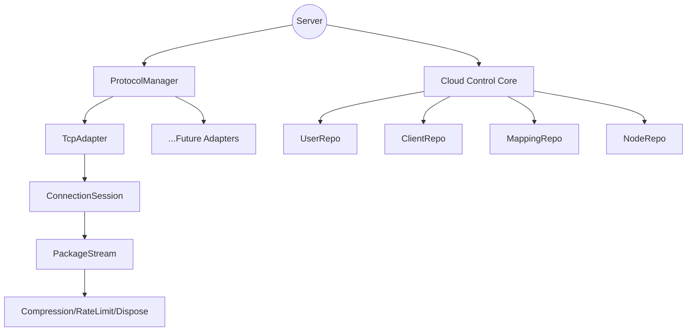

# tunnox-core

<p align="center">
  <a href="README.zh-CN.md">中文</a> | <b>English</b>
</p>

---

## Overview

tunnox-core is a high-quality, cloud-controlled intranet tunneling backend core, featuring a layered protocol adapter system, resource tree management, and extensibility for multiple protocols. All resources are managed via a Dispose tree for graceful shutdown and maintainability. The project aims to deliver an elegant, scalable, and production-ready tunneling service core.

---

## Features

- **Layered Protocol Adapter Architecture**: Unified interface for all protocol adapters, supporting hot-plug and extensibility.
- **Dispose Tree Resource Management**: All adapters, streams, services, and sessions are managed in a hierarchical Dispose tree for safe and graceful shutdown.
- **Multi-Protocol Support**: TCP implemented, extensible to HTTP, WebSocket, etc.
- **Command-based Packet Dispatch**: Session layer dispatches business logic by CommandType, supporting clean separation of concerns.
- **High Maintainability**: Elegant code structure, clear layering, and easy for team collaboration.
- **Comprehensive Unit Testing**: 100% test pass rate required, with resource isolation for each test case.

---

## Architecture Diagram



---

## Quick Start

```bash
# 1. Clone the repository
$ git clone https://github.com/tunnox-net/tunnox-core.git
$ cd tunnox-core

# 2. Install dependencies
$ go mod tidy

# 3. Run unit tests
$ go test ./... -v

# 4. Refer to examples/ for integration
```

---

## Documentation

- [Architecture Design](docs/architecture.md) - Detailed architecture overview and design principles
- [API Documentation](docs/api.md) - Complete API reference and interfaces
- [Usage Examples](docs/examples.md) - Comprehensive code examples and best practices

---

## Directory Structure

```
internal/
  cloud/      # Cloud control core: user, client, mapping, node, auth, config
  protocol/   # Protocol adapters, manager, session
  stream/     # Package stream, compression, rate limiter
  utils/      # Dispose tree, buffer pool, helpers
examples/     # Usage examples
cmd/server/   # Server entry
 tests/       # Full unit test coverage
docs/         # Documentation
```

---

## Development Progress

✅ Dispose tree resource management, all core structs included
✅ ProtocolAdapter interface & BaseAdapter, multi-protocol ready
✅ TcpAdapter, TCP port listening & connection management
✅ ProtocolManager, unified registration/start/close
✅ ConnectionSession, layered packet handling & CommandType dispatch
✅ Cloud control core (user, client, mapping, node, auth, etc.)
✅ Unit test system, 100% pass for Dispose, Repository, etc.

⏳ **Core Features**
- ConnectionSession command-handler optimization (map[CommandType]Handler)
- Complete packet processing pipeline with InitPacket/AcceptPacket support
- User authentication and authorization flow implementation
- Real-time connection monitoring and statistics

⏳ **Protocol Adapters**
- HTTP/HTTPS protocol adapter
- WebSocket protocol adapter
- UDP protocol adapter
- Custom protocol adapter framework

⏳ **Configuration & Management**
- Configuration file support (YAML/JSON)
- Environment variable configuration
- Hot-reload configuration capability
- Parameterized port and address configuration

⏳ **Storage & Persistence**
- Redis storage backend integration
- PostgreSQL database support
- Distributed storage with consistency
- Data migration and backup tools

⏳ **Security & Encryption**
- TLS/SSL encryption support
- End-to-end encryption for data transfer
- Certificate management and validation
- Rate limiting and DDoS protection

⏳ **Monitoring & Observability**
- Metrics collection (Prometheus format)
- Distributed tracing (OpenTelemetry)
- Health check endpoints
- Performance monitoring dashboard

⏳ **Scalability & Performance**
- Load balancing across multiple nodes
- Connection pooling optimization
- Memory usage optimization
- Performance benchmarking suite

⏳ **API & Integration**
- RESTful API endpoints
- gRPC service interface
- WebSocket API for real-time updates
- SDK for multiple languages

⏳ **Testing & Quality**
- Integration test suite
- Performance testing framework
- Security testing (penetration tests)
- End-to-end testing scenarios

⏳ **Documentation & Examples**
- Complete API documentation
- Deployment guides
- Troubleshooting guides
- Production deployment examples

---

## Contributing

Contributions are welcome! Please open issues, pull requests, or suggestions to help build a high-quality cloud-controlled tunneling core.

---

## License

[MIT](LICENSE)

---

## Contact

- Maintainer: roger tong
- Email: zhangyu.tongbin@gmail.com