# Tunnox Core

<div align="center">


**🌐 云端隧道与连接管理核心框架**  
*专为分布式网络环境设计的轻量级隧道解决方案*

[🚀 快速开始](#-快速开始) • [🏗️ 系统架构](#️-系统架构) • [✨ 核心功能](#-核心功能) • [📦 项目结构](#-项目结构)

</div>

---

## 📋 项目概述

Tunnox Core 是一个基于 Go 语言开发的云端隧道框架，专为分布式网络环境设计。项目采用现代化的分层架构，集成了多种网络协议支持，通过内存池、零拷贝、流式处理等先进技术，为端口映射和连接管理提供高性能、低延迟的解决方案。

### 🎯 项目目标

**轻量隧道服务** 🔄 开发中
- 提供端口映射和隧道功能框架，支持 TCP、HTTP、SOCKS 等多种协议映射

**多协议支持** ✅ 已完成
- 支持 TCP、WebSocket、UDP、QUIC 等多种传输协议，适应不同网络环境需求

**分布式架构** 🔄 开发中
- 支持集群部署和节点管理，实现高可用性和负载均衡

**资源优化** ✅ 已完成
- 通过内存池、零拷贝、连接池等技术大幅提升性能，降低资源消耗

**可扩展性** ✅ 已完成
- 模块化设计，插件化架构，便于功能扩展和定制化开发

### 🌟 技术特点

**🏗️ 分层架构**
- 清晰的业务逻辑、数据访问和基础设施分离
- 便于维护和扩展

**🏭 工厂模式**
- StreamFactory统一管理流组件创建，支持配置化工厂和预定义模板
- 统一管理和配置

**🔧 资源管理**
- 基于 Dispose 模式的层次化资源清理，防止内存泄漏
- 确保优雅关闭

**🛡️ 类型安全**
- 强类型系统，统一的命名规范
- 提高代码质量和开发效率

**⚡ 并发控制**
- 线程安全的设计，优化的锁定策略
- 支持高并发场景

**🚀 性能优化**
- 内存池、零拷贝、流式处理、压缩算法等技术的综合应用
- 高性能和低延迟

**🔌 协议适配**
- 统一的协议适配器接口，支持多种网络协议的透明切换
- 灵活切换协议

**📊 流式处理**
- 支持数据压缩、限速、分块传输等高级流处理功能
- 优化网络带宽

**📈 流管理**
- StreamManager统一管理流生命周期，支持流注册、监控和指标统计
- 统一监控和管理

---

## 🏗️ 系统架构

### 📊 整体架构图

```mermaid
graph TB
    subgraph "应用层"
        Server[服务器入口]
        Config[配置管理]
    end
    
    subgraph "业务层"
        CloudControl[云控总线]
        subgraph "业务管理器"
            JWTManager[JWT管理器]
            StatsManager[统计管理器 - 基础版]
            NodeManager[节点管理器 - 基础版]
            AnonymousManager[匿名管理器]
            SearchManager[搜索管理器 - 基础版]
            ConnectionManager[连接管理器 - 基础版]
            ConfigManager[配置管理器 - 基础版]
            CleanupManager[清理管理器 - 基础版]
        end
    end
    
    subgraph "数据层"
        subgraph "数据仓库"
            UserRepo[用户仓库]
            ClientRepo[客户端仓库]
            MappingRepo[端口映射仓库]
            NodeRepo[节点仓库]
            ConnectionRepo[连接仓库]
        end
        
        subgraph "存储抽象"
            MemoryStorage[内存存储 - 已实现]
            RedisStorage[Redis存储 - 待实现]
            CustomStorage[自定义存储 - 待实现]
        end
    end
    
    subgraph "基础设施层"
        subgraph "分布式服务"
            IDGenerator[ID生成器 - 基础版]
            DistributedLock[分布式锁 - 基础版]
        end
        
        subgraph "协议层"
            TCPAdapter[TCP适配器 - 框架版]
            WebSocketAdapter[WebSocket适配器 - 框架版]
            UDPAdapter[UDP适配器 - 框架版]
            QUICAdapter[QUIC适配器 - 框架版]
        end
        
        subgraph "流处理"
            StreamProcessor[流处理器 - 基础版]
            RateLimiter[限速器 - 基础版]
            Compression[压缩器 - 基础版]
            Encryption[加密器 - 待实现]
        end
    end
    
    Server --> CloudControl
    CloudControl --> JWTManager
    CloudControl --> StatsManager
    CloudControl --> NodeManager
    CloudControl --> AnonymousManager
    CloudControl --> SearchManager
    CloudControl --> ConnectionManager
    CloudControl --> ConfigManager
    CloudControl --> CleanupManager
    
    JWTManager --> UserRepo
    StatsManager --> UserRepo
    NodeManager --> NodeRepo
    AnonymousManager --> ClientRepo
    SearchManager --> UserRepo
    ConnectionManager --> ConnectionRepo
    
    UserRepo --> MemoryStorage
    ClientRepo --> MemoryStorage
    MappingRepo --> MemoryStorage
    NodeRepo --> MemoryStorage
    ConnectionRepo --> MemoryStorage
    
    CloudControl --> IDGenerator
    CloudControl --> DistributedLock
    
    Server --> TCPAdapter
    Server --> WebSocketAdapter
    Server --> UDPAdapter
    Server --> QUICAdapter
    
    TCPAdapter --> StreamProcessor
    WebSocketAdapter --> StreamProcessor
    UDPAdapter --> StreamProcessor
    QUICAdapter --> StreamProcessor
    
    StreamProcessor --> RateLimiter
    StreamProcessor --> Compression
    StreamProcessor --> Encryption
```



### 📋 架构分层说明

#### 🎯 分层设计原则

**依赖倒置**
- 高层模块不依赖低层模块，都依赖抽象
- 通过接口进行解耦

**单一职责**
- 每层只负责自己的核心功能
- 明确的职责边界

**开闭原则**
- 对扩展开放，对修改关闭
- 工厂模式和配置化

**接口隔离**
- 通过接口进行解耦，降低耦合度
- 定义清晰的接口

#### 📋 各层职责

**应用层**
- 服务器入口和配置管理
- 主要组件：ProtocolFactory, Server, Main

**协议层**
- 多种网络协议的适配器实现
- 主要组件：TCP, WebSocket, UDP, QUIC适配器

**会话层**
- 连接会话管理和生命周期控制
- 主要组件：ConnectionSession, StreamManager

**流管理层**
- 流组件的统一管理和注册
- 主要组件：StreamManager, 流注册表, 指标统计

**工厂层**
- 流组件的创建和配置
- 主要组件：DefaultStreamFactory, ConfigurableStreamFactory

**实现层**
- 具体的流处理组件实现
- 主要组件：StreamProcessor, 压缩器, 限速器

### 🔄 流处理架构分层图

```mermaid
graph TB
    %% 应用层 (Application Layer)
    subgraph AL["应用层 (Application Layer)"]
        style AL fill:#e1f5fe
        PF[ProtocolFactory<br/>协议工厂]
        S[Server<br/>服务器]
        M[Main<br/>主程序]
    end

    %% 协议层 (Protocol Layer)
    subgraph PL["协议层 (Protocol Layer)"]
        style PL fill:#f3e5f5
        TA[TCP Adapter<br/>TCP适配器]
        WA[WebSocket Adapter<br/>WebSocket适配器]
        UA[UDP Adapter<br/>UDP适配器]
        QA[QUIC Adapter<br/>QUIC适配器]
    end

    %% 会话层 (Session Layer)
    subgraph SL["会话层 (Session Layer)"]
        style SL fill:#e8f5e8
        CS[ConnectionSession<br/>连接会话]
        subgraph CS_INNER["会话组件"]
            CID[ConnectionID<br/>连接ID生成器]
            SM[StreamManager<br/>流管理器]
        end
    end

    %% 流管理层 (Stream Management Layer)
    subgraph SML["流管理层 (Stream Management Layer)"]
        style SML fill:#fff3e0
        STM[StreamManager<br/>流管理器]
        subgraph STM_INNER["管理组件"]
            SR[Stream Registry<br/>流注册表]
            SMF[Stream Metrics<br/>流指标]
        end
    end

    %% 工厂层 (Factory Layer)
    subgraph FL["工厂层 (Factory Layer)"]
        style FL fill:#fce4ec
        DSF[DefaultStreamFactory<br/>默认流工厂]
        CSF[ConfigurableStreamFactory<br/>可配置流工厂]
        SP[Stream Profiles<br/>流配置模板]
    end

    %% 实现层 (Implementation Layer)
    subgraph IL["实现层 (Implementation Layer)"]
        style IL fill:#f1f8e9
        SPROC[StreamProcessor<br/>流处理器]
        GZR[GzipReader<br/>压缩读取器]
        GZW[GzipWriter<br/>压缩写入器]
        RLR[RateLimiterReader<br/>限速读取器]
        RLW[RateLimiterWriter<br/>限速写入器]
        TB[TokenBucket<br/>令牌桶]
    end

    %% 连接关系
    %% 应用层到协议层
    PF --> TA
    PF --> WA
    PF --> UA
    PF --> QA

    %% 协议层到会话层
    TA --> CS
    WA --> CS
    UA --> CS
    QA --> CS

    %% 会话层到流管理层
    CS --> STM

    %% 流管理层到工厂层
    STM --> DSF
    STM --> CSF

    %% 工厂层到实现层
    DSF --> SPROC
    CSF --> SPROC
    SPROC --> GZR
    SPROC --> GZW
    SPROC --> RLR
    SPROC --> RLW
    RLR --> TB
    RLW --> TB

    %% 样式定义
    classDef applicationLayer fill:#e1f5fe,stroke:#0277bd,stroke-width:2px
    classDef protocolLayer fill:#f3e5f5,stroke:#7b1fa2,stroke-width:2px
    classDef sessionLayer fill:#e8f5e8,stroke:#388e3c,stroke-width:2px
    classDef streamManagementLayer fill:#fff3e0,stroke:#f57c00,stroke-width:2px
    classDef factoryLayer fill:#fce4ec,stroke:#880e4f,stroke-width:2px
    classDef implementationLayer fill:#f1f8e9,stroke:#33691e,stroke-width:2px

    %% Apply styles
    class PF,S,M applicationLayer
    class TA,WA,UA,QA protocolLayer
    class CS,CID,SM sessionLayer
    class STM,SR,SMF streamManagementLayer
    class DSF,CSF,SP factoryLayer
    class SPROC,GZR,GZW,RLR,RLW,TB implementationLayer
```



---

## ✨ 核心功能

### 🔐 认证与安全

**JWT Token管理** ✅ 已完成
- 支持token生成、验证、刷新，内置token缓存和自动清理机制

**匿名用户支持** ✅ 已完成
- 匿名客户端生成和管理功能

**角色权限控制** 🔄 开发中
- 基础权限控制框架（细粒度权限待实现）

**安全通信** 🔄 开发中
- TLS加密传输支持（具体实现待完善）

**加密传输选项** 🔄 开发中
- 预留数据包加密标识位，支持可选的端到端加密传输

### 📊 统计与监控

**基础统计** ✅ 已完成
- 用户、客户端、端口映射的基础统计信息

**流量统计** 🔄 开发中
- 基础的流量和连接数统计（图表数据待实现）

**系统监控** ✅ 已完成
- 系统整体统计信息收集

**性能指标** ✅ 已完成
- 基础的性能指标收集框架

### 🌐 分布式支持

**节点管理** 🔄 开发中
- 基础节点注册和心跳机制（故障转移待实现）

**ID生成** ✅ 已完成
- 基础ID生成器，支持客户端、用户、节点、映射ID生成（内存版本）

**分布式锁** ✅ 已完成
- 基础分布式锁实现，支持集群环境下的资源协调（内存版本）

**负载均衡** 🔄 开发中
- 负载均衡框架（具体策略待实现）

**集群通信** 🔄 开发中
- 节点间通信框架（具体实现待完成）

### ⚡ 性能优化

**内存池** ✅ 已完成
- 高效的缓冲区管理，减少内存分配和GC压力

**零拷贝** ✅ 已完成
- 减少内存分配开销，提升数据传输效率

**流式处理** ✅ 已完成
- 支持压缩和限速，优化网络带宽使用

**连接池** 🔄 开发中
- 连接池框架（具体优化待实现）

**异步处理** 🔄 开发中
- 异步处理框架（具体机制待完善）

**数据包处理** ✅ 已完成
- 支持压缩、加密标识位，灵活的数据包类型处理

### 🔄 资源管理

**自动清理** ✅ 已完成
- 基础过期资源清理机制，防止资源泄漏

**内存泄漏防护** ✅ 已完成
- 基础资源跟踪框架，确保资源正确释放

**优雅关闭** ✅ 已完成
- 基础资源释放机制，支持优雅的服务关闭

**资源监控** 🔄 开发中
- 基础资源使用监控框架（实时监控待完善）

---

## 🚀 快速开始

### 📋 环境要求

**Go** 1.24+
- 支持泛型、模块化等现代特性

**Git** 最新版本
- 用于代码版本控制

### 🛠️ 安装与运行

```bash
# 克隆仓库
git clone https://github.com/tunnox-net/tunnox-core.git
cd tunnox-core

# 安装依赖
go mod tidy

# 运行测试
go test ./... -v

# 构建服务器
go build -o server cmd/server/main.go

# 运行服务器
./server
```

### ⚙️ 配置说明

项目使用 YAML 配置文件，支持以下配置项：

**服务器配置**
- 监听地址、端口、超时设置、CORS 配置
- 基础服务器参数

**协议配置**
- TCP、WebSocket、UDP、QUIC 协议参数
- 支持独立端口配置

**日志配置**
- 日志级别、格式、输出位置
- 支持日志轮转和压缩

**云控配置**
- JWT 设置、数据清理策略、ID 生成参数
- 云控相关配置

**性能配置**
- 内存池、连接池参数
- 支持动态调整

**监控配置**
- 指标收集、健康检查
- 支持 Prometheus 格式

**安全配置**
- TLS 设置、API 密钥认证、管理员账户
- 安全相关配置

**限流配置**
- 请求频率限制、突发流量处理
- 流量控制配置

> **注意**：当前配置系统为静态配置，支持文件配置和环境变量覆盖，动态配置管理功能正在开发中。

详细配置示例请参考 `config.yaml` 文件，支持环境变量覆盖配置。

---

## 📦 项目结构

```
tunnox-core/
├── 📁 cmd/                    # 命令行应用
│   └── 📁 server/            # 服务器入口
├── 📁 internal/              # 内部包
│   ├── 📁 cloud/             # 云控相关
│   │   ├── 📁 managers/      # 业务管理器
│   │   ├── 📁 generators/    # ID生成器
│   │   ├── 📁 distributed/   # 分布式服务
│   │   ├── 📁 models/        # 数据模型
│   │   ├── 📁 repos/         # 数据仓库
│   │   ├── 📁 storages/      # 存储抽象
│   │   ├── 📁 constants/     # 常量定义
│   │   ├── 📁 configs/       # 配置管理
│   │   ├── 📁 factories/     # 工厂模式
│   │   └── 📁 stats/         # 统计功能
│   ├── 📁 protocol/          # 协议适配器
│   │   ├── 📄 adapter.go     # 协议适配器接口
│   │   ├── 📄 manager.go     # 协议管理器
│   │   ├── 📄 session.go     # 连接会话管理
│   │   ├── 📄 tcp_adapter.go # TCP适配器
│   │   ├── 📄 websocket_adapter.go # WebSocket适配器
│   │   ├── 📄 udp_adapter.go # UDP适配器
│   │   └── 📄 quic_adapter.go # QUIC适配器
│   ├── 📁 stream/            # 流处理
│   │   ├── 📄 factory.go     # 流工厂实现
│   │   ├── 📄 manager.go     # 流管理器
│   │   ├── 📄 config.go      # 流配置模板
│   │   ├── 📄 interfaces.go  # 流接口定义
│   │   ├── 📄 stream_processor.go # 流处理器
│   │   ├── 📄 rate_limiter.go # 限速器
│   │   ├── 📄 compression.go # 压缩器
│   │   └── 📄 token_bucket.go # 令牌桶
│   ├── 📁 utils/             # 工具类
│   │   ├── 📄 dispose.go     # 资源管理
│   │   ├── 📄 buffer_pool.go # 缓冲区池
│   │   ├── 📄 logger.go      # 日志工具
│   │   ├── 📄 random.go      # 随机数生成
│   │   └── 📄 time.go        # 时间工具
│   ├── 📁 constants/         # 常量定义
│   │   ├── 📄 constants.go   # 基础常量
│   │   ├── 📄 log.go         # 日志常量
│   │   └── 📄 http.go        # HTTP常量
│   ├── 📁 errors/            # 错误处理
│   │   └── 📄 errors.go      # 错误定义
│   └── 📁 packet/            # 数据包处理
│       └── 📄 packet.go      # 数据包定义
├── 📁 tests/                 # 测试文件
├── 📁 docs/                  # 文档
├── 📁 scripts/               # 脚本文件
├── 📄 go.mod                 # Go模块文件
├── 📄 go.sum                 # 依赖校验文件
├── 📄 config.yaml            # 配置文件
├── 📄 README.md              # 中文说明
├── 📄 README_EN.md           # 英文说明
└── 📄 LICENSE                # 许可证
```

---

## 📈 开发进度

### ✅ 已完成

**基础架构设计** 100%
- 完整的分层架构设计

**协议适配器框架** 100%
- TCP、WebSocket、UDP、QUIC协议框架

**流处理系统** 100%
- 压缩、限速、零拷贝功能

**StreamFactory架构** 100%
- 工厂模式、配置化工厂、预定义模板

**StreamManager** 100%
- 流生命周期管理、指标统计

**连接会话管理框架** 100%
- 会话管理和生命周期控制

**JWT 认证系统** 100%
- 完整的JWT认证功能

**内存池和缓冲区管理** 100%
- 高效的内存管理

**日志系统** 100%
- 结构化日志系统

**错误处理框架** 100%
- 统一的错误处理

**基础ID生成器** 100%
- 内存版本ID生成

**基础配置管理** 100%
- 文件配置和环境变量

**数据模型定义** 100%
- 完整的数据模型

**数据访问层** 100%
- Repository模式实现

**基础统计功能** 100%
- 基础统计和监控

**测试覆盖** 100%
- 完整的单元测试覆盖

### 🚧 开发中

**端口映射业务逻辑实现** 30%
- 核心业务逻辑开发中

**数据转发机制实现** 20%
- 数据转发功能开发中

**集群节点通信实现** 15%
- 节点间通信开发中

**统计和监控系统完善** 40%
- 监控系统完善中

**用户管理界面开发** 10%
- 管理界面开发中

**API 接口实现** 25%
- RESTful API开发中

**加密传输处理器实现** 35%
- 加密功能开发中

**分布式ID生成器完善** 60%
- Redis/数据库支持开发中

**分布式锁实现** 50%
- Redis/数据库支持开发中

**动态配置管理系统** 20%
- 热重载、配置验证开发中

**协议适配器具体实现** 70%
- 具体协议实现中

**连接会话具体业务逻辑** 45%
- 业务逻辑完善中

### 📋 计划中

- [ ] 客户端 SDK
- [ ] Web 管理界面
- [ ] 移动端支持
- [ ] 插件系统
- [ ] 性能基准测试
- [ ] 部署文档
- [ ] 用户手册

---

## 🤝 贡献指南

我们欢迎社区贡献！请遵循以下步骤：

### 📝 贡献流程

1. **Fork 本仓库**
2. **创建功能分支** (`git checkout -b feature/AmazingFeature`)
3. **提交更改** (`git commit -m 'Add some AmazingFeature'`)
4. **推送到分支** (`git push origin feature/AmazingFeature`)
5. **创建 Pull Request**

### 🛠️ 开发标准

**代码标准**
- 遵循 Go 语言编码规范
- 使用 gofmt 格式化代码

**测试覆盖**
- 添加适当的测试用例
- 确保代码质量

**文档更新**
- 更新相关文档
- 保持文档同步

### 📋 开发环境

**Go 版本要求**
- Go 1.24+ (支持泛型等现代特性)

**开发工具**
- 推荐使用 GoLand 或 VS Code
- 安装 Go 扩展和格式化工具

**代码质量**
- 使用 `go vet` 检查代码
- 使用 `golint` 检查代码风格
- 运行 `go test ./...` 确保测试通过

---

## 📄 许可证

本项目采用 MIT 许可证 - 查看 [LICENSE](LICENSE) 文件了解详情。

---

## 📞 联系我们

- **项目主页**: [GitHub](https://github.com/tunnox-net/tunnox-core)
- **问题反馈**: [Issues](https://github.com/tunnox-net/tunnox-core/issues)
- **讨论交流**: [Discussions](https://github.com/tunnox-net/tunnox-core/discussions)

---

<div align="center">

**⭐ 如果这个项目对你有帮助，请给我们一个 Star！**

</div>