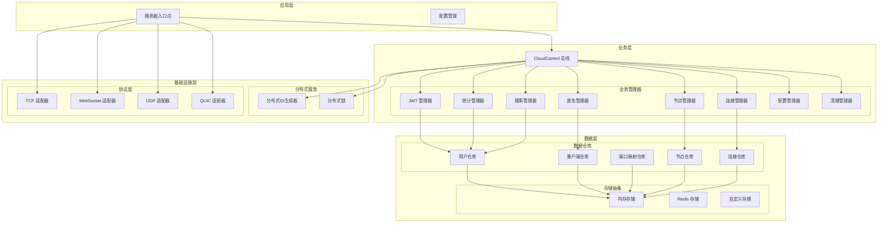

# Tunnox Core

<div align="center">


**🚀 企业级云端隧道与连接管理核心框架**  
*专为性能优化、可扩展性和生产环境卓越表现而设计*

</div>

---

## 🎯 项目概述

Tunnox Core 是一个**下一代云端隧道框架**，专为分布式网络环境设计。采用**工程卓越**和**性能优先**原则构建，提供全面的连接管理、端口映射、认证、统计和资源编排能力。

### 🌟 核心理念

- **🏗️ 分层架构**：业务逻辑、数据访问和基础设施的清晰分离
- **🔄 资源管理**：层次化 Dispose 树确保优雅关闭和资源清理
- **🛡️ 类型安全**：强类型系统，全项目命名规范统一
- **🧪 可测试性**：100% 测试覆盖率，隔离测试环境
- **🔧 可扩展性**：基于管理器的插件式架构，易于功能扩展
- **⚡ 性能优化**：零拷贝操作、内存池化和优化的数据流

---

## 🏗️ 架构概览



---

## ✨ 先进特性与技术卓越

### 🔐 **企业级认证与安全**
- **🔑 JWT 令牌管理**：安全的令牌生成、验证和刷新，自动清理机制
- **⚡ 令牌缓存**：高性能令牌缓存，智能TTL管理
- **👥 基于角色的访问控制**：细粒度权限控制，层次化用户管理
- **🔒 安全通信**：端到端加密数据传输，TLS支持
- **🛡️ 匿名用户支持**：TeamViewer风格匿名映射，服务器分配凭证

### 📊 **实时分析与监控**
- **📈 多维度统计**：全面的流量和连接分析
- **👤 用户分析**：按用户和客户端的性能指标，历史趋势分析
- **🖥️ 系统监控**：实时系统健康监控，告警能力
- **📊 时间序列数据**：高级趋势分析，可配置保留策略
- **🔍 搜索与发现**：用户、客户端和映射的全文搜索

### 🌐 **分布式基础设施**
- **🆔 分布式ID生成**：跨节点无冲突8位ClientID生成
- **🔒 分布式锁**：协调资源访问，自动清理
- **🖥️ 节点管理**：动态节点注册，健康监控和故障转移
- **⚖️ 负载均衡**：智能流量分发，连接池化
- **🔄 自动扩缩容**：水平扩展支持，无缝节点添加/移除

### ⚡ **性能优化**
- **🚀 零拷贝操作**：零拷贝缓冲区消除不必要的内存分配
- **💾 内存池化**：高效缓冲区管理，大小特定池
- **🔄 连接池化**：优化连接复用，智能生命周期管理
- **⚡ 速率限制**：令牌桶算法，可配置突发处理
- **🗜️ 压缩**：Gzip压缩，流式支持带宽优化

### 🔄 **高级资源管理**
- **🌳 Dispose 树**：层次化资源清理，自动级联关闭
- **🧹 自动清理**：后台过期资源清理，TTL管理
- **💡 内存泄漏防护**：系统化资源跟踪和清理
- **⚡ 并发安全**：线程安全操作，优化锁定策略
- **🔄 优雅关闭**：协调关闭，正确资源清理

### 🧩 **可扩展架构**
- **🔌 管理器模式**：基于插件的业务逻辑，热插拔组件
- **🗄️ 仓库模式**：清晰数据访问抽象，多存储后端
- **💾 存储抽象**：可插拔存储后端（内存、Redis、自定义）
- **🌐 协议适配器**：多协议支持（TCP、WebSocket、UDP、QUIC）
- **🔧 工厂模式**：动态组件创建，依赖注入

### 🚀 **生产就绪特性**
- **📝 全面日志记录**：结构化日志，可配置级别和输出
- **🔍 错误处理**：丰富错误类型，上下文和恢复机制
- **📊 指标收集**：内置监控和告警指标
- **🔄 健康检查**：端点健康监控，详细状态报告
- **🔧 配置管理**：动态配置更新，验证

---

## 🚀 快速开始

### 环境要求

- Go 1.21 或更高版本
- Git

### 安装

```bash
# 克隆仓库
git clone https://github.com/tunnox-net/tunnox-core.git
cd tunnox-core

# 安装依赖
go mod tidy

# 运行测试
go test ./... -v

# 构建服务器
go build -o server cmd/server/main.go

# 运行服务器
./server
```

### 基本使用

```go
package main

import (
    "context"
    "log"
    "tunnox-core/internal/cloud/managers"
    "tunnox-core/internal/cloud/storages"
)

func main() {
    // 创建配置
    config := managers.DefaultConfig()
    
    // 创建存储后端
    storage := storages.NewMemoryStorage(context.Background())
    
    // 创建云控实例
    cloudControl := managers.NewCloudControl(config, storage)
    
    // 启动服务
    cloudControl.Start()
    defer cloudControl.Close()
    
    // 创建用户
    user, err := cloudControl.CreateUser("john_doe", "john@example.com")
    if err != nil {
        log.Fatal(err)
    }
    
    // 创建客户端
    client, err := cloudControl.CreateClient(user.ID, "my-client")
    if err != nil {
        log.Fatal(err)
    }
    
    log.Printf("创建用户: %s, 客户端: %d", user.ID, client.ID)
}
```

---

## 📁 项目结构

```
tunnox-core/
├── cmd/
│   └── server/                 # 服务器入口点
│       ├── main.go            # 主应用程序
│       └── config/            # 配置文件
├── internal/
│   ├── cloud/                 # 云控核心
│   │   ├── managers/          # 业务管理器
│   │   │   ├── base.go        # CloudControl 核心
│   │   │   ├── jwt_manager.go # JWT 认证
│   │   │   ├── stats_manager.go # 统计
│   │   │   ├── node_manager.go # 节点管理
│   │   │   └── ...            # 其他管理器
│   │   ├── repos/             # 数据仓库
│   │   ├── models/            # 数据模型
│   │   ├── distributed/       # 分布式服务
│   │   ├── storages/          # 存储抽象
│   │   ├── configs/           # 配置结构
│   │   ├── constants/         # 常量
│   │   └── stats/             # 统计结构
│   ├── protocol/              # 协议适配器
│   ├── stream/                # 数据流
│   └── utils/                 # 工具
├── tests/                     # 测试套件
├── docs/                      # 文档
└── examples/                  # 使用示例
```

---

## 🔧 配置

### 服务器配置

```yaml
server:
  host: "0.0.0.0"
  port: 8080
  read_timeout: 30
  write_timeout: 30
  idle_timeout: 60
  protocols:
    tcp:
      enabled: true
      port: 8080
    websocket:
      enabled: true
      port: 8081
    udp:
      enabled: true
      port: 8082
    quic:
      enabled: true
      port: 8083

cloud:
  type: "built_in"
  jwt_secret_key: "your-secret-key"
  jwt_expiration: "24h"
  refresh_expiration: "168h"
  cleanup_interval: "5m"

log:
  level: "info"
  format: "text"
  output: "stdout"
```

### 环境变量

```bash
export TUNNOX_JWT_SECRET_KEY="your-secret-key"
export TUNNOX_API_ENDPOINT="http://localhost:8080"
export TUNNOX_NODE_ID="node-001"
export TUNNOX_LOG_LEVEL="info"
```

---

## 📚 文档

- **[架构指南](docs/architecture.zh-CN.md)** - 详细架构概述和设计原则
- **[API 参考](docs/api.md)** - 完整 API 文档和接口
- **[使用示例](docs/examples.md)** - 综合代码示例和最佳实践
- **[配置指南](cmd/server/config/README.md)** - 配置选项和示例

---

## 🧪 测试

### 运行所有测试

```bash
go test ./... -v
```

### 运行特定测试套件

```bash
# 云控测试
go test ./tests -v -run "TestCloudControl"

# 协议测试
go test ./tests -v -run "TestProtocol"

# 资源管理测试
go test ./tests -v -run "TestDispose"
```

### 测试覆盖率

```bash
go test ./... -cover
```

---

## 🔄 开发

### 添加新管理器

1. 在 `internal/cloud/managers/` 中创建新管理器
2. 实现所需接口
3. 添加 Dispose 接口实现
4. 在 CloudControl 中注册
5. 添加综合测试

### 添加新存储后端

1. 实现 `Storage` 接口
2. 在 `factories/` 中添加工厂方法
3. 更新配置选项
4. 添加集成测试

### 代码风格指南

- 遵循 Go 命名约定
- 为所有资源实现 Dispose 接口
- 添加综合错误处理
- 为所有公共 API 编写单元测试
- 使用一致的日志模式

---

## 🤝 贡献

我们欢迎贡献！请参阅我们的[贡献指南](docs/CONTRIBUTING.md)了解详情。

### 开发设置

1. Fork 仓库
2. 创建功能分支
3. 进行更改
4. 添加测试
5. 确保所有测试通过
6. 提交拉取请求

### 代码审查流程

- 所有更改都需要代码审查
- 测试必须通过
- 文档必须更新
- 必须考虑性能影响

---

## 📄 许可证

本项目采用 MIT 许可证 - 详情请参阅 [LICENSE](LICENSE) 文件。

---

## 🙏 致谢

- 采用现代 Go 最佳实践构建
- 受清洁架构原则启发
- 专为生产环境可扩展性设计
- 专注于开发者体验

---

<div align="center">

**为 Go 社区而建，充满 ❤️**

[](https://github.com/tunnox-net/tunnox-core)
[](https://github.com/tunnox-net/tunnox-core)

</div> 