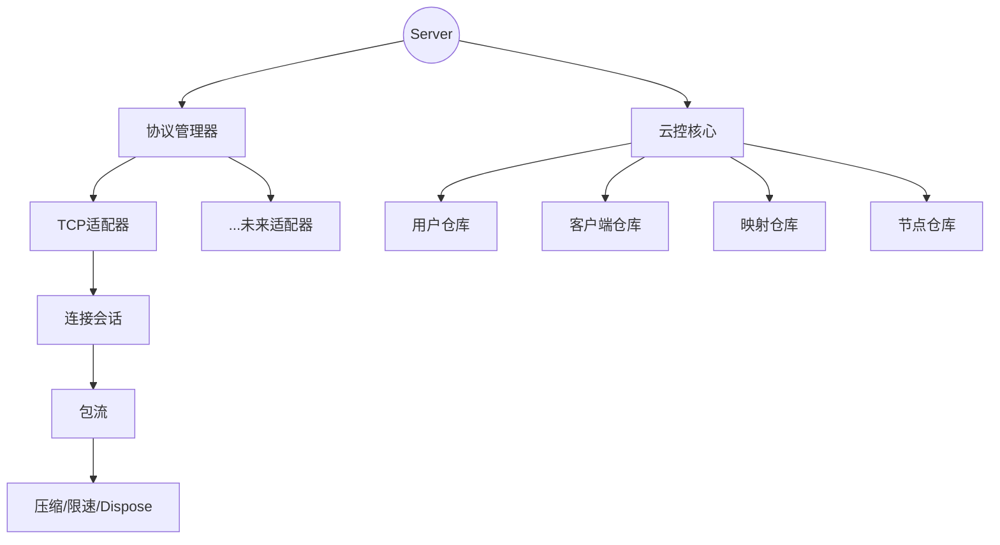

# tunnox-core

<p align="center">
  <b>中文</b> | <a href="README.md">English</a>
</p>

---

## 项目简介

tunnox-core 是一个高质量的云控内网穿透后端核心，具备分层协议适配体系、资源树型管理、支持多协议扩展。所有资源均纳入Dispose树型管理，保证优雅关闭和高可维护性。目标是打造架构优雅、可扩展、生产级的穿透服务内核。

---

## 主要特性

- **分层协议适配架构**：所有协议适配器实现统一接口，支持热插拔和扩展。
- **Dispose树型资源管理**：所有适配器、流、服务、会话等均纳入Dispose树，Server为顶层节点，关闭时自动级联释放所有资源。
- **多协议支持**：已实现TCP协议，后续可扩展HTTP、WebSocket等。
- **基于CommandType的包分发**：会话层按CommandType分发业务，分层清晰。
- **高可维护性**：代码结构优雅，分层清晰，便于团队协作和二次开发。
- **单元测试与资源隔离**：所有单元测试需100%通过，资源隔离，测试用例互不干扰。

---

## 架构图



---

## 快速开始

```bash
# 1. 克隆仓库
$ git clone https://github.com/your-org/tunnox-core.git
$ cd tunnox-core

# 2. 安装依赖
$ go mod tidy

# 3. 运行单元测试
$ go test ./... -v

# 4. 参考 examples/ 目录集成
```

---

## 目录结构

```
internal/
  cloud/      # 云控核心：用户、客户端、映射、节点、认证、配置
  protocol/   # 协议适配器、管理器、会话
  stream/     # 包流、压缩、限速
  utils/      # Dispose树、内存池、工具
examples/     # 使用示例
cmd/server/   # 服务入口
 tests/       # 全量单元测试
```

---

## 开发进度

- [x] Dispose树型资源管理体系，所有核心结构体已纳入Dispose树
- [x] ProtocolAdapter接口与BaseAdapter实现，支持多协议适配
- [x] TcpAdapter实现，支持TCP端口监听与连接管理
- [x] ProtocolManager实现，统一注册、启动、关闭所有协议适配器
- [x] ConnectionSession分层包处理与CommandType分发设计
- [x] 云控核心（用户、客户端、端口映射、节点、认证等）初步实现
- [x] 单元测试体系完善，Dispose、Repository等关键模块测试100%通过
- [ ] 后续计划：扩展更多协议适配器、参数化配置、完善API文档、持续优化架构

---

## 贡献指南

欢迎提出Issue、PR或建议，共同打造高质量云控穿透内核。

---

## 许可证

[MIT](LICENSE)

---

## 联系方式

- 维护者：roger tong
- 邮箱：zhangyu.tongbin@gmail.com 