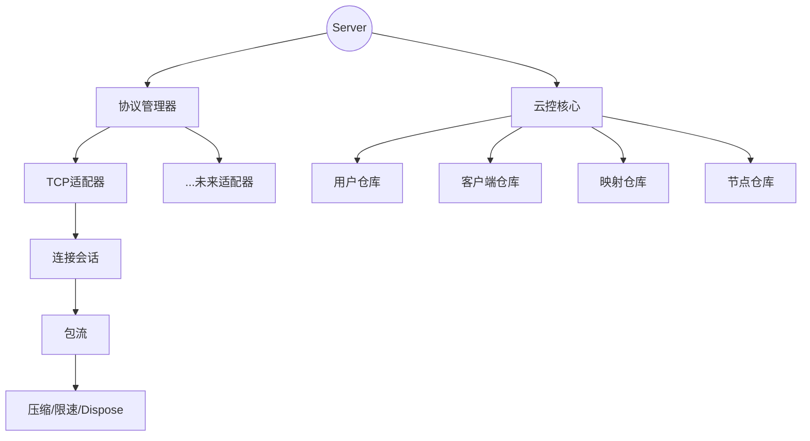

# tunnox-core

高性能多协议隧道/中转/代理核心库，适用于云原生和边缘场景。支持 TCP、WebSocket、UDP、QUIC 四种协议，统一业务处理入口，易于扩展，资源管理健全。

## 特性亮点

- 🚀 **多协议支持**：TCP、WebSocket、UDP、QUIC
- 🧩 **统一 Adapter 接口**：所有协议适配器实现 `Adapter` 接口
- 🏗️ **Manager**：统一注册/启动/关闭所有适配器
- 🧠 **ConnectionSession**：业务逻辑集中（开发中）
- 🔒 **线程安全**：所有连接和流均为并发安全设计
- 🔄 **易于扩展**：新增协议只需实现 Adapter 接口即可
- 📦 **丰富的示例和文档**：详见 `docs/` 目录

## 快速上手

### 1. 服务端启动多协议监听

```go
package main
import (
    "context"
    "log"
    "os"
    "os/signal"
    "syscall"
    "tunnox-core/internal/cloud"
    "tunnox-core/internal/protocol"
)

func main() {
    ctx := context.Background()
    cloudControl := cloud.NewBuiltInCloudControl(cloud.DefaultConfig())
    cloudControl.Start()
    defer cloudControl.Stop()

    session := &protocol.ConnectionSession{CloudApi: cloudControl}
    session.SetCtx(ctx, session.onClose)
    pm := protocol.NewManager(ctx)

    tcp := protocol.NewTcpAdapter(ctx, session)
    ws := protocol.NewWebSocketAdapter(ctx, session)
    udp := protocol.NewUdpAdapter(ctx, session)
    quic := protocol.NewQuicAdapter(ctx, session)

    tcp.ListenFrom(":8080")
    ws.ListenFrom(":8081")
    udp.ListenFrom(":8082")
    quic.ListenFrom(":8083")

    pm.Register(tcp)
    pm.Register(ws)
    pm.Register(udp)
    pm.Register(quic)
    if err := pm.StartAll(ctx); err != nil {
        log.Fatal(err)
    }
    log.Println("Server started on TCP:8080, WS:8081, UDP:8082, QUIC:8083")
    sig := make(chan os.Signal, 1)
    signal.Notify(sig, syscall.SIGINT, syscall.SIGTERM)
    <-sig
    pm.CloseAll()
}
```

### 2. 客户端连接示例

```go
// TCP
client := protocol.NewTcpAdapter(ctx, nil)
client.ConnectTo("localhost:8080")
// WebSocket
ws := protocol.NewWebSocketAdapter(ctx, nil)
ws.ConnectTo("ws://localhost:8081")
// UDP
udp := protocol.NewUdpAdapter(ctx, nil)
udp.ConnectTo("localhost:8082")
// QUIC
quic := protocol.NewQuicAdapter(ctx, nil)
quic.ConnectTo("localhost:8083")
```

### 3. 统一业务处理入口（开发中）

所有协议的连接最终都由 ConnectionSession 统一处理：
```go
func (s *ConnectionSession) AcceptConnection(reader io.Reader, writer io.Writer) {
    // 业务逻辑在这里实现，与协议无关（当前开发中）
}
```

## Adapter 接口

```go
type Adapter interface {
    ConnectTo(serverAddr string) error
    ListenFrom(serverAddr string) error
    Start(ctx context.Context) error
    Stop() error
    Name() string
    GetReader() io.Reader
    GetWriter() io.Writer
    Close()
}
```

## 协议特性对比

| 协议 | 可靠性 | 性能 | 防火墙友好 | 延迟 | 适用场景 |
|------|--------|------|------------|------|----------|
| TCP | 高 | 中等 | 好 | 中等 | 文件传输、数据库连接 |
| WebSocket | 高 | 中等 | 很好 | 中等 | Web应用、实时通信 |
| UDP | 低 | 高 | 好 | 低 | 游戏、流媒体、DNS |
| QUIC | 高 | 高 | 中等 | 低 | 现代Web、移动应用 |

## 开发状态

- ✅ **协议适配器**：TCP、WebSocket、UDP、QUIC 适配器已完全实现
- ✅ **管理器**：协议管理器，统一注册/启动/关闭
- ✅ **云控**：内置云控 API
- 🔄 **ConnectionSession**：核心业务逻辑集成（开发中）
- 🔄 **数据包流**：数据传输，支持压缩和限速

## 扩展性

- 新增协议只需实现 Adapter 接口并注册即可
- 业务逻辑将完全复用，协议无关（ConnectionSession 完成后）

## 测试

```bash
go test ./tests -v -run "Test.*Adapter"
```

## 目录结构

```
internal/
  cloud/      # 云控核心：用户、客户端、映射、节点、认证、配置
  protocol/   # 协议适配器、管理器、会话（开发中）
  stream/     # 数据包流、压缩、限速
  utils/      # Dispose树、缓冲池、工具
cmd/server/   # 服务端入口点，包含配置
tests/        # 单元测试
docs/         # 文档
```

## 文档
- [多协议适配器示例](docs/multi_protocol_example.zh-CN.md)
- [架构说明](docs/architecture.zh-CN.md)
- [API/用法示例](docs/examples.md)

---

如需更多帮助或定制开发，欢迎提 issue 或 PR！

---

## 项目简介

tunnox-core 是一个高性能、高可维护性、可扩展的云控内网穿透后端核心。项目采用分层协议适配架构，具备先进的资源管理，专为低延迟和高吞吐量场景设计。所有资源均纳入Dispose树型管理，确保优雅关闭和资源可控回收。目标是打造一套架构优雅、性能卓越、可生产部署的穿透服务内核。

---

## 主要特性

- **高性能**：针对低延迟和高吞吐量场景优化，支持零拷贝、内存池、并发优化和限速。
- **分层协议适配架构**：所有协议适配器实现统一接口，支持热插拔和扩展。
- **Dispose树型资源管理**：所有适配器、流、服务、会话等均纳入Dispose树，Server为顶层节点，关闭时自动级联释放所有资源。
- **多协议支持**：已实现TCP协议，后续可扩展HTTP、WebSocket等。
- **基于CommandType的包分发**：会话层按CommandType分发业务，分层清晰。
- **高可维护性**：代码结构优雅，分层清晰，便于团队协作和二次开发。
- **单元测试与资源隔离**：所有单元测试需100%通过，资源隔离，测试用例互不干扰。

---

## 架构图



---

## 快速开始

```bash
# 1. 克隆仓库
$ git clone https://github.com/tunnox-net/tunnox-core.git
$ cd tunnox-core

# 2. 安装依赖
$ go mod tidy

# 3. 运行单元测试
$ go test ./... -v

# 4. 参考 examples/ 目录集成
```

---

## 文档

- [架构设计](docs/architecture.md) - 详细的架构概述和设计原则
- [API文档](docs/api.md) - 完整的API参考和接口说明
- [使用示例](docs/examples.md) - 全面的代码示例和最佳实践

---

## 目录结构

```
internal/
  cloud/      # 云控核心：用户、客户端、映射、节点、认证、配置
  protocol/   # 协议适配器、管理器、会话
  stream/     # 包流、压缩、限速
  utils/      # Dispose树、内存池、工具
cmd/server/   # 服务入口
 tests/       # 全量单元测试
docs/         # 文档
```

---

## 开发进度

✅ Dispose树型资源管理体系，所有核心结构体已纳入Dispose树  
✅ ProtocolAdapter接口与BaseAdapter实现，支持多协议适配  
✅ TcpAdapter实现，支持TCP端口监听与连接管理  
✅ ProtocolManager实现，统一注册、启动、关闭所有协议适配器  
✅ ConnectionSession分层包处理与CommandType分发设计  
✅ 云控核心（用户、客户端、端口映射、节点、认证等）初步实现  
✅ 单元测试体系完善，Dispose、Repository等关键模块测试100%通过  

⏳ **核心功能**
- ConnectionSession命令处理器优化（map[CommandType]Handler）
- 完整的包处理流水线，支持InitPacket/AcceptPacket
- 用户认证和授权流程实现
- 实时连接监控和统计

⏳ **协议适配器**
- HTTP/HTTPS协议适配器
- WebSocket协议适配器
- UDP协议适配器
- 自定义协议适配器框架

⏳ **配置与管理**
- 配置文件支持（YAML/JSON）
- 环境变量配置
- 热重载配置能力
- 参数化端口和地址配置

⏳ **存储与持久化**
- Redis存储后端集成
- PostgreSQL数据库支持
- 分布式存储与一致性
- 数据迁移和备份工具

⏳ **安全与加密**
- TLS/SSL加密支持
- 端到端数据传输加密
- 证书管理和验证
- 限速和DDoS防护

⏳ **监控与可观测性**
- 指标收集（Prometheus格式）
- 分布式追踪（OpenTelemetry）
- 健康检查端点
- 性能监控仪表板

⏳ **可扩展性与性能**
- 多节点负载均衡
- 连接池优化
- 内存使用优化
- 性能基准测试套件

⏳ **API与集成**
- RESTful API端点
- gRPC服务接口
- WebSocket API实时更新
- 多语言SDK

⏳ **测试与质量**
- 集成测试套件
- 性能测试框架
- 安全测试（渗透测试）
- 端到端测试场景

⏳ **文档与示例**
- 完整API文档
- 部署指南
- 故障排除指南
- 生产环境部署示例

---

## 贡献指南

欢迎提出Issue、PR或建议，共同打造高质量云控穿透内核。

---

## 许可证

[MIT](LICENSE)

---

## 联系方式

- 维护者：roger tong
- 邮箱：zhangyu.tongbin@gmail.com 