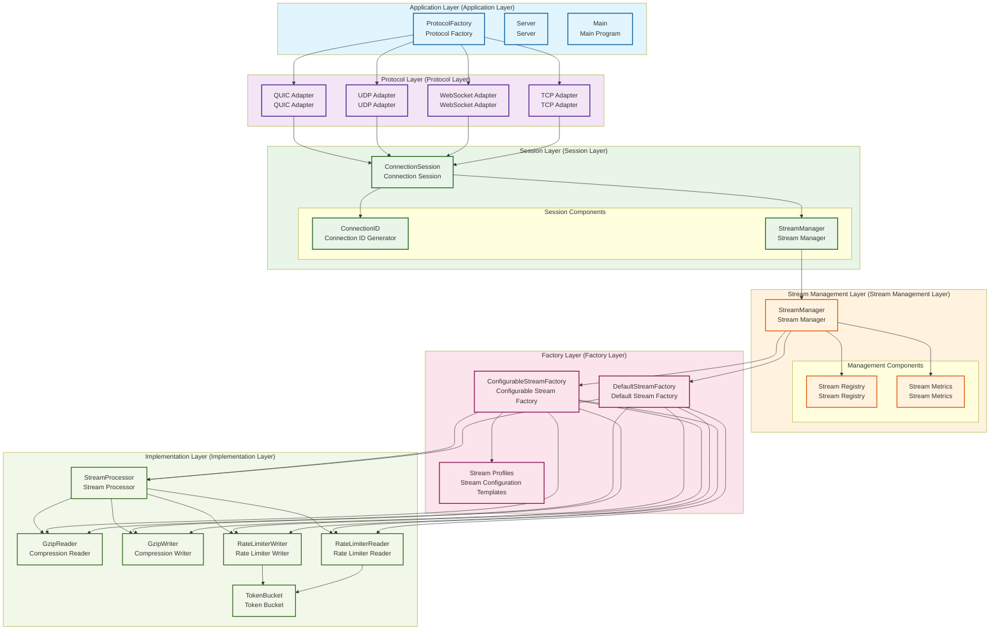

# Tunnox Core

<div align="center">


**🌐 Cloud Tunnel and Connection Management Core Framework**  
*A lightweight tunnel solution designed for distributed network environments*

[🚀 Quick Start](#-quick-start) • [🏗️ System Architecture](#️-system-architecture) • [✨ Core Features](#-core-features) • [📦 Project Structure](#-project-structure)

</div>

---

## 📋 Project Overview

Tunnox Core is a cloud tunnel framework developed in Go, designed specifically for distributed network environments. The project adopts a modern layered architecture, integrates support for multiple network protocols, and provides high-performance, low-latency solutions for port mapping and connection management through advanced technologies such as memory pools, zero-copy, and streaming processing.

### 🎯 Project Goals

**Lightweight Tunnel Service** 🔄 In Development
- Provide port mapping and tunnel functionality framework, supporting TCP, HTTP, SOCKS, and other protocol mappings

**Multi-Protocol Support** ✅ Completed
- Support TCP, WebSocket, UDP, QUIC, and other transport protocols, adapting to different network environment requirements

**Distributed Architecture** 🔄 In Development
- Support cluster deployment and node management, achieving high availability and load balancing

**Resource Optimization** ✅ Completed
- Significantly improve performance and reduce resource consumption through memory pools, zero-copy, connection pools, and other technologies

**Scalability** ✅ Completed
- Modular design, plugin architecture, facilitating feature extension and customized development

### 🌟 Technical Features

**🏗️ Layered Architecture**
- Clear separation of business logic, data access, and infrastructure
- Easy maintenance and extension

**🏭 Factory Pattern**
- StreamFactory unified management of stream component creation, supporting configurable factories and predefined templates
- Unified management and configuration

**🔧 Resource Management**
- Hierarchical resource cleanup based on Dispose pattern, preventing memory leaks
- Ensures graceful shutdown

**🛡️ Type Safety**
- Strong type system, unified naming conventions
- Improves code quality and development efficiency

**⚡ Concurrency Control**
- Thread-safe design, optimized locking strategies
- Supports high-concurrency scenarios

**🚀 Performance Optimization**
- Comprehensive application of memory pools, zero-copy, streaming processing, compression algorithms, and other technologies
- High performance and low latency

**🔌 Protocol Adaptation**
- Unified protocol adapter interface, supporting transparent switching of multiple network protocols
- Flexible protocol switching

**📊 Streaming Processing**
- Support for data compression, rate limiting, chunked transmission, and other advanced stream processing features
- Optimizes network bandwidth

**📈 Stream Management**
- StreamManager unified management of stream lifecycle, supporting stream registration, monitoring, and metrics statistics
- Unified monitoring and management

---

## 🏗️ System Architecture

### 📊 Overall Architecture Diagram

```mermaid
graph TB
    subgraph "Application Layer"
        Server[Server Entry]
        Config[Configuration Management]
    end
    
    subgraph "Business Layer"
        CloudControl[Cloud Control Bus]
        subgraph "Business Managers"
            JWTManager[JWT Manager]
            StatsManager[Statistics Manager - Basic]
            NodeManager[Node Manager - Basic]
            AnonymousManager[Anonymous Manager]
            SearchManager[Search Manager - Basic]
            ConnectionManager[Connection Manager - Basic]
            ConfigManager[Configuration Manager - Basic]
            CleanupManager[Cleanup Manager - Basic]
        end
    end
    
    subgraph "Data Layer"
        subgraph "Data Repositories"
            UserRepo[User Repository]
            ClientRepo[Client Repository]
            MappingRepo[Port Mapping Repository]
            NodeRepo[Node Repository]
            ConnectionRepo[Connection Repository]
        end
        
        subgraph "Storage Abstraction"
            MemoryStorage[Memory Storage - Implemented]
            RedisStorage[Redis Storage - To Implement]
            CustomStorage[Custom Storage - To Implement]
        end
    end
    
    subgraph "Infrastructure Layer"
        subgraph "Distributed Services"
            IDGenerator[ID Generator - Basic]
            DistributedLock[Distributed Lock - Basic]
        end
        
        subgraph "Protocol Layer"
            TCPAdapter[TCP Adapter - Framework]
            WebSocketAdapter[WebSocket Adapter - Framework]
            UDPAdapter[UDP Adapter - Framework]
            QUICAdapter[QUIC Adapter - Framework]
        end
        
        subgraph "Stream Processing"
            StreamProcessor[Stream Processor - Basic]
            RateLimiter[Rate Limiter - Basic]
            Compression[Compression - Basic]
            Encryption[Encryption - To Implement]
        end
    end
    
    Server --> CloudControl
    CloudControl --> JWTManager
    CloudControl --> StatsManager
    CloudControl --> NodeManager
    CloudControl --> AnonymousManager
    CloudControl --> SearchManager
    CloudControl --> ConnectionManager
    CloudControl --> ConfigManager
    CloudControl --> CleanupManager
    
    JWTManager --> UserRepo
    StatsManager --> UserRepo
    NodeManager --> NodeRepo
    AnonymousManager --> ClientRepo
    SearchManager --> UserRepo
    ConnectionManager --> ConnectionRepo
    
    UserRepo --> MemoryStorage
    ClientRepo --> MemoryStorage
    MappingRepo --> MemoryStorage
    NodeRepo --> MemoryStorage
    ConnectionRepo --> MemoryStorage
    
    CloudControl --> IDGenerator
    CloudControl --> DistributedLock
    
    Server --> TCPAdapter
    Server --> WebSocketAdapter
    Server --> UDPAdapter
    Server --> QUICAdapter
    
    TCPAdapter --> StreamProcessor
    WebSocketAdapter --> StreamProcessor
    UDPAdapter --> StreamProcessor
    QUICAdapter --> StreamProcessor
    
    StreamProcessor --> RateLimiter
    StreamProcessor --> Compression
    StreamProcessor --> Encryption
```



### 📋 Architecture Layer Description

#### 🎯 Layered Design Principles

**Dependency Inversion**
- High-level modules don't depend on low-level modules, both depend on abstractions
- Decoupling through interfaces

**Single Responsibility**
- Each layer is only responsible for its core functionality
- Clear responsibility boundaries

**Open-Closed Principle**
- Open for extension, closed for modification
- Factory pattern and configuration

**Interface Segregation**
- Decoupling through interfaces, reducing coupling
- Define clear interfaces

#### 📋 Layer Responsibilities

**Application Layer**
- Server entry and configuration management
- Main components: ProtocolFactory, Server, Main

**Protocol Layer**
- Multiple network protocol adapter implementations
- Main components: TCP, WebSocket, UDP, QUIC adapters

**Session Layer**
- Connection session management and lifecycle control
- Main components: ConnectionSession, StreamManager

**Stream Management Layer**
- Unified management and registration of stream components
- Main components: StreamManager, stream registry, metrics statistics

**Factory Layer**
- Stream component creation and configuration
- Main components: DefaultStreamFactory, ConfigurableStreamFactory

**Implementation Layer**
- Specific stream processing component implementations
- Main components: StreamProcessor, compressors, rate limiters

### 🔄 Stream Processing Architecture Layered Diagram



---

## ✨ Core Features

### 🔐 Authentication & Security

**JWT Token Management** ✅ Completed
- Support for token generation, validation, and refresh, with built-in token caching and automatic cleanup mechanisms

**Anonymous User Support** ✅ Completed
- Anonymous client generation and management functionality

**Role Permission Control** 🔄 In Development
- Basic permission control framework (fine-grained permissions to be implemented)

**Secure Communication** 🔄 In Development
- TLS encrypted transmission support (specific implementation to be improved)

**Encrypted Transmission Options** 🔄 In Development
- Reserved data packet encryption flag bits, supporting optional end-to-end encrypted transmission

### 📊 Statistics & Monitoring

**Basic Statistics** ✅ Completed
- Basic statistical information for users, clients, and port mappings

**Traffic Statistics** 🔄 In Development
- Basic traffic and connection count statistics (chart data to be implemented)

**System Monitoring** ✅ Completed
- System-wide statistical information collection

**Performance Metrics** ✅ Completed
- Basic performance metrics collection framework

### 🌐 Distributed Support

**Node Management** 🔄 In Development
- Basic node registration and heartbeat mechanisms (failover to be implemented)

**ID Generation** ✅ Completed
- Basic ID generator, supporting client, user, node, and mapping ID generation (memory version)

**Distributed Lock** ✅ Completed
- Basic distributed lock implementation, supporting resource coordination in cluster environments (memory version)

**Load Balancing** 🔄 In Development
- Load balancing framework (specific strategies to be implemented)

**Cluster Communication** 🔄 In Development
- Inter-node communication framework (specific implementation to be completed)

### ⚡ Performance Optimization

**Memory Pool** ✅ Completed
- Efficient buffer management, reducing memory allocation and GC pressure

**Zero-Copy** ✅ Completed
- Reducing memory allocation overhead, improving data transmission efficiency

**Streaming Processing** ✅ Completed
- Support for compression and rate limiting, optimizing network bandwidth usage

**Connection Pool** 🔄 In Development
- Connection pool framework (specific optimizations to be implemented)

**Asynchronous Processing** 🔄 In Development
- Asynchronous processing framework (specific mechanisms to be improved)

**Data Packet Processing** ✅ Completed
- Support for compression and encryption flag bits, flexible data packet type processing

### 🔄 Resource Management

**Automatic Cleanup** ✅ Completed
- Basic expired resource cleanup mechanisms, preventing resource leaks

**Memory Leak Prevention** ✅ Completed
- Basic resource tracking framework, ensuring proper resource release

**Graceful Shutdown** ✅ Completed
- Basic resource release mechanisms, supporting graceful service shutdown

**Resource Monitoring** 🔄 In Development
- Basic resource usage monitoring framework (real-time monitoring to be improved)

---

## 🚀 Quick Start

### 📋 Requirements

**Go** 1.24+
- Support for generics, modularization, and other modern features

**Git** Latest version
- For code version control

### 🛠️ Installation & Running

```bash
# Clone repository
git clone https://github.com/tunnox-net/tunnox-core.git
cd tunnox-core

# Install dependencies
go mod tidy

# Run tests
go test ./... -v

# Build server
go build -o server cmd/server/main.go

# Run server
./server
```

### ⚙️ Configuration

The project uses YAML configuration files, supporting the following configuration items:

**Server Configuration**
- Listen address, port, timeout settings, CORS configuration
- Basic server parameters

**Protocol Configuration**
- TCP, WebSocket, UDP, QUIC protocol parameters
- Support for independent port configuration

**Logging Configuration**
- Log level, format, output location
- Support for log rotation and compression

**Cloud Control Configuration**
- JWT settings, data cleanup strategies, ID generation parameters
- Cloud control related configuration

**Performance Configuration**
- Memory pool, connection pool parameters
- Support for dynamic adjustment

**Monitoring Configuration**
- Metrics collection, health checks
- Support for Prometheus format

**Security Configuration**
- TLS settings, API key authentication, administrator accounts
- Security related configuration

**Rate Limiting Configuration**
- Request frequency limits, burst traffic handling
- Traffic control configuration

> **Note**: The current configuration system is static configuration, supporting file configuration and environment variable overrides. Dynamic configuration management functionality is under development.

For detailed configuration examples, please refer to the `config.yaml` file, which supports environment variable configuration overrides.

---

## 📦 Project Structure

```
tunnox-core/
├── 📁 cmd/                    # Command line applications
│   └── 📁 server/            # Server entry point
├── 📁 internal/              # Internal packages
│   ├── 📁 cloud/             # Cloud control related
│   │   ├── 📁 managers/      # Business managers
│   │   └── 📁 generators/    # ID generators
│   ├── 📁 protocol/          # Protocol adapters
│   ├── 📁 stream/            # Stream processing
│   │   ├── 📄 factory.go     # Stream factory implementation
│   │   ├── 📄 manager.go     # Stream manager
│   │   ├── 📄 config.go      # Stream configuration templates
│   │   ├── 📄 interfaces.go  # Stream interface definitions
│   │   └── 📄 ...           # Other stream processing components
│   ├── 📁 packet/            # Data packet definitions
│   ├── 📁 utils/             # Utility functions
│   ├── 📁 errors/            # Error definitions
│   └── 📁 constants/         # Constant definitions
├── 📁 docs/                  # Documentation
│   └── 📄 architecture-layers.mmd  # Architecture layered diagram
├── 📁 tests/                 # Test files
│   └── 📄 stream_factory_test.go   # Stream factory tests
├── 📄 config.yaml           # Configuration file
├── 📄 go.mod               # Go module file
└── 📄 LICENSE              # License
```

---

## 🔧 Technology Stack

### 🏗️ Core Framework

**Go** 1.24+
- Primary development language, supporting generics, modularization, and other modern features

**TCP/WebSocket/UDP/QUIC** Latest
- Multiple transport protocol support

**JWT** golang-jwt/jwt/v5
- Authentication tokens, supporting token refresh and caching

**Gorilla WebSocket** Latest
- WebSocket support, supporting binary and text messages

**quic-go** Latest
- QUIC protocol support, supporting HTTP/3 and custom protocols

### 🛠️ Utility Libraries

**Logrus** Latest
- Structured logging, supporting multiple output formats

**Testify** Latest
- Rich assertion and testing tools

**YAML** gopkg.in/yaml.v3
- Human-friendly configuration file format

**Gzip** Built-in
- Built-in compression algorithm support

### ⚡ Performance Optimization

**Memory Pool**
- Custom memory pool implementation, reducing GC pressure
- Reduces memory allocation overhead

**Zero-Copy**
- Buffer reuse, improving data transmission efficiency
- Improves transmission performance

**Streaming Processing**
- Support for compression, rate limiting, chunked transmission
- Optimizes network bandwidth

**Factory Pattern**
- StreamFactory unified management of stream component creation
- Supports configurable optimization

**Stream Management**
- StreamManager provides stream lifecycle management and performance monitoring
- Unified monitoring and management

**Connection Pool**
- Connection pool framework (specific reuse optimization to be implemented)
- Connection reuse optimization

**Data Packet Processing**
- Support for compression and encryption flag bits, flexible data packet type processing
- Flexible data processing

---

## 📈 Development Progress

### ✅ Completed

**Basic Architecture Design** 100%
- Complete layered architecture design

**Protocol Adapter Framework** 100%
- TCP, WebSocket, UDP, QUIC protocol framework

**Stream Processing System** 100%
- Compression, rate limiting, zero-copy functionality

**StreamFactory Architecture** 100%
- Factory pattern, configurable factory, predefined templates

**StreamManager** 100%
- Stream lifecycle management, metrics statistics

**Connection Session Management Framework** 100%
- Session management and lifecycle control

**JWT Authentication System** 100%
- Complete JWT authentication functionality

**Memory Pool and Buffer Management** 100%
- Efficient memory management

**Logging System** 100%
- Structured logging system

**Error Handling Framework** 100%
- Unified error handling

**Basic ID Generator** 100%
- Memory version ID generation

**Basic Configuration Management** 100%
- File configuration and environment variables

**Data Model Definitions** 100%
- Complete data models

**Data Access Layer** 100%
- Repository pattern implementation

**Basic Statistics Functionality** 100%
- Basic statistics and monitoring

### 🚧 In Development

**Port Mapping Business Logic Implementation** 30%
- Core business logic development in progress

**Data Forwarding Mechanism Implementation** 20%
- Data forwarding functionality development in progress

**Cluster Node Communication Implementation** 15%
- Inter-node communication development in progress

**Statistics and Monitoring System Improvement** 40%
- Monitoring system improvement in progress

**User Management Interface Development** 10%
- Management interface development in progress

**API Interface Implementation** 25%
- RESTful API development in progress

**Encrypted Transmission Processor Implementation** 35%
- Encryption functionality development in progress

**Distributed ID Generator Improvement** 60%
- Redis/database support development in progress

**Distributed Lock Implementation** 50%
- Redis/database support development in progress

**Dynamic Configuration Management System** 20%
- Hot reload, configuration validation development in progress

**Protocol Adapter Specific Implementation** 70%
- Specific protocol implementation in progress

**Connection Session Specific Business Logic** 45%
- Business logic improvement in progress

### 📋 Planned

- [ ] Client SDK
- [ ] Web Management Interface
- [ ] Mobile Support
- [ ] Plugin System
- [ ] Performance Benchmarking
- [ ] Deployment Documentation
- [ ] User Manual

---

## 🤝 Contributing

We welcome community contributions! Please follow these steps:

### 📝 Contribution Process

1. **Fork this repository**
2. **Create a feature branch** (`git checkout -b feature/AmazingFeature`)
3. **Commit your changes** (`git commit -m 'Add some AmazingFeature'`)
4. **Push to the branch** (`git push origin feature/AmazingFeature`)
5. **Create a Pull Request**

### 🛠️ Development Standards

**Code Standards**
- Follow Go language coding standards
- Use gofmt to format code

**Test Coverage**
- Add appropriate test cases
- Ensure code quality

**Documentation Updates**
- Update relevant documentation
- Keep documentation synchronized

**Test Passing**
- Ensure code passes all tests
- Verify functionality correctness

---

## 📄 License

This project is licensed under the MIT License - see the [LICENSE](LICENSE) file for details.

---

## 📞 Contact Us

**Project Repository**
- https://github.com/tunnox-net/tunnox-core

**Issue Feedback**
- https://github.com/tunnox-net/tunnox-core/issues

**Development Email**
- zhangyu.tongbin@gmail.com

---

## 🙏 Acknowledgments

Thank you to all developers and users who have contributed to this project!

---

<div align="center">

**⭐ If this project helps you, please give it a star!**

</div> 