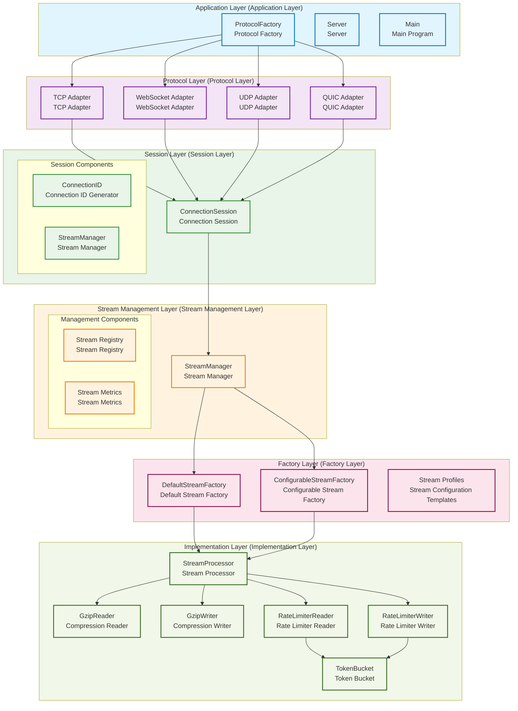

# Tunnox Core

<div align="center">


**🌐 Cloud Tunnel and Connection Management Core Framework**  
*A lightweight tunnel solution designed for distributed network environments*

[🚀 Quick Start](#-quick-start) • [🏗️ System Architecture](#️-system-architecture) • [✨ Core Features](#-core-features) • [📦 Project Structure](#-project-structure)

</div>

---

## 📋 Project Overview

Tunnox Core is a cloud tunnel framework developed in Go, designed specifically for distributed network environments. The project adopts a modern layered architecture, integrates support for multiple network protocols, and provides high-performance, low-latency solutions for port mapping and connection management through advanced technologies such as memory pools, zero-copy, stream processing, and encryption.

### 🎯 Project Goals

**Multi-Protocol Support** ✅ Completed
- Support TCP, WebSocket, UDP, QUIC, and other transport protocols, adapting to different network environment requirements

**Stream Processing System** ✅ Completed
- Complete stream processing architecture supporting compression, rate limiting, encryption, zero-copy and other technologies

**Distributed Architecture** 🔄 In Development
- Support cluster deployment and node management, achieving high availability and load balancing

**Port Mapping Business** 🔄 In Development
- Provide port mapping and tunnel functionality framework, supporting TCP, HTTP, SOCKS, and other protocol mappings

**Scalability** ✅ Completed
- Modular design, plugin architecture, facilitating feature extension and customized development

### 🌟 Technical Features

**🏗️ Layered Architecture**
- Clear separation of application layer, protocol layer, session layer, stream management layer, factory layer, and implementation layer
- Easy to maintain and extend

**🔐 Encrypted Transmission**
- Support for AES-GCM encryption with compression-first-then-encryption transmission strategy
- Configurable encryption key management

**🏭 Factory Pattern**
- StreamFactory unified management of stream component creation, supporting configurable factory and predefined templates
- Unified management and configuration

**🔧 Resource Management**
- Hierarchical resource cleanup based on Dispose pattern, preventing memory leaks
- Ensuring graceful shutdown

**⚡ Performance Optimization**
- Comprehensive application of memory pools, zero-copy, stream processing, compression algorithms, and other technologies
- High performance and low latency

**🔌 Protocol Adaptation**
- Unified protocol adapter interface, supporting transparent switching of multiple network protocols
- Flexible protocol switching

**📊 Stream Management**
- StreamManager unified management of stream lifecycle, supporting stream registration, monitoring, and metrics statistics
- Unified monitoring and management

---

## 🏗️ System Architecture

### 📊 Overall Architecture Diagram


### 📋 Architecture Layer Description

#### 🎯 Layered Design Principles

**Dependency Inversion**
- High-level modules don't depend on low-level modules, both depend on abstractions
- Decoupling through interfaces

**Single Responsibility**
- Each layer is only responsible for its core functionality
- Clear responsibility boundaries

**Open-Closed Principle**
- Open for extension, closed for modification
- Factory pattern and configuration

**Interface Segregation**
- Decoupling through interfaces, reducing coupling
- Define clear interfaces

#### 📋 Layer Responsibilities

**Application Layer**
- Server entry and configuration management
- Main components: ProtocolFactory, Server, Main

**Protocol Layer**
- Multiple network protocol adapter implementations
- Main components: TCP, WebSocket, UDP, QUIC adapters

**Session Layer**
- Connection session management and lifecycle control
- Main components: ConnectionSession, StreamManager

**Stream Management Layer**
- Unified management and registration of stream components
- Main components: StreamManager, stream registry, metrics statistics

**Factory Layer**
- Stream component creation and configuration
- Main components: DefaultStreamFactory, ConfigurableStreamFactory

**Implementation Layer**
- Specific stream processing component implementations
- Main components: StreamProcessor, compressors, rate limiters

### 🔄 Stream Processing Architecture Layered Diagram



---

## ✨ Core Features

### 🔐 Authentication & Security

**JWT Token Management** ✅ Completed
- Support for token generation, validation, and refresh, with built-in token caching and automatic cleanup mechanisms

**Anonymous User Support** ✅ Completed
- Anonymous client generation and management functionality

**Encrypted Transmission** ✅ Completed
- Support for AES-GCM encryption with compression-first-then-encryption transmission strategy
- Configurable encryption key management

**Role Permission Control** 🔄 In Development
- Basic permission control framework (fine-grained permissions to be implemented)

**Secure Communication** 🔄 In Development
- TLS encrypted transmission support (specific implementation to be improved)

### 📊 Statistics & Monitoring

**Basic Statistics** ✅ Completed
- Basic statistical information for users, clients, and port mappings

**Traffic Statistics** 🔄 In Development
- Basic traffic and connection count statistics (chart data to be implemented)

**System Monitoring** ✅ Completed
- System-wide statistical information collection

**Performance Metrics** ✅ Completed
- Basic performance metrics collection framework

### 🌐 Distributed Support

**Node Management** 🔄 In Development
- Basic node registration and heartbeat mechanisms (failover to be implemented)

**ID Generation** ✅ Completed
- Basic ID generator, supporting client, user, node, and mapping ID generation (memory version)

**Distributed Lock** ✅ Completed
- Basic distributed lock implementation, supporting resource coordination in cluster environments (memory version)

**Load Balancing** 🔄 In Development
- Load balancing framework (specific strategies to be implemented)

**Cluster Communication** 🔄 In Development
- Inter-node communication framework (specific implementation to be completed)

### ⚡ Performance Optimization

**Memory Pool** ✅ Completed
- Efficient buffer management, reducing memory allocation and GC pressure

**Zero-Copy** ✅ Completed
- Reducing memory allocation overhead, improving data transmission efficiency

**Streaming Processing** ✅ Completed
- Support for compression, rate limiting, encryption, optimizing network bandwidth usage

**Connection Pool** 🔄 In Development
- Connection pool framework (specific optimizations to be implemented)

**Asynchronous Processing** 🔄 In Development
- Asynchronous processing framework (specific mechanisms to be improved)

**Data Packet Processing** ✅ Completed
- Support for compression and encryption flag bits, flexible data packet type processing

### 🔄 Resource Management

**Automatic Cleanup** ✅ Completed
- Basic expired resource cleanup mechanisms, preventing resource leaks

**Memory Leak Prevention** ✅ Completed
- Basic resource tracking framework, ensuring proper resource release

**Graceful Shutdown** ✅ Completed
- Basic resource release mechanisms, supporting graceful service shutdown

**Resource Monitoring** 🔄 In Development
- Basic resource usage monitoring framework (real-time monitoring to be improved)

---

## 🚀 Quick Start

### 📋 Requirements

**Go** 1.24+
- Support for generics, modularization, and other modern features

**Git** Latest version
- For code version control

### 🛠️ Installation & Running

```bash
# Clone repository
git clone https://github.com/tunnox-net/tunnox-core.git
cd tunnox-core

# Install dependencies
go mod tidy

# Run tests
go test ./... -v

# Build server
go build -o server cmd/server/main.go

# Run server
./server
```

### ⚙️ Configuration

The project uses YAML configuration files, supporting the following configuration items:

**Server Configuration**
- Listen address, port, timeout settings, CORS configuration
- Basic server parameters

**Protocol Configuration**
- TCP, WebSocket, UDP, QUIC protocol parameters
- Support for independent port configuration

**Logging Configuration**
- Log level, format, output location
- Support for log rotation and compression

**Cloud Control Configuration**
- JWT settings, data cleanup strategies, ID generation parameters
- Cloud control related configuration

**Performance Configuration**
- Memory pool, connection pool parameters
- Support for dynamic adjustment

**Monitoring Configuration**
- Metrics collection, health checks
- Support for Prometheus format

**Security Configuration**
- TLS settings, API key authentication, administrator accounts
- Security related configuration

**Rate Limiting Configuration**
- Request frequency limits, burst traffic handling
- Traffic control configuration

> **Note**: The current configuration system is static configuration, supporting file configuration and environment variable overrides. Dynamic configuration management functionality is under development.

For detailed configuration examples, please refer to the `config.yaml` file, which supports environment variable configuration overrides.

---

## 📦 Project Structure

```
tunnox-core/
├── 📁 cmd/                    # Command line applications
│   └── 📁 server/            # Server entry point
├── 📁 internal/              # Internal packages
│   ├── 📁 cloud/             # Cloud control related
│   │   ├── 📁 managers/      # Business managers
│   │   ├── 📁 generators/    # ID generators
│   │   ├── 📁 distributed/   # Distributed services
│   │   ├── 📁 models/        # Data models
│   │   ├── 📁 repos/         # Data repositories
│   │   ├── 📁 storages/      # Storage abstraction
│   │   ├── 📁 constants/     # Constant definitions
│   │   ├── 📁 configs/       # Configuration management
│   │   ├── 📁 factories/     # Factory patterns
│   │   └── 📁 stats/         # Statistics functionality
│   ├── 📁 protocol/          # Protocol adapters
│   │   ├── 📄 adapter.go     # Protocol adapter interface
│   │   ├── 📄 manager.go     # Protocol manager
│   │   ├── 📄 session.go     # Connection session management
│   │   ├── 📄 tcp_adapter.go # TCP adapter
│   │   ├── 📄 websocket_adapter.go # WebSocket adapter
│   │   ├── 📄 udp_adapter.go # UDP adapter
│   │   └── 📄 quic_adapter.go # QUIC adapter
│   ├── 📁 stream/            # Stream processing
│   │   ├── 📄 factory.go     # Stream factory implementation
│   │   ├── 📄 manager.go     # Stream manager
│   │   ├── 📄 config.go      # Stream configuration templates
│   │   ├── 📄 interfaces.go  # Stream interface definitions
│   │   ├── 📄 stream_processor.go # Stream processor
│   │   ├── 📄 rate_limiter.go # Rate limiter
│   │   ├── 📄 compression.go # Compressor
│   │   └── 📄 token_bucket.go # Token bucket
│   ├── 📁 utils/             # Utility classes
│   │   ├── 📄 dispose.go     # Resource management
│   │   ├── 📄 buffer_pool.go # Buffer pool
│   │   ├── 📄 logger.go      # Logging utilities
│   │   ├── 📄 random.go      # Random number generation
│   │   └── 📄 time.go        # Time utilities
│   ├── 📁 constants/         # Constant definitions
│   │   ├── 📄 constants.go   # Basic constants
│   │   ├── 📄 log.go         # Logging constants
│   │   └── 📄 http.go        # HTTP constants
│   ├── 📁 errors/            # Error handling
│   │   └── 📄 errors.go      # Error definitions
│   └── 📁 packet/            # Data packet processing
│       └── 📄 packet.go      # Data packet definitions
├── 📁 tests/                 # Test files
├── 📁 docs/                  # Documentation
├── 📁 scripts/               # Script files
├── 📄 go.mod                 # Go module file
├── 📄 go.sum                 # Dependency checksum file
├── 📄 config.yaml            # Configuration file
├── 📄 README.md              # Chinese documentation
├── 📄 README_EN.md           # English documentation
└── 📄 LICENSE                # License
```

---

## 📈 Development Progress

### ✅ Completed

**Basic Architecture Design** 100%
- Complete layered architecture design

**Protocol Adapter Framework** 100%
- TCP, WebSocket, UDP, QUIC protocol framework

**Stream Processing System** 100%
- Compression, rate limiting, zero-copy functionality

**StreamFactory Architecture** 100%
- Factory pattern, configurable factory, predefined templates

**StreamManager** 100%
- Stream lifecycle management, metrics statistics

**Connection Session Management Framework** 100%
- Session management and lifecycle control

**JWT Authentication System** 100%
- Complete JWT authentication functionality

**Memory Pool and Buffer Management** 100%
- Efficient memory management

**Logging System** 100%
- Structured logging system

**Error Handling Framework** 100%
- Unified error handling

**Basic ID Generator** 100%
- Memory version ID generation

**Basic Configuration Management** 100%
- File configuration and environment variables

**Data Model Definitions** 100%
- Complete data models

**Data Access Layer** 100%
- Repository pattern implementation

**Basic Statistics Functionality** 100%
- Basic statistics and monitoring

**Test Coverage** 100%
- Complete unit test coverage

### 🚧 In Development

**Port Mapping Business Logic Implementation** 30%
- Core business logic development in progress

**Data Forwarding Mechanism Implementation** 20%
- Data forwarding functionality development in progress

**Cluster Node Communication Implementation** 15%
- Inter-node communication development in progress

**Statistics and Monitoring System Improvement** 40%
- Monitoring system improvement in progress

**User Management Interface Development** 10%
- Management interface development in progress

**API Interface Implementation** 25%
- RESTful API development in progress

**Encrypted Transmission System** 100%
- AES-GCM encryption with compression-first-then-encryption strategy

**Distributed ID Generator Improvement** 60%
- Redis/database support development in progress

**Distributed Lock Implementation** 50%
- Redis/database support development in progress

**Dynamic Configuration Management System** 20%
- Hot reload, configuration validation development in progress

**Protocol Adapter Specific Implementation** 70%
- Specific protocol implementation in progress

**Connection Session Specific Business Logic** 45%
- Business logic improvement in progress

### 📋 Planned

- [ ] Client SDK
- [ ] Web Management Interface
- [ ] Mobile Support
- [ ] Plugin System
- [ ] Performance Benchmarking
- [ ] Deployment Documentation
- [ ] User Manual

---

## 🤝 Contributing

We welcome community contributions! Please follow these steps:

### 📝 Contribution Process

1. **Fork this repository**
2. **Create a feature branch** (`git checkout -b feature/AmazingFeature`)
3. **Commit your changes** (`git commit -m 'Add some AmazingFeature'`)
4. **Push to the branch** (`git push origin feature/AmazingFeature`)
5. **Create a Pull Request**

### 🛠️ Development Standards

**Code Standards**
- Follow Go language coding standards
- Use gofmt to format code

**Test Coverage**
- Add appropriate test cases
- Ensure code quality

**Documentation Updates**
- Update relevant documentation
- Keep documentation synchronized

### 📋 Development Environment

**Go Version Requirements**
- Go 1.24+ (supporting generics and other modern features)

**Development Tools**
- Recommended to use GoLand or VS Code
- Install Go extensions and formatting tools

**Code Quality**
- Use `go vet` to check code
- Use `golint` to check code style
- Run `go test ./...` to ensure tests pass

---

## 📄 License

This project is licensed under the MIT License - see the [LICENSE](LICENSE) file for details.

---

## 📞 Contact Us

- **Project Homepage**: [GitHub](https://github.com/tunnox-net/tunnox-core)
- **Issue Reporting**: [Issues](https://github.com/tunnox-net/tunnox-core/issues)
- **Discussion**: [Discussions](https://github.com/tunnox-net/tunnox-core/discussions)

---

<div align="center">

**⭐ If this project helps you, please give us a Star!**

</div> 