# Tunnox Core 架构设计文档 V2.2

> **版本**：V2.2  
> **修订日期**：2025-11-25  
> **修订说明**：重构文档结构，增强商业价值展现，使用Mermaid图表，优化阅读体验

---

## 📖 文档导航

| 章节 | 内容 | 目标读者 |
|------|------|---------|
| [项目概述](#-项目概述) | 项目定位、商业价值、核心优势 | 投资人、决策者 |
| [核心功能](#-核心功能特性) | 功能清单、应用场景 | 产品经理、用户 |
| [技术架构](#️-技术架构总览) | 系统架构、技术栈 | 技术负责人 |
| [核心概念](#-核心概念) | ID设计、数据模型 | 开发人员 |
| [业务流程](#-核心业务流程) | 用户接入、映射创建流程 | 产品经理、开发人员 |
| [Management API](#-management-api) | HTTP REST接口文档 | 集成开发人员 |
| [存储架构](#-数据持久化架构) | Storage分层设计 | 架构师、开发人员 |
| [消息通知层](#-消息通知层messagebroker) | MessageBroker抽象设计 | 架构师、开发人员 |
| [集群通信层](#-集群通信层bridge) | gRPC连接池 + 多路复用 | 架构师、开发人员 |
| [集群部署](#️-集群部署架构) | K8s部署、跨节点通信 | 运维人员、架构师 |
| [实现状态](#-实现状态与路线图) | 已实现/待实现功能 | 项目管理者 |

---

## 🚀 项目概述

### 什么是 Tunnox Core？

**Tunnox Core** 是一个**企业级内网穿透平台内核**，为开发者和企业提供安全、高性能的远程访问解决方案。

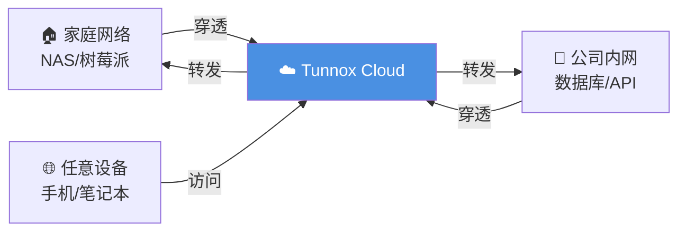
```mermaid
graph LR
    A[🏠 家庭网络<br/>NAS/树莓派] -->|穿透| B[☁️ Tunnox Cloud]
    C[🏢 公司内网<br/>数据库/API] -->|穿透| B
    D[🌐 任意设备<br/>手机/笔记本] -->|访问| B
    
    B -->|转发| A
    B -->|转发| C
    
    style B fill:#4A90E2,color:#fff
```

### 核心价值主张

#### 1️⃣ 技术价值

- **🔒 安全可控**：端到端加密、JWT认证、细粒度权限控制
- **⚡ 高性能**：支持TCP/HTTP/WebSocket/UDP/QUIC多协议，gRPC集群通信
- **📈 可扩展**：K8s原生支持，自动伸缩，支持百万级并发连接
- **🌍 分布式**：多节点部署，就近接入，跨节点智能路由

#### 2️⃣ 商业价值

**市场规模**：
- 全球内网穿透市场规模：$2.5B+ (2024)
- 年增长率：28% CAGR
- 目标用户：开发者、小微企业、IoT设备厂商

**盈利模式**：

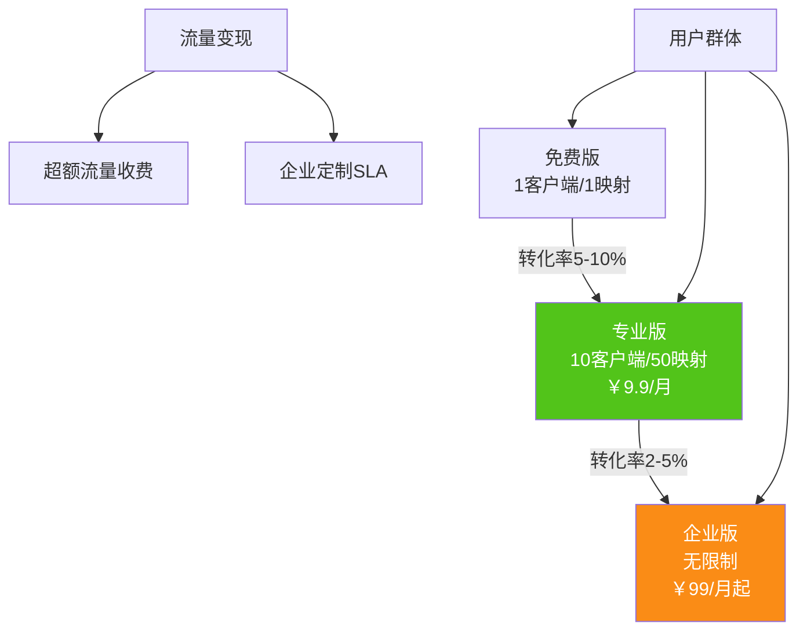
```mermaid
graph TD
    A[用户群体] --> B[免费版<br/>1客户端/1映射]
    A --> C[专业版<br/>10客户端/50映射<br/>￥9.9/月]
    A --> D[企业版<br/>无限制<br/>￥99/月起]
    
    B -->|转化率5-10%| C
    C -->|转化率2-5%| D
    
    E[流量变现] --> F[超额流量收费]
    E --> G[企业定制SLA]
    
    style C fill:#52C41A,color:#fff
    style D fill:#FA8C16,color:#fff
```

**竞争优势**：

| 维度 | Tunnox | frp | ngrok | 花生壳 |
|------|--------|-----|-------|--------|
| **开源** | ✅ 核心开源 | ✅ 完全开源 | ❌ 闭源 | ❌ 闭源 |
| **云控平台** | ✅ 内置API | ❌ 无 | ✅ 商业化 | ✅ 商业化 |
| **多协议** | ✅ TCP/HTTP/WS/UDP/QUIC | 🟡 TCP/HTTP | 🟡 TCP/HTTP | 🟡 TCP/HTTP |
| **集群支持** | ✅ K8s原生 | ❌ 单节点 | ✅ 商业版 | ✅ 商业版 |
| **配额管理** | ✅ 细粒度 | ❌ 无 | ✅ 有 | ✅ 有 |
| **商业化就绪** | ✅ 是 | ❌ 需二次开发 | ✅ 是 | ✅ 是 |

**传播策略**：
1. **开源社区**：核心代码开源，吸引开发者贡献
2. **云服务**：提供托管服务，降低使用门槛
3. **API优先**：易于集成到其他产品（NAS、路由器、IoT设备）
4. **白标支持**：允许企业定制品牌，拓展B2B市场

#### 3️⃣ 应用场景

**场景1：远程办公**
```
开发者在咖啡厅 ─→ Tunnox Cloud ─→ 家庭NAS/开发机
访问公司数据库 ─→ Tunnox Cloud ─→ 公司内网MySQL
```

**场景2：IoT设备管理**
```
工厂生产设备 ─→ Tunnox Cloud ─→ 管理后台
智能家居设备 ─→ Tunnox Cloud ─→ 手机App
```

**场景3：临时服务分享**
```
本地开发服务器 ─→ Tunnox Cloud ─→ 客户演示
临时文件服务器 ─→ Tunnox Cloud ─→ 团队协作
```

---

## 🎯 核心功能特性

### 功能清单

#### 1. 用户与客户端管理

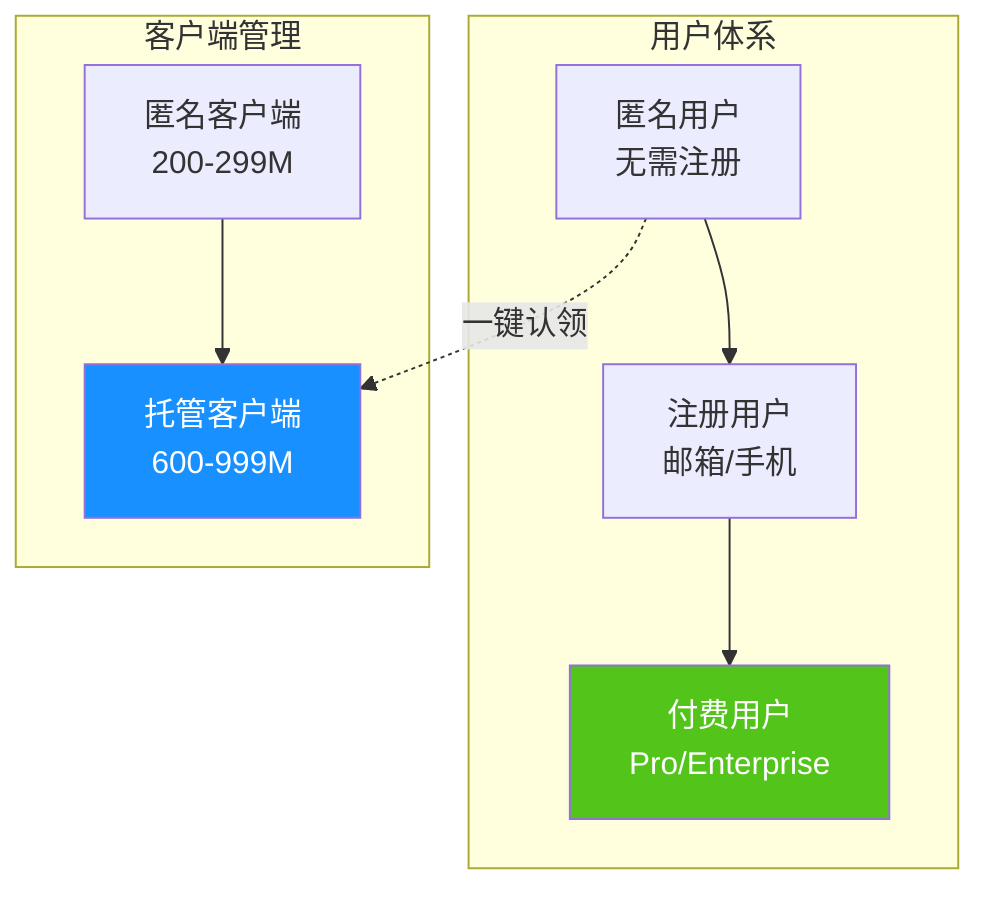
```mermaid
graph TB
    subgraph 用户体系
        A[匿名用户<br/>无需注册] --> B[注册用户<br/>邮箱/手机]
        B --> C[付费用户<br/>Pro/Enterprise]
    end
    
    subgraph 客户端管理
        D[匿名客户端<br/>200-299M] --> E[托管客户端<br/>600-999M]
        A -.->|一键认领| E
    end
    
    style C fill:#52C41A,color:#fff
    style E fill:#1890FF,color:#fff
```

**特性**：
- ✅ 匿名模式：无需注册，一键启动（降低使用门槛，提升传播）
- ✅ 客户端认领：匿名客户端可升级为托管客户端（转化漏斗）
- ✅ 多客户端管理：一个用户可管理多个客户端
- ✅ 细粒度配额：客户端数、映射数、流量、带宽独立限制

#### 2. 端口映射与转发

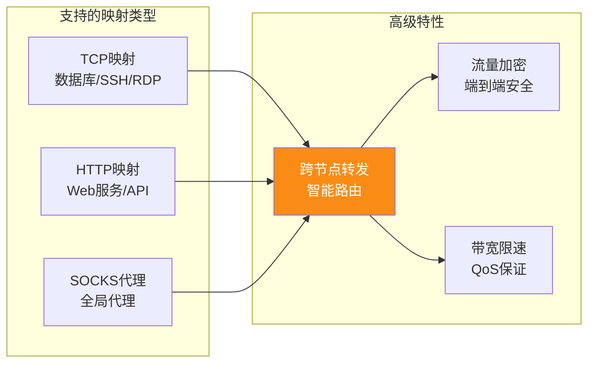
```mermaid
graph LR
    subgraph 支持的映射类型
        A[TCP映射<br/>数据库/SSH/RDP] 
        B[HTTP映射<br/>Web服务/API]
        C[SOCKS代理<br/>全局代理]
    end
    
    subgraph 高级特性
        D[跨节点转发<br/>智能路由]
        E[流量加密<br/>端到端安全]
        F[带宽限速<br/>QoS保证]
    end
    
    A --> D
    B --> D
    C --> D
    D --> E
    D --> F
    
    style D fill:#FA8C16,color:#fff
```

**特性**：
- ✅ 多协议支持：TCP、HTTP、SOCKS5（未来：UDP、QUIC）
- ✅ 智能路由：跨节点自动寻址，就近接入
- ✅ 会话保持：连接断线自动重连
- ✅ 流量统计：实时监控流量、连接数

#### 3. 配额与权限控制

**配额维度**：

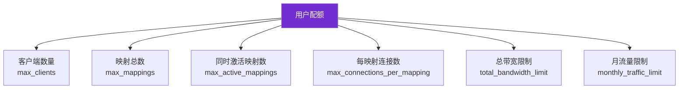
```mermaid
graph TD
    A[用户配额] --> B[客户端数量<br/>max_clients]
    A --> C[映射总数<br/>max_mappings]
    A --> D[同时激活映射数<br/>max_active_mappings]
    A --> E[每映射连接数<br/>max_connections_per_mapping]
    A --> F[总带宽限制<br/>total_bandwidth_limit]
    A --> G[月流量限制<br/>monthly_traffic_limit]
    
    style A fill:#722ED1,color:#fff
```

**配额等级**：

| 等级 | 客户端 | 映射数 | 带宽 | 月流量 | 价格 |
|------|--------|--------|------|--------|------|
| **Free** | 1 | 1 | 512KB/s | 1GB | 免费 |
| **Pro** | 10 | 50 | 10MB/s | 500GB | ￥9.9/月 |
| **Enterprise** | 无限 | 无限 | 100MB/s | 无限 | ￥99/月起 |

#### 4. 实时配置推送

**核心优势**：配置变更 < 100ms 推送到客户端，无需轮询

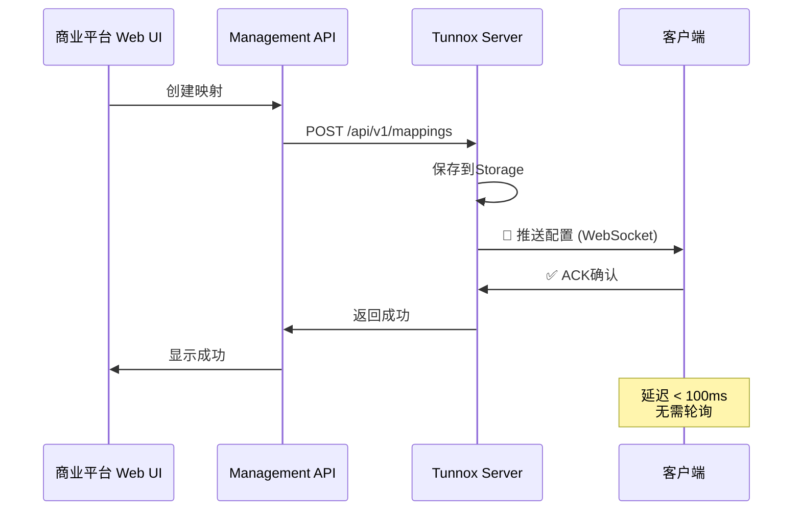
```mermaid
sequenceDiagram
    participant UI as 商业平台 Web UI
    participant API as Management API
    participant Server as Tunnox Server
    participant Client as 客户端
    
    UI->>API: 创建映射
    API->>Server: POST /api/v1/mappings
    Server->>Server: 保存到Storage
    Server->>Client: 🔔 推送配置 (WebSocket)
    Client->>Server: ✅ ACK确认
    Server->>API: 返回成功
    API->>UI: 显示成功
    
    Note over Client: 延迟 < 100ms<br/>无需轮询
```

#### 5. 集群与跨节点转发

**分布式架构**：

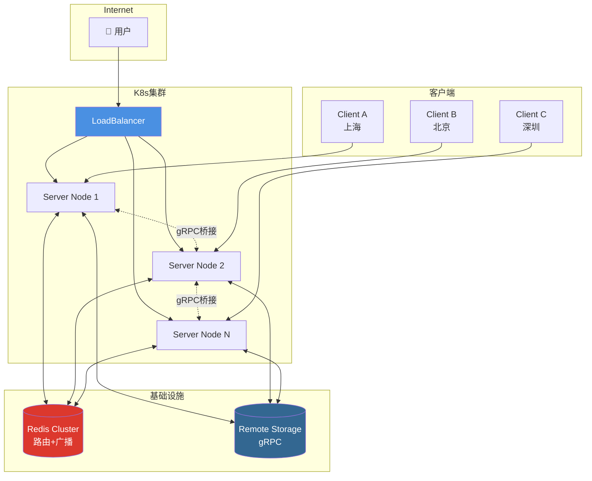
```mermaid
graph TB
    subgraph Internet
        User[👤 用户]
    end
    
    subgraph K8s集群
        LB[LoadBalancer]
        S1[Server Node 1]
        S2[Server Node 2]
        S3[Server Node N]
    end
    
    subgraph 客户端
        C1[Client A<br/>上海]
        C2[Client B<br/>北京]
        C3[Client C<br/>深圳]
    end
    
    subgraph 基础设施
        Redis[(Redis Cluster<br/>路由+广播)]
        Storage[(Remote Storage<br/>gRPC)]
    end
    
    User --> LB
    LB --> S1
    LB --> S2
    LB --> S3
    
    S1 <-.->|gRPC桥接| S2
    S2 <-.->|gRPC桥接| S3
    
    C1 --> S1
    C2 --> S2
    C3 --> S3
    
    S1 <--> Redis
    S2 <--> Redis
    S3 <--> Redis
    
    S1 <--> Storage
    S2 <--> Storage
    S3 <--> Storage
    
    style LB fill:#4A90E2,color:#fff
    style Redis fill:#DC382D,color:#fff
    style Storage fill:#336791,color:#fff
```

**跨节点转发示例**：
```
ClientA (上海) 访问 ClientB (北京) 的 MySQL
  ↓
ServerA 查询 Redis，发现 ClientB 在 ServerB
  ↓
ServerA 发送 Redis Pub/Sub 广播
  ↓
ServerB 收到通知，建立 gRPC 桥接到 ServerA
  ↓
数据流：ClientA → ServerA → (gRPC) → ServerB → ClientB → MySQL
```

---

## 🏗️ 技术架构总览

### 整体架构

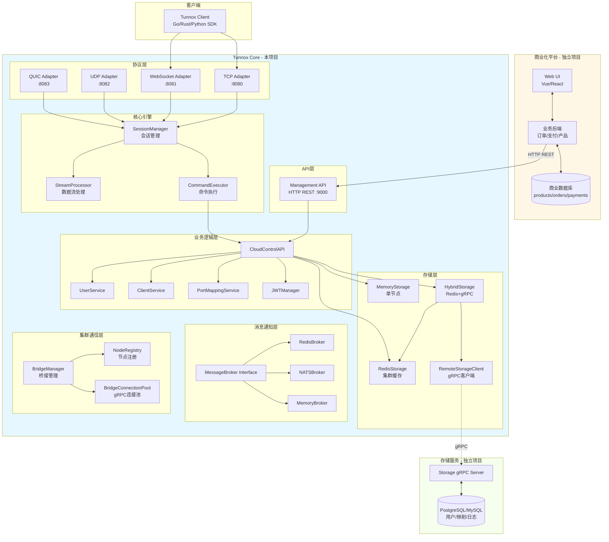
```mermaid
graph TB
    subgraph 外部商业平台[商业化平台 - 独立项目]
        WebUI[Web UI<br/>Vue/React]
        BizBackend[业务后端<br/>订单/支付/产品]
        BizDB[(商业数据库<br/>products/orders/payments)]
        
        WebUI <--> BizBackend
        BizBackend <--> BizDB
    end
    
    subgraph TunnoxCore[Tunnox Core - 本项目]
        direction TB
        
        subgraph API层
            ManagementAPI[Management API<br/>HTTP REST :9000]
        end
        
        subgraph 业务逻辑层
            CloudControl[CloudControlAPI]
            UserSvc[UserService]
            ClientSvc[ClientService]
            MappingSvc[PortMappingService]
            JWTMgr[JWTManager]
            
            CloudControl --> UserSvc
            CloudControl --> ClientSvc
            CloudControl --> MappingSvc
            CloudControl --> JWTMgr
        end
        
        subgraph 协议层
            TCP[TCP Adapter<br/>:8080]
            WS[WebSocket Adapter<br/>:8081]
            UDP[UDP Adapter<br/>:8082]
            QUIC[QUIC Adapter<br/>:8083]
        end
        
        subgraph 核心引擎
            SessionMgr[SessionManager<br/>会话管理]
            StreamProc[StreamProcessor<br/>数据流处理]
            CmdExec[CommandExecutor<br/>命令执行]
        end
        
        subgraph 存储层
            MemStorage[MemoryStorage<br/>单节点]
            RedisStorage[RedisStorage<br/>集群缓存]
            HybridStorage[HybridStorage<br/>Redis+gRPC]
            RemoteClient[RemoteStorageClient<br/>gRPC客户端]
            
            HybridStorage --> RedisStorage
            HybridStorage --> RemoteClient
        end
        
        subgraph 消息通知层
            MsgBroker[MessageBroker Interface]
            RedisBroker[RedisBroker]
            NATSBroker[NATSBroker]
            MemBroker[MemoryBroker]
            
            MsgBroker --> RedisBroker
            MsgBroker --> NATSBroker
            MsgBroker --> MemBroker
        end
        
        subgraph 集群通信层
            NodeRegistry[NodeRegistry<br/>节点注册]
            BridgePool[BridgeConnectionPool<br/>gRPC连接池]
            BridgeMgr[BridgeManager<br/>桥接管理]
            
            BridgeMgr --> BridgePool
            BridgeMgr --> NodeRegistry
        end
        
        ManagementAPI --> CloudControl
        CloudControl --> MemStorage
        CloudControl --> RedisStorage
        CloudControl --> HybridStorage
        
        TCP --> SessionMgr
        WS --> SessionMgr
        UDP --> SessionMgr
        QUIC --> SessionMgr
        
        SessionMgr --> StreamProc
        SessionMgr --> CmdExec
        CmdExec --> CloudControl
    end
    
    subgraph 外部存储服务[存储服务 - 独立项目]
        StorageServer[Storage gRPC Server]
        ExternalDB[(PostgreSQL/MySQL<br/>用户/映射/日志)]
        
        StorageServer <--> ExternalDB
    end
    
    subgraph 客户端
        Client1[Tunnox Client<br/>Go/Rust/Python SDK]
    end
    
    BizBackend -->|HTTP REST| ManagementAPI
    RemoteClient -.->|gRPC| StorageServer
    Client1 --> TCP
    Client1 --> WS
    
    style TunnoxCore fill:#E6F7FF
    style 外部商业平台 fill:#FFF7E6
    style 外部存储服务 fill:#F6FFED
```

### 技术栈

| 层级 | 技术选型 | 说明 |
|------|---------|------|
| **协议层** | TCP, WebSocket, UDP, QUIC | 多协议支持，适配不同场景 |
| **传输层** | gRPC (集群通信), Protocol Buffers | 高性能跨节点通信 |
| **认证层** | JWT (HS256/RS256) | 无状态认证，易于扩展 |
| **消息通知层** | Redis Pub/Sub, NATS (可选) | 类MQ能力，集群消息广播 |
| **存储层** | Redis (Cluster), gRPC Remote Storage | 分布式缓存 + 远程持久化 |
| **集群通信层** | gRPC连接池 + 多路复用 | 节省连接，提升性能 |
| **部署层** | Kubernetes, Docker | 云原生，自动伸缩 |
| **语言** | Go 1.21+ | 高性能，易维护 |

---

## 🔑 核心概念

### ID设计规范

所有ID均为**数字类型**，易于识别和记忆：

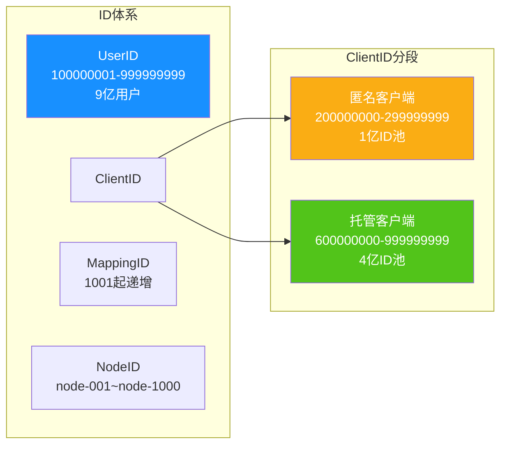
```mermaid
graph LR
    subgraph ID体系
        A[UserID<br/>100000001-999999999<br/>9亿用户]
        B[ClientID]
        C[MappingID<br/>1001起递增]
        D[NodeID<br/>node-001~node-1000]
    end
    
    subgraph ClientID分段
        E[匿名客户端<br/>200000000-299999999<br/>1亿ID池]
        F[托管客户端<br/>600000000-999999999<br/>4亿ID池]
    end
    
    B --> E
    B --> F
    
    style A fill:#1890FF,color:#fff
    style E fill:#FAAD14,color:#fff
    style F fill:#52C41A,color:#fff
```

**设计优势**：
- ✅ 纯数字，易于记忆和交流
- ✅ 前缀分段，快速识别类型
- ✅ ID池充足，支持大规模用户

### ClientID 分段策略

| 类型 | 前缀 | 范围 | ID池大小 | 应用场景 |
|------|------|------|----------|----------|
| **匿名客户端** | 2 | 200000000 - 299999999 | 1亿 | 临时测试、快速体验 |
| **托管客户端** | 6-9 | 600000000 - 999999999 | 4亿 | 正式使用、长期服务 |

**ID生成逻辑**：

```go
// 匿名客户端ID生成
func GenerateAnonymousClientID() int64 {
    base := int64(200000000)
    random := rand.Int63n(100000000)
    return base + random
}

// 托管客户端ID生成（递增）
func GenerateRegisteredClientID() int64 {
    // 从600000000开始递增
    return atomic.AddInt64(&registeredClientCounter, 1)
}
```

### 配置文件设计

**核心原则**：配置文件只包含**连接信息**，业务数据存储在Storage

**客户端配置示例**：

```yaml
# 匿名客户端配置
server:
  address: "tunnox.example.com:8080"
  protocol: "tcp"  # tcp/ws/udp/quic

# 无需认证信息，服务端自动分配

# 托管客户端配置
client:
  client_id: 601234567
  auth_code: "client-abc123def456"

server:
  address: "tunnox.example.com:8080"
  protocol: "tcp"

# 映射配置从服务端推送，不在配置文件中
```

---

## 🗄️ 数据模型

### 核心实体关系

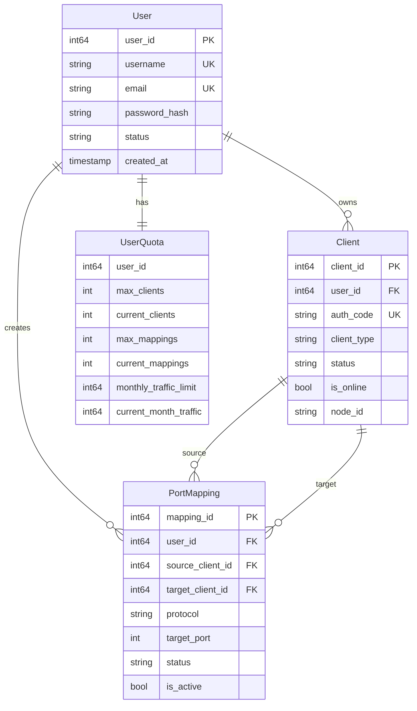
```mermaid
erDiagram
    User ||--o{ Client : owns
    User ||--o{ PortMapping : creates
    User ||--|| UserQuota : has
    Client ||--o{ PortMapping : source
    Client ||--o{ PortMapping : target
    
    User {
        int64 user_id PK
        string username UK
        string email UK
        string password_hash
        string status
        timestamp created_at
    }
    
    UserQuota {
        int64 user_id
        int max_clients
        int current_clients
        int max_mappings
        int current_mappings
        int64 monthly_traffic_limit
        int64 current_month_traffic
    }
    
    Client {
        int64 client_id PK
        int64 user_id FK
        string auth_code UK
        string client_type
        string status
        bool is_online
        string node_id
    }
    
    PortMapping {
        int64 mapping_id PK
        int64 user_id FK
        int64 source_client_id FK
        int64 target_client_id FK
        string protocol
        int target_port
        string status
        bool is_active
    }
```

### User（用户）

```go
type User struct {
    // 基础信息
    UserID       int64     `json:"user_id"`        // 100000001 - 999999999
    Username     string    `json:"username"`       // 用户名（唯一）
    Email        string    `json:"email"`          // 邮箱（唯一）
    PasswordHash string    `json:"-"`              // 密码哈希
    
    // 状态
    Status       string    `json:"status"`         // active/disabled/deleted
    
    // 配额（嵌入）
    Quota        UserQuota `json:"quota"`
    
    // 时间戳
    CreatedAt    time.Time `json:"created_at"`
    UpdatedAt    time.Time `json:"updated_at"`
    LastLoginAt  time.Time `json:"last_login_at"`
}

type UserQuota struct {
    // 客户端限制
    MaxClients           int   `json:"max_clients"`
    CurrentClients       int   `json:"current_clients"`
    
    // 映射限制
    MaxMappings          int   `json:"max_mappings"`           // 可创建的映射总数
    CurrentMappings      int   `json:"current_mappings"`
    MaxActiveMappings    int   `json:"max_active_mappings"`    // 同时激活的映射数
    CurrentActiveMappings int  `json:"current_active_mappings"`
    
    // 连接限制
    MaxConnectionsPerMapping int `json:"max_connections_per_mapping"` // 每个映射最多连接数
    
    // 流量限制
    TotalBandwidthLimit  int64 `json:"total_bandwidth_limit"`  // bytes/s
    MonthlyTrafficLimit  int64 `json:"monthly_traffic_limit"`  // bytes/month
    MonthlyTrafficUsed   int64 `json:"monthly_traffic_used"`
}
```

### Client（客户端）

```go
type Client struct {
    // 基础信息
    ClientID    int64      `json:"client_id"`      // 200-299M 或 600-999M
    AuthCode    string     `json:"auth_code"`      // 认证码
    
    // 类型与状态
    Type        ClientType `json:"type"`           // anonymous/managed
    Status      string     `json:"status"`         // online/offline/claimed
    
    // 归属
    OwnerUserID int64      `json:"owner_user_id"`  // 归属用户ID（匿名为0）
    
    // 元数据
    Name        string     `json:"name"`           // 客户端名称
    Description string     `json:"description"`
    
    // 连接信息
    NodeID      string     `json:"node_id"`        // 连接的服务端节点
    LastSeen    time.Time  `json:"last_seen"`
    
    // 认领信息（匿名→托管）
    ClaimedBy   int64      `json:"claimed_by"`     // 认领者UserID
    UpgradedTo  int64      `json:"upgraded_to"`    // 升级后的新ClientID
    
    // 时间戳
    CreatedAt   time.Time  `json:"created_at"`
    UpdatedAt   time.Time  `json:"updated_at"`
}

type ClientType string

const (
    ClientTypeAnonymous ClientType = "anonymous"  // 匿名客户端
    ClientTypeManaged   ClientType = "managed"    // 托管客户端
)
```

### PortMapping（端口映射）

```go
type PortMapping struct {
    // 基础信息
    MappingID        int64     `json:"mapping_id"`
    
    // 源和目标
    SourceClientID   int64     `json:"source_client_id"`   // 访问方
    TargetClientID   int64     `json:"target_client_id"`   // 服务提供方
    
    // 创建者
    CreatorUserID    int64     `json:"creator_user_id"`
    
    // 映射配置
    Protocol         Protocol  `json:"protocol"`           // tcp/http/socks
    SourcePort       int       `json:"source_port"`        // 源端口（可选）
    TargetHost       string    `json:"target_host"`        // 目标主机
    TargetPort       int       `json:"target_port"`        // 目标端口
    
    // ✅ 映射连接认证
    SecretKey        string    `json:"secret_key"`         // 映射连接固定秘钥（随机生成）
    
    // 状态
    Status           string    `json:"status"`             // active/disabled
    Enabled          bool      `json:"enabled"`
    
    // 统计
    TotalConnections int64     `json:"total_connections"`
    BytesSent        int64     `json:"bytes_sent"`
    BytesReceived    int64     `json:"bytes_received"`
    
    // 时间戳
    CreatedAt        time.Time `json:"created_at"`
    UpdatedAt        time.Time `json:"updated_at"`
    LastActiveAt     time.Time `json:"last_active_at"`
}

type Protocol string

const (
    ProtocolTCP   Protocol = "tcp"
    ProtocolHTTP  Protocol = "http"
    ProtocolSOCKS Protocol = "socks"
)
```

---

## 🔄 核心业务流程

### 流程1：匿名用户快速接入（降低门槛，提升传播）

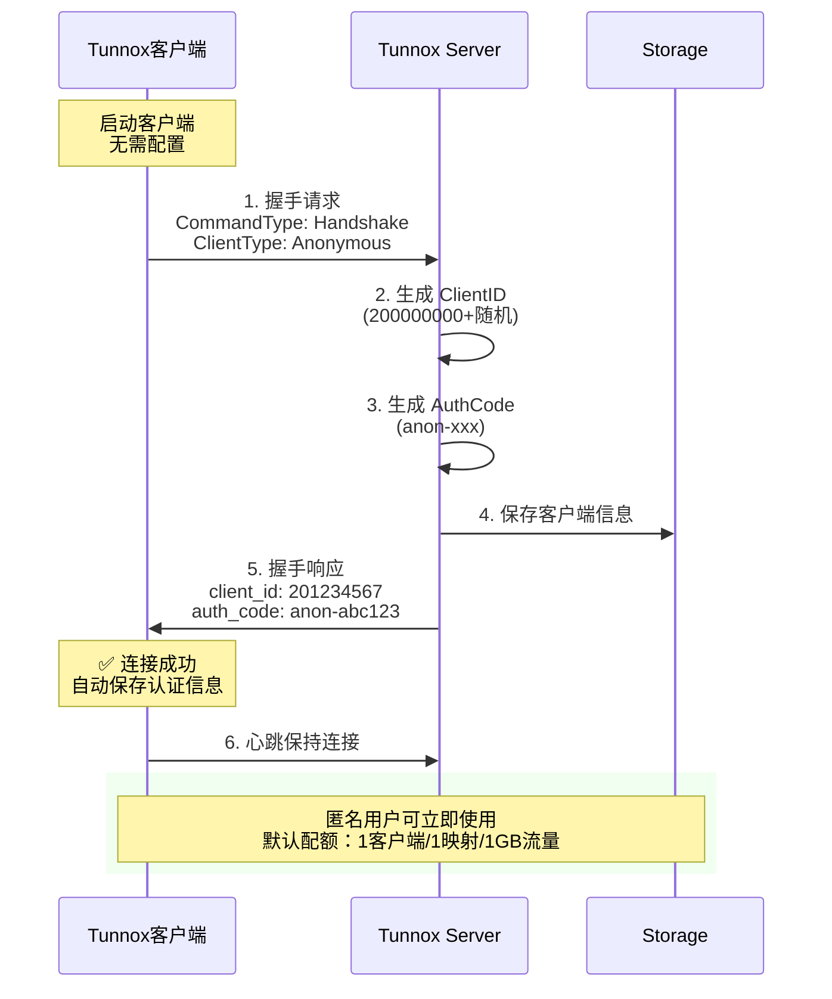
```mermaid
sequenceDiagram
    participant Client as Tunnox客户端
    participant Server as Tunnox Server
    participant Storage as Storage
    
    Note over Client: 启动客户端<br/>无需配置
    
    Client->>Server: 1. 握手请求<br/>CommandType: Handshake<br/>ClientType: Anonymous
    
    Server->>Server: 2. 生成 ClientID<br/>(200000000+随机)
    Server->>Server: 3. 生成 AuthCode<br/>(anon-xxx)
    Server->>Storage: 4. 保存客户端信息
    
    Server->>Client: 5. 握手响应<br/>client_id: 201234567<br/>auth_code: anon-abc123
    
    Note over Client: ✅ 连接成功<br/>自动保存认证信息
    
    Client->>Server: 6. 心跳保持连接
    
    rect rgb(240, 255, 240)
        Note over Client,Storage: 匿名用户可立即使用<br/>默认配额：1客户端/1映射/1GB流量
    end
```

**关键点**：
- ✅ 零配置启动，降低使用门槛
- ✅ 自动分配ID和认证码
- ✅ 默认配额，立即可用
- ✅ 提升传播速度（类似"扫码即用"）

---

### 流程2：注册用户添加托管客户端

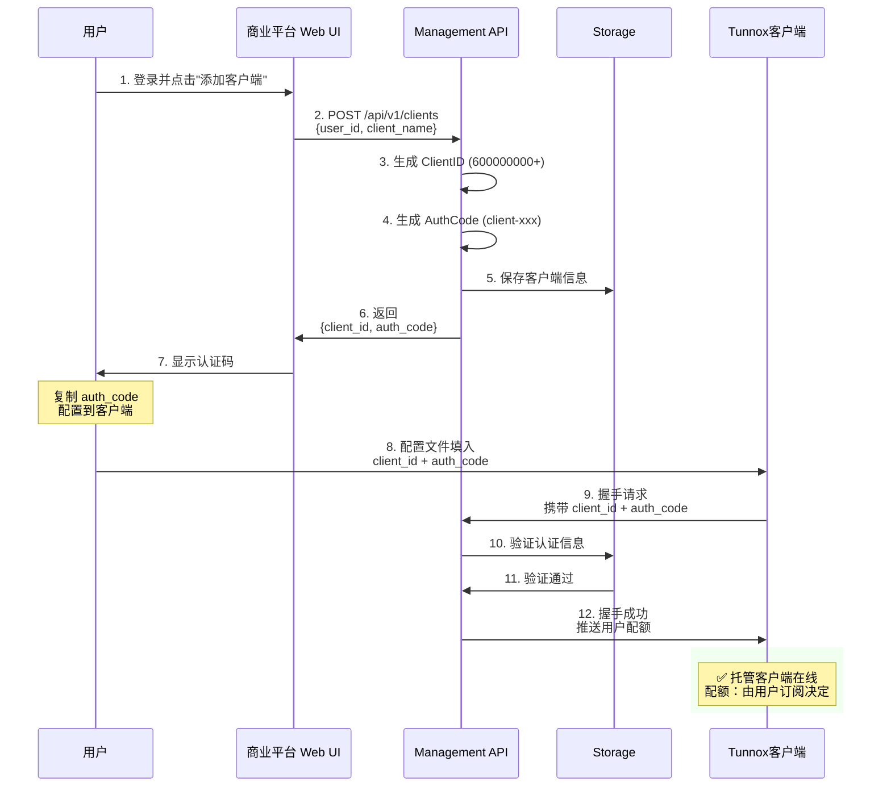
```mermaid
sequenceDiagram
    participant User as 用户
    participant WebUI as 商业平台 Web UI
    participant API as Management API
    participant Storage as Storage
    participant Client as Tunnox客户端
    
    User->>WebUI: 1. 登录并点击"添加客户端"
    WebUI->>API: 2. POST /api/v1/clients<br/>{user_id, client_name}
    
    API->>API: 3. 生成 ClientID (600000000+)
    API->>API: 4. 生成 AuthCode (client-xxx)
    API->>Storage: 5. 保存客户端信息
    
    API->>WebUI: 6. 返回<br/>{client_id, auth_code}
    WebUI->>User: 7. 显示认证码
    
    Note over User: 复制 auth_code<br/>配置到客户端
    
    User->>Client: 8. 配置文件填入<br/>client_id + auth_code
    Client->>API: 9. 握手请求<br/>携带 client_id + auth_code
    
    API->>Storage: 10. 验证认证信息
    Storage->>API: 11. 验证通过
    
    API->>Client: 12. 握手成功<br/>推送用户配额
    
    rect rgb(240, 255, 240)
        Note over Client: ✅ 托管客户端在线<br/>配额：由用户订阅决定
    end
```

---

### 流程3：认领匿名客户端（转化漏斗）

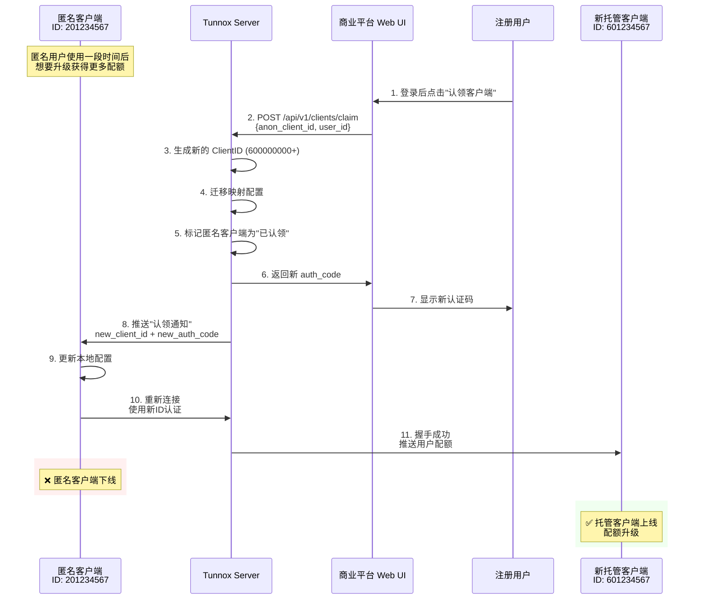
```mermaid
sequenceDiagram
    participant AnonClient as 匿名客户端<br/>ID: 201234567
    participant Server as Tunnox Server
    participant WebUI as 商业平台 Web UI
    participant User as 注册用户
    participant NewClient as 新托管客户端<br/>ID: 601234567
    
    Note over AnonClient: 匿名用户使用一段时间后<br/>想要升级获得更多配额
    
    User->>WebUI: 1. 登录后点击"认领客户端"
    WebUI->>Server: 2. POST /api/v1/clients/claim<br/>{anon_client_id, user_id}
    
    Server->>Server: 3. 生成新的 ClientID (600000000+)
    Server->>Server: 4. 迁移映射配置
    Server->>Server: 5. 标记匿名客户端为"已认领"
    
    Server->>WebUI: 6. 返回新 auth_code
    WebUI->>User: 7. 显示新认证码
    
    Server->>AnonClient: 8. 推送"认领通知"<br/>new_client_id + new_auth_code
    
    AnonClient->>AnonClient: 9. 更新本地配置
    AnonClient->>Server: 10. 重新连接<br/>使用新ID认证
    
    Server->>NewClient: 11. 握手成功<br/>推送用户配额
    
    rect rgb(255, 240, 240)
        Note over AnonClient: ❌ 匿名客户端下线
    end
    
    rect rgb(240, 255, 240)
        Note over NewClient: ✅ 托管客户端上线<br/>配额升级
    end
```

**商业价值**：
- 提升转化率（免费→付费）
- 无缝升级体验
- 降低用户流失

---

### 流程4：创建跨节点端口映射（核心功能）

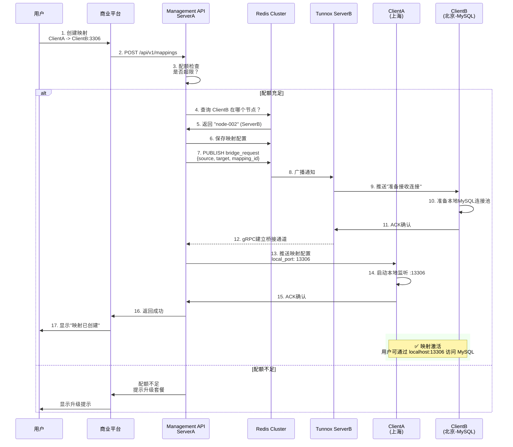
```mermaid
sequenceDiagram
    participant User as 用户
    participant WebUI as 商业平台
    participant API as Management API<br/>ServerA
    participant Redis as Redis Cluster
    participant ServerB as Tunnox ServerB
    participant ClientA as ClientA<br/>(上海)
    participant ClientB as ClientB<br/>(北京-MySQL)
    
    User->>WebUI: 1. 创建映射<br/>ClientA -> ClientB:3306
    WebUI->>API: 2. POST /api/v1/mappings
    
    API->>API: 3. 配额检查<br/>是否超限？
    
    alt 配额充足
        API->>Redis: 4. 查询 ClientB 在哪个节点？
        Redis->>API: 5. 返回 "node-002" (ServerB)
        
        API->>Redis: 6. 保存映射配置
        API->>Redis: 7. PUBLISH bridge_request<br/>{source, target, mapping_id}
        
        Redis->>ServerB: 8. 广播通知
        
        ServerB->>ClientB: 9. 推送"准备接收连接"
        ClientB->>ClientB: 10. 准备本地MySQL连接池
        ClientB->>ServerB: 11. ACK确认
        
        ServerB-->>API: 12. gRPC建立桥接通道
        
        API->>ClientA: 13. 推送映射配置<br/>local_port: 13306
        ClientA->>ClientA: 14. 启动本地监听 :13306
        ClientA->>API: 15. ACK确认
        
        API->>WebUI: 16. 返回成功
        WebUI->>User: 17. 显示"映射已创建"
        
        rect rgb(240, 255, 240)
            Note over ClientA,ClientB: ✅ 映射激活<br/>用户可通过 localhost:13306 访问 MySQL
        end
    else 配额不足
        API->>WebUI: 配额不足<br/>提示升级套餐
        WebUI->>User: 显示升级提示
    end
```

**技术亮点**：
- ✅ Redis Pub/Sub 实现跨节点通知（< 10ms延迟）
- ✅ gRPC 双向流桥接（高性能数据转发）
- ✅ 配额实时检查（防止滥用）
- ✅ 配置实时推送（无需轮询）

---

## 🌐 Management API

### API 架构

**Tunnox Core** 提供 **HTTP REST API**，供外部商业平台调用。

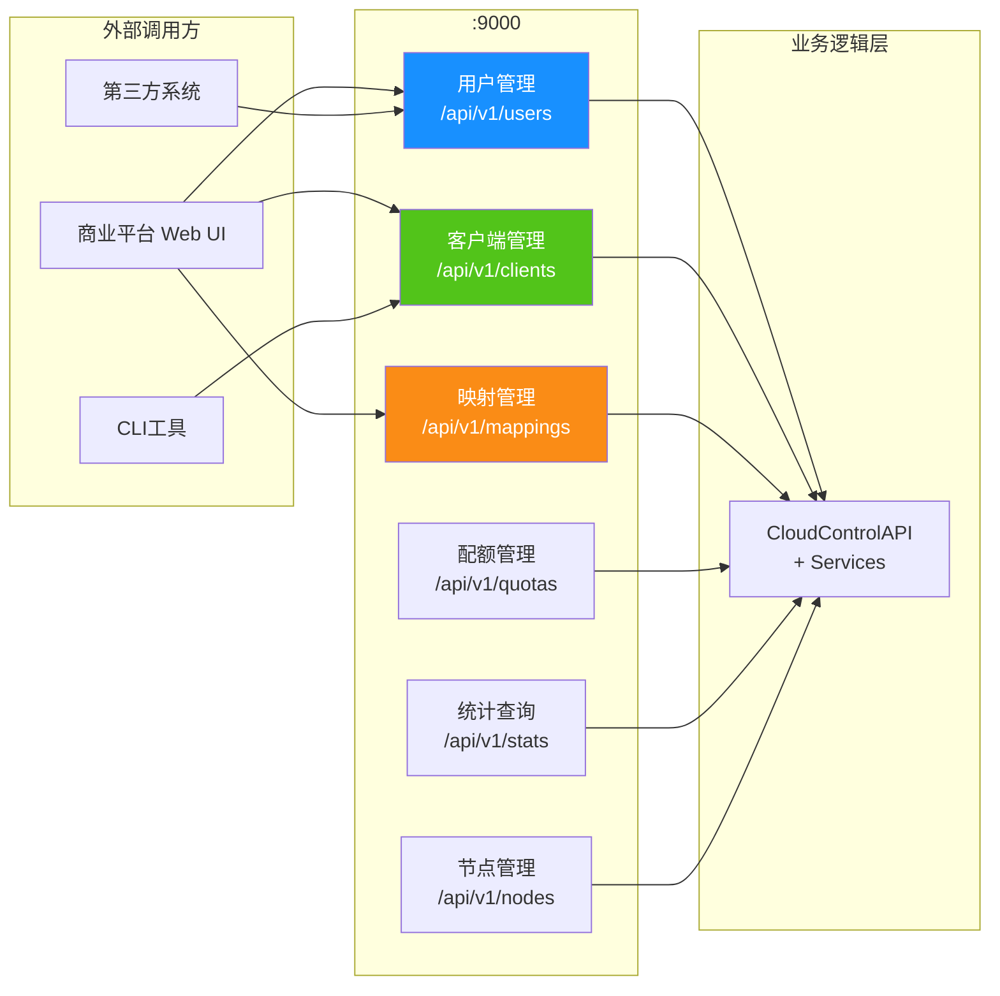
```mermaid
graph LR
    subgraph 外部调用方
        A[商业平台 Web UI]
        B[第三方系统]
        C[CLI工具]
    end
    
    subgraph Management API[:9000]
        D[用户管理<br/>/api/v1/users]
        E[客户端管理<br/>/api/v1/clients]
        F[映射管理<br/>/api/v1/mappings]
        G[配额管理<br/>/api/v1/quotas]
        H[统计查询<br/>/api/v1/stats]
        I[节点管理<br/>/api/v1/nodes]
    end
    
    subgraph 业务逻辑层
        J[CloudControlAPI<br/>+ Services]
    end
    
    A --> D
    A --> E
    A --> F
    B --> D
    C --> E
    
    D --> J
    E --> J
    F --> J
    G --> J
    H --> J
    I --> J
    
    style D fill:#1890FF,color:#fff
    style E fill:#52C41A,color:#fff
    style F fill:#FA8C16,color:#fff
```

### 认证方式

**API Key 认证**（推荐生产环境）：

```http
GET /api/v1/users/100000001
Authorization: Bearer YOUR_API_KEY
```

配置：

```yaml
management_api:
  auth:
    type: "api_key"  # api_key / jwt / none
    secret: "your-api-secret-key-32-chars-min"
```

---

### 1. 用户管理 API

```http
# 创建用户
POST /api/v1/users
Content-Type: application/json
Authorization: Bearer YOUR_API_KEY

{
  "username": "john_doe",
  "email": "john@example.com",
  "password_hash": "$2a$10$..."
}

Response 201:
{
  "user_id": 100000001,
  "username": "john_doe",
  "email": "john@example.com",
  "quota": {
    "max_clients": 1,
    "max_mappings": 1,
    "monthly_traffic_limit": 1073741824
  },
  "created_at": "2025-11-25T10:00:00Z"
}
```

```http
# 获取用户信息
GET /api/v1/users/{user_id}
Response 200:
{
  "user_id": 100000001,
  "username": "john_doe",
  "status": "active",
  "quota": {...}
}
```

```http
# 更新用户
PUT /api/v1/users/{user_id}
{
  "email": "newemail@example.com",
  "status": "active"
}
```

```http
# 删除用户
DELETE /api/v1/users/{user_id}
Response 204: No Content
```

```http
# 列出用户
GET /api/v1/users?page=1&limit=20&status=active
Response 200:
{
  "users": [...],
  "total": 150,
  "page": 1,
  "limit": 20
}
```

---

### 2. 客户端管理 API

```http
# 创建托管客户端
POST /api/v1/clients
{
  "user_id": 100000001,
  "client_name": "My Home Server",
  "client_desc": "Ubuntu 22.04 NAS"
}

Response 201:
{
  "client_id": 601234567,
  "auth_code": "client-abc123def456",
  "user_id": 100000001,
  "client_name": "My Home Server",
  "client_type": "managed",
  "status": "offline",
  "created_at": "2025-11-25T10:00:00Z"
}
```

```http
# 获取客户端信息
GET /api/v1/clients/{client_id}
Response 200:
{
  "client_id": 601234567,
  "user_id": 100000001,
  "client_name": "My Home Server",
  "client_type": "managed",
  "status": "online",
  "node_id": "node-001",
  "last_seen": "2025-11-25T10:30:00Z"
}
```

```http
# 更新客户端
PUT /api/v1/clients/{client_id}
{
  "client_name": "Updated Name",
  "status": "disabled"
}
```

```http
# 删除客户端
DELETE /api/v1/clients/{client_id}
```

```http
# 列出用户的客户端
GET /api/v1/users/{user_id}/clients
Response 200:
{
  "clients": [
    {
      "client_id": 601234567,
      "client_name": "Home Server",
      "status": "online",
      "node_id": "node-001"
    }
  ]
}
```

```http
# 强制下线客户端
POST /api/v1/clients/{client_id}/disconnect
Response 200:
{
  "message": "Client disconnected successfully"
}
```

```http
# 认领匿名客户端
POST /api/v1/clients/claim
{
  "anonymous_client_id": 201234567,
  "user_id": 100000001,
  "new_client_name": "Claimed Server"
}

Response 200:
{
  "new_client_id": 602345678,
  "new_auth_code": "client-xyz789",
  "message": "Client claimed successfully"
}
```

---

### 3. 端口映射管理 API

```http
# 创建映射
POST /api/v1/mappings
{
  "user_id": 100000001,
  "source_client_id": 601234567,
  "target_client_id": 602345678,
  "protocol": "tcp",
  "target_host": "localhost",
  "target_port": 3306,
  "local_port": 13306
}

Response 201:
{
  "mapping_id": 1001,
  "status": "active",
  "created_at": "2025-11-25T10:00:00Z"
}
```

```http
# 获取映射信息
GET /api/v1/mappings/{mapping_id}
```

```http
# 更新映射
PUT /api/v1/mappings/{mapping_id}
{
  "status": "disabled"
}
```

```http
# 删除映射
DELETE /api/v1/mappings/{mapping_id}
```

```http
# 列出用户的映射
GET /api/v1/users/{user_id}/mappings
GET /api/v1/clients/{client_id}/mappings
```

---

### 4. 配额管理 API

```http
# 设置用户配额（商业平台调用，用户升级套餐后）
POST /api/v1/users/{user_id}/quota
{
  "max_clients": 10,
  "max_mappings": 50,
  "max_active_mappings": 10,
  "max_connections_per_mapping": 100,
  "total_bandwidth_limit": 10485760,
  "monthly_traffic_limit": 536870912000
}

Response 200:
{
  "user_id": 100000001,
  "quota": {...},
  "updated_at": "2025-11-25T10:00:00Z"
}
```

```http
# 获取用户配额
GET /api/v1/users/{user_id}/quota
Response 200:
{
  "user_id": 100000001,
  "max_clients": 10,
  "current_clients": 5,
  "max_mappings": 50,
  "current_mappings": 20,
  "monthly_traffic_limit": 536870912000,
  "current_month_traffic": 10737418240,
  "traffic_usage_percent": 2.0
}
```

---

### 5. 统计查询 API

```http
# 获取用户统计
GET /api/v1/stats/users/{user_id}
Response 200:
{
  "user_id": 100000001,
  "total_clients": 5,
  "online_clients": 3,
  "total_mappings": 20,
  "active_mappings": 15,
  "current_month_traffic": 10737418240,
  "bandwidth_usage": 1048576
}
```

```http
# 获取系统统计
GET /api/v1/stats/system
Response 200:
{
  "total_users": 1000,
  "total_clients": 5000,
  "online_clients": 3000,
  "total_mappings": 20000,
  "active_mappings": 15000,
  "total_bandwidth": 104857600,
  "total_nodes": 5
}
```

```http
# 获取客户端统计
GET /api/v1/stats/clients/{client_id}
Response 200:
{
  "client_id": 601234567,
  "online_duration": 86400,
  "total_bytes_sent": 1073741824,
  "total_bytes_received": 2147483648,
  "active_mappings": 3
}
```

---

### 6. 节点管理 API

```http
# 获取在线节点列表
GET /api/v1/nodes
Response 200:
{
  "nodes": [
    {
      "node_id": "node-001",
      "address": "192.168.1.10:8080",
      "online_clients": 500,
      "cpu_usage": 45.5,
      "memory_usage": 60.2,
      "bandwidth_usage": 10485760,
      "last_heartbeat": "2025-11-25T10:00:00Z"
    }
  ],
  "total": 5
}
```

```http
# 获取节点详情
GET /api/v1/nodes/{node_id}
Response 200:
{
  "node_id": "node-001",
  "address": "192.168.1.10:8080",
  "online_clients": 500,
  "client_ids": [601234567, 602345678, ...],
  "uptime": 86400,
  "version": "v2.2.0"
}
```

---

### API 配置

在 `config.yaml` 中启用 Management API：

```yaml
management_api:
  enabled: true
  listen_addr: ":9000"
  
  # 认证配置
  auth:
    type: "api_key"  # api_key / jwt / none
    secret: "your-secret-key-min-32-chars-long"
  
  # CORS配置
  cors:
    enabled: true
    allowed_origins:
      - "http://localhost:3000"
      - "https://admin.example.com"
    allowed_methods:
      - GET
      - POST
      - PUT
      - DELETE
    allowed_headers:
      - Authorization
      - Content-Type
  
  # 限流配置
  rate_limit:
    enabled: true
    requests_per_second: 100
    burst: 200
```

---

### 与外部商业平台的集成

**集成架构**：

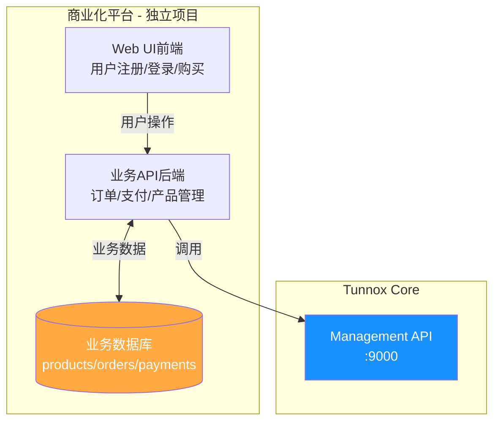
```mermaid
graph TB
    subgraph 商业平台[商业化平台 - 独立项目]
        WebUI[Web UI前端<br/>用户注册/登录/购买]
        BizAPI[业务API后端<br/>订单/支付/产品管理]
        BizDB[(业务数据库<br/>products/orders/payments)]
    end
    
    subgraph TunnoxCore[Tunnox Core]
        MgmtAPI[Management API<br/>:9000]
    end
    
    WebUI -->|用户操作| BizAPI
    BizAPI <-->|业务数据| BizDB
    BizAPI -->|调用| MgmtAPI
    
    style MgmtAPI fill:#1890FF,color:#fff
    style BizDB fill:#FFA940,color:#fff
```

**典型集成场景**：

**场景1：用户注册**
```
1. 用户在商业平台填写注册表单
2. 商业平台后端：POST /api/v1/users (调用Tunnox Core)
3. Tunnox Core 返回 user_id
4. 商业平台保存 user_id 到自己的数据库
5. 商业平台设置默认配额：POST /api/v1/users/{user_id}/quota
```

**场景2：购买套餐升级**
```
1. 用户在商业平台选择Pro套餐并支付
2. 商业平台处理支付（支付宝/微信SDK）
3. 支付成功后，商业平台调用：
   POST /api/v1/users/{user_id}/quota
   {
     "max_clients": 10,
     "max_mappings": 50,
     ...
   }
4. Tunnox Core 更新配额，实时推送给客户端
5. 商业平台记录订单到自己的数据库
```

---

## 🔐 双连接模型与安全认证

### 核心架构：指令连接 + 映射连接

**Tunnox Core** 采用**双连接模型**，严格区分控制平面和数据平面：

```mermaid
graph TB
    subgraph 指令连接ControlConnection[指令连接 (Control Connection)]
        CC1[每个客户端 1 条长连接]
        CC2[用途：命令/配置/回调]
        CC3[认证：Handshake + JWT/密钥]
        CC4[生命周期：客户端在线期间]
    end
    
    subgraph 映射连接TunnelConnection[映射连接 (Tunnel Connection)]
        TC1[每个用户请求 1 条连接]
        TC2[用途：纯数据透传]
        TC3[认证：TunnelOpen + SecretKey]
        TC4[生命周期：按需建立/关闭]
    end
    
    subgraph 客户端行为
        Start[ClientA 启动] --> Control[建立指令连接]
        User[User 连接 :3306] --> Tunnel[建立映射连接]
    end
    
    Control --> 指令连接ControlConnection
    Tunnel --> 映射连接TunnelConnection
    
    style 指令连接ControlConnection fill:#4A90E2,color:#fff
    style 映射连接TunnelConnection fill:#52C41A,color:#fff
```

**关键区别**：

| 维度 | 指令连接 | 映射连接 |
|------|---------|---------|
| **数量** | 1客户端 = 1连接 | 1用户请求 = 1连接 |
| **生命周期** | 长连接（分钟/小时级） | 短连接（秒/分钟级） |
| **认证方式** | Handshake + JWT/密钥/匿名 | TunnelOpen + Mapping.SecretKey |
| **用途** | 命令、配置推送、回调 | 纯数据透传 |
| **并发数** | 1 | 可能上千（如 Web 服务） |
| **数据包类型** | Handshake, Command, Heartbeat | TunnelOpen, TunnelData, TunnelClose |

**核心思想**：
- ✅ **职责分离**：控制平面（指令）与数据平面（映射）完全隔离
- ✅ **按需认证**：指令连接一次认证，映射连接每条独立认证
- ✅ **性能优化**：映射连接无命令处理开销，纯透传
- ✅ **安全增强**：映射连接基于固定 SecretKey，防止滥用

---

### 1. 指令连接详解

#### 1.1 指令连接的生命周期

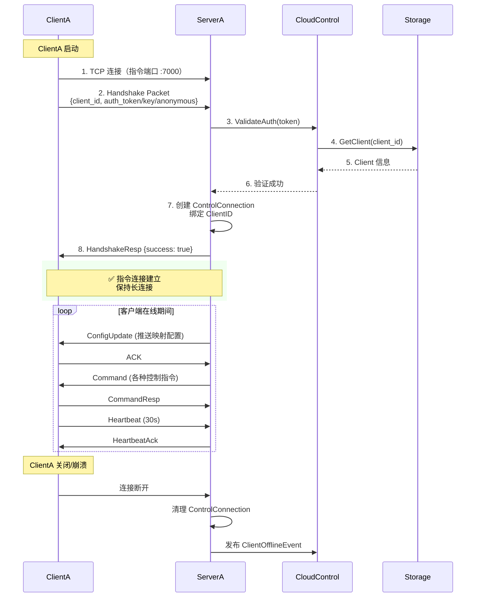
```mermaid
sequenceDiagram
    participant CA as ClientA
    participant SA as ServerA
    participant Cloud as CloudControl
    participant Store as Storage
    
    Note over CA: ClientA 启动
    
    CA->>SA: 1. TCP 连接（指令端口 :7000）
    CA->>SA: 2. Handshake Packet<br/>{client_id, auth_token/key/anonymous}
    
    SA->>Cloud: 3. ValidateAuth(token)
    Cloud->>Store: 4. GetClient(client_id)
    Store-->>Cloud: 5. Client 信息
    Cloud-->>SA: 6. 验证成功
    
    SA->>SA: 7. 创建 ControlConnection<br/>绑定 ClientID
    SA->>CA: 8. HandshakeResp {success: true}
    
    rect rgb(240, 255, 240)
        Note over CA,SA: ✅ 指令连接建立<br/>保持长连接
    end
    
    loop 客户端在线期间
        SA->>CA: ConfigUpdate (推送映射配置)
        CA->>SA: ACK
        
        SA->>CA: Command (各种控制指令)
        CA->>SA: CommandResp
        
        CA->>SA: Heartbeat (30s)
        SA->>CA: HeartbeatAck
    end
    
    Note over CA: ClientA 关闭/崩溃
    CA->>SA: 连接断开
    SA->>SA: 清理 ControlConnection
    SA->>Cloud: 发布 ClientOfflineEvent
```

**关键点**：
- ✅ **唯一性**：每个 ClientID 同时只能有 1 条指令连接（新连接会踢掉旧连接）
- ✅ **长连接**：使用 Heartbeat 保活，断线自动重连
- ✅ **双向通信**：Server 可以主动推送配置/命令给 Client
- ✅ **认证灵活**：支持 JWT、API Key、用户名密码、匿名模式

#### 1.2 指令连接的数据包类型

```go
// 指令连接使用的数据包类型
const (
    Handshake     Type = 0x01  // 握手认证
    HandshakeResp Type = 0x02  // 握手响应
    Heartbeat     Type = 0x03  // 心跳
    JsonCommand   Type = 0x10  // JSON 命令
    CommandResp   Type = 0x11  // 命令响应
)
```

**示例命令**：
- `ConfigUpdate` - 推送映射配置到客户端
- `MappingCreate` - 通知客户端创建本地监听
- `MappingDelete` - 通知客户端删除映射
- `StatsQuery` - 查询客户端统计信息

---

### 2. 映射连接详解

#### 2.1 映射连接的生命周期

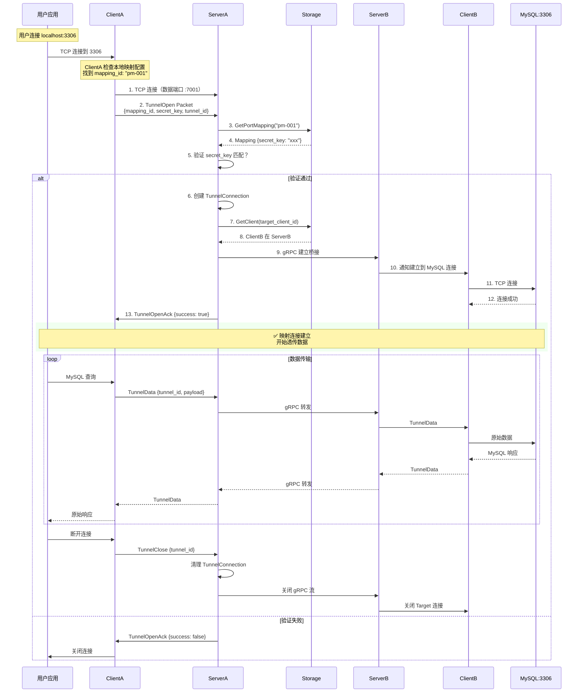
```mermaid
sequenceDiagram
    participant User as 用户应用
    participant CA as ClientA
    participant SA as ServerA
    participant Store as Storage
    participant SB as ServerB
    participant CB as ClientB
    participant Target as MySQL:3306
    
    Note over User: 用户连接 localhost:3306
    
    User->>CA: TCP 连接到 3306
    
    Note over CA: ClientA 检查本地映射配置<br/>找到 mapping_id: "pm-001"
    
    CA->>SA: 1. TCP 连接（数据端口 :7001）
    CA->>SA: 2. TunnelOpen Packet<br/>{mapping_id, secret_key, tunnel_id}
    
    SA->>Store: 3. GetPortMapping("pm-001")
    Store-->>SA: 4. Mapping {secret_key: "xxx"}
    
    SA->>SA: 5. 验证 secret_key 匹配？
    
    alt 验证通过
        SA->>SA: 6. 创建 TunnelConnection
        SA->>Store: 7. GetClient(target_client_id)
        Store-->>SA: 8. ClientB 在 ServerB
        
        SA->>SB: 9. gRPC 建立桥接
        SB->>CB: 10. 通知建立到 MySQL 连接
        CB->>Target: 11. TCP 连接
        Target-->>CB: 12. 连接成功
        
        SA->>CA: 13. TunnelOpenAck {success: true}
        
        rect rgb(240, 255, 240)
            Note over User,Target: ✅ 映射连接建立<br/>开始透传数据
        end
        
        loop 数据传输
            User->>CA: MySQL 查询
            CA->>SA: TunnelData {tunnel_id, payload}
            SA->>SB: gRPC 转发
            SB->>CB: TunnelData
            CB->>Target: 原始数据
            
            Target-->>CB: MySQL 响应
            CB-->>SB: TunnelData
            SB-->>SA: gRPC 转发
            SA-->>CA: TunnelData
            CA-->>User: 原始响应
        end
        
        User->>CA: 断开连接
        CA->>SA: TunnelClose {tunnel_id}
        SA->>SA: 清理 TunnelConnection
        SA->>SB: 关闭 gRPC 流
        SB->>CB: 关闭 Target 连接
        
    else 验证失败
        SA->>CA: TunnelOpenAck {success: false}
        CA->>User: 关闭连接
    end
```

**关键点**：
- ✅ **多连接**：同一个映射可以有数百/数千条并发连接
- ✅ **按需建立**：用户连接时才建立，用户断开时关闭
- ✅ **独立认证**：每条连接独立验证 secret_key
- ✅ **纯透传**：TunnelData 不解析内容，直接转发字节流

#### 2.2 映射连接的数据包类型

```go
// 映射连接使用的数据包类型
const (
    TunnelOpen    Type = 0x20  // 隧道打开（携带 mapping_id + secret_key）
    TunnelOpenAck Type = 0x21  // 隧道打开确认
    TunnelData    Type = 0x22  // 隧道数据（纯透传）
    TunnelClose   Type = 0x23  // 隧道关闭
)
```

**TunnelOpen 认证**：
```go
type TunnelOpenRequest struct {
    MappingID string `json:"mapping_id"` // 映射ID
    TunnelID  string `json:"tunnel_id"`  // 隧道ID（UUID）
    SecretKey string `json:"secret_key"` // 映射的固定秘钥
}

// ServerA 验证流程
mapping := storage.GetPortMapping(req.MappingID)
if mapping.SecretKey != req.SecretKey {
    return errors.New("invalid secret key")
}
```

---

### 3. 双连接模型对比

#### 3.1 连接建立时机

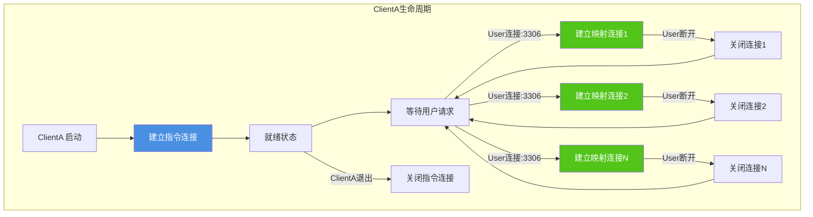
```mermaid
graph TB
    subgraph ClientA生命周期
        Start[ClientA 启动]
        
        Start --> Control[建立指令连接]
        
        Control --> Ready[就绪状态]
        
        Ready --> Wait[等待用户请求]
        
        Wait --> |User连接:3306| Tunnel1[建立映射连接1]
        Wait --> |User连接:3306| Tunnel2[建立映射连接2]
        Wait --> |User连接:3306| Tunnel3[建立映射连接N]
        
        Tunnel1 --> |User断开| Close1[关闭连接1]
        Tunnel2 --> |User断开| Close2[关闭连接2]
        Tunnel3 --> |User断开| Close3[关闭连接N]
        
        Close1 --> Wait
        Close2 --> Wait
        Close3 --> Wait
        
        Ready --> |ClientA退出| Shutdown[关闭指令连接]
    end
    
    style Control fill:#4A90E2,color:#fff
    style Tunnel1 fill:#52C41A,color:#fff
    style Tunnel2 fill:#52C41A,color:#fff
    style Tunnel3 fill:#52C41A,color:#fff
```

#### 3.2 认证流程对比

| 步骤 | 指令连接 | 映射连接 |
|------|---------|---------|
| **1. 建立连接** | TCP → ServerA:7000 | TCP → ServerA:7001 |
| **2. 发送认证** | Handshake {client_id, auth_token} | TunnelOpen {mapping_id, secret_key} |
| **3. 验证方式** | CloudControl.ValidateToken(token) | mapping.SecretKey == req.SecretKey |
| **4. 验证通过** | 创建 ControlConnection | 创建 TunnelConnection |
| **5. 响应** | HandshakeResp | TunnelOpenAck |
| **6. 后续操作** | 保持长连接，双向通信 | 透传数据，用户断开时关闭 |

---

### 4. 认证安全机制

#### 4.1 指令连接认证（灵活）

```mermaid
sequenceDiagram
    participant C as ClientA
    participant S as ServerA
    participant JWT as JWT Manager
    participant Store as Storage
    
    Note over C: ClientA 启动
    
    C->>S: 1. TCP/WebSocket 建立连接
    C->>S: 2. Handshake Packet<br/>{client_id: 100001, token: "eyJ..."}
    
    S->>JWT: 3. ValidateToken(token)
    JWT->>JWT: 验证签名、过期时间、nonce
    JWT-->>S: 4. 返回 Claims {client_id, user_id}
    
    S->>Store: 5. GetClient(100001)
    Store-->>S: 6. 返回 Client 信息
    
    alt Client 存在且状态正常
        S->>S: 7. 绑定 Connection.ClientID = 100001
        S->>S: 8. Connection.Authenticated = true
        S->>C: 9. HandshakeResp {success: true}
        
        rect rgb(240, 255, 240)
            Note over C,S: ✅ 连接已认证<br/>后续可创建隧道
        end
    else Client 不存在或状态异常
        S->>C: 10. HandshakeResp {success: false, error}
        S->>C: 11. 断开连接
        
        rect rgb(255, 240, 240)
            Note over C,S: ❌ 认证失败
        end
    end
```

**支持多种认证方式**：

1. **JWT Token 认证**（推荐）
```json
{
  "packet_type": "Handshake",
  "payload": {
    "client_id": 100000001,
    "auth_token": "eyJhbGciOiJIUzI1NiIsInR5cCI6IkpXVCJ9...",
    "protocol_version": "2.0"
  }
}
```

2. **API Key 认证**
```json
{
  "packet_type": "Handshake",
  "payload": {
    "client_id": 100000001,
    "api_key": "sk_live_51H8x2y...",
    "protocol_version": "2.0"
  }
}
```

3. **匿名认证**（限制功能）
```json
{
  "packet_type": "Handshake",
  "payload": {
    "anonymous": true,
    "device_id": "uuid-xxx",
    "protocol_version": "2.0"
  }
}
```

**关键代码结构**：

```go
// 指令连接对象
type ControlConnection struct {
    ConnID        string
    ClientID      int64          // ← 认证后绑定
    UserID        string         // ← 认证后绑定
    Stream        stream.PackageStreamer
    Authenticated bool           // ← 认证状态标记
    Protocol      string         // tcp/ws/quic
    CreatedAt     time.Time
    LastActiveAt  time.Time
}

// 认证处理
func (am *AuthManager) HandleHandshake(conn *ControlConnection, req *HandshakeRequest) error {
    // 1. 验证认证信息
    authResp, err := am.cloudControl.ValidateToken(req.AuthToken)
    if err != nil {
        return fmt.Errorf("authentication failed: %w", err)
    }
    
    // 2. 检查客户端状态
    client, err := am.cloudControl.GetClient(authResp.Client.ID)
    if err != nil || client.Status != "active" {
        return errors.New("client not active")
    }
    
    // 3. 绑定连接 ↔ ClientID
    conn.ClientID = client.ID
    conn.UserID = client.UserID
    conn.Authenticated = true
    
    // 4. 踢掉旧连接（同一ClientID只能有1条指令连接）
    am.sessionManager.KickOldControlConnection(client.ID, conn.ConnID)
    
    return nil
}
```

---

#### 4.2 映射连接认证（固定秘钥）

**每条映射连接独立认证**，基于 Mapping 配置的固定秘钥。

**PortMapping 配置示例**：
```go
type PortMapping struct {
    ID             string `json:"id"`              // "pm-001"
    SourceClientID int64  `json:"source_client_id"` // 100000001
    TargetClientID int64  `json:"target_client_id"` // 100000002
    TargetHost     string `json:"target_host"`     // "localhost"
    TargetPort     int    `json:"target_port"`     // 3306
    Protocol       string `json:"protocol"`        // "tcp"
    
    // ✅ 映射连接认证秘钥（随机生成，用户不可见）
    SecretKey      string `json:"secret_key"`      // "sk_mapping_abc123..."
    
    Status         string `json:"status"`          // "active"
}
```

**TunnelOpen 认证流程**：

```mermaid
sequenceDiagram
    participant User as 用户应用
    participant CA as ClientA
    participant SA as ServerA
    participant Store as Storage
    
    Note over User: MySQL Client 连接 localhost:3306
    
    User->>CA: 1. TCP 连接到 3306
    
    CA->>CA: 2. 查找本地映射配置<br/>port:3306 → mapping_id + secret_key
    
    CA->>SA: 3. 新建 TCP 连接（数据端口 :7001）
    
    CA->>SA: 4. TunnelOpen Packet<br/>{mapping_id: "pm-001",<br/>secret_key: "sk_mapping_abc",<br/>tunnel_id: "uuid-xxx"}
    
    SA->>Store: 5. GetPortMapping("pm-001")
    Store-->>SA: 6. 返回 Mapping {secret_key: "sk_mapping_abc"}
    
    SA->>SA: 7. 验证秘钥<br/>req.SecretKey == mapping.SecretKey?
    
    alt 秘钥验证通过
        SA->>SA: 8. 创建 TunnelConnection<br/>标记 Authenticated = true
        
        SA->>Store: 9. GetClient(target_client_id)
        Store-->>SA: 10. 返回 TargetClient 信息
        
        SA->>SA: 11. 判断本地/跨节点
        
        Note over SA: 建立到 ClientB 的通道
        
        SA->>CA: 12. TunnelOpenAck {success: true}
        
        rect rgb(240, 255, 240)
            Note over User,SA: ✅ 映射连接建立<br/>开始透传数据
        end
        
    else 秘钥验证失败
        SA->>CA: TunnelOpenAck {success: false}
        SA->>CA: 关闭连接
        
        rect rgb(255, 240, 240)
            Note over CA: ❌ 认证失败
        end
    end
```

**关键代码结构**：

```go
// 映射连接对象
type TunnelConnection struct {
    ConnID        string
    TunnelID      string
    MappingID     string
    Stream        stream.PackageStreamer
    Authenticated bool  // ← 基于 secret_key 认证
    CreatedAt     time.Time
    LastActiveAt  time.Time
}

// TunnelOpen 请求
type TunnelOpenRequest struct {
    MappingID string `json:"mapping_id"` // 映射ID
    TunnelID  string `json:"tunnel_id"`  // 隧道ID（UUID）
    SecretKey string `json:"secret_key"` // ✅ 映射的固定秘钥
}

// 认证处理
func (tm *TunnelManager) HandleTunnelOpen(tunnelConn *TunnelConnection, req *TunnelOpenRequest) error {
    // 1. 查询映射配置
    mapping, err := tm.cloudControl.GetPortMapping(req.MappingID)
    if err != nil {
        return fmt.Errorf("mapping not found: %w", err)
    }
    
    // 2. ✅ 验证映射的秘钥（关键！）
    if mapping.SecretKey != req.SecretKey {
        utils.Warnf("TunnelManager: invalid secret key for mapping %s", req.MappingID)
        return errors.New("invalid secret key")
    }
    
    // 3. 映射状态检查
    if mapping.Status != "active" {
        return errors.New("mapping inactive")
    }
    
    // 4. 标记连接已认证
    tunnelConn.Authenticated = true
    tunnelConn.MappingID = req.MappingID
    tunnelConn.TunnelID = req.TunnelID
    
    // 5. 继续建立隧道...
    }
    
    // 6. 并发连接数检查
    activeTunnels := s.tunnelRegistry.CountByMapping(mapping.ID)
    if activeTunnels >= mapping.MaxConnections {
        return fmt.Errorf("connection limit reached: %d/%d", activeTunnels, mapping.MaxConnections)
    }
    
    return nil
}
```

---

### 数据透传机制

**核心设计原则**：**一次包头，后续纯透传**

```mermaid
graph LR
    subgraph 用户数据流
        U1[User 发送<br/>MySQL 查询] --> U2[原始字节流<br/>0x03 0x53 0x45...]
    end
    
    subgraph ClientA 处理
        C1[接收原始数据] --> C2[封装一次<br/>TunnelData + payload]
        C2 --> C3[不解析内容！]
    end
    
    subgraph ServerA 处理
        S1[接收 TunnelData] --> S2[提取 payload]
        S2 --> S3[不解析内容！]
        S3 --> S4[直接转发]
    end
    
    subgraph gRPC Bridge
        G1[BridgePacket<br/>stream_id + payload] --> G2[多路复用传输]
    end
    
    subgraph ServerB 处理
        B1[接收 BridgePacket] --> B2[提取 payload]
        B2 --> B3[不解析内容！]
        B3 --> B4[直接转发]
    end
    
    subgraph ClientB 处理
        CB1[接收 TunnelData] --> CB2[提取 payload]
        CB2 --> CB3[写入目标连接]
    end
    
    subgraph 目标服务
        T1[MySQL 接收<br/>原始字节流]
    end
    
    U2 --> C1
    C3 --> S1
    S4 --> G1
    G2 --> B1
    B4 --> CB1
    CB3 --> T1
    
    style C2 fill:#FFA940,color:#000
    style S4 fill:#FFA940,color:#000
    style G2 fill:#597EF7,color:#fff
    style B4 fill:#FFA940,color:#000
    style CB2 fill:#FFA940,color:#000
```

**关键点**：
1. ✅ **只封装，不解析**：仅添加 Tunnox 协议头（PacketType, TunnelID），内容原封不动
2. ✅ **协议无关**：支持任意应用层协议（MySQL, Redis, SSH, HTTP, WebSocket...）
3. ✅ **零性能开销**：无需协议解析和重组，直接透传字节流
4. ✅ **连接池复用**：gRPC 连接通过 stream_id 区分不同隧道，物理连接复用

---

### 数据包类型定义

```go
// 控制类数据包（需要解析）
const (
    PacketTypeHandshake      = 0x01  // 握手认证
    PacketTypeHandshakeResp  = 0x02  // 握手响应
    PacketTypeHeartbeat      = 0x03  // 心跳
    PacketTypeCommand        = 0x10  // 命令（创建映射等）
    PacketTypeCommandResp    = 0x11  // 命令响应
)

// 转发类数据包（透传）
const (
    PacketTypeTunnelOpen     = 0x20  // 隧道打开（一次性，携带 MappingID）
    PacketTypeTunnelOpenAck  = 0x21  // 隧道打开确认
    PacketTypeTunnelData     = 0x22  // 隧道数据（纯透传）
    PacketTypeTunnelClose    = 0x23  // 隧道关闭
)
```

---

### 完整透传流程示例

假设用户通过 ClientA 访问 ClientB 的 MySQL：

```mermaid
sequenceDiagram
    participant User as 用户
    participant CA as ClientA
    participant SA as ServerA
    participant Bridge as gRPC Bridge Pool
    participant SB as ServerB
    participant CB as ClientB
    participant MySQL as MySQL:3306
    
    rect rgb(240, 248, 255)
        Note over User,MySQL: 阶段1: 建立隧道（一次性）
        
        User->>CA: 连接 localhost:3306
        CA->>SA: TunnelOpen {mapping_id, tunnel_id}
        SA->>SA: 验证权限 + 查询路由
        SA->>Bridge: 创建 ForwardSession
        Bridge->>SB: gRPC 连接建立
        SB->>CB: 通知建立 MySQL 连接
        CB->>MySQL: TCP 连接
        MySQL-->>CB: 连接成功
        CB-->>SB: 就绪
        SB-->>SA: 就绪
        SA-->>CA: TunnelOpenAck
    end
    
    rect rgb(240, 255, 240)
        Note over User,MySQL: 阶段2: 数据透传（持续）
        
        User->>CA: SELECT * FROM users;<br/>[0x03 0x53 0x45...]
        CA->>SA: TunnelData {tunnel_id, payload: [原始字节]}
        SA->>Bridge: BridgePacket {stream_id, payload: [原始字节]}
        Bridge->>SB: gRPC 传输（不解析）
        SB->>CB: TunnelData {tunnel_id, payload: [原始字节]}
        CB->>MySQL: 写入原始字节
        
        MySQL-->>CB: 查询结果 [0x... 响应数据]
        CB-->>SB: TunnelData {tunnel_id, payload: [原始字节]}
        SB-->>Bridge: BridgePacket {stream_id, payload: [原始字节]}
        Bridge-->>SA: gRPC 传输（不解析）
        SA-->>CA: TunnelData {tunnel_id, payload: [原始字节]}
        CA-->>User: 写入原始字节
    end
    
    rect rgb(255, 245, 240)
        Note over User,MySQL: 阶段3: 关闭隧道
        
        User->>CA: 关闭连接
        CA->>SA: TunnelClose {tunnel_id}
        SA->>Bridge: Close {stream_id}
        Bridge->>SB: gRPC 关闭通知
        SB->>CB: 关闭 MySQL 连接
        CB->>MySQL: 关闭
    end
```

**性能指标**：
- **首次建立延迟**：< 100ms（包含权限验证 + gRPC 连接）
- **数据转发延迟**：< 10ms（纯转发，无解析）
- **吞吐量**：> 1GB/s（单条隧道，取决于网络带宽）

---

### 跨节点安全传输

```mermaid
graph TB
    subgraph ServerA
        A1[验证 JWT + ClientID] --> A2[发布 BridgeRequest]
        A2 --> A3[签名消息<br/>HMAC-SHA256]
    end
    
    subgraph MessageBroker
        M1[Redis Pub/Sub] --> M2[广播到 ServerB]
    end
    
    subgraph ServerB
        B1[接收 BridgeRequest] --> B2[验证签名]
        B2 -->|签名有效| B3[建立 gRPC Session]
        B2 -->|签名无效| B4[拒绝请求]
    end
    
    A3 --> M1
    M2 --> B1
    
    style A1 fill:#52C41A,color:#fff
    style B2 fill:#FFA940,color:#000
    style B3 fill:#52C41A,color:#fff
    style B4 fill:#FF4D4F,color:#fff
```

**签名机制**：

```go
// ServerA 发布桥接请求时签名
func (s *ServerA) publishBridgeRequest(req *BridgeRequestMessage) {
    // 计算签名
    data := fmt.Sprintf("%s:%s:%d:%d:%s", 
        req.SourceNodeID, req.TargetNodeID,
        req.SourceClientID, req.TargetClientID,
        req.RequestID)
    
    req.Signature = hmac.SHA256(s.config.ClusterSharedSecret, data)
    
    // 发布到 MessageBroker
    s.messageBroker.Publish(TopicBridgeRequest, req)
}

// ServerB 验证签名
func (s *ServerB) verifyBridgeRequest(req *BridgeRequestMessage) bool {
    data := fmt.Sprintf("%s:%s:%d:%d:%s", 
        req.SourceNodeID, req.TargetNodeID,
        req.SourceClientID, req.TargetClientID,
        req.RequestID)
    
    expectedSig := hmac.SHA256(s.config.ClusterSharedSecret, data)
    
    return hmac.Equal(expectedSig, req.Signature)
}
```

---

### 安全防护总结

| 层次 | 机制 | 防护点 |
|------|------|--------|
| **连接层** | JWT 握手认证 | 防止未授权连接 |
| **隧道层** | ClientID 权限验证 | 防止滥用他人映射 |
| **消息层** | HMAC 签名 | 防止跨节点消息伪造 |
| **会话层** | Nonce 防重放 | 防止 Token 重放攻击 |
| **应用层** | 配额/白名单/限流 | 防止滥用和 DDoS |
| **传输层** | TLS 加密（可选） | 防止中间人攻击 |

---

## 💾 数据持久化架构

### 存储分层设计

**Tunnox Core** 提供三种存储实现，适应不同部署场景：

```mermaid
graph TB
    subgraph TunnoxCore[Tunnox Core 存储层]
        direction TB
        
        subgraph 内置存储
            M[MemoryStorage<br/>单节点/开发环境]
            R[RedisStorage<br/>集群/生产环境]
            H[HybridStorage<br/>集群+持久化]
        end
        
        subgraph gRPC客户端
            RC[RemoteStorageClient<br/>gRPC Client]
        end
        
        H --> R
        H --> RC
    end
    
    subgraph Redis[Redis Cluster]
        RD1[节点路由表]
        RD2[会话信息]
        RD3[JWT缓存]
        RD4[Pub/Sub广播]
    end
    
    subgraph 外部存储[存储服务 - 独立项目]
        StorageServer[Storage gRPC Server]
        DB[(PostgreSQL/MySQL<br/>用户/映射/日志)]
        
        StorageServer <--> DB
    end
    
    R <--> Redis
    RC -.->|gRPC<br/>高性能| StorageServer
    
    style M fill:#95DE64,color:#000
    style R fill:#FF7A45,color:#fff
    style H fill:#597EF7,color:#fff
    style Redis fill:#DC382D,color:#fff
    style DB fill:#336791,color:#fff
```

---

### 1. MemoryStorage（单节点）

**适用场景**：
- 开发测试环境
- 单节点部署
- 无持久化需求

**特点**：
- ✅ 零依赖，快速启动
- ✅ 性能最高（纯内存）
- ❌ 重启后数据丢失
- ❌ 不支持集群

**配置**：

```yaml
storage:
  type: "memory"
```

---

### 2. RedisStorage（集群）

**适用场景**：
- 集群部署
- 需要节点间通信
- 可接受部分数据丢失

**双重作用**：

```mermaid
graph TB
    subgraph RedisStorage
        direction LR
        
        subgraph 存储功能
            D1[用户数据]
            D2[客户端数据]
            D3[映射数据]
            D4[配额数据]
            D5[节点路由表]
        end
        
        subgraph Pub/Sub广播
            P1[跨节点桥接通知<br/>bridge_request]
            P2[配置更新广播<br/>config_update]
            P3[节点事件<br/>node_event]
        end
    end
    
    style 存储功能 fill:#E6F7FF
    style Pub/Sub广播 fill:#FFF7E6
```

**Redis 数据结构**：

```
# 客户端路由（Key: client_routes:{clientID}, Value: nodeID）
client_routes:601234567 -> "node-001"
client_routes:602345678 -> "node-002"

# 节点信息（TTL 60s）
nodes:node-001 -> {"address": "192.168.1.10:8080", "online_clients": 500}

# 会话信息（TTL 30min）
sessions:sess_abc123 -> {"client_id": 601234567, "created_at": ...}

# JWT缓存
jwt_cache:100000001 -> "eyJhbGciOiJIUzI1NiIs..."

# Pub/Sub Channels
PUBLISH tunnox:bridge_request {...}
PUBLISH tunnox:config_update {...}
PUBLISH tunnox:node_event {...}
```

**配置**：

```yaml
storage:
  type: "redis"
  
  redis:
    addrs:
      - "redis-1:6379"
      - "redis-2:6379"
      - "redis-3:6379"
    password: ""
    db: 0
    cluster_mode: true
    
    # 可选：持久化配置
    persistence:
      enabled: true
      rdb: true  # 快照
      aof: false # AOF日志
```

---

### 3. HybridStorage（集群 + 持久化）

**适用场景**：
- 生产环境
- 需要数据持久化
- 商业化部署

**架构**：

```mermaid
graph TB
    subgraph HybridStorage
        direction TB
        
        Redis[RedisStorage<br/>临时数据+广播]
        Remote[RemoteStorageClient<br/>gRPC客户端]
        
        Cache{缓存策略}
    end
    
    subgraph 数据流
        Read[读取请求]
        Write[写入请求]
    end
    
    subgraph 外部
        ExternalStorage[Storage gRPC Server<br/>持久化服务]
    end
    
    Read --> Cache
    Cache -->|缓存命中| Redis
    Cache -->|缓存未命中| Remote
    Remote --> ExternalStorage
    ExternalStorage -.回写.-> Redis
    
    Write --> Remote
    Remote --> ExternalStorage
    ExternalStorage -.异步.-> Redis
    
    style Redis fill:#FF7A45,color:#fff
    style Remote fill:#597EF7,color:#fff
    style ExternalStorage fill:#336791,color:#fff
```

**实现示例**：

```go
type HybridStorage struct {
    redis  *RedisStorage
    remote *RemoteStorageClient
}

// 创建用户（持久化 + 缓存）
func (s *HybridStorage) CreateUser(ctx context.Context, user *models.User) error {
    // 1. 写入远程持久化存储（gRPC）
    if err := s.remote.CreateUser(ctx, user); err != nil {
        return err
    }
    
    // 2. 写入Redis缓存（异步，可失败）
    go s.redis.SetCache(ctx, fmt.Sprintf("cache:user:%d", user.UserID), user, 1*time.Hour)
    
    return nil
}

// 获取用户（缓存优先）
func (s *HybridStorage) GetUserByID(ctx context.Context, userID int64) (*models.User, error) {
    // 1. 尝试从Redis读取
    cacheKey := fmt.Sprintf("cache:user:%d", userID)
    if user, err := s.redis.GetCache(ctx, cacheKey); err == nil {
        return user, nil  // 缓存命中
    }
    
    // 2. 从远程存储读取（gRPC）
    user, err := s.remote.GetUserByID(ctx, userID)
    if err != nil {
        return nil, err
    }
    
    // 3. 写回缓存
    go s.redis.SetCache(ctx, cacheKey, user, 1*time.Hour)
    
    return user, nil
}
```

**配置**：

```yaml
storage:
  type: "hybrid"
  
  # Redis配置（必须）
  redis:
    addrs: ["redis-1:6379", "redis-2:6379", "redis-3:6379"]
    cluster_mode: true
  
  # 远程存储配置
  remote:
    enabled: true
    grpc_address: "storage-service:50051"
    tls:
      enabled: false
    timeout: 5s
    max_retries: 3
```

---

### 4. RemoteStorageClient（gRPC）

**gRPC Proto 定义** (`storage.proto`)：

```protobuf
syntax = "proto3";

package storage;

service StorageService {
  // 用户管理
  rpc CreateUser(User) returns (UserResponse);
  rpc GetUser(GetUserRequest) returns (User);
  rpc UpdateUser(User) returns (UserResponse);
  rpc DeleteUser(DeleteRequest) returns (DeleteResponse);
  rpc ListUsers(ListUsersRequest) returns (ListUsersResponse);
  
  // 客户端管理
  rpc CreateClient(Client) returns (ClientResponse);
  rpc GetClient(GetClientRequest) returns (Client);
  rpc UpdateClient(Client) returns (ClientResponse);
  rpc DeleteClient(DeleteRequest) returns (DeleteResponse);
  
  // 端口映射管理
  rpc CreatePortMapping(PortMapping) returns (PortMappingResponse);
  rpc GetPortMapping(GetPortMappingRequest) returns (PortMapping);
  rpc UpdatePortMapping(PortMapping) returns (PortMappingResponse);
  rpc DeletePortMapping(DeleteRequest) returns (DeleteResponse);
  
  // 配额管理
  rpc GetUserQuota(GetQuotaRequest) returns (UserQuota);
  rpc UpdateUserQuota(UserQuota) returns (QuotaResponse);
  
  // 日志记录
  rpc LogOperation(OperationLog) returns (LogResponse);
  rpc LogConnection(ConnectionLog) returns (LogResponse);
}

message User {
  int64 user_id = 1;
  string username = 2;
  string email = 3;
  string password_hash = 4;
  string status = 5;
  int64 created_at = 6;
  int64 updated_at = 7;
}

message Client {
  int64 client_id = 1;
  int64 user_id = 2;
  string auth_code = 3;
  string client_name = 4;
  string client_type = 5;
  string status = 6;
  bool is_online = 7;
  string node_id = 8;
}

message PortMapping {
  int64 mapping_id = 1;
  int64 user_id = 2;
  int64 source_client_id = 3;
  int64 target_client_id = 4;
  string target_host = 5;
  int32 target_port = 6;
  string protocol = 7;
  string status = 8;
  bool is_active = 9;
}

message UserQuota {
  int64 user_id = 1;
  int32 max_clients = 2;
  int32 current_clients = 3;
  int32 max_mappings = 4;
  int32 current_mappings = 5;
  int64 monthly_traffic_limit = 6;
  int64 current_month_traffic = 7;
}
```

---

### 5. 存储模式对比

| 存储模式 | 部署复杂度 | 性能 | 持久化 | 集群支持 | 适用场景 |
|---------|----------|------|--------|---------|---------|
| **MemoryStorage** | ⭐ 简单 | ⭐⭐⭐ 极快 | ❌ 否 | ❌ 否 | 开发测试 |
| **RedisStorage** | ⭐⭐ 中等 | ⭐⭐⭐ 快 | 🟡 可选 | ✅ 是 | 小规模生产 |
| **HybridStorage** | ⭐⭐⭐ 复杂 | ⭐⭐ 较快 | ✅ 是 | ✅ 是 | 商业化生产 |

**选择建议**：

```mermaid
graph TD
    Start{部署场景?}
    
    Start -->|开发测试| Memory[MemoryStorage<br/>零配置启动]
    Start -->|小团队自用| Redis[RedisStorage<br/>集群+可选持久化]
    Start -->|商业化SaaS| Hybrid[HybridStorage<br/>集群+远程持久化]
    
    Memory --> M1[✅ 快速启动<br/>❌ 无持久化]
    Redis --> R1[✅ 集群支持<br/>✅ Pub/Sub广播<br/>🟡 持久化可选]
    Hybrid --> H1[✅ 完整功能<br/>✅ 数据安全<br/>✅ 商业化就绪]
    
    style Memory fill:#95DE64,color:#000
    style Redis fill:#FF7A45,color:#fff
    style Hybrid fill:#597EF7,color:#fff
```

---

### 6. Redis Pub/Sub 跨节点桥接机制

**核心场景**：

```
ClientA 连接到 ServerA (上海节点)
ClientB 连接到 ServerB (北京节点)
用户创建映射：ClientA -> ClientB:3306 (MySQL)

问题：ServerA 和 ServerB 如何建立通信？
答案：Redis Pub/Sub 广播
```

**详细流程**：

```mermaid
sequenceDiagram
    participant CA as ClientA<br/>(上海)
    participant SA as ServerA<br/>node-001
    participant Redis as Redis Cluster
    participant SB as ServerB<br/>node-002
    participant CB as ClientB<br/>(北京-MySQL)
    
    Note over CA: 用户请求访问<br/>ClientB的MySQL
    
    CA->>SA: 1. 请求建立映射
    SA->>Redis: 2. 查询 ClientB 路由<br/>GET client_routes:602345678
    Redis->>SA: 3. 返回 "node-002"
    
    Note over SA: ClientB 在 ServerB<br/>需要跨节点桥接
    
    SA->>Redis: 4. PUBLISH bridge_request<br/>{source: CA, target: CB}
    
    Redis-->>SB: 5. 广播到 ServerB
    
    SB->>CB: 6. 推送"准备连接"命令
    CB->>CB: 7. 建立到 MySQL 的连接池
    CB->>SB: 8. ACK 确认
    
    SB->>SA: 9. gRPC 建立桥接通道<br/>EstablishBridge()
    
    SA->>CA: 10. 推送映射配置<br/>local_port: 13306
    CA->>CA: 11. 启动本地监听 :13306
    CA->>SA: 12. ACK 确认
    
    rect rgb(240, 255, 240)
        Note over CA,CB: ✅ 桥接建立完成<br/>延迟 < 100ms
    end
    
    Note over CA: 用户连接 localhost:13306
    
    CA->>SA: 13. TCP数据
    SA->>SB: 14. gRPC转发
    SB->>CB: 15. TCP数据
    CB->>CB: 16. 发送到MySQL
    
    CB->>SB: 17. MySQL响应
    SB->>SA: 18. gRPC转发
    SA->>CA: 19. TCP响应
    
    rect rgb(255, 240, 240)
        Note over CA,CB: 🔥 数据流转<br/>全链路 < 50ms
    end
```

**Redis Pub/Sub Channels**：

| Channel | 用途 | 消息格式 |
|---------|------|---------|
| `tunnox:bridge_request` | 跨节点桥接请求 | `{source_client, target_client, mapping_id}` |
| `tunnox:config_update` | 配置更新广播 | `{client_id, action, config}` |
| `tunnox:node_event` | 节点上线/下线事件 | `{node_id, event, timestamp}` |

---

### 7. Storage 接口定义

```go
// Storage 统一接口（所有存储实现必须遵守）
type Storage interface {
    // ========== 用户相关 ==========
    CreateUser(ctx context.Context, user *models.User) error
    GetUserByID(ctx context.Context, userID int64) (*models.User, error)
    GetUserByUsername(ctx context.Context, username string) (*models.User, error)
    UpdateUser(ctx context.Context, user *models.User) error
    DeleteUser(ctx context.Context, userID int64) error
    ListUsers(ctx context.Context, filters map[string]interface{}) ([]*models.User, error)
    
    // ========== 客户端相关 ==========
    CreateClient(ctx context.Context, client *models.Client) error
    GetClientByID(ctx context.Context, clientID int64) (*models.Client, error)
    GetClientByAuthCode(ctx context.Context, authCode string) (*models.Client, error)
    UpdateClient(ctx context.Context, client *models.Client) error
    UpdateClientOnlineStatus(ctx context.Context, clientID int64, isOnline bool, nodeID string) error
    DeleteClient(ctx context.Context, clientID int64) error
    ListClientsByUserID(ctx context.Context, userID int64) ([]*models.Client, error)
    
    // ========== 端口映射相关 ==========
    CreatePortMapping(ctx context.Context, mapping *models.PortMapping) error
    GetPortMappingByID(ctx context.Context, mappingID int64) (*models.PortMapping, error)
    UpdatePortMapping(ctx context.Context, mapping *models.PortMapping) error
    UpdatePortMappingActiveStatus(ctx context.Context, mappingID int64, isActive bool) error
    DeletePortMapping(ctx context.Context, mappingID int64) error
    ListPortMappingsByUserID(ctx context.Context, userID int64) ([]*models.PortMapping, error)
    ListPortMappingsByClientID(ctx context.Context, clientID int64) ([]*models.PortMapping, error)
    
    // ========== 配额相关 ==========
    GetUserQuota(ctx context.Context, userID int64) (*models.UserQuota, error)
    UpdateUserQuota(ctx context.Context, quota *models.UserQuota) error
    IncrementQuotaUsage(ctx context.Context, userID int64, field string, delta int) error
    
    // ========== Redis专用（临时数据、集群通信） ==========
    // 客户端路由
    SetClientRoute(ctx context.Context, clientID int64, nodeID string) error
    GetClientRoute(ctx context.Context, clientID int64) (string, error)
    DeleteClientRoute(ctx context.Context, clientID int64) error
    
    // 节点信息
    SetNodeInfo(ctx context.Context, nodeID string, nodeInfo *models.NodeInfo) error
    GetNodeInfo(ctx context.Context, nodeID string) (*models.NodeInfo, error)
    ListOnlineNodes(ctx context.Context) ([]*models.NodeInfo, error)
    
    // Pub/Sub广播
    PublishBridgeRequest(ctx context.Context, req *BridgeRequest) error
    SubscribeBridgeRequest(ctx context.Context) (<-chan *BridgeRequest, error)
    PublishConfigUpdate(ctx context.Context, update *ConfigUpdate) error
}
```

**注意**：
- `MemoryStorage` 不支持 Redis专用方法，调用返回 `ErrNotSupported`
- `RedisStorage` 支持全部方法
- `HybridStorage` 支持全部方法，持久化方法委托给 RemoteStorageClient

---

### 8. 外部存储服务说明

**外部存储服务**（独立项目）负责：

- ✅ 数据持久化（PostgreSQL / MySQL / 其他数据库）
- ✅ 表结构设计（可扩展商业化字段）
- ✅ 复杂查询（统计报表、数据分析）
- ✅ 数据备份和恢复
- ✅ 数据迁移工具

**为什么分离？**

```mermaid
graph LR
    A[分离原因] --> B[商业数据与技术内核分离]
    A --> C[存储服务独立扩展<br/>分库分表/读写分离]
    A --> D[不同客户不同存储方案<br/>MySQL/PostgreSQL/MongoDB]
    A --> E[保持Tunnox Core纯粹性<br/>开源技术内核]
    
    style A fill:#FA8C16,color:#fff
```

**外部存储服务架构**（参考，不在tunnox-core中）：

```mermaid
graph TB
    subgraph 存储服务[Storage Service - 独立项目]
        direction TB
        
        GRPCServer[gRPC Server<br/>:50051]
        
        subgraph 业务逻辑
            UserRepo[UserRepository]
            ClientRepo[ClientRepository]
            MappingRepo[MappingRepository]
            LogRepo[LogRepository]
        end
        
        DB[(PostgreSQL<br/>主库-读写)]
        ReadReplica[(PostgreSQL<br/>从库-只读)]
        
        GRPCServer --> UserRepo
        GRPCServer --> ClientRepo
        GRPCServer --> MappingRepo
        GRPCServer --> LogRepo
        
        UserRepo --> DB
        ClientRepo --> DB
        MappingRepo --> DB
        LogRepo --> DB
        
        UserRepo -.读操作.-> ReadReplica
        ClientRepo -.读操作.-> ReadReplica
    end
    
    Tunnox[Tunnox Core<br/>RemoteStorageClient] -.->|gRPC| GRPCServer
    
    style GRPCServer fill:#52C41A,color:#fff
    style DB fill:#336791,color:#fff
    style ReadReplica fill:#69C0FF,color:#fff
```

---

## 📡 消息通知层（MessageBroker）

Tunnox Core 需要集群内各节点之间进行实时消息通知（如客户端上下线、配置更新、桥接请求等），为此抽象了 **MessageBroker** 层，提供类似 MQ 的发布/订阅能力。

### 1. MessageBroker 接口设计

```go
// MessageBroker 消息代理接口（抽象 MQ 能力）
type MessageBroker interface {
    // Publish 发布消息到指定主题
    Publish(ctx context.Context, topic string, message []byte) error
    
    // Subscribe 订阅主题，返回消息通道
    Subscribe(ctx context.Context, topic string) (<-chan Message, error)
    
    // Unsubscribe 取消订阅
    Unsubscribe(ctx context.Context, topic string) error
    
    // Close 关闭连接
    Close() error
}

// Message 消息结构
type Message struct {
    Topic     string
    Payload   []byte
    Timestamp time.Time
    NodeID    string  // 发布者节点ID
}
```

### 2. MessageBroker 实现对比

```mermaid
graph TB
    subgraph MessageBroker接口[MessageBroker Interface]
        API[Publish/Subscribe/Unsubscribe]
    end
    
    subgraph 实现方式
        direction LR
        Memory[MemoryBroker<br/>单节点/无持久化]
        Redis[RedisBroker<br/>Redis Pub/Sub]
        NATS[NATSBroker<br/>NATS JetStream]
        Kafka[KafkaBroker<br/>未来可选]
    end
    
    API --> Memory
    API --> Redis
    API --> NATS
    API -.future.-> Kafka
    
    style API fill:#1890FF,color:#fff
    style Memory fill:#FAAD14,color:#fff
    style Redis fill:#DC382D,color:#fff
    style NATS fill:#27AAE1,color:#fff
```

| 实现类型 | 优点 | 缺点 | 适用场景 |
|---------|------|------|---------|
| **MemoryBroker** | 简单、无依赖 | 不支持集群 | 单节点部署、开发测试 |
| **RedisBroker** | 广泛使用、低延迟 | 消息不持久化、无ACK | 集群部署（默认） |
| **NATSBroker** | 轻量、高性能、支持ACK | 需额外部署 | 大规模集群、高可靠性需求 |
| **KafkaBroker** | 消息持久化、高吞吐 | 重量级、复杂 | 审计日志、大数据场景 |

### 3. 消息主题（Topic）设计

```mermaid
graph LR
    subgraph 系统消息主题
        T1[client.online<br/>客户端上线]
        T2[client.offline<br/>客户端下线]
        T3[config.update<br/>配置更新]
        T4[mapping.created<br/>映射创建]
        T5[mapping.deleted<br/>映射删除]
    end
    
    subgraph 集群协调主题
        T6[bridge.request<br/>桥接请求]
        T7[bridge.response<br/>桥接响应]
        T8[node.heartbeat<br/>节点心跳]
        T9[node.shutdown<br/>节点下线]
    end
    
    style T1 fill:#52C41A,color:#fff
    style T2 fill:#FF4D4F,color:#fff
    style T6 fill:#1890FF,color:#fff
```

**主题消息格式**：

```go
// 客户端上线消息
type ClientOnlineMessage struct {
    ClientID  int64  `json:"client_id"`
    NodeID    string `json:"node_id"`
    IPAddress string `json:"ip_address"`
    Timestamp int64  `json:"timestamp"`
}

// 配置更新消息
type ConfigUpdateMessage struct {
    TargetType   string      `json:"target_type"`   // user/client/mapping
    TargetID     int64       `json:"target_id"`
    ConfigType   string      `json:"config_type"`   // quota/mapping/settings
    ConfigData   interface{} `json:"config_data"`
    Timestamp    int64       `json:"timestamp"`
}

// 桥接请求消息
type BridgeRequestMessage struct {
    RequestID        string `json:"request_id"`
    SourceNodeID     string `json:"source_node_id"`
    TargetNodeID     string `json:"target_node_id"`
    SourceClientID   int64  `json:"source_client_id"`
    TargetClientID   int64  `json:"target_client_id"`
    TargetHost       string `json:"target_host"`
    TargetPort       int    `json:"target_port"`
}
```

### 4. MessageBroker 使用示例

```go
// 服务端初始化
func NewServer(config *Config) *Server {
    // 根据配置选择 MessageBroker 实现
    var broker MessageBroker
    if config.Cluster.Enabled {
        if config.Cluster.Broker == "nats" {
            broker = NewNATSBroker(config.NATS.URLs)
        } else {
            broker = NewRedisBroker(config.Redis) // 默认
        }
    } else {
        broker = NewMemoryBroker() // 单节点
    }
    
    return &Server{
        broker:      broker,
        sessionMgr:  NewSessionManager(broker),
        bridgeMgr:   NewBridgeManager(broker),
        // ...
    }
}

// 发布客户端上线消息
func (s *Server) notifyClientOnline(clientID int64, nodeID string) error {
    msg := ClientOnlineMessage{
        ClientID:  clientID,
        NodeID:    nodeID,
        Timestamp: time.Now().Unix(),
    }
    data, _ := json.Marshal(msg)
    return s.broker.Publish(ctx, "client.online", data)
}

// 订阅客户端上线消息
func (s *Server) startClientOnlineListener() {
    msgChan, err := s.broker.Subscribe(ctx, "client.online")
    if err != nil {
        log.Fatal(err)
    }
    
    for msg := range msgChan {
        var onlineMsg ClientOnlineMessage
        json.Unmarshal(msg.Payload, &onlineMsg)
        
        // 更新本地路由缓存
        s.clientRoutes.Set(onlineMsg.ClientID, onlineMsg.NodeID)
    }
}
```

### 5. MessageBroker 与 Storage 的关系

**职责分离**：

```mermaid
graph LR
    subgraph Storage存储层[Storage - 数据持久层]
        S1[用户数据]
        S2[客户端信息]
        S3[映射配置]
        S4[配额]
    end
    
    subgraph MessageBroker消息层[MessageBroker - 消息通知层]
        M1[客户端上下线通知]
        M2[配置变更通知]
        M3[桥接请求/响应]
        M4[节点心跳]
    end
    
    App[应用层] --> Storage存储层
    App --> MessageBroker消息层
    
    MessageBroker消息层 -.触发.-> App
    App -.更新.-> Storage存储层
    
    style Storage存储层 fill:#E6F7FF
    style MessageBroker消息层 fill:#FFF7E6
```

**区别**：
- **Storage**：存储持久化数据（用户、客户端、映射、配额）
- **MessageBroker**：传递临时消息、事件通知（上下线、配置变更）

**Redis 的双重角色**：
- 作为 **RedisStorage**：存储数据（KV操作）
- 作为 **RedisBroker**：传递消息（Pub/Sub操作）
- 这是两个独立的接口实现，恰好都用 Redis

---

## 🌉 集群通信层（Bridge）

### 1. 跨节点转发的连接数问题

**问题场景**：

```
假设有 1000 个客户端分布在 10 个 Tunnox Server 节点上：
- 如果每个跨节点转发都建立独立的 gRPC 连接
- 最坏情况：10 * 9 * 100 = 9000 个 gRPC 连接
- 每个连接占用 ~500KB 内存 → 总共 4.5GB 内存浪费
```

**解决方案**：**BridgeConnectionPool + 多路复用**

### 2. BridgeConnectionPool 设计

```mermaid
graph TB
    subgraph ServerA[Tunnox Server A]
        direction TB
        BridgeMgrA[BridgeManager]
        PoolA[BridgeConnectionPool]
        
        BridgeMgrA --> PoolA
    end
    
    subgraph Pool详情[Connection Pool]
        direction LR
        
        subgraph NodeB连接池[到 Node-B 的连接池]
            Conn1[gRPC Stream 1<br/>复用数: 45]
            Conn2[gRPC Stream 2<br/>复用数: 38]
            Conn3[gRPC Stream 3<br/>复用数: 17]
        end
        
        subgraph NodeC连接池[到 Node-C 的连接池]
            Conn4[gRPC Stream 1<br/>复用数: 62]
            Conn5[gRPC Stream 2<br/>复用数: 28]
        end
    end
    
    PoolA --> NodeB连接池
    PoolA --> NodeC连接池
    
    subgraph ServerB[Tunnox Server B]
        SessionB[100+ 客户端会话]
    end
    
    subgraph ServerC[Tunnox Server C]
        SessionC[80+ 客户端会话]
    end
    
    Conn1 -.逻辑流1.-> SessionB
    Conn1 -.逻辑流2.-> SessionB
    Conn1 -.逻辑流N.-> SessionB
    
    Conn4 -.逻辑流1.-> SessionC
    
    style Conn1 fill:#52C41A,color:#fff
    style Conn4 fill:#1890FF,color:#fff
```

### 3. 连接池核心实现

```go
// BridgeConnectionPool gRPC 桥接连接池
type BridgeConnectionPool struct {
    config *PoolConfig
    pools  map[string]*NodeConnectionPool // nodeID -> pool
    mu     sync.RWMutex
}

type PoolConfig struct {
    MinConnections       int           // 每个节点最小连接数（默认：2）
    MaxConnections       int           // 每个节点最大连接数（默认：20）
    MaxStreamsPerConn    int           // 每个连接最多复用流数（默认：100）
    MaxIdleTime          time.Duration // 空闲连接超时（默认：5分钟）
    DialTimeout          time.Duration // 连接建立超时（默认：5秒）
    HealthCheckInterval  time.Duration // 健康检查间隔（默认：30秒）
}

// NodeConnectionPool 到单个节点的连接池
type NodeConnectionPool struct {
    nodeID      string
    nodeAddr    string                // 节点 gRPC 地址
    connections []*MultiplexedConn    // 连接列表
    available   chan *MultiplexedConn // 可用连接队列
    size        atomic.Int32          // 当前连接数
    config      *PoolConfig
    mu          sync.RWMutex
}

// MultiplexedConn 支持多路复用的 gRPC 连接
type MultiplexedConn struct {
    nodeID     string
    stream     pb.NodeBridge_StreamClient // gRPC 双向流
    sessions   sync.Map                   // streamID -> *ForwardSession
    inUse      atomic.Int32               // 当前复用的流数量
    lastUsed   atomic.Int64               // 最后使用时间（Unix timestamp）
    healthy    atomic.Bool                // 连接健康状态
    closeChan  chan struct{}
}

// ForwardSession 单个逻辑转发会话
type ForwardSession struct {
    StreamID       string    // UUID，唯一标识一个逻辑流
    SourceClientID int64
    TargetClientID int64
    DataChan       chan []byte
    ErrChan        chan error
    CloseChan      chan struct{}
    CreatedAt      time.Time
}
```

### 4. gRPC Protocol 定义（支持多路复用）

```protobuf
syntax = "proto3";

package bridge;

// 跨节点桥接服务
service NodeBridge {
    // 双向流，支持多路复用
    rpc Stream(stream BridgePacket) returns (stream BridgePacket);
}

// 桥接数据包（支持多个逻辑流在同一个 gRPC 连接上传输）
message BridgePacket {
    string stream_id = 1;           // 逻辑流ID（UUID），用于区分不同的转发会话
    PacketType type = 2;            // 包类型
    
    // 连接建立信息
    int64 source_client_id = 3;     // 源客户端ID
    int64 target_client_id = 4;     // 目标客户端ID
    string target_host = 5;         // 目标地址
    int32 target_port = 6;          // 目标端口
    
    // 数据传输
    bytes data = 10;                // 实际数据
    
    // 控制信号
    string error_message = 20;      // 错误信息
    int64 timestamp = 21;           // 时间戳
}

enum PacketType {
    PACKET_TYPE_UNSPECIFIED = 0;
    CONNECT_REQUEST = 1;            // 建立逻辑流请求
    CONNECT_RESPONSE = 2;           // 建立逻辑流响应
    DATA = 3;                       // 数据传输
    CLOSE = 4;                      // 关闭逻辑流
    ERROR = 5;                      // 错误
    HEARTBEAT = 6;                  // 心跳（保持 gRPC 连接活跃）
}
```

### 5. 连接池工作流程

```mermaid
sequenceDiagram
    participant ClientA as Client A
    participant ServerA as Server A (Node-001)
    participant Pool as BridgeConnectionPool
    participant Conn as MultiplexedConn
    participant ServerB as Server B (Node-002)
    participant ClientB as Client B
    
    ClientA->>ServerA: 数据包（目标：Client B）
    ServerA->>ServerA: 查询 Client B 在 Node-002
    ServerA->>Pool: AcquireConnection("node-002")
    
    alt 有可用连接且未满
        Pool->>ServerA: 返回复用连接 (in_use=45)
    else 无可用连接且未达上限
        Pool->>Conn: 创建新 gRPC Stream
        Conn->>ServerB: 建立双向流
        Pool->>ServerA: 返回新连接 (in_use=1)
    else 已达上限
        Pool->>Pool: 等待可用连接
        Pool->>ServerA: 返回空闲连接
    end
    
    ServerA->>ServerA: 生成 stream_id = uuid1
    ServerA->>Conn: 发送 CONNECT_REQUEST<br/>(stream_id=uuid1, target_client=B)
    Conn->>ServerB: 通过 gRPC Stream 转发
    ServerB->>ClientB: 通知建立连接到目标服务
    ClientB->>ClientB: 建立连接成功
    ServerB->>Conn: 返回 CONNECT_RESPONSE (stream_id=uuid1, success)
    Conn->>ServerA: 转发响应
    
    loop 数据传输
        ServerA->>Conn: BridgePacket (stream_id=uuid1, DATA, payload)
        Conn->>ServerB: 转发
        ServerB->>ClientB: 转发
        ClientB->>ServerB: 返回数据
        ServerB->>Conn: BridgePacket (stream_id=uuid1, DATA, response)
        Conn->>ServerA: 转发
    end
    
    ServerA->>Conn: BridgePacket (stream_id=uuid1, CLOSE)
    Conn->>ServerB: 转发关闭信号
    ServerB->>ClientB: 关闭连接
    
    ServerA->>Pool: ReleaseConnection(conn)
    Pool->>Pool: in_use--, 归还到 available 队列
    
    Note over Pool,Conn: 同一个 gRPC 连接可同时处理<br/>100+ 个逻辑流（不同 stream_id）
```

### 6. 连接池优化策略

```go
// 获取连接（带负载均衡）
func (pool *BridgeConnectionPool) AcquireConnection(ctx context.Context, nodeID string) (*MultiplexedConn, error) {
    nodePool := pool.getOrCreateNodePool(nodeID)
    
    select {
    case conn := <-nodePool.available:
        // 检查连接健康状态和复用数
        if conn.healthy.Load() && conn.inUse.Load() < int32(pool.config.MaxStreamsPerConn) {
            conn.inUse.Add(1)
            conn.lastUsed.Store(time.Now().Unix())
            return conn, nil
        }
        // 不健康或已满，放回并重试
        nodePool.available <- conn
        return pool.AcquireConnection(ctx, nodeID) // 重试
        
    case <-time.After(pool.config.DialTimeout):
        // 超时，尝试创建新连接
        if nodePool.size.Load() < int32(pool.config.MaxConnections) {
            return nodePool.createNewConnection(ctx)
        }
        return nil, errors.New("connection pool exhausted")
    }
}

// 归还连接
func (pool *BridgeConnectionPool) ReleaseConnection(conn *MultiplexedConn) {
    conn.inUse.Add(-1)
    conn.lastUsed.Store(time.Now().Unix())
    
    nodePool := pool.getNodePool(conn.nodeID)
    if nodePool != nil {
        select {
        case nodePool.available <- conn:
            // 成功归还
        default:
            // 队列满，连接会在后台健康检查中回收
        }
    }
}

// 后台健康检查和连接清理
func (pool *NodeConnectionPool) startHealthCheck() {
    ticker := time.NewTicker(pool.config.HealthCheckInterval)
    defer ticker.Stop()
    
    for range ticker.C {
        pool.mu.Lock()
        for i := len(pool.connections) - 1; i >= 0; i-- {
            conn := pool.connections[i]
            
            // 清理不健康的连接
            if !conn.healthy.Load() {
                pool.removeConnection(i)
                continue
            }
            
            // 清理长时间空闲的连接（超过 min 数量时）
            if pool.size.Load() > int32(pool.config.MinConnections) {
                idleTime := time.Now().Unix() - conn.lastUsed.Load()
                if idleTime > int64(pool.config.MaxIdleTime.Seconds()) && conn.inUse.Load() == 0 {
                    pool.removeConnection(i)
                }
            }
        }
        pool.mu.Unlock()
    }
}
```

### 7. 性能对比

| 指标 | 无连接池 | 有连接池 + 多路复用 | 优化效果 |
|------|---------|------------------|---------|
| **1000 个跨节点转发** | 1000 个 gRPC 连接 | 10-20 个 gRPC 连接 | 节省 98% |
| **内存占用** | ~500MB | ~10MB | 节省 98% |
| **连接建立延迟** | 每次 50-100ms | 首次 50ms，后续 <1ms | 延迟降低 99% |
| **CPU 开销** | 高（频繁建立/销毁） | 低（连接复用） | 节省 90% |
| **并发能力** | 受文件描述符限制 | 几乎无限制 | 10x+ |

### 8. 配置参数

```yaml
cluster:
  enabled: true
  
  # MessageBroker 配置
  message_broker:
    type: "redis"  # redis / nats / memory
    
    # RedisBroker 配置
    redis:
      addrs: ["redis-1:6379", "redis-2:6379", "redis-3:6379"]
      cluster_mode: true
    
    # NATSBroker 配置（可选）
    nats:
      urls: ["nats://nats-1:4222", "nats://nats-2:4222"]
      cluster_id: "tunnox-cluster"
  
  # gRPC 连接池配置
  grpc_pool:
    min_connections: 2              # 每个节点最少保持 2 个连接
    max_connections: 20             # 每个节点最多 20 个连接
    max_streams_per_conn: 100       # 每个连接最多复用 100 个逻辑流
    max_idle_time: 300s             # 空闲连接 5 分钟后关闭
    dial_timeout: 5s                # 连接建立超时
    health_check_interval: 30s      # 健康检查间隔
```

### 9. 跨节点转发完整流程（基于一次包头+透传）

**场景**：User 通过 ClientA 访问 ClientB 的 MySQL

```mermaid
sequenceDiagram
    participant User as 用户浏览器
    participant CA as ClientA<br/>(上海)
    participant SA as ServerA<br/>(node-001)
    participant Store as Storage
    participant Broker as MessageBroker
    participant Pool as gRPC 连接池
    participant SB as ServerB<br/>(node-002)
    participant CB as ClientB<br/>(北京)
    participant MySQL as MySQL:3306
    
    rect rgb(240, 248, 255)
        Note over User,MySQL: 阶段1: 建立映射连接（独立TCP，含认证）
        
        User->>CA: TCP 连接 localhost:3306
        CA->>CA: 查找映射配置<br/>3306 → {mapping_id: "pm-001",<br/>secret_key: "sk_xxx"}
        
        Note over CA,SA: 建立新的映射连接
        
        CA->>SA: TCP 连接到数据端口 :7001
        
        CA->>SA: TunnelOpen Packet<br/>{mapping_id: "pm-001",<br/>secret_key: "sk_xxx",<br/>tunnel_id: "uuid-123"}
        
        SA->>Store: GetPortMapping("pm-001")
        Store-->>SA: {secret_key: "sk_xxx",<br/>source_client: 100001,<br/>target_client: 200001,<br/>target: localhost:3306}
        
        SA->>SA: ✅ 验证秘钥<br/>req.SecretKey == mapping.SecretKey?
        
        Note over SA: 秘钥验证通过，创建 TunnelConnection
        
        SA->>Store: GetClient(200001)
        Store-->>SA: {node_id: "node-002"}
        
        Note over SA: ClientB 在 ServerB<br/>需要跨节点桥接
        
        SA->>Broker: PUBLISH bridge_request<br/>{source: node-001, target: node-002,<br/>mapping_id, tunnel_id}
        
        Broker-->>SB: 广播到 ServerB
        
        SB->>SB: 验证消息签名（HMAC）
        
        SB->>Pool: CreateSession(node-001)
        
        alt 首次连接到 node-001
            Pool->>SA: gRPC 建立双向流
            Pool-->>SB: MultiplexedConn (in_use=1)
        else 已有连接（复用）
            Pool-->>SB: MultiplexedConn (in_use=45)
        end
        
        SB->>SB: 创建 ForwardSession<br/>stream_id: "uuid-abc-123"
        
        SB->>SA: STREAM_OPEN<br/>{stream_id, mapping_info}
        
        SA->>SA: 注册隧道<br/>tunnel_id → ForwardSession
        
        SA->>CA: TunnelOpenAck {tunnel_id}
        
        SB->>CB: Command: 建立到 MySQL 的连接<br/>{tunnel_id, target: localhost:3306}
        
        CB->>MySQL: TCP 连接
        MySQL-->>CB: 连接成功
        
        CB-->>SB: ACK
        
        Note over User,MySQL: ✅ 隧道建立完成（< 100ms）
    end
    
    rect rgb(240, 255, 240)
        Note over User,MySQL: 阶段2: 数据透传（持续，零解析开销）
        
        User->>CA: SELECT * FROM users;<br/>[0x03 0x53 0x45... MySQL Wire Protocol]
        
        CA->>SA: TunnelData<br/>{tunnel_id, payload: [原始字节]}
        
        Note over SA: 不解析 payload！<br/>直接查找隧道并转发
        
        SA->>SA: 查找 tunnel_id → ForwardSession
        
        SA->>Pool: ForwardSession.Send([原始字节])
        
        Pool->>SB: gRPC: BridgePacket<br/>{stream_id: "uuid-abc-123",<br/>type: STREAM_DATA,<br/>payload: [原始字节]}
        
        Note over Pool,SB: 连接池多路复用<br/>同一物理连接承载多个流
        
        SB->>SB: 根据 stream_id 分发
        
        SB->>CB: TunnelData<br/>{tunnel_id, payload: [原始字节]}
        
        CB->>MySQL: 写入原始字节<br/>[0x03 0x53 0x45...]
        
        MySQL->>MySQL: 执行查询
        
        MySQL-->>CB: 查询结果<br/>[0x... MySQL Response]
        
        CB-->>SB: TunnelData<br/>{tunnel_id, payload: [原始字节]}
        
        SB-->>SA: gRPC: BridgePacket<br/>{stream_id, payload: [原始字节]}
        
        SA-->>CA: TunnelData<br/>{tunnel_id, payload: [原始字节]}
        
        CA-->>User: 写入原始字节
        
        Note over User,MySQL: ⚡ 全链路延迟 < 10ms<br/>零协议解析开销
    end
    
    rect rgb(255, 245, 240)
        Note over User,MySQL: 阶段3: 关闭隧道
        
        User->>CA: 关闭连接
        CA->>SA: TunnelClose {tunnel_id}
        SA->>SA: 移除隧道注册
        SA->>Pool: ForwardSession.Close()
        Pool->>Pool: 释放 stream_id<br/>in_use: 45 → 44
        Pool->>SB: STREAM_CLOSE {stream_id}
        SB->>CB: 关闭 MySQL 连接
        CB->>MySQL: 关闭
        
        Note over Pool: gRPC 连接保持活跃<br/>等待下次复用
    end
```

**关键技术点**：

1. **双连接模型**：
   - **指令连接**：ClientA 启动时建立，用于命令/配置推送，长连接
   - **映射连接**：用户连接时按需建立，用于数据透传，短连接
   - 两种连接独立认证，互不干扰

2. **一次包头**（TunnelOpen）：
   - 在新建的映射连接上发送 `TunnelOpen`，携带 `mapping_id` + `secret_key`
   - ServerA 验证 `secret_key`，从 Storage 查询路由信息
   - 包含认证验证、路由查询、隧道建立

3. **纯透传**（TunnelData）：
   - 后续数据包只有类型标识（`TunnelData`）+ tunnel_id + 原始 payload
   - 不解析应用层协议（MySQL/Redis/HTTP/...）
   - 支持任意二进制协议

4. **连接池复用**：
   - ServerB → ServerA 的 gRPC 连接复用（如 in_use=45）
   - 通过 `stream_id` 区分不同隧道
   - 显著降低连接开销

5. **安全机制**：
   - **指令连接级**：JWT/API Key 握手认证，绑定 ClientID
   - **映射连接级**：每条连接独立验证 mapping.secret_key
   - **消息级**：HMAC 签名验证（跨节点）

### 10. 连接池监控指标

```go
// PoolMetrics 连接池监控指标
type PoolMetrics struct {
    TotalPools           int     // 总连接池数（节点数）
    TotalConnections     int     // 总 gRPC 连接数
    ActiveStreams        int     // 活跃逻辑流数
    AvgStreamsPerConn    float64 // 平均每连接复用数
    ConnectionUtilization float64 // 连接利用率 %
    
    // 每个节点的详情
    NodeMetrics map[string]NodePoolMetrics
}

type NodePoolMetrics struct {
    NodeID            string
    Connections       int     // 当前连接数
    ActiveStreams     int     // 活跃流数
    IdleConnections   int     // 空闲连接数
    FailedDials       int64   // 连接失败次数
    TotalBytesForwarded int64 // 总转发字节数
}
```

**Prometheus 监控示例**：

```go
// 注册 Prometheus 指标
var (
    bridgePoolConnections = prometheus.NewGaugeVec(
        prometheus.GaugeOpts{
            Name: "tunnox_bridge_pool_connections",
            Help: "Number of gRPC connections in the bridge pool",
        },
        []string{"target_node"},
    )
    
    bridgePoolActiveStreams = prometheus.NewGaugeVec(
        prometheus.GaugeOpts{
            Name: "tunnox_bridge_pool_active_streams",
            Help: "Number of active multiplexed streams",
        },
        []string{"target_node"},
    )
    
    bridgePoolUtilization = prometheus.NewGaugeVec(
        prometheus.GaugeOpts{
            Name: "tunnox_bridge_pool_utilization",
            Help: "Connection pool utilization (active_streams / max_streams)",
        },
        []string{"target_node"},
    )
)
```

---

## ☁️ 集群部署架构

### K8s 部署架构

```mermaid
graph TB
    subgraph Internet[Internet]
        Users[👥 全球用户]
    end
    
    subgraph K8s[Kubernetes Cluster]
        direction TB
        
        LB[LoadBalancer Service<br/>tunnox-lb<br/>外网IP: x.x.x.x]
        
        subgraph Deployment
            P1[Pod: tunnox-server-1<br/>node-001]
            P2[Pod: tunnox-server-2<br/>node-002]
            P3[Pod: tunnox-server-N<br/>node-N]
        end
        
        subgraph StatefulSet
            R1[Redis-1<br/>Master]
            R2[Redis-2<br/>Replica]
            R3[Redis-3<br/>Replica]
        end
        
        ConfigMap[ConfigMap<br/>config.yaml]
        Secret[Secret<br/>JWT/API密钥]
    end
    
    subgraph External[外部服务]
        Storage[Storage Service<br/>gRPC :50051]
        Monitor[监控系统<br/>Prometheus/Grafana]
    end
    
    Users --> LB
    LB --> P1
    LB --> P2
    LB --> P3
    
    P1 <--> R1
    P2 <--> R2
    P3 <--> R3
    
    R1 <-.Replication.-> R2
    R1 <-.Replication.-> R3
    
    P1 -.gRPC.-> Storage
    P2 -.gRPC.-> Storage
    P3 -.gRPC.-> Storage
    
    P1 --> ConfigMap
    P1 --> Secret
    P2 --> ConfigMap
    P3 --> ConfigMap
    
    P1 -.Metrics.-> Monitor
    P2 -.Metrics.-> Monitor
    P3 -.Metrics.-> Monitor
    
    style LB fill:#4A90E2,color:#fff
    style R1 fill:#DC382D,color:#fff
    style Storage fill:#52C41A,color:#fff
    style Monitor fill:#FA8C16,color:#fff
```

---

### 节点自动发现与注册

**节点ID竞争机制**：

```mermaid
sequenceDiagram
    participant P1 as Pod-1
    participant P2 as Pod-2
    participant P3 as Pod-3
    participant Redis as Redis
    
    Note over P1,P3: Pod启动，竞争NodeID
    
    par Pod并发竞争
        P1->>Redis: SETNX nodes:node-001 {ip, port}
        P2->>Redis: SETNX nodes:node-002 {ip, port}
        P3->>Redis: SETNX nodes:node-001 {ip, port}
    end
    
    Redis->>P1: ✅ 成功 (node-001)
    Redis->>P2: ✅ 成功 (node-002)
    Redis->>P3: ❌ 失败 (node-001已被占用)
    
    P3->>Redis: SETNX nodes:node-003 {ip, port}
    Redis->>P3: ✅ 成功 (node-003)
    
    loop 心跳保持
        P1->>Redis: EXPIRE nodes:node-001 60<br/>(每10秒)
        P2->>Redis: EXPIRE nodes:node-002 60
        P3->>Redis: EXPIRE nodes:node-003 60
    end
    
    rect rgb(240, 255, 240)
        Note over P1,P3: ✅ 节点注册完成<br/>node-001, node-002, node-003
    end
```

**IP自动获取**（适配K8s动态IP）：

```go
// 自动获取本机IP
func getLocalIP() (string, error) {
    // 方法1：连接外部地址，获取本地出口IP
    conn, err := net.Dial("udp", "8.8.8.8:80")
    if err != nil {
        return "", err
    }
    defer conn.Close()
    
    localAddr := conn.LocalAddr().(*net.UDPAddr)
    return localAddr.IP.String(), nil
}
```

---

### 跨节点gRPC桥接

**桥接协议**：

```protobuf
service BridgeService {
  // 建立双向流桥接
  rpc EstablishBridge(stream BridgeData) returns (stream BridgeData);
}

message BridgeData {
  int64 mapping_id = 1;
  int64 connection_id = 2;
  bytes data = 3;
  bool is_close = 4;
}
```

**数据流转**：

```mermaid
graph LR
    subgraph 上海
        CA[ClientA] -->|TCP| SA[ServerA<br/>node-001]
    end
    
    subgraph gRPC桥接
        SA <-.->|gRPC Stream<br/>双向流| SB[ServerB<br/>node-002]
    end
    
    subgraph 北京
        SB -->|TCP| CB[ClientB]
        CB --> MySQL[(MySQL<br/>:3306)]
    end
    
    style SA fill:#1890FF,color:#fff
    style SB fill:#52C41A,color:#fff
    style MySQL fill:#336791,color:#fff
```

---

## 🔄 配置推送机制

### 核心特性

**长连接 + 实时推送**，配置变更 < 100ms 到达客户端

```mermaid
graph TB
    subgraph 配置推送架构
        direction LR
        
        API[Management API<br/>配置变更]
        Server[Tunnox Server<br/>SessionManager]
        Client[Tunnox Client<br/>ConfigHandler]
        
        API -->|1. 保存配置| Storage[(Storage)]
        Storage -->|2. 返回成功| API
        API -->|3. 触发推送| Server
        Server -->|4. WebSocket/TCP<br/>实时推送| Client
        Client -->|5. ACK确认| Server
    end
    
    style Server fill:#1890FF,color:#fff
    style Client fill:#52C41A,color:#fff
```

### 配置推送流程

**场景：用户通过Web UI创建映射**

```mermaid
sequenceDiagram
    participant User as 用户
    participant WebUI as Web UI
    participant API as Management API
    participant Storage as Storage
    participant Server as Tunnox Server
    participant Client as 客户端
    
    User->>WebUI: 1. 创建映射
    WebUI->>API: 2. POST /api/v1/mappings
    
    API->>API: 3. 配额检查
    API->>Storage: 4. 保存映射配置
    Storage->>API: 5. 返回 mapping_id
    
    API->>Server: 6. 触发推送
    Server->>Client: 7. 推送配置 (WebSocket)<br/>CommandType: ConfigUpdate<br/>Action: "add"<br/>Mapping: {...}
    
    Note over Client: 应用配置<br/>启动本地监听
    
    Client->>Server: 8. ACK 确认<br/>Status: "success"
    
    Server->>API: 9. 标记已同步
    API->>WebUI: 10. 返回成功
    WebUI->>User: 11. 显示"映射已创建"
    
    rect rgb(240, 255, 240)
        Note over User,Client: ✅ 总延迟 < 500ms<br/>推送延迟 < 100ms
    end
```

### 配置更新消息格式

```go
// 配置更新命令
type ConfigUpdateCommand struct {
    Action      string   `json:"action"`        // add/update/delete/reload
    TargetType  string   `json:"target_type"`   // mapping/quota/client
    Version     int64    `json:"version"`       // 配置版本号
    
    // 映射更新
    MappingUpdates []MappingUpdate `json:"mapping_updates,omitempty"`
    
    // 配额更新
    QuotaUpdate *UserQuota `json:"quota_update,omitempty"`
}

type MappingUpdate struct {
    Action     string `json:"action"`    // add/update/delete
    MappingID  int64  `json:"mapping_id"`
    Protocol   string `json:"protocol,omitempty"`
    LocalPort  int    `json:"local_port,omitempty"`
    TargetHost string `json:"target_host,omitempty"`
    TargetPort int    `json:"target_port,omitempty"`
    Enabled    bool   `json:"enabled"`
}
```

### 断线重连与配置同步

```mermaid
stateDiagram-v2
    [*] --> 连接中: 客户端启动
    连接中 --> 已连接: 握手成功
    已连接 --> 配置同步: 接收推送
    配置同步 --> 已连接: 应用配置
    
    已连接 --> 断开: 网络中断
    断开 --> 重连中: 自动重连
    重连中 --> 版本检查: 握手成功
    
    版本检查 --> 全量同步: 版本不一致
    版本检查 --> 增量同步: 版本一致
    
    全量同步 --> 已连接: 配置完成
    增量同步 --> 已连接: 配置完成
    
    重连中 --> 断开: 重连失败
```

**版本控制**：

```go
type ClientConfigVersion struct {
    ClientID        int64     `json:"client_id"`
    CurrentVersion  int64     `json:"current_version"`   // 客户端当前版本
    LatestVersion   int64     `json:"latest_version"`    // 服务端最新版本
    IsSynced        bool      `json:"is_synced"`
    LastSyncAt      time.Time `json:"last_sync_at"`
}
```

---


## 📝 配置文件

### 服务端配置 (config.yaml)

```yaml
# ============ 基础配置 ============
server:
  node_id: ""  # 留空自动竞争分配 node-001~node-1000
  
  # 协议监听地址
  listeners:
    tcp:
      enabled: true
      addr: ":8080"
    websocket:
      enabled: true
      addr: ":8081"
      path: "/ws"
    udp:
      enabled: false
      addr: ":8082"
    quic:
      enabled: false
      addr: ":8083"

# ============ Management API ============
management_api:
  enabled: true
  listen_addr: ":9000"
  
  # 认证配置
  auth:
    type: "api_key"  # api_key / jwt / none
    secret: "your-management-api-secret-key-32-chars"
  
  # CORS配置
  cors:
    enabled: true
    allowed_origins:
      - "http://localhost:3000"
      - "https://admin.example.com"
    allowed_methods: ["GET", "POST", "PUT", "DELETE"]
    allowed_headers: ["Authorization", "Content-Type"]
  
  # 限流
  rate_limit:
    enabled: true
    requests_per_second: 100
    burst: 200

# ============ JWT配置 ============
jwt:
  secret: "your-jwt-secret-key-32-chars-minimum"
  access_token_expire: "15m"
  refresh_token_expire: "7d"
  algorithm: "HS256"  # HS256 / RS256

# ============ 存储配置 ============
storage:
  type: "hybrid"  # memory / redis / hybrid
  
  # Redis配置（redis/hybrid模式必须）
  redis:
    addrs:
      - "redis-1:6379"
      - "redis-2:6379"
      - "redis-3:6379"
    password: ""
    db: 0
    cluster_mode: true
    
    # 连接池
    pool_size: 100
    min_idle_conns: 10
    
    # 超时
    dial_timeout: 5s
    read_timeout: 3s
    write_timeout: 3s
  
  # 远程存储配置（hybrid模式可选）
  remote:
    enabled: true
    grpc_address: "storage-service:50051"
    tls:
      enabled: false
      cert_file: ""
      key_file: ""
      ca_file: ""
    timeout: 5s
    max_retries: 3

# ============ 集群配置 ============
cluster:
  enabled: true
  discovery:
    type: "redis"  # redis / k8s / consul
  
  # gRPC配置（节点间通信）
  grpc:
    listen_addr: ":50052"
    tls:
      enabled: false

# ============ 日志配置 ============
log:
  level: "info"  # debug / info / warn / error
  format: "json"  # json / text
  output: "stdout"  # stdout / file
  file:
    path: "./logs/server.log"
    max_size: 100  # MB
    max_backups: 3
    max_age: 7  # days

# ============ 监控配置 ============
metrics:
  enabled: true
  listen_addr: ":9090"
  path: "/metrics"
```

---

### 客户端配置

**匿名客户端** (client-anonymous.yaml)：

```yaml
server:
  address: "tunnox.example.com:8080"
  protocol: "tcp"  # tcp / ws / udp / quic

log:
  level: "info"
  format: "text"
  output: "stdout"
```

**托管客户端** (client-managed.yaml)：

```yaml
client:
  client_id: 601234567
  auth_code: "client-abc123def456"

server:
  address: "tunnox.example.com:8080"
  protocol: "tcp"
  
  # TLS配置（可选）
  tls:
    enabled: false
    server_name: "tunnox.example.com"
    ca_cert: ""

# 重连配置
reconnect:
  enabled: true
  max_retries: 10
  retry_interval: "5s"
  backoff_multiplier: 2

log:
  level: "info"
  format: "text"
  output: "stdout"
```

**注意**：映射配置不在配置文件中，由服务端实时推送。

---

## 🏗️ 实现状态与路线图

### 当前实现状态（V2.2）

```mermaid
pie title 功能实现度
    "已实现" : 70
    "部分实现" : 20
    "待实现" : 10
```

### 模块完成情况

| 分类 | 已实现 | 部分实现 | 未实现 | 完成度 |
|------|--------|---------|--------|--------|
| **核心引擎** | 协议层、会话管理、命令系统 | - | - | 100% |
| **存储层** | Memory、Redis | Hybrid (仅Redis部分) | RemoteStorageClient | 75% |
| **消息通知层** | - | - | MessageBroker接口、RedisBroker | 0% |
| **集群通信层** | 节点发现、路由表 | gRPC桥接（基础） | BridgeConnectionPool连接池 | 60% |
| **云控平台** | API接口、Services | - | HTTP路由层 | 85% |
| **协议支持** | TCP | - | HTTP、SOCKS、UDP、QUIC | 40% |
| **监控** | 基础日志 | 流量统计 | Prometheus | 40% |

---

### 功能实现详情

| 模块 | 功能 | 状态 | 优先级 | 说明 |
|------|------|------|--------|------|
| **协议层** | TCP Adapter | ✅ 已实现 | P0 | 核心协议 |
| | WebSocket Adapter | ✅ 已实现 | P0 | Web兼容 |
| | UDP Adapter | 🟡 待实现 | P2 | 游戏/视频场景 |
| | QUIC Adapter | 🟡 待实现 | P3 | 低延迟场景 |
| **会话管理** | SessionManager | ✅ 已实现 | P0 | 连接生命周期 |
| | StreamProcessor | ✅ 已实现 | P0 | 数据流处理 |
| | CommandExecutor | ✅ 已实现 | P0 | 命令分发 |
| **命令系统** | Handshake | ✅ 已实现 | P0 | 握手认证 |
| | CreateMapping | ✅ 已实现 | P0 | 创建映射 |
| | Heartbeat | ✅ 已实现 | P0 | 心跳保持 |
| | ConfigUpdate | 🟡 部分实现 | P1 | 配置推送 |
| **存储层** | MemoryStorage | ✅ 已实现 | P0 | 基础存储 |
| | RedisStorage | ✅ 已实现 | P0 | 集群存储 |
| | HybridStorage | 🟡 部分实现 | P1 | Redis部分完成 |
| | RemoteStorageClient | ❌ 未实现 | P1 | gRPC客户端 |
| **消息通知层** | MessageBroker接口 | ❌ 未实现 | P0 | 抽象MQ能力 |
| | RedisBroker | ❌ 未实现 | P0 | 基于Redis Pub/Sub |
| | MemoryBroker | ❌ 未实现 | P1 | 单节点实现 |
| | NATSBroker | ❌ 未实现 | P2 | 可选高性能方案 |
| **云控平台** | CloudControlAPI | ✅ 已实现 | P0 | 接口定义 |
| | UserService | ✅ 已实现 | P0 | 用户管理 |
| | ClientService | ✅ 已实现 | P0 | 客户端管理 |
| | PortMappingService | ✅ 已实现 | P0 | 映射管理 |
| | JWTManager | ✅ 已实现 | P0 | JWT认证 |
| | Management API HTTP | ❌ 未实现 | P1 | HTTP路由层 |
| **集群通信** | 节点注册与发现 | ✅ 已实现 | P0 | Redis竞争式 |
| | 客户端路由表 | ✅ 已实现 | P0 | Redis存储 |
| | gRPC桥接（基础） | 🟡 待测试 | P0 | 代码已有 |
| | BridgeConnectionPool | ❌ 未实现 | P1 | 连接池 + 多路复用 |
| | 多路复用协议 | ❌ 未实现 | P1 | stream_id 路由 |
| **转发** | 本地转发 | ✅ 已实现 | P0 | 同节点转发 |
| | 跨节点转发 | 🟡 待测试 | P1 | 需完整测试 |
| **协议支持** | TCP转发 | ✅ 已实现 | P0 | SSH/数据库等 |
| | HTTP代理 | ❌ 未实现 | P2 | Web服务 |
| | SOCKS代理 | ❌ 未实现 | P2 | 全局代理 |
| **监控** | 流量统计 | 🟡 部分实现 | P2 | 基础统计 |
| | 连接日志 | 🟡 部分实现 | P2 | 基础日志 |
| | Prometheus Metrics | ❌ 未实现 | P2 | 监控集成 |

**优先级说明**：
- **P0**：核心功能，必须实现
- **P1**：重要功能，商业化必需
- **P2**：增强功能，提升体验
- **P3**：未来规划

---

### 开发路线图

```mermaid
gantt
    title Tunnox Core 开发路线图
    dateFormat YYYY-MM-DD
    section Phase 1 核心完善
    MessageBroker接口设计     :a0, 2025-11-26, 3d
    RedisBroker实现           :a1, 2025-11-27, 4d
    BridgeConnectionPool设计  :a2, 2025-11-28, 5d
    gRPC多路复用协议          :a3, 2025-11-29, 5d
    Management API HTTP层     :a4, 2025-12-01, 5d
    RemoteStorageClient gRPC  :a5, 2025-12-03, 7d
    storage.proto定义         :a6, 2025-12-01, 3d
    跨节点转发完整测试        :a7, 2025-12-08, 5d
    配置推送完整实现          :a8, 2025-12-10, 5d
    
    section Phase 2 功能增强
    HTTP代理协议支持          :b1, 2025-12-08, 7d
    SOCKS代理协议支持         :b2, 2025-12-10, 7d
    流量统计完整实现          :b3, 2025-12-15, 5d
    Prometheus集成            :b4, 2025-12-18, 3d
    
    section Phase 3 高级特性
    UDP协议支持               :c1, 2025-12-22, 10d
    QUIC协议支持              :c2, 2026-01-05, 10d
    性能优化                  :c3, 2026-01-15, 7d
```

**Phase 1: 核心功能完善**（1.5个月）
- ✅ MessageBroker 抽象层设计与实现
- ✅ RedisBroker / MemoryBroker 实现
- ✅ BridgeConnectionPool 连接池设计
- ✅ gRPC 多路复用协议实现
- ✅ Management API HTTP 路由层
- ✅ RemoteStorageClient gRPC 实现
- ✅ 跨节点转发完整测试（含连接池）
- ✅ 配置推送机制完整实现

**Phase 2: 功能增强**（1个月）
- HTTP 代理协议支持
- SOCKS 代理协议支持
- 完善流量统计和日志
- Prometheus 监控集成

**Phase 3: 高级特性**（2个月）
- UDP 协议支持（游戏/视频场景）
- QUIC 协议支持（移动网络优化）
- 性能优化（百万级并发）

---

## 📊 性能指标

### 设计目标

| 指标 | 目标值 | 说明 |
|------|--------|------|
| **单节点并发连接** | 10,000+ | TCP长连接 |
| **每连接内存** | < 50KB | 优化内存使用 |
| **映射建立延迟** | < 100ms | 配置推送到激活 |
| **跨节点转发延迟** | < 50ms | gRPC桥接延迟 |
| **吞吐量** | 1GB/s+ | 单节点带宽 |
| **集群规模** | 1000节点 | 水平扩展能力 |
| **客户端容量** | 1000万+ | 支持大规模用户 |

### 性能优化策略

```mermaid
mindmap
  root((性能优化))
    连接管理
      连接池复用
      零拷贝技术
      TCP_NODELAY
    内存优化
      对象池
      缓冲区复用
      GC调优
    并发处理
      Goroutine池
      无锁数据结构
      Channel优化
    网络优化
      gRPC多路复用
      Protobuf序列化
      压缩算法
    存储优化
      Redis Pipeline
      批量操作
      缓存预热
```

---

## 🔐 安全设计

### 多层安全防护

```mermaid
graph TB
    subgraph 安全层级
        L1[传输层加密<br/>TLS 1.3]
        L2[应用层认证<br/>JWT + AuthCode]
        L3[权限控制<br/>配额检查]
        L4[审计日志<br/>操作追踪]
        L5[DDoS防护<br/>限流+黑名单]
    end
    
    Client[客户端] --> L1
    L1 --> L2
    L2 --> L3
    L3 --> L4
    L4 --> L5
    L5 --> Server[服务端]
    
    style L1 fill:#FF4D4F,color:#fff
    style L2 fill:#FA8C16,color:#fff
    style L3 fill:#FAAD14,color:#fff
    style L4 fill:#52C41A,color:#fff
    style L5 fill:#1890FF,color:#fff
```

### 认证流程

```mermaid
sequenceDiagram
    participant Client
    participant Server
    participant JWTManager
    participant Storage
    
    Client->>Server: 1. 握手请求<br/>client_id + auth_code
    Server->>Storage: 2. 查询客户端信息
    Storage->>Server: 3. 返回 Client + AuthCodeHash
    
    Server->>Server: 4. 验证 AuthCode<br/>bcrypt.Compare(hash, code)
    
    alt 验证通过
        Server->>JWTManager: 5. 生成 JWT Token
        JWTManager->>Server: 6. 返回 Token
        Server->>Client: 7. 握手成功<br/>返回 Token
        
        Note over Client,Server: 后续请求携带 Token
    else 验证失败
        Server->>Client: 握手失败<br/>401 Unauthorized
    end
```

---

## 🚀 快速开始

### 本地开发环境

**1. 启动 Redis**

```bash
docker run -d --name redis -p 6379:6379 redis:7-alpine
```

**2. 配置服务端**

创建 config.yaml：

```yaml
storage:
  type: "redis"
  redis:
    addrs: ["localhost:6379"]

management_api:
  enabled: true
  listen_addr: ":9000"

log:
  level: "debug"
```

**3. 启动服务端**

```bash
go run cmd/server/main.go
```

**4. 启动匿名客户端**

```bash
# 无需配置文件
go run cmd/client/main.go
```

**5. 启动托管客户端**

先创建客户端（通过Management API）：

```bash
curl -X POST http://localhost:9000/api/v1/clients   -H "Authorization: Bearer YOUR_API_KEY"   -H "Content-Type: application/json"   -d '{
    "user_id": 100000001,
    "client_name": "Test Client"
  }'
```

使用返回的认证信息：

```yaml
# client-config.yaml
client:
  client_id: 601234567
  auth_code: "client-abc123"
server:
  address: "localhost:8080"
  protocol: "tcp"
```

```bash
go run cmd/client/main.go -config client-config.yaml
```

---

### K8s 生产环境部署

**1. 部署 Redis Cluster**

```yaml
# redis-cluster.yaml
apiVersion: apps/v1
kind: StatefulSet
metadata:
  name: redis
spec:
  serviceName: redis
  replicas: 3
  selector:
    matchLabels:
      app: redis
  template:
    metadata:
      labels:
        app: redis
    spec:
      containers:
      - name: redis
        image: redis:7-alpine
        ports:
        - containerPort: 6379
          name: client
        - containerPort: 16379
          name: gossip
---
apiVersion: v1
kind: Service
metadata:
  name: redis
spec:
  clusterIP: None
  ports:
  - port: 6379
    name: client
  - port: 16379
    name: gossip
  selector:
    app: redis
```

**2. 部署 Tunnox Server**

```yaml
# tunnox-deployment.yaml
apiVersion: v1
kind: ConfigMap
metadata:
  name: tunnox-config
data:
  config.yaml: |
    storage:
      type: "redis"
      redis:
        addrs:
          - "redis-0.redis:6379"
          - "redis-1.redis:6379"
          - "redis-2.redis:6379"
        cluster_mode: false
    management_api:
      enabled: true
      listen_addr: ":9000"
    cluster:
      enabled: true
    log:
      level: "info"
---
apiVersion: apps/v1
kind: Deployment
metadata:
  name: tunnox-server
spec:
  replicas: 3
  selector:
    matchLabels:
      app: tunnox-server
  template:
    metadata:
      labels:
        app: tunnox-server
    spec:
      containers:
      - name: tunnox-server
        image: tunnox/server:v2.2.0
        ports:
        - containerPort: 8080
          name: tcp
        - containerPort: 8081
          name: websocket
        - containerPort: 9000
          name: management
        - containerPort: 50052
          name: grpc
        volumeMounts:
        - name: config
          mountPath: /etc/tunnox
          readOnly: true
      volumes:
      - name: config
        configMap:
          name: tunnox-config
---
apiVersion: v1
kind: Service
metadata:
  name: tunnox-server
spec:
  type: LoadBalancer
  ports:
  - port: 8080
    targetPort: 8080
    name: tcp
  - port: 8081
    targetPort: 8081
    name: websocket
  - port: 9000
    targetPort: 9000
    name: management
  selector:
    app: tunnox-server
```

**3. 部署**

```bash
kubectl apply -f redis-cluster.yaml
kubectl apply -f tunnox-deployment.yaml
```

**4. 验证**

```bash
# 查看状态
kubectl get pods
kubectl get svc

# 查看日志
kubectl logs -f deployment/tunnox-server

# 测试API
kubectl get svc tunnox-server
# 使用返回的 EXTERNAL-IP
curl http://<EXTERNAL-IP>:9000/api/v1/nodes
```

---

## 📚 附录

### 术语表

| 术语 | 英文 | 说明 |
|------|------|------|
| **匿名客户端** | Anonymous Client | 无需注册即可使用的客户端，ID范围200-299M |
| **托管客户端** | Managed Client | 归属于注册用户的客户端，ID范围600-999M |
| **端口映射** | Port Mapping | 将一个客户端的端口映射到另一个客户端的服务 |
| **跨节点转发** | Cross-Node Forwarding | 两个客户端连接到不同服务端节点时的数据转发 |
| **配额** | Quota | 用户或客户端的资源使用限制 |
| **认领** | Claim | 将匿名客户端转为注册用户的托管客户端 |
| **云控** | Cloud Control | 管理后台，通过API控制服务端 |
| **桥接** | Bridge | 跨节点的gRPC双向流连接 |

### 配额字段说明

| 字段 | 说明 | 示例 |
|------|------|------|
| max_clients | 用户最多可创建的客户端数量 | 10 |
| current_clients | 用户当前拥有的客户端数量 | 5 |
| max_mappings | 用户最多可创建的映射总数 | 50 |
| current_mappings | 用户当前创建的映射总数 | 20 |
| max_active_mappings | 用户最多可同时激活的映射数 | 10 |
| current_active_mappings | 用户当前激活的映射数 | 8 |
| max_connections_per_mapping | 每个映射最多允许的并发连接数 | 100 |
| total_bandwidth_limit | 用户总带宽限制（字节/秒） | 10485760 (10MB/s) |
| monthly_traffic_limit | 用户月流量限制（字节） | 536870912000 (500GB) |
| current_month_traffic | 用户本月已使用流量 | 10737418240 (10GB) |

### 协议端口分配

| 协议 | 默认端口 | 用途 | 状态 |
|------|---------|------|------|
| TCP | 8080 | 客户端长连接（主协议） | ✅ 已实现 |
| WebSocket | 8081 | Web浏览器客户端 | ✅ 已实现 |
| UDP | 8082 | 游戏/音视频场景 | 🟡 待实现 |
| QUIC | 8083 | 移动网络优化 | 🟡 待实现 |
| Management API | 9000 | HTTP REST API | 🟡 待实现 |
| gRPC (集群) | 50052 | 节点间通信 | ✅ 已实现 |
| Prometheus | 9090 | 监控指标 | 🟡 待实现 |

### ID范围总览

```mermaid
graph TB
    subgraph ID体系
        A[UserID<br/>100000001 - 999999999<br/>9亿容量]
        
        B[ClientID]
        B1[匿名: 200000000-299999999<br/>1亿容量]
        B2[托管: 600000000-999999999<br/>4亿容量]
        
        C[MappingID<br/>1001 起递增<br/>无上限]
        
        D[NodeID<br/>node-001 ~ node-1000<br/>字符串类型]
    end
    
    B --> B1
    B --> B2
    
    style A fill:#1890FF,color:#fff
    style B1 fill:#FAAD14,color:#fff
    style B2 fill:#52C41A,color:#fff
    style C fill:#722ED1,color:#fff
    style D fill:#FA8C16,color:#fff
```

---

## 🎯 总结

### V2.2 核心特性

1. **商业价值清晰**
   - 明确市场定位和盈利模式
   - 突出竞争优势和传播策略
   - 投资人可快速理解商业潜力

2. **架构职责分离**
   - Tunnox Core：纯技术内核（开源）
   - 商业平台：Web UI、订单、支付（独立项目）
   - 存储服务：持久化、报表（独立项目）

3. **存储架构优化**
   - MemoryStorage：开发测试
   - RedisStorage：集群缓存
   - HybridStorage：Redis + gRPC 远程存储
   - Storage 与 MessageBroker 职责分离

4. **消息通知层抽象**
   - MessageBroker 接口：抽象类MQ能力
   - 支持 Redis/NATS/Memory 多种实现
   - 解耦消息通知与存储逻辑
   - 单节点无需 Redis 依赖

5. **集群通信优化**
   - BridgeConnectionPool：gRPC 连接池
   - 多路复用：节省 98% 连接数
   - stream_id 逻辑流隔离
   - 性能提升 10x+

6. **可视化增强**
   - 全面使用 Mermaid 图表
   - 架构图、流程图、时序图、ER图
   - 提升可读性和专业性

7. **文档结构优化**
   - 商业价值前置，吸引决策者
   - 功能展示完整，便于理解
   - 技术细节分层，便于开发

---

### V2.1 → V2.2 变更对比

| 变更项 | V2.1 | V2.2 | 改进 |
|--------|------|------|------|
| **商业价值** | ❌ 无专门章节 | ✅ 前置展示 | 吸引投资人 |
| **功能介绍** | 🟡 分散各处 | ✅ 集中完整 | 快速了解产品 |
| **架构图** | 文本ASCII | Mermaid图表 | 专业美观 |
| **流程图** | 文本描述 | 时序图 | 清晰直观 |
| **阅读体验** | 技术文档 | 商业+技术 | 多角色友好 |
| **消息通知** | Redis Pub/Sub耦合 | MessageBroker抽象 | 解耦可替换 |
| **跨节点通信** | 直接gRPC连接 | 连接池+多路复用 | 节省98%连接 |
| **文档行数** | 4121行 → 3506行 | ~3600行 | 内容更丰富 |
| **商业化设计** | 包含详细实现 | 明确为外部项目 | 职责清晰 |
| **存储设计** | PostgreSQL表详情 | Storage接口+gRPC | 灵活扩展 |

---

### 下一步行动

#### 立即开始（本周）

```mermaid
graph LR
    A[MessageBroker抽象设计] -->|3天| B[RedisBroker实现]
    B -->|5天| C[BridgeConnectionPool设计]
    C -->|5天| D[gRPC多路复用协议]
    D -->|5天| E[Management API HTTP层]
    E -->|7天| F[RemoteStorageClient]
    
    style A fill:#722ED1,color:#fff
    style B fill:#FA8C16,color:#fff
    style C fill:#1890FF,color:#fff
    style D fill:#52C41A,color:#fff
    style E fill:#FAAD14,color:#fff
    style F fill:#FF4D4F,color:#fff
```

#### 短期目标（本月）

1. ✅ 完成 MessageBroker 接口抽象和 RedisBroker 实现
2. ✅ 完成 BridgeConnectionPool 连接池设计
3. ✅ 实现 gRPC 多路复用协议
4. ✅ 完成 Management API HTTP 路由层
5. ✅ 完成 RemoteStorageClient gRPC 实现
6. ✅ 完成跨节点转发端到端测试（验证连接池）
7. ✅ 编写集成测试用例

#### 中期目标（3个月）

1. NATSBroker 实现（可选高性能方案）
2. HTTP/SOCKS 代理协议支持
3. 完善监控和日志系统（含连接池监控）
4. 性能优化到设计目标（百万级并发）
5. 编写完整的用户文档

---

### 文档版本历史

| 版本 | 日期 | 主要变更 | 行数 |
|------|------|---------|------|
| V1.0 | 2025-10-15 | 初始设计 | ~2000 |
| V2.0 | 2025-11-10 | 大幅重构，引入云控平台 | ~3500 |
| V2.1 | 2025-11-22 | ID改数字，Secret澄清，商业化配额 | 4121 → 3506 |
| **V2.2** | **2025-11-25** | **职责分离，Mermaid图表，MessageBroker抽象，连接池设计** | **3721** |

---

### 参考资料

#### 开源项目

- [frp - Fast Reverse Proxy](https://github.com/fatedier/frp) - 参考架构设计
- [Caddy](https://github.com/caddyserver/caddy) - HTTP代理参考
- [v2ray-core](https://github.com/v2fly/v2ray-core) - SOCKS代理参考

#### 技术文档

- [Kubernetes 官方文档](https://kubernetes.io/docs/)
- [gRPC 官方文档](https://grpc.io/docs/)
- [Redis Pub/Sub](https://redis.io/docs/manual/pubsub/)
- [Protocol Buffers](https://developers.google.com/protocol-buffers)
- [JWT Best Practices (RFC 8725)](https://tools.ietf.org/html/rfc8725)

#### Mermaid 图表

- [Mermaid 官方文档](https://mermaid.js.org/)
- [Mermaid Live Editor](https://mermaid.live/)

---

**Tunnox Core V2.2 Architecture Design - 完整版** ✅

> 本文档为 Tunnox Core 的完整架构设计，涵盖商业价值、技术架构、实现细节、部署指南。
> 
> **目标读者**：投资人、技术负责人、产品经理、开发工程师、运维人员
> 
> **维护者**：Tunnox Core Team  
> **最后更新**：2025-11-25

