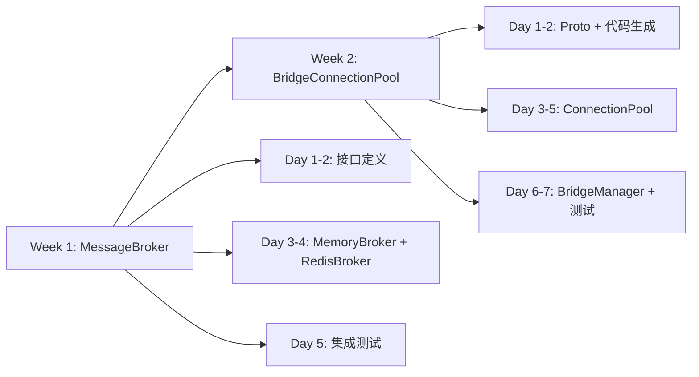
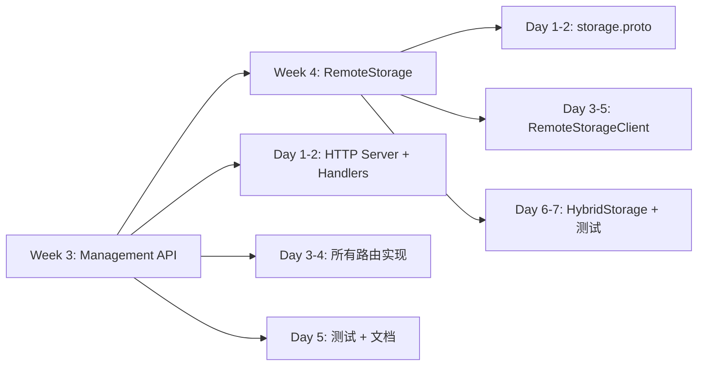
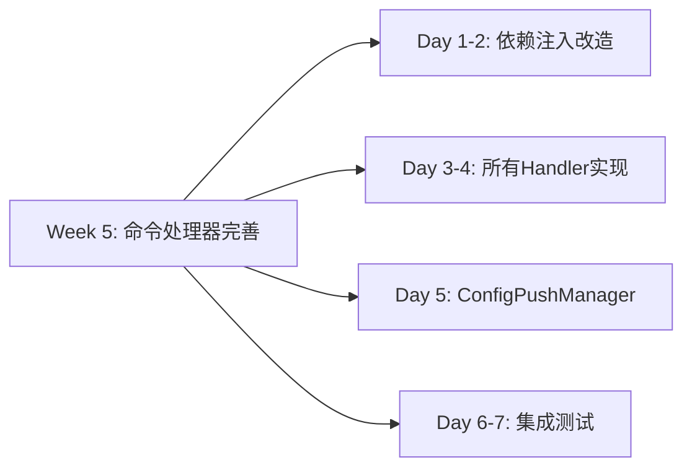
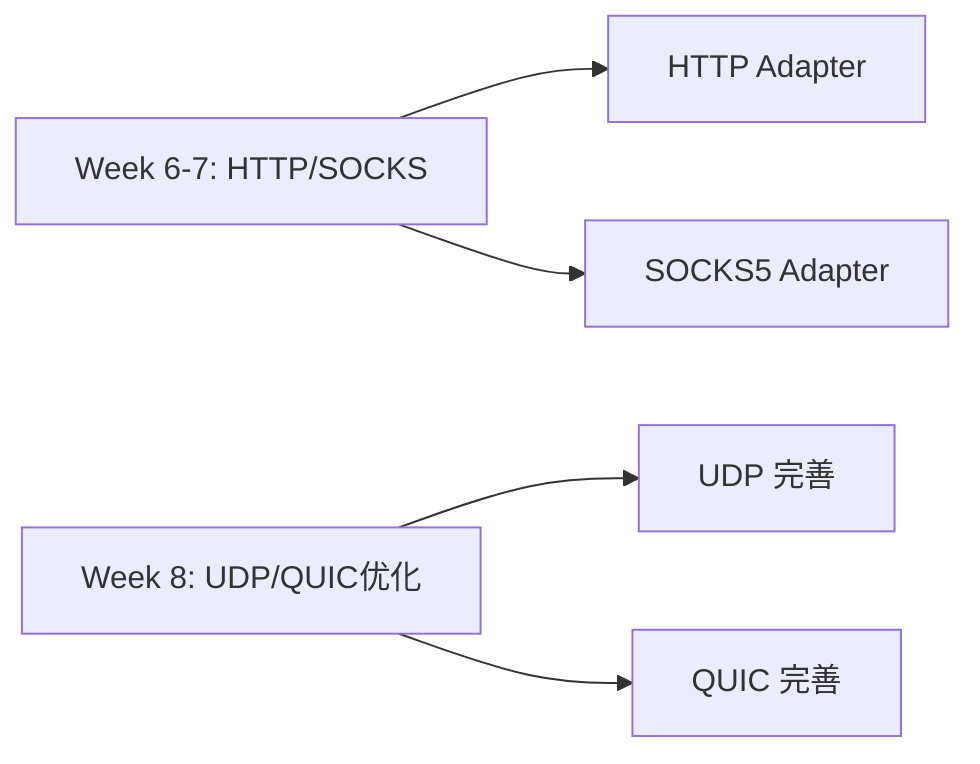
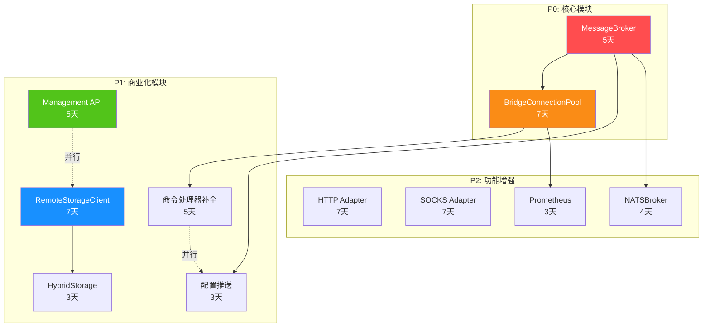

# Tunnox Core 开发指引文档 V2.2

> **版本**：V2.2  
> **创建日期**：2025-11-25  
> **目标**：基于 ARCHITECTURE_DESIGN_V2.2.md，详细规划未完成的内核功能实现

---

## 📖 文档说明

本文档基于当前代码库的实际状态，详细列出所有未完成的内核功能，包括：
- 具体的文件路径和命名
- 接口定义和方法签名
- 实现优先级（P0/P1/P2/P3）
- 依赖关系和实现顺序

**命名规范**：
- 文件名：小写下划线，如 `message_broker.go`
- 接口名：大驼峰，如 `MessageBroker`
- 实现类：大驼峰 + 后缀，如 `RedisBroker`
- 方法名：大驼峰（公开）/ 小驼峰（私有）
- 包名：小写单词，如 `broker`, `bridge`

---

## 🎯 实现优先级定义

| 优先级 | 说明 | 时间窗口 |
|--------|------|---------|
| **P0** | 核心功能，必须立即实现 | 1-2周 |
| **P1** | 重要功能，商业化必需 | 1个月 |
| **P2** | 增强功能，提升体验 | 2-3个月 |
| **P3** | 未来规划，可延后 | 6个月+ |

---

## 📊 当前实现状态总览

### ✅ 已完成模块（核心功能可用）

| 模块 | 文件路径 | 完成度 | 说明 |
|------|---------|--------|------|
| **Storage KV 接口** | `internal/core/storage/interface.go` | 100% | 基础 KV 存储接口 |
| **MemoryStorage** | `internal/core/storage/memory.go` | 100% | 内存存储实现 |
| **RedisStorage** | `internal/core/storage/redis_storage.go` | 100% | Redis KV 存储 |
| **CloudControlAPI** | `internal/cloud/services/cloud_control_api.go` | 90% | 云控API（缺HTTP层） |
| **UserService** | `internal/cloud/services/user_service.go` | 95% | 用户管理服务 |
| **ClientService** | `internal/cloud/services/client_service.go` | 95% | 客户端管理服务 |
| **PortMappingService** | `internal/cloud/services/port_mapping_service.go` | 95% | 映射管理服务 |
| **NodeService** | `internal/cloud/services/node_service.go` | 100% | 节点管理服务 |
| **AuthService** | `internal/cloud/services/auth_service.go` | 100% | 认证服务 |
| **JWTManager** | `internal/cloud/managers/jwt_manager.go` | 100% | JWT 令牌管理 |
| **SessionManager** | `internal/protocol/session/manager.go` | 90% | 会话管理 |
| **CommandExecutor** | `internal/command/executor.go` | 80% | 命令执行器 |
| **StreamProcessor** | `internal/stream/stream_processor.go` | 100% | 数据流处理 |
| **TCP Adapter** | `internal/protocol/adapter/tcp_adapter.go` | 100% | TCP 协议适配器 |
| **WebSocket Adapter** | `internal/protocol/adapter/websocket_adapter.go` | 100% | WebSocket 适配器 |

### ❌ 未实现模块（需要开发）

| 模块 | 优先级 | 工作量 | 说明 |
|------|--------|--------|------|
| **MessageBroker** | P0 | 5天 | 消息通知抽象层 |
| **BridgeConnectionPool** | P0 | 7天 | gRPC 连接池 + 多路复用 |
| **Management API HTTP** | P1 | 5天 | HTTP REST 路由层 |
| **HybridStorage** | P1 | 3天 | Redis + RemoteStorage |
| **RemoteStorageClient** | P1 | 7天 | gRPC 存储客户端 |
| **gRPC Proto 定义** | P1 | 3天 | bridge.proto + storage.proto |
| **命令处理器完善** | P1 | 5天 | 补充业务逻辑 |
| **配置推送机制** | P1 | 3天 | 完整实现 |
| **HTTP 协议支持** | P2 | 7天 | HTTP 代理 |
| **SOCKS 协议支持** | P2 | 7天 | SOCKS5 代理 |
| **UDP Adapter 完善** | P2 | 5天 | UDP 协议支持 |
| **QUIC Adapter 完善** | P2 | 7天 | QUIC 协议支持 |

---

## 🔥 P0 优先级：核心内核功能（2周内完成）

### 1. MessageBroker 消息通知抽象层

**优先级**：P0（最高）  
**工作量**：5天  
**依赖**：无

#### 1.1 接口定义

**文件**：`internal/broker/interface.go`

```go
package broker

import (
    "context"
    "time"
)

// MessageBroker 消息代理接口（抽象 MQ 能力）
type MessageBroker interface {
    // Publish 发布消息到指定主题
    Publish(ctx context.Context, topic string, message []byte) error
    
    // Subscribe 订阅主题，返回消息通道
    Subscribe(ctx context.Context, topic string) (<-chan *Message, error)
    
    // Unsubscribe 取消订阅
    Unsubscribe(ctx context.Context, topic string) error
    
    // Close 关闭连接
    Close() error
}

// Message 消息结构
type Message struct {
    Topic     string
    Payload   []byte
    Timestamp time.Time
    NodeID    string  // 发布者节点ID
}

// Topic 常量定义
const (
    TopicClientOnline   = "client.online"    // 客户端上线
    TopicClientOffline  = "client.offline"   // 客户端下线
    TopicConfigUpdate   = "config.update"    // 配置更新
    TopicMappingCreated = "mapping.created"  // 映射创建
    TopicMappingDeleted = "mapping.deleted"  // 映射删除
    TopicBridgeRequest  = "bridge.request"   // 桥接请求
    TopicBridgeResponse = "bridge.response"  // 桥接响应
    TopicNodeHeartbeat  = "node.heartbeat"   // 节点心跳
    TopicNodeShutdown   = "node.shutdown"    // 节点下线
)
```

#### 1.2 MemoryBroker 实现（单节点）

**文件**：`internal/broker/memory_broker.go`

```go
package broker

import (
    "context"
    "fmt"
    "sync"
    "time"
)

// MemoryBroker 内存消息代理（单节点）
type MemoryBroker struct {
    subscribers map[string][]chan *Message
    mu          sync.RWMutex
    ctx         context.Context
    cancel      context.CancelFunc
}

// NewMemoryBroker 创建内存消息代理
func NewMemoryBroker(ctx context.Context) *MemoryBroker

// Publish 发布消息
func (m *MemoryBroker) Publish(ctx context.Context, topic string, message []byte) error

// Subscribe 订阅主题
func (m *MemoryBroker) Subscribe(ctx context.Context, topic string) (<-chan *Message, error)

// Unsubscribe 取消订阅
func (m *MemoryBroker) Unsubscribe(ctx context.Context, topic string) error

// Close 关闭
func (m *MemoryBroker) Close() error
```

#### 1.3 RedisBroker 实现（集群）

**文件**：`internal/broker/redis_broker.go`

```go
package broker

import (
    "context"
    "github.com/redis/go-redis/v9"
    "time"
)

// RedisBroker Redis 消息代理（基于 Pub/Sub）
type RedisBroker struct {
    client      *redis.Client
    pubsub      *redis.PubSub
    subscribers map[string]chan *Message
    mu          sync.RWMutex
    ctx         context.Context
    cancel      context.CancelFunc
    nodeID      string  // 当前节点ID
}

// RedisBrokerConfig Redis Broker 配置
type RedisBrokerConfig struct {
    Addrs        []string
    Password     string
    DB           int
    ClusterMode  bool
    PoolSize     int
}

// NewRedisBroker 创建 Redis 消息代理
func NewRedisBroker(ctx context.Context, config *RedisBrokerConfig, nodeID string) (*RedisBroker, error)

// Publish 发布消息
func (r *RedisBroker) Publish(ctx context.Context, topic string, message []byte) error

// Subscribe 订阅主题
func (r *RedisBroker) Subscribe(ctx context.Context, topic string) (<-chan *Message, error)

// Unsubscribe 取消订阅
func (r *RedisBroker) Unsubscribe(ctx context.Context, topic string) error

// Close 关闭
func (r *RedisBroker) Close() error

// 私有方法
func (r *RedisBroker) startMessageLoop(topic string, msgChan chan *Message)
```

#### 1.4 Broker Factory

**文件**：`internal/broker/factory.go`

```go
package broker

import (
    "context"
    "fmt"
)

// BrokerType 消息代理类型
type BrokerType string

const (
    BrokerTypeMemory BrokerType = "memory"
    BrokerTypeRedis  BrokerType = "redis"
    BrokerTypeNATS   BrokerType = "nats"
)

// BrokerConfig 消息代理配置
type BrokerConfig struct {
    Type   BrokerType
    NodeID string
    
    // Redis 配置
    Redis *RedisBrokerConfig
    
    // NATS 配置（未来扩展）
    NATS  interface{}
}

// NewMessageBroker 创建消息代理
func NewMessageBroker(ctx context.Context, config *BrokerConfig) (MessageBroker, error) {
    switch config.Type {
    case BrokerTypeMemory:
        return NewMemoryBroker(ctx), nil
    case BrokerTypeRedis:
        if config.Redis == nil {
            return nil, fmt.Errorf("redis config is required")
        }
        return NewRedisBroker(ctx, config.Redis, config.NodeID)
    default:
        return nil, fmt.Errorf("unsupported broker type: %s", config.Type)
    }
}
```

#### 1.5 消息类型定义

**文件**：`internal/broker/messages.go`

```go
package broker

// ClientOnlineMessage 客户端上线消息
type ClientOnlineMessage struct {
    ClientID  int64  `json:"client_id"`
    NodeID    string `json:"node_id"`
    IPAddress string `json:"ip_address"`
    Timestamp int64  `json:"timestamp"`
}

// ClientOfflineMessage 客户端下线消息
type ClientOfflineMessage struct {
    ClientID  int64  `json:"client_id"`
    Timestamp int64  `json:"timestamp"`
}

// ConfigUpdateMessage 配置更新消息
type ConfigUpdateMessage struct {
    TargetType string      `json:"target_type"`  // user/client/mapping
    TargetID   int64       `json:"target_id"`
    ConfigType string      `json:"config_type"`  // quota/mapping/settings
    ConfigData interface{} `json:"config_data"`
    Version    int64       `json:"version"`      // 配置版本号
    Timestamp  int64       `json:"timestamp"`
}

// BridgeRequestMessage 桥接请求消息
type BridgeRequestMessage struct {
    RequestID      string `json:"request_id"`
    SourceNodeID   string `json:"source_node_id"`
    TargetNodeID   string `json:"target_node_id"`
    SourceClientID int64  `json:"source_client_id"`
    TargetClientID int64  `json:"target_client_id"`
    TargetHost     string `json:"target_host"`
    TargetPort     int    `json:"target_port"`
}

// BridgeResponseMessage 桥接响应消息
type BridgeResponseMessage struct {
    RequestID string `json:"request_id"`
    Success   bool   `json:"success"`
    Error     string `json:"error,omitempty"`
    StreamID  string `json:"stream_id"`  // gRPC 逻辑流ID
}
```

#### 1.6 集成到 Server

**修改文件**：`cmd/server/main.go`

**新增字段**：
```go
type Server struct {
    config          *AppConfig
    serviceManager  *utils.ServiceManager
    protocolMgr     *protocol.ProtocolManager
    serverId        string
    storage         storage.Storage
    idManager       *idgen.IDManager
    session         *session.SessionManager
    protocolFactory *ProtocolFactory
    cloudControl    managers.CloudControlAPI
    
    // 新增字段
    messageBroker   broker.MessageBroker  // 消息代理
}
```

**修改方法**：
```go
// NewServer 创建新服务器
func NewServer(config *AppConfig, parentCtx context.Context) *Server {
    // ... 现有代码 ...
    
    // 创建 MessageBroker
    brokerConfig := &broker.BrokerConfig{
        Type:   broker.BrokerTypeMemory,  // 默认内存模式
        NodeID: server.serverId,
    }
    
    // 如果配置了 Redis，使用 RedisBroker
    if config.Redis != nil && config.Cluster.Enabled {
        brokerConfig.Type = broker.BrokerTypeRedis
        brokerConfig.Redis = &broker.RedisBrokerConfig{
            Addrs:       config.Redis.Addrs,
            Password:    config.Redis.Password,
            DB:          config.Redis.DB,
            ClusterMode: config.Redis.ClusterMode,
            PoolSize:    config.Redis.PoolSize,
        }
    }
    
    messageBroker, err := broker.NewMessageBroker(parentCtx, brokerConfig)
    if err != nil {
        utils.Fatalf("Failed to create message broker: %v", err)
    }
    server.messageBroker = messageBroker
    
    // ... 其他初始化代码 ...
    
    return server
}
```

**实现任务**：
- [ ] 创建 `internal/broker/` 目录
- [ ] 实现 `interface.go`（接口定义）
- [ ] 实现 `memory_broker.go`（单节点）
- [ ] 实现 `redis_broker.go`（集群）
- [ ] 实现 `factory.go`（工厂）
- [ ] 实现 `messages.go`（消息类型）
- [ ] 编写单元测试 `*_test.go`
- [ ] 集成到 `cmd/server/main.go`

---

### 2. BridgeConnectionPool gRPC 连接池

**优先级**：P0（最高）  
**工作量**：7天  
**依赖**：MessageBroker

#### 2.1 gRPC Proto 定义

**文件**：`api/proto/bridge/bridge.proto`

```protobuf
syntax = "proto3";

package bridge;

option go_package = "tunnox-core/api/proto/bridge";

// 跨节点桥接服务
service NodeBridge {
    // 双向流，支持多路复用
    rpc Stream(stream BridgePacket) returns (stream BridgePacket);
}

// 桥接数据包
message BridgePacket {
    string stream_id = 1;           // 逻辑流ID（UUID）
    PacketType type = 2;            // 包类型
    
    // 连接信息
    int64 source_client_id = 3;
    int64 target_client_id = 4;
    string target_host = 5;
    int32 target_port = 6;
    
    // 数据
    bytes data = 10;
    
    // 控制信号
    string error_message = 20;
    int64 timestamp = 21;
}

enum PacketType {
    PACKET_TYPE_UNSPECIFIED = 0;
    CONNECT_REQUEST = 1;   // 建立逻辑流请求
    CONNECT_RESPONSE = 2;  // 建立逻辑流响应
    DATA = 3;              // 数据传输
    CLOSE = 4;             // 关闭逻辑流
    ERROR = 5;             // 错误
    HEARTBEAT = 6;         // 心跳
}
```

**生成命令**：
```bash
protoc --go_out=. --go_opt=paths=source_relative \
    --go-grpc_out=. --go-grpc_opt=paths=source_relative \
    api/proto/bridge/bridge.proto
```

#### 2.2 连接池核心实现

**文件**：`internal/bridge/connection_pool.go`

```go
package bridge

import (
    "context"
    "sync"
    "sync/atomic"
    "time"
    pb "tunnox-core/api/proto/bridge"
)

// BridgeConnectionPool gRPC 桥接连接池
type BridgeConnectionPool struct {
    config *PoolConfig
    pools  map[string]*NodeConnectionPool
    mu     sync.RWMutex
    ctx    context.Context
    cancel context.CancelFunc
}

// PoolConfig 连接池配置
type PoolConfig struct {
    MinConnections      int           // 每节点最小连接数（默认：2）
    MaxConnections      int           // 每节点最大连接数（默认：20）
    MaxStreamsPerConn   int           // 每连接最大复用流（默认：100）
    MaxIdleTime         time.Duration // 空闲连接超时（默认：5分钟）
    DialTimeout         time.Duration // 连接建立超时（默认：5秒）
    HealthCheckInterval time.Duration // 健康检查间隔（默认：30秒）
}

// NewBridgeConnectionPool 创建连接池
func NewBridgeConnectionPool(ctx context.Context, config *PoolConfig) *BridgeConnectionPool

// AcquireConnection 获取到指定节点的连接
func (p *BridgeConnectionPool) AcquireConnection(ctx context.Context, nodeID, nodeAddr string) (*MultiplexedConn, error)

// ReleaseConnection 归还连接
func (p *BridgeConnectionPool) ReleaseConnection(conn *MultiplexedConn)

// Close 关闭连接池
func (p *BridgeConnectionPool) Close() error

// GetPoolMetrics 获取连接池监控指标
func (p *BridgeConnectionPool) GetPoolMetrics() *PoolMetrics

// 私有方法
func (p *BridgeConnectionPool) getOrCreateNodePool(nodeID, nodeAddr string) *NodeConnectionPool
func (p *BridgeConnectionPool) getNodePool(nodeID string) *NodeConnectionPool
```

**文件**：`internal/bridge/node_pool.go`

```go
package bridge

// NodeConnectionPool 到单个节点的连接池
type NodeConnectionPool struct {
    nodeID      string
    nodeAddr    string
    connections []*MultiplexedConn
    available   chan *MultiplexedConn
    size        atomic.Int32
    config      *PoolConfig
    mu          sync.RWMutex
    ctx         context.Context
}

// NewNodeConnectionPool 创建节点连接池
func NewNodeConnectionPool(ctx context.Context, nodeID, nodeAddr string, config *PoolConfig) *NodeConnectionPool

// createNewConnection 创建新连接
func (np *NodeConnectionPool) createNewConnection(ctx context.Context) (*MultiplexedConn, error)

// removeConnection 移除连接
func (np *NodeConnectionPool) removeConnection(index int)

// startHealthCheck 启动健康检查
func (np *NodeConnectionPool) startHealthCheck()

// Close 关闭节点连接池
func (np *NodeConnectionPool) Close() error
```

**文件**：`internal/bridge/multiplexed_conn.go`

```go
package bridge

// MultiplexedConn 支持多路复用的 gRPC 连接
type MultiplexedConn struct {
    nodeID    string
    nodeAddr  string
    stream    pb.NodeBridge_StreamClient
    client    pb.NodeBridgeClient
    grpcConn  *grpc.ClientConn
    sessions  sync.Map  // streamID -> *ForwardSession
    inUse     atomic.Int32
    lastUsed  atomic.Int64
    healthy   atomic.Bool
    closeChan chan struct{}
    mu        sync.RWMutex
}

// NewMultiplexedConn 创建复用连接
func NewMultiplexedConn(ctx context.Context, nodeID, nodeAddr string) (*MultiplexedConn, error)

// CreateForwardSession 创建转发会话
func (mc *MultiplexedConn) CreateForwardSession(streamID string, sourceClientID, targetClientID int64, targetHost string, targetPort int) (*ForwardSession, error)

// CloseForwardSession 关闭转发会话
func (mc *MultiplexedConn) CloseForwardSession(streamID string) error

// SendData 发送数据
func (mc *MultiplexedConn) SendData(streamID string, data []byte) error

// startReceiveLoop 启动接收循环
func (mc *MultiplexedConn) startReceiveLoop()

// Close 关闭连接
func (mc *MultiplexedConn) Close() error

// IsHealthy 检查连接健康
func (mc *MultiplexedConn) IsHealthy() bool
```

**文件**：`internal/bridge/forward_session.go`

```go
package bridge

// ForwardSession 单个逻辑转发会话
type ForwardSession struct {
    StreamID       string
    SourceClientID int64
    TargetClientID int64
    TargetHost     string
    TargetPort     int
    DataChan       chan []byte
    ErrChan        chan error
    CloseChan      chan struct{}
    CreatedAt      time.Time
    BytesSent      atomic.Int64
    BytesReceived  atomic.Int64
}

// NewForwardSession 创建转发会话
func NewForwardSession(streamID string, sourceClientID, targetClientID int64, targetHost string, targetPort int) *ForwardSession

// SendData 发送数据
func (fs *ForwardSession) SendData(data []byte) error

// Close 关闭会话
func (fs *ForwardSession) Close() error
```

#### 2.3 BridgeManager 桥接管理器

**文件**：`internal/bridge/bridge_manager.go`

```go
package bridge

import (
    "context"
    "tunnox-core/internal/broker"
    "tunnox-core/internal/core/storage"
)

// BridgeManager 桥接管理器（协调跨节点转发）
type BridgeManager struct {
    pool          *BridgeConnectionPool
    broker        broker.MessageBroker
    storage       storage.Storage
    nodeID        string
    ctx           context.Context
    cancel        context.CancelFunc
    
    // 路由缓存（clientID -> nodeID）
    clientRoutes  sync.Map
}

// NewBridgeManager 创建桥接管理器
func NewBridgeManager(
    ctx context.Context,
    nodeID string,
    pool *BridgeConnectionPool,
    broker broker.MessageBroker,
    storage storage.Storage,
) *BridgeManager

// ForwardToClient 转发数据到指定客户端
// 如果客户端在当前节点，直接转发；否则通过桥接转发
func (bm *BridgeManager) ForwardToClient(
    ctx context.Context,
    targetClientID int64,
    targetHost string,
    targetPort int,
    data []byte,
) error

// GetClientNode 获取客户端所在节点
func (bm *BridgeManager) GetClientNode(ctx context.Context, clientID int64) (string, error)

// UpdateClientRoute 更新客户端路由
func (bm *BridgeManager) UpdateClientRoute(clientID int64, nodeID string)

// DeleteClientRoute 删除客户端路由
func (bm *BridgeManager) DeleteClientRoute(clientID int64)

// startBrokerListener 启动消息代理监听
func (bm *BridgeManager) startBrokerListener()

// handleClientOnlineEvent 处理客户端上线事件
func (bm *BridgeManager) handleClientOnlineEvent(msg *broker.Message)

// handleClientOfflineEvent 处理客户端下线事件
func (bm *BridgeManager) handleClientOfflineEvent(msg *broker.Message)

// handleBridgeRequest 处理桥接请求
func (bm *BridgeManager) handleBridgeRequest(msg *broker.Message)

// Close 关闭桥接管理器
func (bm *BridgeManager) Close() error
```

#### 2.4 gRPC Server 实现

**文件**：`internal/bridge/grpc_server.go`

```go
package bridge

import (
    "context"
    pb "tunnox-core/api/proto/bridge"
    "google.golang.org/grpc"
)

// GRPCBridgeServer gRPC 桥接服务端
type GRPCBridgeServer struct {
    pb.UnimplementedNodeBridgeServer
    bridgeManager *BridgeManager
    nodeID        string
}

// NewGRPCBridgeServer 创建 gRPC 桥接服务端
func NewGRPCBridgeServer(nodeID string, bridgeManager *BridgeManager) *GRPCBridgeServer

// Stream 实现双向流
func (s *GRPCBridgeServer) Stream(stream pb.NodeBridge_StreamServer) error

// StartGRPCServer 启动 gRPC 服务器
func StartGRPCServer(ctx context.Context, listenAddr string, server *GRPCBridgeServer) (*grpc.Server, error)
```

#### 2.5 监控指标

**文件**：`internal/bridge/metrics.go`

```go
package bridge

// PoolMetrics 连接池监控指标
type PoolMetrics struct {
    TotalPools            int
    TotalConnections      int
    ActiveStreams         int
    AvgStreamsPerConn     float64
    ConnectionUtilization float64
    NodeMetrics           map[string]*NodePoolMetrics
}

// NodePoolMetrics 节点连接池监控
type NodePoolMetrics struct {
    NodeID              string
    Connections         int
    ActiveStreams       int
    IdleConnections     int
    FailedDials         int64
    TotalBytesForwarded int64
}

// CollectMetrics 收集指标
func (p *BridgeConnectionPool) CollectMetrics() *PoolMetrics
```

**实现任务**：
- [ ] 创建 `api/proto/bridge/` 目录
- [ ] 编写 `bridge.proto`
- [ ] 生成 gRPC Go 代码
- [ ] 创建 `internal/bridge/` 目录
- [ ] 实现 `connection_pool.go`
- [ ] 实现 `node_pool.go`
- [ ] 实现 `multiplexed_conn.go`
- [ ] 实现 `forward_session.go`
- [ ] 实现 `bridge_manager.go`
- [ ] 实现 `grpc_server.go`
- [ ] 实现 `metrics.go`
- [ ] 编写单元测试和集成测试
- [ ] 集成到 `cmd/server/main.go`

---

## 📱 P1 优先级：商业化必需功能（1个月内完成）

### 3. Management API HTTP 路由层

**优先级**：P1  
**工作量**：5天  
**依赖**：无（CloudControlAPI 已实现）

#### 3.1 HTTP 服务器

**文件**：`internal/api/server.go`

```go
package api

import (
    "context"
    "net/http"
    "time"
    "tunnox-core/internal/cloud/services"
    "github.com/go-chi/chi/v5"
    "github.com/go-chi/chi/v5/middleware"
    "github.com/go-chi/cors"
)

// ManagementAPIServer Management API HTTP 服务器
type ManagementAPIServer struct {
    config        *APIConfig
    router        *chi.Mux
    server        *http.Server
    cloudControl  services.CloudControlAPI
    
    // Handlers
    userHandler    *UserHandler
    clientHandler  *ClientHandler
    mappingHandler *MappingHandler
    quotaHandler   *QuotaHandler
    statsHandler   *StatsHandler
    nodeHandler    *NodeHandler
    authHandler    *AuthHandler
}

// APIConfig Management API 配置
type APIConfig struct {
    Enabled     bool
    ListenAddr  string
    Auth        AuthConfig
    CORS        CORSConfig
    RateLimit   RateLimitConfig
}

type AuthConfig struct {
    Type   string  // api_key / jwt / none
    Secret string
}

type CORSConfig struct {
    Enabled        bool
    AllowedOrigins []string
    AllowedMethods []string
    AllowedHeaders []string
}

type RateLimitConfig struct {
    Enabled            bool
    RequestsPerSecond  int
    Burst              int
}

// NewManagementAPIServer 创建 Management API 服务器
func NewManagementAPIServer(config *APIConfig, cloudControl services.CloudControlAPI) *ManagementAPIServer

// Start 启动服务器
func (s *ManagementAPIServer) Start(ctx context.Context) error

// Stop 停止服务器
func (s *ManagementAPIServer) Stop(ctx context.Context) error

// setupRoutes 设置路由
func (s *ManagementAPIServer) setupRoutes()

// setupMiddleware 设置中间件
func (s *ManagementAPIServer) setupMiddleware()
```

#### 3.2 用户管理 API Handler

**文件**：`internal/api/handlers/user_handler.go`

```go
package handlers

import (
    "net/http"
    "tunnox-core/internal/cloud/services"
    "github.com/go-chi/chi/v5"
)

// UserHandler 用户管理 Handler
type UserHandler struct {
    userService services.UserService
}

// NewUserHandler 创建用户 Handler
func NewUserHandler(userService services.UserService) *UserHandler

// CreateUser POST /api/v1/users
func (h *UserHandler) CreateUser(w http.ResponseWriter, r *http.Request)

// GetUser GET /api/v1/users/{user_id}
func (h *UserHandler) GetUser(w http.ResponseWriter, r *http.Request)

// UpdateUser PUT /api/v1/users/{user_id}
func (h *UserHandler) UpdateUser(w http.ResponseWriter, r *http.Request)

// DeleteUser DELETE /api/v1/users/{user_id}
func (h *UserHandler) DeleteUser(w http.ResponseWriter, r *http.Request)

// ListUsers GET /api/v1/users
func (h *UserHandler) ListUsers(w http.ResponseWriter, r *http.Request)

// RegisterRoutes 注册路由
func (h *UserHandler) RegisterRoutes(r chi.Router)
```

#### 3.3 客户端管理 API Handler

**文件**：`internal/api/handlers/client_handler.go`

```go
package handlers

// ClientHandler 客户端管理 Handler
type ClientHandler struct {
    clientService services.ClientService
}

// NewClientHandler 创建客户端 Handler
func NewClientHandler(clientService services.ClientService) *ClientHandler

// CreateClient POST /api/v1/clients
func (h *ClientHandler) CreateClient(w http.ResponseWriter, r *http.Request)

// GetClient GET /api/v1/clients/{client_id}
func (h *ClientHandler) GetClient(w http.ResponseWriter, r *http.Request)

// UpdateClient PUT /api/v1/clients/{client_id}
func (h *ClientHandler) UpdateClient(w http.ResponseWriter, r *http.Request)

// DeleteClient DELETE /api/v1/clients/{client_id}
func (h *ClientHandler) DeleteClient(w http.ResponseWriter, r *http.Request)

// ListUserClients GET /api/v1/users/{user_id}/clients
func (h *ClientHandler) ListUserClients(w http.ResponseWriter, r *http.Request)

// DisconnectClient POST /api/v1/clients/{client_id}/disconnect
func (h *ClientHandler) DisconnectClient(w http.ResponseWriter, r *http.Request)

// RegisterRoutes 注册路由
func (h *ClientHandler) RegisterRoutes(r chi.Router)
```

#### 3.4 端口映射 API Handler

**文件**：`internal/api/handlers/mapping_handler.go`

```go
package handlers

// MappingHandler 端口映射 Handler
type MappingHandler struct {
    mappingService services.PortMappingService
}

// NewMappingHandler 创建映射 Handler
func NewMappingHandler(mappingService services.PortMappingService) *MappingHandler

// CreateMapping POST /api/v1/mappings
func (h *MappingHandler) CreateMapping(w http.ResponseWriter, r *http.Request)

// GetMapping GET /api/v1/mappings/{mapping_id}
func (h *MappingHandler) GetMapping(w http.ResponseWriter, r *http.Request)

// UpdateMapping PUT /api/v1/mappings/{mapping_id}
func (h *MappingHandler) UpdateMapping(w http.ResponseWriter, r *http.Request)

// DeleteMapping DELETE /api/v1/mappings/{mapping_id}
func (h *MappingHandler) DeleteMapping(w http.ResponseWriter, r *http.Request)

// ListUserMappings GET /api/v1/users/{user_id}/mappings
func (h *MappingHandler) ListUserMappings(w http.ResponseWriter, r *http.Request)

// ListClientMappings GET /api/v1/clients/{client_id}/mappings
func (h *MappingHandler) ListClientMappings(w http.ResponseWriter, r *http.Request)

// RegisterRoutes 注册路由
func (h *MappingHandler) RegisterRoutes(r chi.Router)
```

#### 3.5 其他 Handlers

**文件**：`internal/api/handlers/quota_handler.go`

```go
// QuotaHandler 配额管理 Handler
type QuotaHandler struct {
    userService services.UserService
}

// SetUserQuota POST /api/v1/users/{user_id}/quota
func (h *QuotaHandler) SetUserQuota(w http.ResponseWriter, r *http.Request)

// GetUserQuota GET /api/v1/users/{user_id}/quota
func (h *QuotaHandler) GetUserQuota(w http.ResponseWriter, r *http.Request)
```

**文件**：`internal/api/handlers/stats_handler.go`

```go
// StatsHandler 统计查询 Handler
type StatsHandler struct {
    statsService services.StatsService
}

// GetRealtimeStats GET /api/v1/stats/realtime
func (h *StatsHandler) GetRealtimeStats(w http.ResponseWriter, r *http.Request)

// GetUserStats GET /api/v1/stats/users
func (h *StatsHandler) GetUserStats(w http.ResponseWriter, r *http.Request)

// GetTrafficStats GET /api/v1/stats/traffic
func (h *StatsHandler) GetTrafficStats(w http.ResponseWriter, r *http.Request)
```

**文件**：`internal/api/handlers/node_handler.go`

```go
// NodeHandler 节点管理 Handler
type NodeHandler struct {
    nodeService services.NodeService
}

// ListNodes GET /api/v1/nodes
func (h *NodeHandler) ListNodes(w http.ResponseWriter, r *http.Request)

// GetNode GET /api/v1/nodes/{node_id}
func (h *NodeHandler) GetNode(w http.ResponseWriter, r *http.Request)
```

#### 3.6 中间件

**文件**：`internal/api/middleware/auth.go`

```go
package middleware

import (
    "net/http"
)

// AuthMiddleware 认证中间件
type AuthMiddleware struct {
    authType string  // api_key / jwt / none
    secret   string
}

// NewAuthMiddleware 创建认证中间件
func NewAuthMiddleware(authType, secret string) *AuthMiddleware

// Handler 认证处理
func (m *AuthMiddleware) Handler(next http.Handler) http.Handler

// validateAPIKey 验证 API Key
func (m *AuthMiddleware) validateAPIKey(token string) bool

// validateJWT 验证 JWT Token
func (m *AuthMiddleware) validateJWT(token string) bool
```

**文件**：`internal/api/middleware/rate_limit.go`

```go
package middleware

import (
    "net/http"
    "sync"
    "time"
    "golang.org/x/time/rate"
)

// RateLimitMiddleware 限流中间件
type RateLimitMiddleware struct {
    limiters map[string]*rate.Limiter
    mu       sync.RWMutex
    rps      int
    burst    int
}

// NewRateLimitMiddleware 创建限流中间件
func NewRateLimitMiddleware(rps, burst int) *RateLimitMiddleware

// Handler 限流处理
func (m *RateLimitMiddleware) Handler(next http.Handler) http.Handler

// getLimiter 获取或创建限流器
func (m *RateLimitMiddleware) getLimiter(key string) *rate.Limiter
```

**文件**：`internal/api/middleware/cors.go`

```go
package middleware

// CORSMiddleware 使用 go-chi/cors 包
// 无需自定义实现，直接使用库
```

#### 3.7 响应工具

**文件**：`internal/api/response/response.go`

```go
package response

import (
    "encoding/json"
    "net/http"
)

// Response 统一响应格式
type Response struct {
    Success bool        `json:"success"`
    Data    interface{} `json:"data,omitempty"`
    Error   string      `json:"error,omitempty"`
    Code    int         `json:"code"`
}

// JSON 返回 JSON 响应
func JSON(w http.ResponseWriter, statusCode int, data interface{})

// Success 返回成功响应
func Success(w http.ResponseWriter, data interface{})

// Error 返回错误响应
func Error(w http.ResponseWriter, statusCode int, message string)

// Created 返回创建成功响应
func Created(w http.ResponseWriter, data interface{})

// NoContent 返回无内容响应
func NoContent(w http.ResponseWriter)
```

**实现任务**：
- [ ] 创建 `internal/api/` 目录
- [ ] 实现 `server.go`（HTTP 服务器）
- [ ] 创建 `internal/api/handlers/` 目录
- [ ] 实现所有 Handler（user, client, mapping, quota, stats, node）
- [ ] 创建 `internal/api/middleware/` 目录
- [ ] 实现中间件（auth, rate_limit）
- [ ] 创建 `internal/api/response/` 目录
- [ ] 实现响应工具函数
- [ ] 编写 API 集成测试
- [ ] 集成到 `cmd/server/main.go`
- [ ] 更新 `config.yaml` 添加 management_api 配置

---

### 4. HybridStorage 实现

**优先级**：P1  
**工作量**：3天  
**依赖**：RemoteStorageClient（可并行）

#### 4.1 HybridStorage 实现

**文件**：`internal/core/storage/hybrid_storage.go`

```go
package storage

import (
    "context"
    "fmt"
    "time"
)

// HybridStorage Redis + Remote Storage 混合存储
type HybridStorage struct {
    redis  *RedisStorage
    remote RemoteStorage  // 远程存储接口
    ctx    context.Context
}

// NewHybridStorage 创建混合存储
func NewHybridStorage(
    ctx context.Context,
    redisConfig *RedisConfig,
    remoteConfig *RemoteStorageConfig,
) (*HybridStorage, error)

// Set 设置值（Cache-Aside 模式）
func (h *HybridStorage) Set(key string, value interface{}, ttl time.Duration) error {
    // 1. 写入远程存储
    if err := h.remote.Set(key, value, ttl); err != nil {
        return err
    }
    
    // 2. 更新 Redis 缓存
    h.redis.Set(key, value, ttl)
    
    return nil
}

// Get 获取值（缓存优先）
func (h *HybridStorage) Get(key string) (interface{}, error) {
    // 1. 先从 Redis 读取
    value, err := h.redis.Get(key)
    if err == nil {
        return value, nil
    }
    
    // 2. 缓存未命中，从远程存储读取
    value, err = h.remote.Get(key)
    if err != nil {
        return nil, err
    }
    
    // 3. 写回 Redis 缓存
    h.redis.Set(key, value, 1*time.Hour)
    
    return value, nil
}

// Delete 删除值
func (h *HybridStorage) Delete(key string) error {
    // 1. 删除远程存储
    if err := h.remote.Delete(key); err != nil {
        return err
    }
    
    // 2. 删除 Redis 缓存
    h.redis.Delete(key)
    
    return nil
}

// 实现 Storage 接口的其他方法...
```

**文件**：`internal/core/storage/remote_interface.go`

```go
package storage

// RemoteStorage 远程存储接口（将通过 gRPC 实现）
type RemoteStorage interface {
    Storage  // 继承基础 Storage 接口
    
    // 健康检查
    Ping(ctx context.Context) error
    
    // 批量操作（性能优化）
    BatchSet(ctx context.Context, items map[string]interface{}, ttl time.Duration) error
    BatchGet(ctx context.Context, keys []string) (map[string]interface{}, error)
    BatchDelete(ctx context.Context, keys []string) error
}

// RemoteStorageConfig 远程存储配置
type RemoteStorageConfig struct {
    Enabled     bool
    GRPCAddress string
    TLS         TLSConfig
    Timeout     time.Duration
    MaxRetries  int
}

type TLSConfig struct {
    Enabled  bool
    CertFile string
    KeyFile  string
    CAFile   string
}
```

**实现任务**：
- [ ] 实现 `hybrid_storage.go`
- [ ] 实现 `remote_interface.go`
- [ ] 编写单元测试 `hybrid_storage_test.go`
- [ ] 更新 `factory.go` 支持 HybridStorage 创建

---

### 5. RemoteStorageClient gRPC 客户端

**优先级**：P1  
**工作量**：7天  
**依赖**：storage.proto

#### 5.1 gRPC Proto 定义

**文件**：`api/proto/storage/storage.proto`

```protobuf
syntax = "proto3";

package storage;

option go_package = "tunnox-core/api/proto/storage";

// 远程存储服务
service StorageService {
  // 基础 KV 操作
  rpc Set(SetRequest) returns (SetResponse);
  rpc Get(GetRequest) returns (GetResponse);
  rpc Delete(DeleteRequest) returns (DeleteResponse);
  rpc Exists(ExistsRequest) returns (ExistsResponse);
  
  // 批量操作
  rpc BatchSet(BatchSetRequest) returns (BatchSetResponse);
  rpc BatchGet(BatchGetRequest) returns (BatchGetResponse);
  rpc BatchDelete(BatchDeleteRequest) returns (BatchDeleteResponse);
  
  // 列表操作
  rpc SetList(SetListRequest) returns (SetListResponse);
  rpc GetList(GetListRequest) returns (GetListResponse);
  rpc AppendToList(AppendToListRequest) returns (AppendToListResponse);
  
  // 哈希操作
  rpc SetHash(SetHashRequest) returns (SetHashResponse);
  rpc GetHash(GetHashRequest) returns (GetHashResponse);
  rpc GetAllHash(GetAllHashRequest) returns (GetAllHashResponse);
  
  // 计数器操作
  rpc Incr(IncrRequest) returns (IncrResponse);
  rpc IncrBy(IncrByRequest) returns (IncrByResponse);
  
  // 健康检查
  rpc Ping(PingRequest) returns (PingResponse);
}

// Set 请求
message SetRequest {
  string key = 1;
  bytes value = 2;
  int64 ttl_seconds = 3;  // 0 表示永久
}

message SetResponse {
  bool success = 1;
  string error = 2;
}

// Get 请求
message GetRequest {
  string key = 1;
}

message GetResponse {
  bytes value = 1;
  bool found = 2;
  string error = 3;
}

// Delete 请求
message DeleteRequest {
  string key = 1;
}

message DeleteResponse {
  bool success = 1;
  string error = 2;
}

// Exists 请求
message ExistsRequest {
  string key = 1;
}

message ExistsResponse {
  bool exists = 1;
  string error = 2;
}

// BatchSet 请求
message BatchSetRequest {
  map<string, bytes> items = 1;
  int64 ttl_seconds = 2;
}

message BatchSetResponse {
  bool success = 1;
  string error = 2;
}

// BatchGet 请求
message BatchGetRequest {
  repeated string keys = 1;
}

message BatchGetResponse {
  map<string, bytes> items = 1;
  string error = 2;
}

// BatchDelete 请求
message BatchDeleteRequest {
  repeated string keys = 1;
}

message BatchDeleteResponse {
  bool success = 1;
  string error = 2;
}

// Ping 请求
message PingRequest {
}

message PingResponse {
  bool healthy = 1;
  int64 timestamp = 2;
}

// ... 其他操作的消息定义 ...
```

**生成命令**：
```bash
protoc --go_out=. --go_opt=paths=source_relative \
    --go-grpc_out=. --go-grpc_opt=paths=source_relative \
    api/proto/storage/storage.proto
```

#### 5.2 gRPC 客户端实现

**文件**：`internal/core/storage/remote_storage_client.go`

```go
package storage

import (
    "context"
    "encoding/json"
    "fmt"
    "time"
    pb "tunnox-core/api/proto/storage"
    "google.golang.org/grpc"
    "google.golang.org/grpc/credentials/insecure"
)

// RemoteStorageClient gRPC 远程存储客户端
type RemoteStorageClient struct {
    conn    *grpc.ClientConn
    client  pb.StorageServiceClient
    config  *RemoteStorageConfig
    ctx     context.Context
}

// NewRemoteStorageClient 创建远程存储客户端
func NewRemoteStorageClient(ctx context.Context, config *RemoteStorageConfig) (*RemoteStorageClient, error) {
    // 建立 gRPC 连接
    opts := []grpc.DialOption{
        grpc.WithTransportCredentials(insecure.NewCredentials()),
        grpc.WithBlock(),
    }
    
    dialCtx, cancel := context.WithTimeout(ctx, config.Timeout)
    defer cancel()
    
    conn, err := grpc.DialContext(dialCtx, config.GRPCAddress, opts...)
    if err != nil {
        return nil, fmt.Errorf("failed to connect to remote storage: %w", err)
    }
    
    client := pb.NewStorageServiceClient(conn)
    
    return &RemoteStorageClient{
        conn:   conn,
        client: client,
        config: config,
        ctx:    ctx,
    }, nil
}

// Set 设置值
func (r *RemoteStorageClient) Set(key string, value interface{}, ttl time.Duration) error {
    data, err := json.Marshal(value)
    if err != nil {
        return err
    }
    
    req := &pb.SetRequest{
        Key:        key,
        Value:      data,
        TtlSeconds: int64(ttl.Seconds()),
    }
    
    ctx, cancel := context.WithTimeout(r.ctx, r.config.Timeout)
    defer cancel()
    
    resp, err := r.client.Set(ctx, req)
    if err != nil {
        return fmt.Errorf("grpc set failed: %w", err)
    }
    
    if !resp.Success {
        return fmt.Errorf("remote storage error: %s", resp.Error)
    }
    
    return nil
}

// Get 获取值
func (r *RemoteStorageClient) Get(key string) (interface{}, error) {
    req := &pb.GetRequest{Key: key}
    
    ctx, cancel := context.WithTimeout(r.ctx, r.config.Timeout)
    defer cancel()
    
    resp, err := r.client.Get(ctx, req)
    if err != nil {
        return nil, fmt.Errorf("grpc get failed: %w", err)
    }
    
    if !resp.Found {
        return nil, ErrKeyNotFound
    }
    
    var value interface{}
    if err := json.Unmarshal(resp.Value, &value); err != nil {
        return nil, err
    }
    
    return value, nil
}

// Delete 删除值
func (r *RemoteStorageClient) Delete(key string) error

// Ping 健康检查
func (r *RemoteStorageClient) Ping(ctx context.Context) error

// BatchSet 批量设置
func (r *RemoteStorageClient) BatchSet(ctx context.Context, items map[string]interface{}, ttl time.Duration) error

// BatchGet 批量获取
func (r *RemoteStorageClient) BatchGet(ctx context.Context, keys []string) (map[string]interface{}, error)

// Close 关闭连接
func (r *RemoteStorageClient) Close() error {
    return r.conn.Close()
}

// 实现 Storage 接口的其他方法...
```

**实现任务**：
- [ ] 创建 `api/proto/storage/` 目录
- [ ] 编写 `storage.proto`
- [ ] 生成 gRPC Go 代码
- [ ] 实现 `remote_interface.go`
- [ ] 实现 `remote_storage_client.go`
- [ ] 编写单元测试 `remote_storage_client_test.go`
- [ ] 编写 Mock 服务端用于测试

---

### 6. 命令处理器业务逻辑补全

**优先级**：P1  
**工作量**：5天  
**依赖**：CloudControlAPI（已实现）

#### 6.1 完善 TcpMapHandler

**文件**：`internal/command/handlers.go`

**当前状态**：
```go
func (h *TcpMapHandler) Handle(ctx *CommandContext) (*CommandResponse, error) {
    // TODO: 实现TCP端口映射逻辑
    ...
}
```

**需要实现**：
```go
func (h *TcpMapHandler) Handle(ctx *CommandContext) (*CommandResponse, error) {
    utils.Infof("Handling TCP mapping command for connection: %s", ctx.ConnectionID)
    
    // 1. 解析请求体
    var req TcpMappingRequest
    if err := json.Unmarshal([]byte(ctx.Body), &req); err != nil {
        return nil, fmt.Errorf("failed to parse request: %w", err)
    }
    
    // 2. 获取 CloudControlAPI（需要注入）
    cloudControl := ctx.Dependencies["cloud_control"].(CloudControlAPI)
    
    // 3. 验证客户端权限和配额
    client, err := cloudControl.GetClient(req.SourceClientID)
    if err != nil {
        return nil, fmt.Errorf("client not found: %w", err)
    }
    
    // 4. 检查用户配额
    user, err := cloudControl.GetUser(client.UserID)
    if err != nil {
        return nil, fmt.Errorf("user not found: %w", err)
    }
    
    if user.Quota.CurrentMappings >= user.Quota.MaxMappings {
        return &CommandResponse{
            Success: false,
            Error:   "quota exceeded: max mappings reached",
        }, nil
    }
    
    // 5. 创建端口映射
    mapping := &models.PortMapping{
        SourceClientID: req.SourceClientID,
        TargetClientID: req.TargetClientID,
        Protocol:       models.ProtocolTCP,
        SourcePort:     req.SourcePort,
        TargetHost:     req.TargetHost,
        TargetPort:     req.TargetPort,
        Status:         models.MappingStatusActive,
    }
    
    createdMapping, err := cloudControl.CreatePortMapping(mapping)
    if err != nil {
        return nil, fmt.Errorf("failed to create mapping: %w", err)
    }
    
    // 6. 返回成功响应
    data, _ := json.Marshal(map[string]interface{}{
        "mapping_id":   createdMapping.ID,
        "source_port":  createdMapping.SourcePort,
        "target_host":  createdMapping.TargetHost,
        "target_port":  createdMapping.TargetPort,
        "status":       createdMapping.Status,
    })
    
    return &CommandResponse{
        Success:   true,
        Data:      string(data),
        RequestID: ctx.RequestID,
        CommandId: ctx.CommandId,
    }, nil
}
```

#### 6.2 需要补充的请求/响应结构

**文件**：`internal/command/types.go`（新增）

```go
package command

// TcpMappingRequest TCP 映射请求
type TcpMappingRequest struct {
    SourceClientID int64  `json:"source_client_id"`
    TargetClientID int64  `json:"target_client_id"`
    SourcePort     int    `json:"source_port"`
    TargetHost     string `json:"target_host"`
    TargetPort     int    `json:"target_port"`
}

// HttpMappingRequest HTTP 映射请求
type HttpMappingRequest struct {
    SourceClientID int64  `json:"source_client_id"`
    TargetClientID int64  `json:"target_client_id"`
    Subdomain      string `json:"subdomain"`
    TargetHost     string `json:"target_host"`
    TargetPort     int    `json:"target_port"`
}

// SocksMappingRequest SOCKS 映射请求
type SocksMappingRequest struct {
    SourceClientID int64  `json:"source_client_id"`
    TargetClientID int64  `json:"target_client_id"`
    SourcePort     int    `json:"source_port"`
}
```

#### 6.3 依赖注入改造

**修改文件**：`internal/command/executor.go`

**当前**：
```go
type Executor struct {
    registry types.CommandRegistry
    // ...
}
```

**改为**：
```go
type Executor struct {
    registry     types.CommandRegistry
    cloudControl services.CloudControlAPI  // 新增：注入 CloudControlAPI
    // ...
}

// NewExecutor 创建执行器
func NewExecutor(
    registry types.CommandRegistry,
    cloudControl services.CloudControlAPI,  // 新增参数
    parentCtx context.Context,
) *Executor
```

**修改 CommandContext**：
```go
type CommandContext struct {
    ConnectionID string
    RequestID    string
    CommandId    packet.CommandType
    Body         string
    Timestamp    time.Time
    
    // 新增：依赖注入
    CloudControl services.CloudControlAPI
}
```

**实现任务**：
- [ ] 补充 TcpMapHandler.Handle() 完整逻辑
- [ ] 补充 HttpMapHandler.Handle() 完整逻辑
- [ ] 补充 SocksMapHandler.Handle() 完整逻辑
- [ ] 补充 DataInHandler.Handle() 完整逻辑
- [ ] 补充 DataOutHandler.Handle() 完整逻辑
- [ ] 补充 ForwardHandler.Handle() 完整逻辑
- [ ] 新增 `types.go` 定义请求/响应结构
- [ ] 修改 Executor 支持 CloudControlAPI 注入
- [ ] 修改 CommandContext 包含 CloudControl
- [ ] 编写集成测试

---

### 7. 配置推送机制完善

**优先级**：P1  
**工作量**：3天  
**依赖**：MessageBroker

#### 7.1 ConfigPushManager

**文件**：`internal/cloud/managers/config_push_manager.go`（新建）

```go
package managers

import (
    "context"
    "encoding/json"
    "tunnox-core/internal/broker"
    "tunnox-core/internal/cloud/models"
    "tunnox-core/internal/protocol/session"
)

// ConfigPushManager 配置推送管理器
type ConfigPushManager struct {
    broker         broker.MessageBroker
    sessionManager *session.SessionManager
    ctx            context.Context
}

// NewConfigPushManager 创建配置推送管理器
func NewConfigPushManager(
    ctx context.Context,
    broker broker.MessageBroker,
    sessionManager *session.SessionManager,
) *ConfigPushManager

// PushUserQuotaUpdate 推送用户配额更新
func (m *ConfigPushManager) PushUserQuotaUpdate(userID int64, quota *models.UserQuota) error {
    msg := broker.ConfigUpdateMessage{
        TargetType: "user",
        TargetID:   userID,
        ConfigType: "quota",
        ConfigData: quota,
        Version:    time.Now().Unix(),
        Timestamp:  time.Now().Unix(),
    }
    
    data, _ := json.Marshal(msg)
    return m.broker.Publish(m.ctx, broker.TopicConfigUpdate, data)
}

// PushMappingCreate 推送映射创建通知
func (m *ConfigPushManager) PushMappingCreate(mapping *models.PortMapping) error

// PushMappingDelete 推送映射删除通知
func (m *ConfigPushManager) PushMappingDelete(mappingID string) error

// PushClientConfigUpdate 推送客户端配置更新
func (m *ConfigPushManager) PushClientConfigUpdate(clientID int64, config interface{}) error

// Start 启动监听配置更新消息
func (m *ConfigPushManager) Start() error

// Stop 停止
func (m *ConfigPushManager) Stop() error

// 私有方法
func (m *ConfigPushManager) handleConfigUpdate(msg *broker.Message)
func (m *ConfigPushManager) sendToClient(clientID int64, configData interface{}) error
```

#### 7.2 客户端配置接收和应用

**修改文件**：需要在客户端项目中实现（不在本项目范围）

**服务端需要提供的能力**：
```go
// internal/protocol/session/manager.go

// PushConfigToClient 推送配置到客户端
func (s *SessionManager) PushConfigToClient(clientID int64, configType string, configData interface{}) error {
    // 1. 查找客户端连接
    conn := s.GetConnectionByClientID(clientID)
    if conn == nil {
        return fmt.Errorf("client %d not connected", clientID)
    }
    
    // 2. 构造配置推送命令
    cmd := &packet.CommandPacket{
        Type: packet.ConfigUpdate,
        Body: configData,  // 序列化后的配置
    }
    
    // 3. 发送命令
    return conn.Stream.WritePacket(&packet.TransferPacket{
        CommandPacket: cmd,
    })
}

// GetConnectionByClientID 根据 ClientID 获取连接
func (s *SessionManager) GetConnectionByClientID(clientID int64) *types.Connection
```

**实现任务**：
- [ ] 创建 `config_push_manager.go`
- [ ] 实现配置推送的所有方法
- [ ] 修改 SessionManager 添加 PushConfigToClient 方法
- [ ] 修改 SessionManager 添加 GetConnectionByClientID 方法
- [ ] 集成到服务端启动流程
- [ ] 编写集成测试

---

## 🚀 P2 优先级：功能增强（2-3个月内完成）

### 8. HTTP 协议支持

**优先级**：P2  
**工作量**：7天  
**依赖**：命令处理器

#### 8.1 HTTP 协议适配器

**文件**：`internal/protocol/adapter/http_adapter.go`（新建）

```go
package adapter

import (
    "context"
    "net/http"
    "tunnox-core/internal/protocol/session"
)

// HttpAdapter HTTP 协议适配器
type HttpAdapter struct {
    *BaseAdapter
    server *http.Server
}

// NewHttpAdapter 创建 HTTP 适配器
func NewHttpAdapter(ctx context.Context, sessionMgr *session.SessionManager) *HttpAdapter

// Start 启动 HTTP 服务器
func (a *HttpAdapter) Start(ctx context.Context) error

// Stop 停止 HTTP 服务器
func (a *HttpAdapter) Stop(ctx context.Context) error

// handleHTTPRequest 处理 HTTP 请求
func (a *HttpAdapter) handleHTTPRequest(w http.ResponseWriter, r *http.Request)

// forwardToTarget 转发到目标服务
func (a *HttpAdapter) forwardToTarget(subdomain string, req *http.Request) (*http.Response, error)
```

**实现任务**：
- [ ] 创建 `http_adapter.go`
- [ ] 实现 HTTP 反向代理逻辑
- [ ] 支持子域名路由
- [ ] 支持 WebSocket 升级
- [ ] 编写测试

---

### 9. SOCKS5 协议支持

**优先级**：P2  
**工作量**：7天  
**依赖**：命令处理器

#### 9.1 SOCKS5 协议适配器

**文件**：`internal/protocol/adapter/socks_adapter.go`（新建）

```go
package adapter

import (
    "context"
    "net"
    "tunnox-core/internal/protocol/session"
)

// SocksAdapter SOCKS5 协议适配器
type SocksAdapter struct {
    *BaseAdapter
    listener net.Listener
}

// NewSocksAdapter 创建 SOCKS5 适配器
func NewSocksAdapter(ctx context.Context, sessionMgr *session.SessionManager) *SocksAdapter

// Start 启动 SOCKS5 服务器
func (a *SocksAdapter) Start(ctx context.Context) error

// Stop 停止 SOCKS5 服务器
func (a *SocksAdapter) Stop(ctx context.Context) error

// handleSocksConnection 处理 SOCKS5 连接
func (a *SocksAdapter) handleSocksConnection(conn net.Conn)

// performHandshake SOCKS5 握手
func (a *SocksAdapter) performHandshake(conn net.Conn) error

// handleSOCKS5Request 处理 SOCKS5 请求
func (a *SocksAdapter) handleSOCKS5Request(conn net.Conn) error
```

**实现任务**：
- [ ] 创建 `socks_adapter.go`
- [ ] 实现 SOCKS5 握手协议
- [ ] 实现 CONNECT 命令
- [ ] 支持认证（Username/Password）
- [ ] 编写测试

---

### 10. UDP Adapter 完善

**优先级**：P2  
**工作量**：5天  
**依赖**：无

**文件**：`internal/protocol/adapter/udp_adapter.go`

**当前状态**：部分实现  
**需要完善**：
- [ ] 实现 UDP 数据包转发逻辑
- [ ] 实现 NAT 穿透支持
- [ ] 实现连接状态管理
- [ ] 优化 UDP 性能（零拷贝）
- [ ] 编写压力测试

---

### 11. QUIC Adapter 完善

**优先级**：P2  
**工作量**：7天  
**依赖**：无

**文件**：`internal/protocol/adapter/quic_adapter.go`

**当前状态**：部分实现  
**需要完善**：
- [ ] 实现 QUIC 多路复用
- [ ] 实现 0-RTT 快速握手
- [ ] 实现流量控制
- [ ] 优化移动网络性能
- [ ] 编写测试

---

### 12. NATSBroker 实现（可选）

**优先级**：P2  
**工作量**：4天  
**依赖**：MessageBroker 接口

**文件**：`internal/broker/nats_broker.go`

```go
package broker

import (
    "context"
    "github.com/nats-io/nats.go"
)

// NATSBroker NATS 消息代理
type NATSBroker struct {
    conn        *nats.Conn
    js          nats.JetStreamContext
    subscribers map[string]*nats.Subscription
    mu          sync.RWMutex
    ctx         context.Context
    nodeID      string
}

// NATSBrokerConfig NATS 配置
type NATSBrokerConfig struct {
    URLs      []string
    ClusterID string
    ClientID  string
}

// NewNATSBroker 创建 NATS 消息代理
func NewNATSBroker(ctx context.Context, config *NATSBrokerConfig, nodeID string) (*NATSBroker, error)

// 实现 MessageBroker 接口的所有方法
```

**实现任务**：
- [ ] 实现 `nats_broker.go`
- [ ] 更新 `factory.go` 支持 NATS
- [ ] 编写测试
- [ ] 更新配置文件支持 NATS

---

### 13. Prometheus 监控集成

**优先级**：P2  
**工作量**：3天  
**依赖**：无

**文件**：`internal/metrics/prometheus.go`（新建）

```go
package metrics

import (
    "github.com/prometheus/client_golang/prometheus"
    "github.com/prometheus/client_golang/prometheus/promauto"
)

var (
    // 客户端指标
    ClientsOnline = promauto.NewGauge(prometheus.GaugeOpts{
        Name: "tunnox_clients_online",
        Help: "Number of online clients",
    })
    
    ClientConnections = promauto.NewGaugeVec(
        prometheus.GaugeOpts{
            Name: "tunnox_client_connections",
            Help: "Number of connections per client",
        },
        []string{"client_id"},
    )
    
    // 映射指标
    MappingsActive = promauto.NewGauge(prometheus.GaugeOpts{
        Name: "tunnox_mappings_active",
        Help: "Number of active port mappings",
    })
    
    // 流量指标
    BytesTransferred = promauto.NewCounterVec(
        prometheus.CounterOpts{
            Name: "tunnox_bytes_transferred_total",
            Help: "Total bytes transferred",
        },
        []string{"direction", "client_id"},
    )
    
    // 连接池指标
    BridgePoolConnections = promauto.NewGaugeVec(
        prometheus.GaugeOpts{
            Name: "tunnox_bridge_pool_connections",
            Help: "Number of gRPC connections in bridge pool",
        },
        []string{"target_node"},
    )
    
    BridgePoolActiveStreams = promauto.NewGaugeVec(
        prometheus.GaugeOpts{
            Name: "tunnox_bridge_pool_active_streams",
            Help: "Number of active multiplexed streams",
        },
        []string{"target_node"},
    )
    
    BridgePoolUtilization = promauto.NewGaugeVec(
        prometheus.GaugeOpts{
            Name: "tunnox_bridge_pool_utilization",
            Help: "Bridge connection pool utilization",
        },
        []string{"target_node"},
    )
    
    // 节点指标
    NodeHeartbeatLatency = promauto.NewHistogramVec(
        prometheus.HistogramOpts{
            Name:    "tunnox_node_heartbeat_latency_seconds",
            Help:    "Node heartbeat latency",
            Buckets: prometheus.DefBuckets,
        },
        []string{"node_id"},
    )
)

// MetricsCollector 指标收集器
type MetricsCollector struct {
    bridgePool *bridge.BridgeConnectionPool
    sessionMgr *session.SessionManager
}

// NewMetricsCollector 创建指标收集器
func NewMetricsCollector(
    bridgePool *bridge.BridgeConnectionPool,
    sessionMgr *session.SessionManager,
) *MetricsCollector

// Start 启动指标收集
func (mc *MetricsCollector) Start(ctx context.Context)

// collectBridgePoolMetrics 收集连接池指标
func (mc *MetricsCollector) collectBridgePoolMetrics()

// collectSessionMetrics 收集会话指标
func (mc *MetricsCollector) collectSessionMetrics()
```

**文件**：`internal/api/metrics_server.go`（新建）

```go
package api

import (
    "context"
    "net/http"
    "github.com/prometheus/client_golang/prometheus/promhttp"
)

// MetricsServer Prometheus 指标服务器
type MetricsServer struct {
    server *http.Server
}

// NewMetricsServer 创建指标服务器
func NewMetricsServer(listenAddr string) *MetricsServer {
    mux := http.NewServeMux()
    mux.Handle("/metrics", promhttp.Handler())
    
    return &MetricsServer{
        server: &http.Server{
            Addr:    listenAddr,
            Handler: mux,
        },
    }
}

// Start 启动服务器
func (s *MetricsServer) Start(ctx context.Context) error

// Stop 停止服务器
func (s *MetricsServer) Stop(ctx context.Context) error
```

**实现任务**：
- [ ] 创建 `internal/metrics/` 目录
- [ ] 实现 `prometheus.go` 定义所有指标
- [ ] 实现 `metrics_server.go` Prometheus HTTP 服务器
- [ ] 在各个模块中埋点上报指标
- [ ] 更新配置文件支持 metrics 配置
- [ ] 编写 Grafana Dashboard JSON

---

## 🔮 P3 优先级：未来规划（6个月+）

### 14. 高级流量控制

**文件**：`internal/stream/traffic_shaper.go`（新建）

```go
package stream

// TrafficShaper 流量整形器
type TrafficShaper struct {
    // 令牌桶算法
    buckets map[int64]*TokenBucket  // clientID -> bucket
}

// NewTrafficShaper 创建流量整形器
func NewTrafficShaper() *TrafficShaper

// AllowTraffic 检查是否允许流量通过
func (ts *TrafficShaper) AllowTraffic(clientID int64, bytes int64) bool

// UpdateQuota 更新配额
func (ts *TrafficShaper) UpdateQuota(clientID int64, bytesPerSecond int64)
```

**实现任务**：
- [ ] 实现流量整形算法
- [ ] 集成到 StreamProcessor
- [ ] 性能优化

---

### 15. 数据压缩优化

**文件**：`internal/stream/compression/adaptive_compression.go`（新建）

```go
package compression

// AdaptiveCompressor 自适应压缩器
type AdaptiveCompressor struct {
    // 根据数据类型选择最优压缩算法
}

// Compress 智能压缩
func (ac *AdaptiveCompressor) Compress(data []byte) ([]byte, error)

// Decompress 解压缩
func (ac *AdaptiveCompressor) Decompress(data []byte) ([]byte, error)
```

**实现任务**：
- [ ] 实现多种压缩算法（zstd, lz4, gzip）
- [ ] 实现自适应选择逻辑
- [ ] 性能基准测试

---

### 16. 端到端加密

**文件**：`internal/stream/encryption/e2e_encryption.go`（新建）

```go
package encryption

// E2EEncryption 端到端加密
type E2EEncryption struct {
    // AES-GCM 加密
}

// EncryptData 加密数据
func (e *E2EEncryption) EncryptData(plaintext []byte, key []byte) ([]byte, error)

// DecryptData 解密数据
func (e *E2EEncryption) DecryptData(ciphertext []byte, key []byte) ([]byte, error)
```

**实现任务**：
- [ ] 实现 AES-GCM 加密
- [ ] 实现密钥交换
- [ ] 集成到 StreamProcessor

---

## 🔧 代码改进任务

### 17. 现有模块需要改进的部分

#### 17.1 SessionManager 改进

**文件**：`internal/protocol/session/manager.go`

**需要新增方法**：

```go
// GetConnectionByClientID 根据 ClientID 获取连接
func (s *SessionManager) GetConnectionByClientID(clientID int64) *types.Connection {
    s.connLock.RLock()
    defer s.connLock.RUnlock()
    
    for _, conn := range s.connMap {
        if conn.ClientID == clientID {
            return conn
        }
    }
    return nil
}

// GetAllConnections 获取所有连接
func (s *SessionManager) GetAllConnections() []*types.Connection {
    s.connLock.RLock()
    defer s.connLock.RUnlock()
    
    conns := make([]*types.Connection, 0, len(s.connMap))
    for _, conn := range s.connMap {
        conns = append(conns, conn)
    }
    return conns
}

// GetConnectionCount 获取连接数
func (s *SessionManager) GetConnectionCount() int {
    s.connLock.RLock()
    defer s.connLock.RUnlock()
    return len(s.connMap)
}

// BroadcastToClients 广播消息到多个客户端
func (s *SessionManager) BroadcastToClients(clientIDs []int64, cmd *packet.CommandPacket) error
```

**实现任务**：
- [ ] 新增上述方法
- [ ] 优化连接查找性能（增加 clientID -> connID 索引）
- [ ] 编写测试

---

#### 17.2 CloudControlAPI 改进

**文件**：`internal/cloud/services/cloud_control_api.go`

**需要新增方法**：

```go
// GetClientsByNodeID 获取指定节点的所有客户端
func (api *CloudControlAPI) GetClientsByNodeID(nodeID string) ([]*models.Client, error)

// GetOnlineClients 获取所有在线客户端
func (api *CloudControlAPI) GetOnlineClients() ([]*models.Client, error)

// GetUserByClientID 根据 ClientID 获取用户
func (api *CloudControlAPI) GetUserByClientID(clientID int64) (*models.User, error)

// UpdateMappingTrafficStats 更新映射流量统计
func (api *CloudControlAPI) UpdateMappingTrafficStats(mappingID string, bytesSent, bytesReceived int64) error

// GetActiveMappingsByClientID 获取客户端的所有活跃映射
func (api *CloudControlAPI) GetActiveMappingsByClientID(clientID int64) ([]*models.PortMapping, error)
```

**实现任务**：
- [ ] 新增上述方法
- [ ] 优化查询性能
- [ ] 编写测试

---

#### 17.3 Storage 接口改进

**文件**：`internal/core/storage/interface.go`

**需要新增方法**：

```go
// Storage 接口新增
type Storage interface {
    // ... 现有方法 ...
    
    // 扫描操作（用于查询）
    Scan(pattern string, cursor uint64, count int64) ([]string, uint64, error)
    
    // 管道操作（批量提交）
    Pipeline() Pipeline
    
    // 事务操作
    Transaction(fn func(tx Transaction) error) error
}

// Pipeline 管道接口
type Pipeline interface {
    Set(key string, value interface{}, ttl time.Duration)
    Get(key string)
    Delete(key string)
    Exec() ([]interface{}, error)
}

// Transaction 事务接口
type Transaction interface {
    Set(key string, value interface{}, ttl time.Duration) error
    Get(key string) (interface{}, error)
    Delete(key string) error
    Commit() error
    Rollback() error
}
```

**实现任务**：
- [ ] 为 MemoryStorage 实现新方法
- [ ] 为 RedisStorage 实现新方法
- [ ] 编写测试

---

#### 17.4 命令处理器的依赖注入

**文件**：`internal/command/executor.go`

**当前问题**：命令处理器无法访问 CloudControlAPI

**解决方案**：
```go
// Executor 执行器
type Executor struct {
    registry      types.CommandRegistry
    cloudControl  services.CloudControlAPI  // 新增
    bridgeManager *bridge.BridgeManager     // 新增
    sessionMgr    *session.SessionManager   // 新增
    // ...
}

// NewExecutor 创建执行器（更新构造函数）
func NewExecutor(
    registry types.CommandRegistry,
    cloudControl services.CloudControlAPI,
    bridgeManager *bridge.BridgeManager,
    sessionMgr *session.SessionManager,
    parentCtx context.Context,
) *Executor

// Execute 执行命令（传递依赖到 Context）
func (e *Executor) Execute(streamPacket *types.StreamPacket) error {
    // ... 现有逻辑 ...
    
    // 创建命令上下文（包含依赖）
    cmdCtx := &CommandContext{
        ConnectionID: streamPacket.ConnectionID,
        RequestID:    requestID,
        CommandId:    cmd.Type,
        Body:         string(cmd.Body),
        Timestamp:    time.Now(),
        
        // 注入依赖
        CloudControl:  e.cloudControl,
        BridgeManager: e.bridgeManager,
        SessionMgr:    e.sessionMgr,
    }
    
    // 调用处理器
    response, err := handler.Handle(cmdCtx)
    // ...
}
```

**修改文件**：`internal/command/types.go`

```go
// CommandContext 命令上下文（新增依赖字段）
type CommandContext struct {
    ConnectionID string
    RequestID    string
    CommandId    packet.CommandType
    Body         string
    Timestamp    time.Time
    
    // 依赖注入
    CloudControl  services.CloudControlAPI
    BridgeManager *bridge.BridgeManager
    SessionMgr    *session.SessionManager
}
```

**实现任务**：
- [ ] 修改 Executor 构造函数
- [ ] 修改 CommandContext 结构
- [ ] 更新所有命令处理器使用新的依赖
- [ ] 更新 `cmd/server/main.go` 的初始化逻辑
- [ ] 编写测试

---

## 📋 实现顺序建议

### Phase 1: 消息通知和集群通信（2周）



### Phase 2: HTTP API 和存储（2周）



### Phase 3: 命令处理器和配置推送（1周）



### Phase 4: 协议增强（2-3周）



---

## ✅ 详细任务清单

### P0 任务清单（核心内核 - 2周）

#### Task 1: MessageBroker 抽象层
- **优先级**：P0
- **工作量**：5天
- **负责人**：待分配
- **状态**：未开始

**文件清单**：
1. `internal/broker/interface.go` - 接口定义 + 常量
2. `internal/broker/memory_broker.go` - 内存实现
3. `internal/broker/redis_broker.go` - Redis Pub/Sub 实现
4. `internal/broker/factory.go` - 工厂模式
5. `internal/broker/messages.go` - 消息类型定义
6. `internal/broker/memory_broker_test.go` - 单元测试
7. `internal/broker/redis_broker_test.go` - 单元测试

**核心接口**：
```go
type MessageBroker interface {
    Publish(ctx context.Context, topic string, message []byte) error
    Subscribe(ctx context.Context, topic string) (<-chan *Message, error)
    Unsubscribe(ctx context.Context, topic string) error
    Close() error
}
```

**集成点**：
- 修改 `cmd/server/main.go` 的 Server 结构
- 在 `NewServer()` 中初始化 MessageBroker
- 传递给 BridgeManager 和 ConfigPushManager

**验收标准**：
- [ ] 单元测试覆盖率 > 80%
- [ ] MemoryBroker 可正常发布/订阅
- [ ] RedisBroker 可跨节点广播
- [ ] 支持多个订阅者
- [ ] 订阅者可正常取消订阅

---

#### Task 2: BridgeConnectionPool gRPC 连接池
- **优先级**：P0
- **工作量**：7天
- **负责人**：待分配
- **状态**：未开始

**文件清单**：
1. `api/proto/bridge/bridge.proto` - gRPC 协议定义
2. `api/proto/bridge/bridge.pb.go` - 自动生成
3. `api/proto/bridge/bridge_grpc.pb.go` - 自动生成
4. `internal/bridge/config.go` - 配置定义
5. `internal/bridge/connection_pool.go` - 连接池
6. `internal/bridge/node_pool.go` - 节点连接池
7. `internal/bridge/multiplexed_conn.go` - 复用连接
8. `internal/bridge/forward_session.go` - 转发会话
9. `internal/bridge/bridge_manager.go` - 桥接管理器
10. `internal/bridge/grpc_server.go` - gRPC 服务端
11. `internal/bridge/metrics.go` - 监控指标
12. `internal/bridge/connection_pool_test.go` - 测试
13. `internal/bridge/bridge_manager_test.go` - 测试

**核心接口**：
```go
type BridgeConnectionPool interface {
    AcquireConnection(ctx context.Context, nodeID, nodeAddr string) (*MultiplexedConn, error)
    ReleaseConnection(conn *MultiplexedConn)
    Close() error
    GetPoolMetrics() *PoolMetrics
}
```

**集成点**：
- 修改 `cmd/server/main.go` 添加 gRPC 服务器启动逻辑
- 创建 BridgeManager 并传递 MessageBroker
- 在配置文件中添加 cluster.grpc_pool 配置

**验收标准**：
- [ ] gRPC 双向流可正常建立
- [ ] 多路复用：单连接支持 100+ 逻辑流
- [ ] 连接池：最少 2 个，最多 20 个连接
- [ ] 健康检查：自动移除不健康连接
- [ ] 空闲连接：5分钟后自动关闭
- [ ] 监控指标：可导出 Prometheus 指标
- [ ] 跨节点转发测试通过

---

### P1 任务清单（商业化功能 - 1个月）

#### Task 3: Management API HTTP 路由层
- **优先级**：P1
- **工作量**：5天
- **负责人**：待分配
- **状态**：未开始

**文件清单**：
1. `internal/api/server.go` - HTTP 服务器
2. `internal/api/config.go` - API 配置
3. `internal/api/handlers/user_handler.go` - 用户 API
4. `internal/api/handlers/client_handler.go` - 客户端 API
5. `internal/api/handlers/mapping_handler.go` - 映射 API
6. `internal/api/handlers/quota_handler.go` - 配额 API
7. `internal/api/handlers/stats_handler.go` - 统计 API
8. `internal/api/handlers/node_handler.go` - 节点 API
9. `internal/api/handlers/auth_handler.go` - 认证 API
10. `internal/api/middleware/auth.go` - 认证中间件
11. `internal/api/middleware/rate_limit.go` - 限流中间件
12. `internal/api/response/response.go` - 响应工具
13. `internal/api/server_test.go` - 集成测试

**依赖包**：
```bash
go get github.com/go-chi/chi/v5
go get github.com/go-chi/cors
go get golang.org/x/time/rate
```

**路由设计**：
```
POST   /api/v1/users                    - 创建用户
GET    /api/v1/users/:user_id           - 获取用户
PUT    /api/v1/users/:user_id           - 更新用户
DELETE /api/v1/users/:user_id           - 删除用户
GET    /api/v1/users                    - 列出用户

POST   /api/v1/clients                  - 创建客户端
GET    /api/v1/clients/:client_id       - 获取客户端
PUT    /api/v1/clients/:client_id       - 更新客户端
DELETE /api/v1/clients/:client_id       - 删除客户端
GET    /api/v1/users/:user_id/clients   - 用户的客户端
POST   /api/v1/clients/:client_id/disconnect - 强制下线

POST   /api/v1/mappings                 - 创建映射
GET    /api/v1/mappings/:mapping_id     - 获取映射
PUT    /api/v1/mappings/:mapping_id     - 更新映射
DELETE /api/v1/mappings/:mapping_id     - 删除映射
GET    /api/v1/users/:user_id/mappings  - 用户的映射
GET    /api/v1/clients/:client_id/mappings - 客户端的映射

POST   /api/v1/users/:user_id/quota     - 设置配额
GET    /api/v1/users/:user_id/quota     - 获取配额

GET    /api/v1/stats/realtime           - 实时统计
GET    /api/v1/stats/users              - 用户统计
GET    /api/v1/stats/traffic            - 流量统计

GET    /api/v1/nodes                    - 节点列表
GET    /api/v1/nodes/:node_id           - 节点详情

GET    /health                          - 健康检查
GET    /version                         - 版本信息
```

**集成点**：
- 在 `cmd/server/main.go` 中启动 ManagementAPIServer
- 传递 CloudControlAPI 实例
- 从配置文件读取 management_api 配置

**验收标准**：
- [ ] 所有 API 端点可正常访问
- [ ] 认证中间件工作正常
- [ ] CORS 配置生效
- [ ] 限流功能正常
- [ ] API 响应格式统一
- [ ] 错误处理完善
- [ ] 集成测试覆盖所有端点

---

#### Task 4: RemoteStorageClient gRPC 实现
- **优先级**：P1
- **工作量**：7天
- **负责人**：待分配
- **状态**：未开始

**文件清单**：
1. `api/proto/storage/storage.proto` - 协议定义
2. `api/proto/storage/storage.pb.go` - 自动生成
3. `api/proto/storage/storage_grpc.pb.go` - 自动生成
4. `internal/core/storage/remote_interface.go` - 接口定义
5. `internal/core/storage/remote_storage_client.go` - gRPC 客户端
6. `internal/core/storage/remote_storage_client_test.go` - 测试
7. `test/mock_storage_server/main.go` - Mock 服务端（用于测试）

**核心方法**：
```go
type RemoteStorageClient struct {
    conn   *grpc.ClientConn
    client pb.StorageServiceClient
    config *RemoteStorageConfig
}

// 必须实现的方法
func (r *RemoteStorageClient) Set(key string, value interface{}, ttl time.Duration) error
func (r *RemoteStorageClient) Get(key string) (interface{}, error)
func (r *RemoteStorageClient) Delete(key string) error
func (r *RemoteStorageClient) Ping(ctx context.Context) error
func (r *RemoteStorageClient) BatchSet(ctx context.Context, items map[string]interface{}, ttl time.Duration) error
func (r *RemoteStorageClient) BatchGet(ctx context.Context, keys []string) (map[string]interface{}, error)
// ... 实现 Storage 接口的所有方法 ...
```

**集成点**：
- 在 HybridStorage 中使用
- 在配置文件中添加 storage.remote 配置

**验收标准**：
- [ ] 可连接到 Mock gRPC 服务端
- [ ] 所有 Storage 方法正常工作
- [ ] 错误重试机制正常
- [ ] 连接超时处理正常
- [ ] TLS 支持（可选）
- [ ] 集成测试通过

---

#### Task 5: HybridStorage 实现
- **优先级**：P1
- **工作量**：3天
- **负责人**：待分配
- **状态**：未开始

**文件清单**：
1. `internal/core/storage/hybrid_storage.go` - 混合存储
2. `internal/core/storage/hybrid_storage_test.go` - 测试

**实现策略**：
- Cache-Aside 模式
- 写入：先写远程，再更新缓存
- 读取：缓存优先，未命中则读远程并回写缓存
- 删除：删除远程，再删除缓存

**集成点**：
- 更新 `internal/core/storage/factory.go`
- 在 `cmd/server/main.go` 中根据配置创建
- 更新配置文件支持 hybrid 模式

**验收标准**：
- [ ] 缓存命中率 > 80%
- [ ] 数据一致性保证
- [ ] 远程存储故障时可降级到 Redis
- [ ] 性能测试：QPS > 10000
- [ ] 集成测试通过

---

#### Task 6: 命令处理器业务逻辑补全
- **优先级**：P1
- **工作量**：5天
- **负责人**：待分配
- **状态**：未开始

**需要修改的文件**：
1. `internal/command/executor.go` - 依赖注入改造
2. `internal/command/types.go` - CommandContext 增加依赖字段
3. `internal/command/handlers.go` - 所有 TODO 部分实现
4. `cmd/server/main.go` - 更新 Executor 初始化

**需要补全的处理器**：

| Handler | 当前状态 | 需要实现的逻辑 |
|---------|---------|---------------|
| TcpMapHandler | TODO | 解析请求 → 验证配额 → 创建映射 → 返回结果 |
| HttpMapHandler | TODO | 解析请求 → 分配子域名 → 创建映射 → 返回URL |
| SocksMapHandler | TODO | 创建 SOCKS 代理映射 → 返回端口 |
| DataInHandler | TODO | 准备数据接收通道 → 返回就绪信号 |
| DataOutHandler | TODO | 准备数据发送通道 → 返回就绪信号 |
| ForwardHandler | TODO | 查找目标节点 → 建立桥接 → 转发数据 |

**依赖注入改造**：
```go
// 当前
func NewExecutor(registry types.CommandRegistry, parentCtx context.Context) *Executor

// 改为
func NewExecutor(
    registry types.CommandRegistry,
    cloudControl services.CloudControlAPI,
    bridgeManager *bridge.BridgeManager,
    sessionMgr *session.SessionManager,
    parentCtx context.Context,
) *Executor
```

**验收标准**：
- [ ] 所有 TODO 注释已移除
- [ ] 所有命令处理器都有完整实现
- [ ] 集成测试覆盖所有命令类型
- [ ] 错误处理完善
- [ ] 日志记录完整

---

#### Task 7: 配置推送机制完善
- **优先级**：P1
- **工作量**：3天
- **负责人**：待分配
- **状态**：未开始

**文件清单**：
1. `internal/cloud/managers/config_push_manager.go` - 配置推送管理器
2. `internal/cloud/managers/config_push_manager_test.go` - 测试
3. `internal/protocol/session/manager.go` - 新增推送方法

**核心功能**：
- 监听 MessageBroker 的配置更新主题
- 将配置推送到对应的在线客户端
- 支持配置版本控制
- 支持全量同步和增量同步

**验收标准**：
- [ ] 配置变更 < 100ms 推送到客户端
- [ ] 支持多种配置类型（quota, mapping, settings）
- [ ] 客户端离线时不丢失配置（下次上线同步）
- [ ] 集成测试通过

---

### P1 任务清单（商业化功能 - 1个月）

#### Task 8: Management API HTTP 路由层
- **优先级**：P1
- **工作量**：5天
- **负责人**：待分配
- **状态**：未开始

**详见上文 Task 3 详细说明**

---

#### Task 9: RemoteStorageClient + HybridStorage
- **优先级**：P1
- **工作量**：10天（组合 Task 4 + Task 5）
- **负责人**：待分配
- **状态**：未开始

**详见上文 Task 4 + Task 5 详细说明**

---

## 🗂️ 目录结构变化

### 当前目录结构
```
tunnox-core/
├── cmd/
│   └── server/
│       └── main.go
├── internal/
│   ├── cloud/          # 云控相关
│   ├── command/        # 命令处理
│   ├── core/           # 核心功能
│   │   └── storage/    # 存储
│   ├── protocol/       # 协议适配器
│   │   ├── adapter/
│   │   └── session/
│   └── stream/         # 数据流处理
└── docs/
```

### 新增目录（需要创建）
```
tunnox-core/
├── api/                          # 新增：API 定义
│   └── proto/                    # 新增：gRPC Proto 文件
│       ├── bridge/               # 新增：桥接协议
│       │   ├── bridge.proto
│       │   ├── bridge.pb.go      # 自动生成
│       │   └── bridge_grpc.pb.go # 自动生成
│       └── storage/              # 新增：存储协议
│           ├── storage.proto
│           ├── storage.pb.go
│           └── storage_grpc.pb.go
├── internal/
│   ├── api/                      # 新增：Management API
│   │   ├── server.go
│   │   ├── config.go
│   │   ├── handlers/             # 新增：HTTP Handlers
│   │   │   ├── user_handler.go
│   │   │   ├── client_handler.go
│   │   │   ├── mapping_handler.go
│   │   │   ├── quota_handler.go
│   │   │   ├── stats_handler.go
│   │   │   ├── node_handler.go
│   │   │   └── auth_handler.go
│   │   ├── middleware/           # 新增：中间件
│   │   │   ├── auth.go
│   │   │   └── rate_limit.go
│   │   └── response/             # 新增：响应工具
│   │       └── response.go
│   ├── broker/                   # 新增：消息代理
│   │   ├── interface.go
│   │   ├── memory_broker.go
│   │   ├── redis_broker.go
│   │   ├── factory.go
│   │   ├── messages.go
│   │   └── *_test.go
│   ├── bridge/                   # 新增：gRPC 桥接
│   │   ├── config.go
│   │   ├── connection_pool.go
│   │   ├── node_pool.go
│   │   ├── multiplexed_conn.go
│   │   ├── forward_session.go
│   │   ├── bridge_manager.go
│   │   ├── grpc_server.go
│   │   ├── metrics.go
│   │   └── *_test.go
│   ├── metrics/                  # 新增：Prometheus 监控
│   │   ├── prometheus.go
│   │   └── collector.go
│   └── core/
│       └── storage/
│           ├── hybrid_storage.go      # 新增
│           ├── remote_interface.go    # 新增
│           └── remote_storage_client.go # 新增
└── test/
    └── mock_storage_server/      # 新增：Mock 服务端
        └── main.go
```

---

## 📦 依赖包清单

### 当前已安装
```
github.com/redis/go-redis/v9
go.uber.org/zap
gopkg.in/yaml.v3
```

### 需要新增
```bash
# HTTP 路由
go get github.com/go-chi/chi/v5
go get github.com/go-chi/cors

# gRPC
go get google.golang.org/grpc
go get google.golang.org/protobuf/cmd/protoc-gen-go
go get google.golang.org/grpc/cmd/protoc-gen-go-grpc

# 限流
go get golang.org/x/time/rate

# Prometheus
go get github.com/prometheus/client_golang/prometheus
go get github.com/prometheus/client_golang/prometheus/promauto
go get github.com/prometheus/client_golang/prometheus/promhttp

# NATS（可选）
go get github.com/nats-io/nats.go

# 测试工具
go get github.com/stretchr/testify/assert
go get github.com/stretchr/testify/mock
```

---

## 🔗 模块依赖关系图



**关键依赖说明**：
1. **MessageBroker 是基础**：BridgeManager、ConfigPushManager 都依赖它
2. **BridgeConnectionPool 依赖 MessageBroker**：需要通过消息协调桥接
3. **命令处理器依赖 BridgeManager**：ForwardHandler 需要跨节点转发能力
4. **HybridStorage 依赖 RemoteStorageClient**：两者可并行开发
5. **Management API 无依赖**：可独立并行开发

---

## 🧪 测试策略

### 单元测试（每个模块）
```bash
# MessageBroker
go test -v tunnox-core/internal/broker/...

# BridgeConnectionPool
go test -v tunnox-core/internal/bridge/...

# Management API
go test -v tunnox-core/internal/api/...

# RemoteStorageClient
go test -v tunnox-core/internal/core/storage/...
```

### 集成测试（跨模块）
```bash
# 跨节点转发测试
go test -v tunnox-core/test/integration/cross_node_test.go

# Management API 集成测试
go test -v tunnox-core/test/integration/api_test.go

# 端到端测试
go test -v tunnox-core/test/e2e/...
```

### 性能测试
```bash
# 连接池性能测试
go test -bench=BenchmarkBridgePool -benchmem

# Storage 性能测试
go test -bench=BenchmarkStorage -benchmem

# 并发测试
go test -v -race tunnox-core/...
```

---

## 📝 配置文件更新

### config.yaml 需要新增的配置

```yaml
# ============ 消息代理配置 ============
message_broker:
  type: "redis"  # memory / redis / nats
  
  # Redis 配置（type=redis时必须）
  redis:
    addrs: ["localhost:6379"]
    password: ""
    db: 0
    cluster_mode: false
    pool_size: 100
  
  # NATS 配置（type=nats时必须）
  nats:
    urls: ["nats://localhost:4222"]
    cluster_id: "tunnox-cluster"

# ============ 集群配置 ============
cluster:
  enabled: false  # 是否启用集群模式
  
  # gRPC 连接池配置
  grpc_pool:
    min_connections: 2
    max_connections: 20
    max_streams_per_conn: 100
    max_idle_time: 300s
    dial_timeout: 5s
    health_check_interval: 30s
  
  # gRPC 服务器配置（节点间通信）
  grpc_server:
    listen_addr: ":50052"
    tls:
      enabled: false
      cert_file: ""
      key_file: ""
      ca_file: ""

# ============ 存储配置 ============
storage:
  type: "memory"  # memory / redis / hybrid
  
  # Redis 配置
  redis:
    addr: "localhost:6379"
    password: ""
    db: 0
    pool_size: 50
  
  # 远程存储配置（type=hybrid时使用）
  remote:
    enabled: false
    grpc_address: "localhost:50051"
    tls:
      enabled: false
    timeout: 5s
    max_retries: 3

# ============ Management API ============
management_api:
  enabled: false
  listen_addr: ":9000"
  
  # 认证配置
  auth:
    type: "api_key"  # api_key / jwt / none
    secret: "your-secret-key-min-32-chars-long"
  
  # CORS 配置
  cors:
    enabled: true
    allowed_origins:
      - "http://localhost:3000"
      - "https://admin.example.com"
    allowed_methods: ["GET", "POST", "PUT", "DELETE"]
    allowed_headers: ["Authorization", "Content-Type"]
  
  # 限流配置
  rate_limit:
    enabled: true
    requests_per_second: 100
    burst: 200

# ============ 监控配置 ============
metrics:
  enabled: false
  listen_addr: ":9090"
  path: "/metrics"
```

---

## 📈 开发进度跟踪

### Week 1: MessageBroker（P0）
| Day | 任务 | 产出 | 状态 |
|-----|------|------|------|
| 1 | 设计接口 + MemoryBroker | interface.go, memory_broker.go | ⏸️ 未开始 |
| 2 | MemoryBroker 测试 | memory_broker_test.go | ⏸️ 未开始 |
| 3 | RedisBroker 实现 | redis_broker.go | ⏸️ 未开始 |
| 4 | RedisBroker 测试 | redis_broker_test.go | ⏸️ 未开始 |
| 5 | Factory + 集成 | factory.go, 修改 main.go | ⏸️ 未开始 |

### Week 2: BridgeConnectionPool（P0）
| Day | 任务 | 产出 | 状态 |
|-----|------|------|------|
| 1 | Proto 定义 + 生成 | bridge.proto, *.pb.go | ⏸️ 未开始 |
| 2 | ConnectionPool 骨架 | connection_pool.go, node_pool.go | ⏸️ 未开始 |
| 3 | MultiplexedConn 实现 | multiplexed_conn.go | ⏸️ 未开始 |
| 4 | ForwardSession 实现 | forward_session.go | ⏸️ 未开始 |
| 5 | BridgeManager 实现 | bridge_manager.go | ⏸️ 未开始 |
| 6 | gRPC Server 实现 | grpc_server.go | ⏸️ 未开始 |
| 7 | 集成测试 | bridge_integration_test.go | ⏸️ 未开始 |

### Week 3: Management API（P1）
| Day | 任务 | 产出 | 状态 |
|-----|------|------|------|
| 1 | Server + 基础结构 | server.go, config.go | ⏸️ 未开始 |
| 2 | User + Client Handlers | user_handler.go, client_handler.go | ⏸️ 未开始 |
| 3 | Mapping + Quota Handlers | mapping_handler.go, quota_handler.go | ⏸️ 未开始 |
| 4 | Stats + Node Handlers | stats_handler.go, node_handler.go | ⏸️ 未开始 |
| 5 | 中间件 + 响应工具 | middleware/*.go, response.go | ⏸️ 未开始 |

### Week 4: RemoteStorage + HybridStorage（P1）
| Day | 任务 | 产出 | 状态 |
|-----|------|------|------|
| 1 | storage.proto 定义 | storage.proto | ⏸️ 未开始 |
| 2 | RemoteStorageClient 骨架 | remote_storage_client.go | ⏸️ 未开始 |
| 3-4 | RemoteStorageClient 完整实现 | 所有方法 | ⏸️ 未开始 |
| 5 | Mock 服务端（测试用） | test/mock_storage_server/main.go | ⏸️ 未开始 |
| 6 | HybridStorage 实现 | hybrid_storage.go | ⏸️ 未开始 |
| 7 | 集成测试 | storage_integration_test.go | ⏸️ 未开始 |

### Week 5: 命令处理器 + 配置推送（P1）
| Day | 任务 | 产出 | 状态 |
|-----|------|------|------|
| 1-2 | Executor 依赖注入改造 | executor.go, types.go | ⏸️ 未开始 |
| 3-4 | 所有 Handler 实现 | handlers.go（补全TODO） | ⏸️ 未开始 |
| 5 | ConfigPushManager | config_push_manager.go | ⏸️ 未开始 |
| 6-7 | 集成测试 | command_integration_test.go | ⏸️ 未开始 |

---

## 🎯 关键成功因素

### 1. 架构一致性
- ✅ 所有新模块必须符合 ARCHITECTURE_DESIGN_V2.2.md 的设计
- ✅ 命名规范与现有代码保持一致
- ✅ 接口抽象优先于具体实现

### 2. 测试覆盖率
- ✅ 单元测试覆盖率 > 80%
- ✅ 集成测试覆盖所有关键路径
- ✅ 性能测试确保满足设计目标

### 3. 代码质量
- ✅ 遵循 Go 代码规范
- ✅ 充分的错误处理
- ✅ 详细的注释和文档
- ✅ 使用 golangci-lint 检查

### 4. 性能指标
- ✅ BridgeConnectionPool：节省 98% 连接数
- ✅ HybridStorage：缓存命中率 > 80%
- ✅ Management API：QPS > 1000
- ✅ 跨节点转发延迟 < 50ms

---

## 🚦 开始开发前的准备工作

### 1. 环境准备
```bash
# 安装 protoc
brew install protobuf  # macOS
# 或 apt-get install protobuf-compiler  # Ubuntu

# 安装 gRPC 插件
go install google.golang.org/protobuf/cmd/protoc-gen-go@latest
go install google.golang.org/grpc/cmd/protoc-gen-go-grpc@latest

# 确保插件在 PATH 中
export PATH="$PATH:$(go env GOPATH)/bin"
```

### 2. 创建分支
```bash
git checkout -b feature/message-broker
git checkout -b feature/bridge-pool
git checkout -b feature/management-api
git checkout -b feature/remote-storage
```

### 3. 代码生成脚本

**文件**：`scripts/gen_proto.sh`（新建）

```bash
#!/bin/bash

set -e

echo "Generating gRPC code..."

# 生成 bridge.proto
protoc --go_out=. --go_opt=paths=source_relative \
    --go-grpc_out=. --go-grpc_opt=paths=source_relative \
    api/proto/bridge/bridge.proto

# 生成 storage.proto
protoc --go_out=. --go_opt=paths=source_relative \
    --go-grpc_out=. --go-grpc_opt=paths=source_relative \
    api/proto/storage/storage.proto

echo "✅ gRPC code generated successfully"
```

```bash
chmod +x scripts/gen_proto.sh
```

---

## 📊 工作量统计

| 优先级 | 任务数 | 总工作量 | 时间窗口 |
|--------|--------|---------|---------|
| **P0** | 2 | 12天 | 2周 |
| **P1** | 5 | 28天 | 1个月 |
| **P2** | 5 | 26天 | 2-3个月 |
| **P3** | 3 | 未评估 | 6个月+ |
| **合计** | 15 | 66天 | 4-5个月 |

**团队规模建议**：
- 1人团队：5-6个月
- 2人团队：3个月（P0+P1 并行）
- 3人团队：2个月（P0+P1 并行 + P2 启动）

---

## 🎓 开发最佳实践

### 1. 分支管理
```bash
# 功能分支命名
feature/<module-name>

# 示例
feature/message-broker
feature/bridge-pool
feature/management-api
```

### 2. 提交规范
```bash
# 提交格式
<type>(<scope>): <subject>

# 类型
feat:     新功能
fix:      Bug 修复
refactor: 重构
test:     测试
docs:     文档
chore:    构建/工具

# 示例
feat(broker): implement RedisBroker with Pub/Sub
feat(bridge): add BridgeConnectionPool with multiplexing
fix(api): correct error handling in UserHandler
test(bridge): add integration test for cross-node forwarding
```

### 3. 代码审查清单
- [ ] 是否符合架构设计？
- [ ] 是否有单元测试？
- [ ] 是否有充分的错误处理？
- [ ] 是否有必要的日志？
- [ ] 是否有内存泄漏风险？
- [ ] 是否有并发安全问题？
- [ ] 是否符合 Go 代码规范？

### 4. 性能优化建议
- 使用对象池减少 GC 压力
- 使用 sync.Pool 复用 buffer
- 避免不必要的序列化/反序列化
- 使用 atomic 代替 mutex（适当场景）
- 批量操作代替逐个操作

---

## 📚 参考资料

### 内部文档
- `docs/ARCHITECTURE_DESIGN_V2.2.md` - 架构设计文档
- `README.md` - 项目说明
- `README_EN.md` - English README

### 外部资源
- [gRPC Go Quick Start](https://grpc.io/docs/languages/go/quickstart/)
- [Protocol Buffers Guide](https://developers.google.com/protocol-buffers/docs/proto3)
- [go-chi Documentation](https://go-chi.io/)
- [Redis Pub/Sub](https://redis.io/docs/manual/pubsub/)
- [NATS Documentation](https://docs.nats.io/)
- [Prometheus Go Client](https://prometheus.io/docs/guides/go-application/)

---

## 🎯 总结

本开发指引文档详细列出了 Tunnox Core V2.2 所有未完成的内核功能，包括：

1. **P0 核心功能**（2周）
   - MessageBroker 消息通知抽象层
   - BridgeConnectionPool gRPC 连接池 + 多路复用

2. **P1 商业化功能**（1个月）
   - Management API HTTP 路由层
   - RemoteStorageClient gRPC 客户端
   - HybridStorage 混合存储
   - 命令处理器业务逻辑补全
   - 配置推送机制完善

3. **P2 功能增强**（2-3个月）
   - HTTP/SOCKS5 协议支持
   - UDP/QUIC 协议完善
   - NATSBroker 可选实现
   - Prometheus 监控集成

所有任务都包含：
- ✅ 详细的文件路径和命名
- ✅ 完整的接口定义和方法签名
- ✅ 清晰的依赖关系
- ✅ 具体的验收标准
- ✅ 参考代码示例

**建议开发顺序**：P0 → P1 → P2，确保核心功能优先完成。

---

**文档版本**：V2.2  
**创建日期**：2025-11-25  
**维护者**：Tunnox Core Team  
**下次更新**：根据实际开发进度更新


---

## 📋 快速参考：文件创建清单

### 立即需要创建的目录

```bash
mkdir -p api/proto/bridge
mkdir -p api/proto/storage
mkdir -p internal/broker
mkdir -p internal/bridge
mkdir -p internal/api/handlers
mkdir -p internal/api/middleware
mkdir -p internal/api/response
mkdir -p internal/metrics
mkdir -p test/mock_storage_server
mkdir -p scripts
```

### 立即需要创建的文件

#### MessageBroker 模块（6个文件）
```
internal/broker/
├── interface.go              ← 接口定义 + 常量
├── memory_broker.go          ← 单节点实现
├── redis_broker.go           ← 集群实现
├── factory.go                ← 工厂模式
├── messages.go               ← 消息类型
└── *_test.go                 ← 测试文件
```

#### Bridge 模块（11个文件）
```
api/proto/bridge/
└── bridge.proto              ← gRPC 协议定义

internal/bridge/
├── config.go                 ← 配置定义
├── connection_pool.go        ← 连接池
├── node_pool.go              ← 节点连接池
├── multiplexed_conn.go       ← 复用连接
├── forward_session.go        ← 转发会话
├── bridge_manager.go         ← 桥接管理器
├── grpc_server.go            ← gRPC 服务端
├── metrics.go                ← 监控指标
└── *_test.go                 ← 测试文件
```

#### Management API 模块（13个文件）
```
internal/api/
├── server.go                 ← HTTP 服务器
├── config.go                 ← API 配置
├── metrics_server.go         ← Prometheus 服务器
├── handlers/
│   ├── user_handler.go
│   ├── client_handler.go
│   ├── mapping_handler.go
│   ├── quota_handler.go
│   ├── stats_handler.go
│   ├── node_handler.go
│   └── auth_handler.go
├── middleware/
│   ├── auth.go
│   └── rate_limit.go
├── response/
│   └── response.go
└── *_test.go
```

#### Storage 模块（5个文件）
```
api/proto/storage/
└── storage.proto             ← gRPC 协议定义

internal/core/storage/
├── remote_interface.go       ← 远程存储接口
├── remote_storage_client.go  ← gRPC 客户端
├── hybrid_storage.go         ← 混合存储
└── *_test.go                 ← 测试文件

test/mock_storage_server/
└── main.go                   ← Mock gRPC 服务端
```

#### Metrics 模块（2个文件）
```
internal/metrics/
├── prometheus.go             ← Prometheus 指标定义
└── collector.go              ← 指标收集器
```

#### 配置和脚本（2个文件）
```
internal/cloud/managers/
└── config_push_manager.go    ← 配置推送管理器

scripts/
└── gen_proto.sh              ← gRPC 代码生成脚本
```

---

## 🔍 代码检查脚本

### 检查未实现的 TODO

**文件**：`scripts/check_todos.sh`（新建）

```bash
#!/bin/bash

echo "=== 检查代码中的 TODO 标记 ==="
echo ""

# 统计 TODO 数量
TODO_COUNT=$(grep -r "TODO:" internal/ cmd/ --include="*.go" | wc -l)
echo "总计 TODO: $TODO_COUNT 个"
echo ""

# 按文件分组显示
echo "详细列表："
grep -r "TODO:" internal/ cmd/ --include="*.go" -n

echo ""
echo "=== 建议 ==="
echo "1. 优先解决 P0 模块的 TODO"
echo "2. 为每个 TODO 创建对应的 GitHub Issue"
echo "3. 完成一个 TODO 后及时移除注释"
```

```bash
chmod +x scripts/check_todos.sh
./scripts/check_todos.sh
```

### 检查测试覆盖率

**文件**：`scripts/check_coverage.sh`（新建）

```bash
#!/bin/bash

echo "=== 运行测试并生成覆盖率报告 ==="
echo ""

# 运行所有测试并生成覆盖率
go test -v -coverprofile=coverage.out ./...

# 生成 HTML 报告
go tool cover -html=coverage.out -o coverage.html

# 显示总体覆盖率
echo ""
echo "=== 覆盖率统计 ==="
go tool cover -func=coverage.out | grep total

echo ""
echo "详细报告已生成: coverage.html"
```

```bash
chmod +x scripts/check_coverage.sh
./scripts/check_coverage.sh
```

---

## 📞 联系方式

如有疑问，请联系：
- 技术负责人：[待补充]
- 架构师：[待补充]
- 项目管理：[待补充]

---

**本文档将随着开发进度持续更新** ✅

