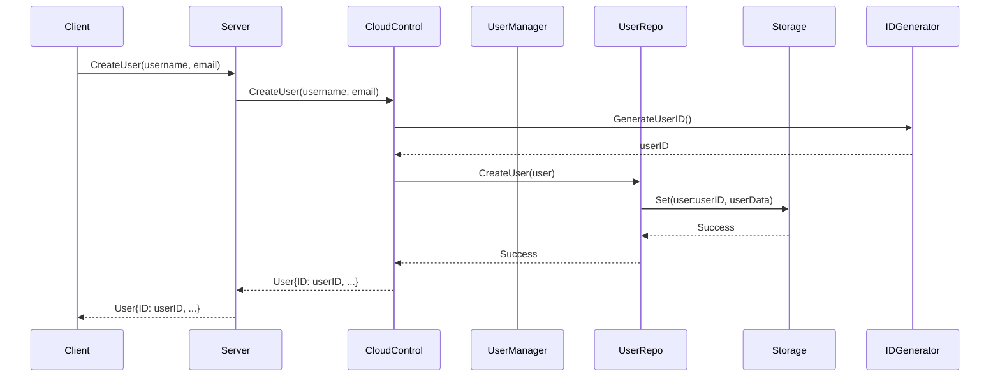
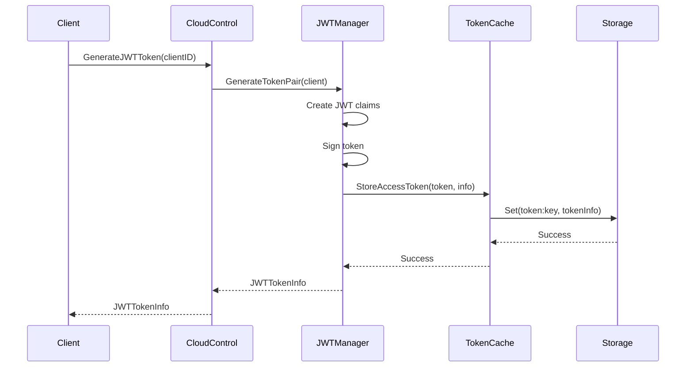
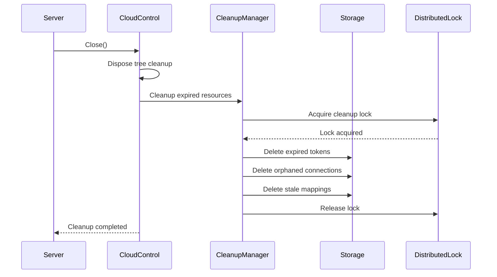

# Architecture Design

## Overview

Tunnox Core is built with a sophisticated layered architecture that emphasizes **engineering elegance**, **maintainability**, **scalability**, and **resource management**. The system is designed around the concept of a **Dispose tree**, where all resources are managed hierarchically for safe and graceful shutdown.

## 🏗️ Core Design Principles

### 1. Layered Architecture

The system follows a clean layered architecture with clear separation of concerns:

```
┌─────────────────────────────────────────────────────────────┐
│                    Application Layer                        │
│  ┌─────────────────┐  ┌─────────────────┐  ┌──────────────┐ │
│  │   Server Entry  │  │   Configuration │  │   Protocol   │ │
│  │     Point       │  │   Management    │  │   Manager    │ │
│  └─────────────────┘  └─────────────────┘  └──────────────┘ │
└─────────────────────────────────────────────────────────────┘
┌─────────────────────────────────────────────────────────────┐
│                    Business Layer                           │
│  ┌─────────────────────────────────────────────────────────┐ │
│  │                CloudControl Bus                         │ │
│  │  ┌─────────────┐ ┌─────────────┐ ┌─────────────────────┐ │ │
│  │  │JWT Manager  │ │Stats Manager│ │   Other Managers    │ │ │
│  │  └─────────────┘ └─────────────┘ └─────────────────────┘ │ │
│  └─────────────────────────────────────────────────────────┘ │
└─────────────────────────────────────────────────────────────┘
┌─────────────────────────────────────────────────────────────┐
│                     Data Layer                              │
│  ┌─────────────────┐  ┌─────────────────────────────────────┐ │
│  │   Repositories  │  │         Storage Abstraction         │ │
│  │  ┌─────────────┐ │  │  ┌─────────────┐ ┌─────────────┐   │ │
│  │  │User Repo    │ │  │  │   Memory    │ │    Redis    │   │ │
│  │  │Client Repo  │ │  │  │   Storage   │ │   Storage   │   │ │
│  │  │Mapping Repo │ │  │  └─────────────┘ └─────────────┘   │ │
│  │  └─────────────┘ │  └─────────────────────────────────────┘ │
│  └─────────────────┘  └─────────────────────────────────────┘ │
└─────────────────────────────────────────────────────────────┘
┌─────────────────────────────────────────────────────────────┐
│                 Infrastructure Layer                        │
│  ┌─────────────────┐  ┌─────────────────────────────────────┐ │
│  │   Distributed   │  │         Protocol Layer              │ │
│  │   Services      │  │  ┌─────────────┐ ┌─────────────┐   │ │
│  │  ┌─────────────┐ │  │  │    TCP      │ │ WebSocket   │   │ │
│  │  │ID Generator │ │  │  │  Adapter    │ │  Adapter    │   │ │
│  │  │Distributed  │ │  │  └─────────────┘ └─────────────┘   │ │
│  │  │   Lock      │ │  │  ┌─────────────┐ ┌─────────────┐   │ │
│  │  └─────────────┘ │  │  │    UDP      │ │    QUIC     │   │ │
│  └─────────────────┘ │  │  │  Adapter    │ │  Adapter    │   │ │
│                      │  │  └─────────────┘ └─────────────┘   │ │
│                      │  └─────────────────────────────────────┘ │
└─────────────────────────────────────────────────────────────┘
```

### 2. Dispose Tree Resource Management

All components that require resource cleanup implement the `utils.Dispose` interface, forming a hierarchical tree structure:

```
Server (Root)
├── CloudControl
│   ├── JWTManager
│   │   └── TokenCacheManager
│   ├── StatsManager
│   ├── NodeManager
│   ├── AnonymousManager
│   ├── SearchManager
│   ├── ConnectionManager
│   ├── ConfigManager
│   ├── CleanupManager
│   ├── DistributedIDGenerator
│   └── DistributedLock
├── ProtocolManager
│   ├── TcpAdapter
│   ├── WebSocketAdapter
│   ├── UdpAdapter
│   └── QuicAdapter
└── Storage Backends
    ├── MemoryStorage
    ├── RedisStorage
    └── CustomStorage
```

**Benefits:**
- **Automatic cascading cleanup** when parent is disposed
- **Prevents resource leaks** through systematic cleanup
- **Clear ownership hierarchy** with explicit parent-child relationships
- **Thread-safe disposal** with proper synchronization
- **Graceful shutdown** ensuring all resources are properly released

### 3. Manager Pattern Architecture

The business logic is organized into specialized managers, each responsible for a specific domain:

#### Manager Responsibilities

| Manager | Responsibility | Key Features |
|---------|---------------|--------------|
| **JWTManager** | Authentication & Token Management | Token generation, validation, refresh, caching |
| **StatsManager** | Statistics & Analytics | User stats, client stats, system stats, traffic analytics |
| **NodeManager** | Node Management | Node registration, health monitoring, service discovery |
| **AnonymousManager** | Anonymous User Management | Anonymous client creation, temporary mappings |
| **SearchManager** | Search & Discovery | User search, client search, mapping search |
| **ConnectionManager** | Connection Tracking | Connection registration, monitoring, cleanup |
| **ConfigManager** | Configuration Management | Dynamic config updates, watchers, hot reload |
| **CleanupManager** | Resource Cleanup | Scheduled cleanup tasks, expired resource removal |

#### Manager Integration

```go
type CloudControl struct {
    // Core dependencies
    config            *ControlConfig
    storage           storages.Storage
    idGen             *distributed.DistributedIDGenerator
    
    // Repositories
    userRepo          *repos.UserRepository
    clientRepo        *repos.ClientRepository
    mappingRepo       *repos.PortMappingRepo
    nodeRepo          *repos.NodeRepository
    connRepo          *repos.ConnectionRepo
    
    // Business managers
    jwtManager        *JWTManager
    statsManager      *StatsManager
    nodeManager       *NodeManager
    anonymousManager  *AnonymousManager
    searchManager     *SearchManager
    connectionManager *ConnectionManager
    configManager     *ConfigManager
    cleanupManager    *CleanupManager
    
    // Infrastructure
    lock              distributed.DistributedLock
    cleanupTicker     *time.Ticker
    done              chan bool
    utils.Dispose
}
```

### 4. Repository Pattern

Each entity type has its own repository for clean data access:

```go
// Repository interfaces
type UserRepository interface {
    CreateUser(user *models.User) error
    GetUser(userID string) (*models.User, error)
    UpdateUser(user *models.User) error
    DeleteUser(userID string) error
    ListUsers(userType models.UserType) ([]*models.User, error)
}

type ClientRepository interface {
    CreateClient(client *models.Client) error
    GetClient(clientID string) (*models.Client, error)
    UpdateClient(client *models.Client) error
    DeleteClient(clientID string) error
    ListUserClients(userID string) ([]*models.Client, error)
}

// ... other repositories
```

**Benefits:**
- **Clean separation** of data access logic
- **Testability** through interface mocking
- **Storage abstraction** allowing different backends
- **Consistent data operations** across the application

### 5. Storage Abstraction

The storage layer provides a unified interface for different storage backends:

```go
type Storage interface {
    Set(key string, value interface{}, ttl time.Duration) error
    Get(key string) (interface{}, error)
    Delete(key string) error
    Exists(key string) (bool, error)
    Close() error
}
```

**Supported Backends:**
- **MemoryStorage**: In-memory storage for development and testing
- **RedisStorage**: Redis-based storage for production
- **CustomStorage**: Extensible interface for custom backends

## 🔄 Data Flow

### 1. User Registration Flow



### 2. JWT Token Generation Flow



### 3. Resource Cleanup Flow



## 🛡️ Error Handling

### Error Types

```go
// Domain-specific errors
type UserNotFoundError struct {
    UserID string
}

type ClientAlreadyExistsError struct {
    ClientID int64
}

type TokenExpiredError struct {
    TokenID string
}

// Infrastructure errors
type StorageError struct {
    Operation string
    Key       string
    Cause     error
}

type DistributedLockError struct {
    LockKey string
    Cause   error
}
```

### Error Handling Patterns

```go
// Graceful degradation
func (m *StatsManager) GetUserStats(userID string) (*stats.UserStats, error) {
    user, err := m.userRepo.GetUser(userID)
    if err != nil {
        if errors.Is(err, &UserNotFoundError{}) {
            return nil, fmt.Errorf("user not found: %s", userID)
        }
        return nil, fmt.Errorf("failed to get user: %w", err)
    }
    
    // Continue with stats calculation...
}

// Resource cleanup on error
func (m *JWTManager) GenerateTokenPair(ctx context.Context, client *models.Client) (*JWTTokenInfo, error) {
    tokenID, err := m.generateTokenID()
    if err != nil {
        return nil, fmt.Errorf("generate token ID failed: %w", err)
    }
    
    // If any step fails, cleanup resources
    defer func() {
        if err != nil {
            m.cache.RevokeAccessToken(ctx, tokenID)
        }
    }()
    
    // Continue with token generation...
}
```

## 🔧 Configuration Management

### Configuration Structure

```go
type ControlConfig struct {
    // API Configuration
    APIEndpoint string        `json:"api_endpoint"`
    APIKey      string        `json:"api_key,omitempty"`
    APISecret   string        `json:"api_secret,omitempty"`
    Timeout     time.Duration `json:"timeout"`
    
    // Node Configuration
    NodeID      string        `json:"node_id,omitempty"`
    NodeName    string        `json:"node_name,omitempty"`
    UseBuiltIn  bool          `json:"use_built_in"`
    
    // JWT Configuration
    JWTSecretKey      string        `json:"jwt_secret_key"`
    JWTExpiration     time.Duration `json:"jwt_expiration"`
    RefreshExpiration time.Duration `json:"refresh_expiration"`
    JWTIssuer         string        `json:"jwt_issuer"`
}
```

### Dynamic Configuration

The `ConfigManager` supports dynamic configuration updates:

```go
// Register configuration watchers
configManager.AddWatcher(myComponent)

// Update configuration
err := configManager.UpdateConfig(ctx, newConfig)

// Watchers are automatically notified
func (c *MyComponent) OnConfigChanged(config *ControlConfig) {
    // Handle configuration changes
}
```

## 🚀 Performance Considerations

### Memory Management

- **Buffer Pools**: Efficient memory usage through buffer pooling
- **Zero-copy Operations**: Minimize memory allocations where possible
- **Garbage Collection Optimization**: Structured to minimize GC pressure

### Concurrency

- **Thread-safe Operations**: All components are designed for concurrent access
- **Connection Pooling**: Optimized connection reuse for scalability
- **Non-blocking I/O**: Asynchronous operations for better performance

### Scalability

- **Horizontal Scaling**: Support for multiple nodes through distributed services
- **Load Balancing**: Intelligent traffic distribution capabilities
- **Stateless Design**: Where possible, components are stateless for better scaling

## 🔒 Security

### Authentication

- **JWT-based Token Authentication**: Secure token-based authentication
- **Token Refresh Mechanism**: Automatic token renewal
- **Secure Key Management**: Proper key storage and rotation

### Authorization

- **Role-based Access Control**: Granular permission management
- **Resource-level Permissions**: Fine-grained access control
- **Audit Logging**: Comprehensive security event logging

### Data Protection

- **Input Validation**: Comprehensive input sanitization
- **Secure Communication**: Encrypted data transmission
- **Token Revocation**: Immediate token invalidation capabilities

## 🔮 Future Extensibility

### Protocol Support

- **HTTP/HTTPS Adapter**: Web-based protocol support
- **Custom Protocol Adapters**: Framework for custom protocols
- **Protocol Versioning**: Backward compatibility support

### Storage Backends

- **PostgreSQL Support**: Relational database integration
- **MongoDB Support**: Document database integration
- **Distributed Storage**: Multi-region storage support

### Monitoring and Observability

- **Metrics Collection**: Prometheus-compatible metrics
- **Distributed Tracing**: OpenTelemetry integration
- **Health Checks**: Comprehensive health monitoring
- **Alerting**: Automated alerting and notification

## 📋 Development Guidelines

### Code Organization

- **Clear Separation of Concerns**: Each component has a single responsibility
- **Interface-driven Design**: Dependencies are defined through interfaces
- **Comprehensive Unit Tests**: 100% test coverage for all public APIs
- **Documentation**: All public APIs are documented

### Resource Management

- **Dispose Interface**: All resources must implement the Dispose interface
- **Proper Error Handling**: Comprehensive error handling and cleanup
- **Memory Leak Prevention**: Systematic resource cleanup
- **Performance Monitoring**: Continuous performance monitoring

### Testing Strategy

- **Unit Tests**: Individual component testing
- **Integration Tests**: End-to-end workflow testing
- **Performance Benchmarks**: Performance regression testing
- **Resource Leak Detection**: Automated resource leak detection

---

## 🎯 Architecture Benefits

### For Developers

- **Clear Structure**: Easy to understand and navigate
- **Testability**: Comprehensive testing capabilities
- **Extensibility**: Simple to add new features
- **Maintainability**: Clean, well-organized code

### For Operations

- **Reliability**: Robust error handling and recovery
- **Scalability**: Horizontal and vertical scaling support
- **Monitoring**: Comprehensive observability
- **Security**: Multi-layered security approach

### For Business

- **Performance**: High-performance, low-latency operations
- **Flexibility**: Adaptable to changing requirements
- **Cost-effectiveness**: Efficient resource utilization
- **Future-proof**: Designed for long-term evolution 