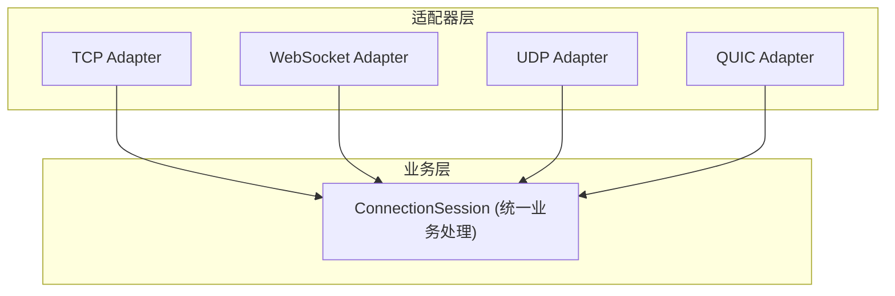

# Architecture Design

## Overview

tunnox-core is built with a layered architecture that emphasizes maintainability, extensibility, and resource management. The system is designed around the concept of a Dispose tree, where all resources are managed hierarchically for safe and graceful shutdown.

## Core Design Principles

### 1. Dispose Tree Resource Management

All components that require resource cleanup implement the `utils.Dispose` interface, forming a hierarchical tree structure:

```
Server (Root)
├── Manager
│   ├── TcpAdapter
│   ├── WebSocketAdapter
│   ├── UdpAdapter
│   └── QuicAdapter
│       └── ConnectionSession
│           └── PackageStream
└── CloudControl
    ├── UserRepository
    ├── ClientRepository
    ├── MappingRepository
    └── NodeRepository
```

**Benefits:**
- Automatic cascading cleanup when parent is disposed
- Prevents resource leaks
- Clear ownership hierarchy
- Thread-safe disposal

### 2. Layered Protocol Adapter Architecture

The protocol layer is designed for extensibility and clean separation of concerns:

```
Manager
├── Adapter Interface
│   ├── BaseAdapter (common functionality)
│   ├── TcpAdapter (TCP implementation)
│   ├── WebSocketAdapter (WebSocket implementation)
│   ├── UdpAdapter (UDP implementation)
│   └── QuicAdapter (QUIC implementation)
```

**Key Features:**
- Unified interface for all protocol adapters
- Hot-plug capability
- Independent lifecycle management
- Consistent error handling

### 3. Session-Based Connection Management

Each connection is managed through a dedicated session:

```
ConnectionSession
├── PackageStream (data transport)
├── Command Handlers (business logic)
└── Resource Management (Dispose integration)
```

## Component Details

### Protocol Layer

#### Adapter Interface
```go
type Adapter interface {
    ConnectTo(serverAddr string) error
    ListenFrom(serverAddr string) error
    Start(ctx context.Context) error
    Stop() error
    Name() string
    GetReader() io.Reader
    GetWriter() io.Writer
    Close()
}
```

#### Example: TcpAdapter Implementation
- Listens on specified TCP port
- Calls `session.AcceptConnection(conn, conn)` for each connection
- Manages connection lifecycle
- Integrates with Dispose tree

### Stream Layer

#### PackageStream
- Thread-safe data transport
- Supports compression and rate limiting
- Memory pool optimization
- Context-aware operations

#### Features
- **Compression**: Gzip compression for data efficiency
- **Rate Limiting**: Token bucket algorithm for bandwidth control
- **Buffer Management**: Memory pool for performance
- **Error Handling**: Comprehensive error types and recovery

### Cloud Control Layer

#### Repository Pattern
Each entity type has its own repository:
- UserRepository: User management
- ClientRepository: Client registration and status
- MappingRepository: Port mapping configuration
- NodeRepository: Node management

#### Built-in Storage
- Memory-based storage for development
- Extensible to Redis, PostgreSQL, etc.
- Transaction support
- Automatic cleanup

## Data Flow

### Connection Establishment
1. Client connects to Adapter (TCP/WebSocket/UDP/QUIC)
2. Adapter calls `session.AcceptConnection(reader, writer)`
3. ConnectionSession creates PackageStream
4. PackageStream handles data transport
5. All components integrated into Dispose tree

### Packet Processing
1. PackageStream reads TransferPacket
2. ConnectionSession dispatches by CommandType
3. Command handlers process business logic
4. Response sent back through PackageStream

### Resource Cleanup
1. Server.Close() triggers Dispose tree cleanup
2. All child components automatically disposed
3. Resources released in correct order
4. No resource leaks

## Error Handling

### Error Types
- **Connection Errors**: Network-related issues
- **Protocol Errors**: Adapter or stream errors
- **Business Logic Errors**: Session/handler errors

### Error Handling Pattern

```go
if err := adapter.Start(ctx); err != nil {
    // Handle error
}
```

## Performance Considerations

### Memory Management
- Buffer pools for efficient memory usage
- Zero-copy operations where possible
- Automatic garbage collection optimization

### Concurrency
- Thread-safe operations throughout
- Connection pooling for scalability
- Non-blocking I/O operations

### Scalability
- Horizontal scaling through multiple nodes
- Load balancing support
- Stateless design where possible

## Security

### Authentication
- JWT-based token authentication
- Token refresh mechanism
- Secure key management

### Authorization
- Role-based access control
- Resource-level permissions
- Audit logging

### Data Protection
- Encryption support (planned)
- Secure communication channels
- Input validation and sanitization

## Future Extensibility

### Protocol Support
- HTTP/HTTPS adapter
- WebSocket adapter
- Custom protocol adapters

### Storage Backends
- Redis integration
- PostgreSQL support
- Distributed storage

### Monitoring and Observability
- Metrics collection
- Distributed tracing
- Health checks

## Development Guidelines

### Code Organization
- Clear separation of concerns
- Interface-driven design
- Comprehensive unit tests
- Documentation for all public APIs

### Resource Management
- All resources must implement Dispose
- Proper error handling and cleanup
- Memory leak prevention
- Performance monitoring

### Testing Strategy
- Unit tests for all components
- Integration tests for workflows
- Performance benchmarks
- Resource leak detection

# 多协议适配器架构

## 设计理念

- **协议无关**：所有协议适配器（TCP、WebSocket、UDP、QUIC）都实现统一的 Adapter 接口。
- **统一业务入口**：所有连接最终都交由 ConnectionSession.AcceptConnection(reader, writer) 处理，业务逻辑与协议解耦。
- **易于扩展**：新增协议只需实现 Adapter 接口并注册。
- **线程安全**：所有流和连接均为并发安全设计。

## 架构图



## Adapter 接口

```go
type Adapter interface {
    ConnectTo(serverAddr string) error
    ListenFrom(serverAddr string) error
    Start(ctx context.Context) error
    Stop() error
    Name() string
    GetReader() io.Reader
    GetWriter() io.Writer
    Close()
}
```

## ConnectionSession 统一业务入口

```go
func (s *ConnectionSession) AcceptConnection(reader io.Reader, writer io.Writer) {
    // 业务逻辑在这里实现，与协议无关
}
```

## 扩展新协议

1. 实现 Adapter 接口
2. 注册到协议管理器
3. 业务逻辑无需修改

## 典型调用流程

1. 适配器监听/连接
2. 新连接到来时，调用 session.AcceptConnection(reader, writer)
3. 业务逻辑处理
4. 连接关闭自动清理

## 适用场景
- 多协议中转/代理/隧道服务
- 需要统一业务逻辑、支持多种网络协议的场景
- 易于扩展和维护的大型分布式系统 