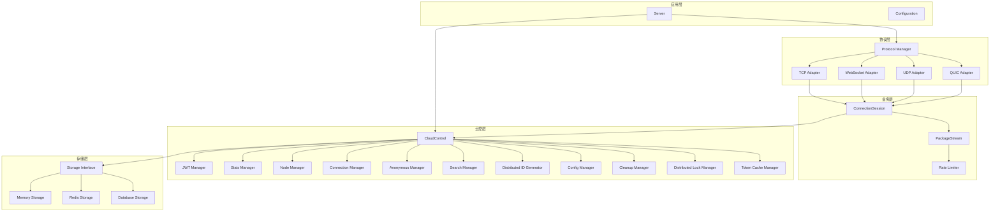
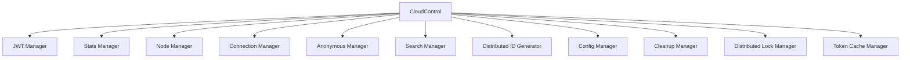
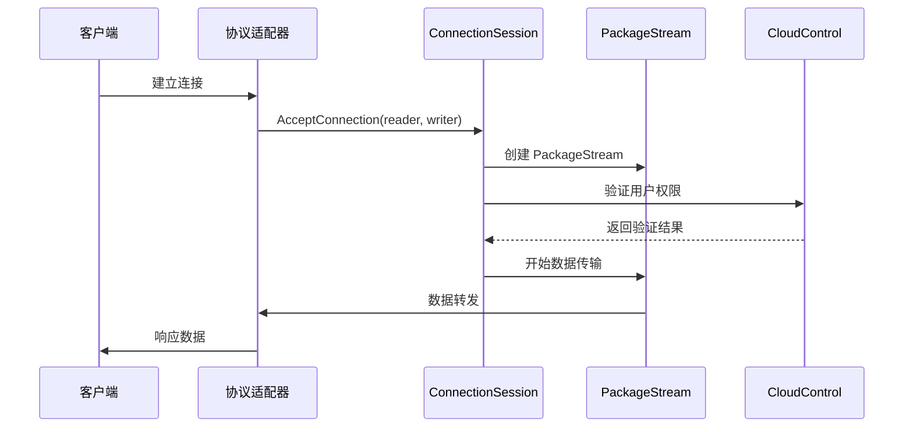

# Tunnox Core 架构设计

## 设计理念

Tunnox Core 采用分层架构设计，遵循以下核心理念：

- **协议无关性**：所有协议适配器（TCP、WebSocket、UDP、QUIC）都实现统一的 `Adapter` 接口
- **统一业务入口**：所有连接最终都交由 `ConnectionSession.AcceptConnection(reader, writer)` 处理，业务逻辑与协议解耦
- **管理器模式**：采用分层管理器架构，每个管理器负责特定的业务领域
- **资源管理**：所有资源型对象都实现 `Dispose` 接口，形成树状资源管理结构
- **易于扩展**：新增协议只需实现 `Adapter` 接口并注册，新增业务功能只需扩展相应的管理器
- **线程安全**：所有组件均为并发安全设计

## 整体架构



## 分层设计

### 1. 应用层 (Application Layer)

**职责**：系统入口、配置管理、生命周期管理

**组件**：
- `Server`：主服务器，协调各层组件
- `Configuration`：配置管理，支持多种配置源

**特点**：
- 统一的启动和关闭流程
- 配置的集中管理
- 优雅关闭支持

### 2. 协议层 (Protocol Layer)

**职责**：多协议适配、连接管理

**组件**：
- `ProtocolManager`：协议管理器，统一管理所有适配器
- `Adapter` 接口：统一的协议适配器接口
- 具体适配器：TCP、WebSocket、UDP、QUIC

**特点**：
- 协议无关的统一接口
- 动态注册和注销
- 并发安全的连接管理

### 3. 业务层 (Business Layer)

**职责**：业务逻辑处理、数据流控制

**组件**：
- `ConnectionSession`：连接会话，统一业务入口
- `PackageStream`：数据包流处理
- `RateLimiter`：流量控制

**特点**：
- 统一的业务处理入口
- 可插拔的业务逻辑
- 内置流量控制机制

### 4. 云控层 (Cloud Control Layer)

**职责**：云端控制、用户管理、权限控制

**组件**：
- `CloudControl`：云控主控制器
- 各种管理器：JWT、统计、节点、连接等

**特点**：
- 分层管理器架构
- 职责单一原则
- 可扩展的设计

### 5. 存储层 (Storage Layer)

**职责**：数据持久化、缓存管理

**组件**：
- `Storage` 接口：统一存储接口
- 具体实现：内存、Redis、数据库

**特点**：
- 存储后端可插拔
- 统一的存储接口
- 支持多种存储策略

## 管理器架构

### CloudControl 管理器结构



### 各管理器职责

| 管理器 | 职责 | 主要功能 |
|--------|------|----------|
| JWT Manager | JWT 令牌管理 | 生成、验证、刷新令牌 |
| Stats Manager | 统计信息管理 | 流量统计、性能监控 |
| Node Manager | 节点管理 | 节点注册、心跳、状态管理 |
| Connection Manager | 连接管理 | 连接池、连接状态跟踪 |
| Anonymous Manager | 匿名用户管理 | 临时用户创建、清理 |
| Search Manager | 搜索功能 | 用户、客户端、映射搜索 |
| Distributed ID Generator | 分布式 ID 生成 | 唯一 ID 生成、序列号管理 |
| Config Manager | 配置管理 | 动态配置、配置热更新 |
| Cleanup Manager | 清理管理 | 过期数据清理、资源回收 |
| Distributed Lock Manager | 分布式锁 | 并发控制、资源锁定 |
| Token Cache Manager | 令牌缓存 | 令牌缓存、过期管理 |

## 资源管理架构

### Dispose 树结构

所有需要资源释放的组件都实现 `utils.Dispose` 接口，形成树状结构：

```
Server (根节点)
├── CloudControl
│   ├── JWTManager
│   ├── StatsManager
│   ├── NodeManager
│   ├── ConnectionManager
│   ├── AnonymousManager
│   ├── SearchManager
│   ├── DistributedIDGenerator
│   ├── ConfigManager
│   ├── CleanupManager
│   ├── DistributedLockManager
│   └── TokenCacheManager
├── ProtocolManager
│   ├── TcpAdapter
│   ├── WebSocketAdapter
│   ├── UdpAdapter
│   └── QuicAdapter
│       └── ConnectionSession
│           └── PackageStream
└── Storage Backends
    ├── MemoryStorage
    ├── RedisStorage
    └── DatabaseStorage
```

**优点**：
- 父节点释放时自动级联清理
- 防止资源泄漏
- 结构清晰
- 并发安全

### 资源释放流程

```go
// 资源释放示例
func (s *Server) Close() {
    // 1. 关闭协议管理器
    s.protocolManager.CloseAll()
    
    // 2. 关闭云控（自动级联关闭所有管理器）
    s.cloudControl.Close()
    
    // 3. 关闭存储后端
    s.storage.Close()
}
```

## 数据流架构

### 连接处理流程



### 数据包处理流程

1. **连接建立**：客户端连接到适配器
2. **会话创建**：适配器调用 `session.AcceptConnection()`
3. **权限验证**：通过云控验证用户权限
4. **流创建**：创建 `PackageStream` 处理数据
5. **数据传输**：在流中进行数据转发
6. **连接关闭**：自动清理资源

## 错误处理架构

### 错误分类

1. **网络错误**：连接超时、网络中断
2. **协议错误**：适配器错误、流错误
3. **业务错误**：权限验证失败、资源不足
4. **系统错误**：配置错误、存储错误

### 错误处理策略

```go
// 统一的错误处理模式
func handleError(err error, context string) {
    switch {
    case errors.Is(err, ErrNetworkTimeout):
        log.Printf("网络超时: %s", context)
        // 重试逻辑
    case errors.Is(err, ErrPermissionDenied):
        log.Printf("权限拒绝: %s", context)
        // 权限处理
    case errors.Is(err, ErrResourceExhausted):
        log.Printf("资源耗尽: %s", context)
        // 资源清理
    default:
        log.Printf("未知错误: %s - %v", context, err)
        // 通用处理
    }
}
```

## 配置管理架构

### 配置层次

1. **默认配置**：内置默认值
2. **文件配置**：YAML/JSON 配置文件
3. **环境变量**：环境变量覆盖
4. **运行时配置**：动态配置更新

### 配置结构

```yaml
# 服务器配置
server:
  port: 8080
  host: "0.0.0.0"
  timeout: 30s

# 云控配置
cloud:
  jwt:
    secret: "your-secret-key"
    expires: 24h
  storage:
    type: "memory"  # memory, redis, database
    redis:
      addr: "localhost:6379"
      password: ""
      db: 0

# 协议配置
protocols:
  tcp:
    enabled: true
    port: 8080
  websocket:
    enabled: true
    port: 8081
  udp:
    enabled: true
    port: 8082
  quic:
    enabled: true
    port: 8083
```

## 性能优化架构

### 连接池管理

```go
// 连接池配置
type ConnectionPoolConfig struct {
    MaxConnections    int           // 最大连接数
    MaxIdleConnections int          // 最大空闲连接数
    IdleTimeout       time.Duration // 空闲超时时间
    ConnectionTimeout time.Duration // 连接超时时间
}
```

### 缓存策略

1. **JWT 令牌缓存**：减少重复验证
2. **用户信息缓存**：减少数据库查询
3. **配置缓存**：减少配置读取开销
4. **连接缓存**：复用连接资源

### 并发控制

1. **协程池**：限制并发协程数量
2. **限流器**：控制请求频率
3. **分布式锁**：防止资源竞争
4. **原子操作**：保证数据一致性

## 安全架构

### 认证机制

1. **JWT 令牌**：无状态认证
2. **客户端证书**：双向认证
3. **API 密钥**：服务间认证

### 授权机制

1. **基于角色的访问控制 (RBAC)**
2. **基于资源的权限控制**
3. **动态权限更新**

### 数据安全

1. **传输加密**：TLS/SSL
2. **数据加密**：敏感数据加密存储
3. **访问审计**：操作日志记录

## 监控架构

### 指标收集

1. **性能指标**：响应时间、吞吐量
2. **资源指标**：CPU、内存、网络
3. **业务指标**：用户数、连接数、错误率

### 日志管理

1. **结构化日志**：JSON 格式
2. **日志级别**：DEBUG、INFO、WARN、ERROR
3. **日志轮转**：按大小和时间轮转

### 告警机制

1. **阈值告警**：资源使用率告警
2. **异常告警**：错误率告警
3. **业务告警**：业务指标异常

## 扩展性设计

### 水平扩展

1. **无状态设计**：支持多实例部署
2. **负载均衡**：请求分发
3. **数据分片**：数据水平分割

### 垂直扩展

1. **模块化设计**：按需加载模块
2. **插件机制**：动态加载插件
3. **配置热更新**：运行时配置更新

### 协议扩展

```go
// 新增协议适配器
type CustomAdapter struct {
    // 实现 Adapter 接口
}

func (c *CustomAdapter) ConnectTo(serverAddr string) error {
    // 实现连接逻辑
}

func (c *CustomAdapter) ListenFrom(serverAddr string) error {
    // 实现监听逻辑
}

// 注册新适配器
customAdapter := protocol.NewCustomAdapter(ctx, session)
pm.Register(customAdapter)
```

## 部署架构

### 单机部署

```
┌─────────────────┐
│   Tunnox Core   │
│                 │
│  ┌─────────────┐│
│  │   Server    ││
│  └─────────────┘│
│  ┌─────────────┐│
│  │ CloudControl││
│  └─────────────┘│
│  ┌─────────────┐│
│  │   Storage   ││
│  └─────────────┘│
└─────────────────┘
```

### 分布式部署

```
┌─────────────────┐    ┌─────────────────┐    ┌─────────────────┐
│  Tunnox Core 1  │    │  Tunnox Core 2  │    │  Tunnox Core 3  │
│                 │    │                 │    │                 │
│  ┌─────────────┐│    │  ┌─────────────┐│    │  ┌─────────────┐│
│  │   Server    ││    │  │   Server    ││    │  │   Server    ││
│  └─────────────┘│    │  └─────────────┘│    │  └─────────────┘│
│  ┌─────────────┐│    │  ┌─────────────┐│    │  ┌─────────────┐│
│  │ CloudControl││    │  │ CloudControl││    │  │ CloudControl││
│  └─────────────┘│    │  └─────────────┘│    │  └─────────────┘│
└─────────────────┘    └─────────────────┘    └─────────────────┘
         │                       │                       │
         └───────────────────────┼───────────────────────┘
                                 │
                    ┌─────────────────┐
                    │   Load Balancer │
                    └─────────────────┘
                                 │
                    ┌─────────────────┐
                    │   Shared Storage│
                    │  (Redis/DB)     │
                    └─────────────────┘
```

## 总结

Tunnox Core 的分层架构设计提供了：

1. **高内聚低耦合**：各层职责明确，相互依赖最小
2. **可扩展性**：支持水平扩展和垂直扩展
3. **可维护性**：模块化设计，便于维护和升级
4. **高性能**：优化的数据流和资源管理
5. **高可用**：完善的错误处理和监控机制
6. **安全性**：多层次的安全防护
7. **易用性**：统一的接口和配置管理

这种架构设计使得 Tunnox Core 能够适应各种复杂的网络环境和业务需求，同时保持良好的性能和可维护性。 