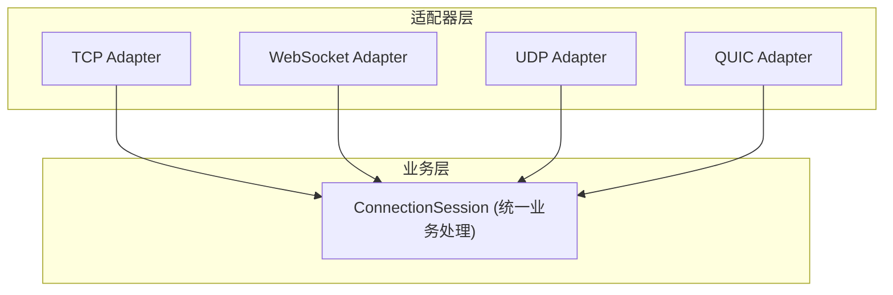

# 多协议适配器架构

## 设计理念

- **协议无关**：所有协议适配器（TCP、WebSocket、UDP、QUIC）都实现统一的 Adapter 接口。
- **统一业务入口**：所有连接最终都交由 ConnectionSession.AcceptConnection(reader, writer) 处理，业务逻辑与协议解耦。
- **易于扩展**：新增协议只需实现 Adapter 接口并注册。
- **线程安全**：所有流和连接均为并发安全设计。

## 架构图



## Adapter 接口

```go
type Adapter interface {
    ConnectTo(serverAddr string) error
    ListenFrom(serverAddr string) error
    Start(ctx context.Context) error
    Stop() error
    Name() string
    GetReader() io.Reader
    GetWriter() io.Writer
    Close()
}
```

## ConnectionSession 统一业务入口

```go
func (s *ConnectionSession) AcceptConnection(reader io.Reader, writer io.Writer) {
    // 业务逻辑在这里实现，与协议无关
}
```

## 扩展新协议

1. 实现 Adapter 接口
2. 注册到 Manager
3. 业务逻辑无需修改

## 典型调用流程

1. 适配器监听/连接
2. 新连接到来时，调用 session.AcceptConnection(reader, writer)
3. 业务逻辑处理
4. 连接关闭自动清理

## 适用场景
- 多协议中转/代理/隧道服务
- 需要统一业务逻辑、支持多种网络协议的场景
- 易于扩展和维护的大型分布式系统

## Dispose树资源管理

所有需要资源释放的组件都实现 `utils.Dispose` 接口，形成树状结构：

```
Server (根)
├── Manager
│   ├── TcpAdapter
│   ├── WebSocketAdapter
│   ├── UdpAdapter
│   └── QuicAdapter
│       └── ConnectionSession
│           └── PackageStream
└── CloudControl
    ├── UserRepository
    ├── ClientRepository
    ├── MappingRepository
    └── NodeRepository
```

**优点：**
- 父节点释放时自动级联清理
- 防止资源泄漏
- 结构清晰
- 并发安全

## 数据流与资源释放

1. 客户端连接到 Adapter（TCP/WebSocket/UDP/QUIC）
2. Adapter 调用 session.AcceptConnection(reader, writer)
3. ConnectionSession 创建 PackageStream
4. PackageStream 负责数据传输
5. 所有组件纳入 Dispose 树统一管理

## 错误处理

- **连接错误**：网络相关问题
- **协议错误**：适配器或流错误
- **业务错误**：Session/handler 错误

```go
if err := adapter.Start(ctx); err != nil {
    // 错误处理
}
``` 