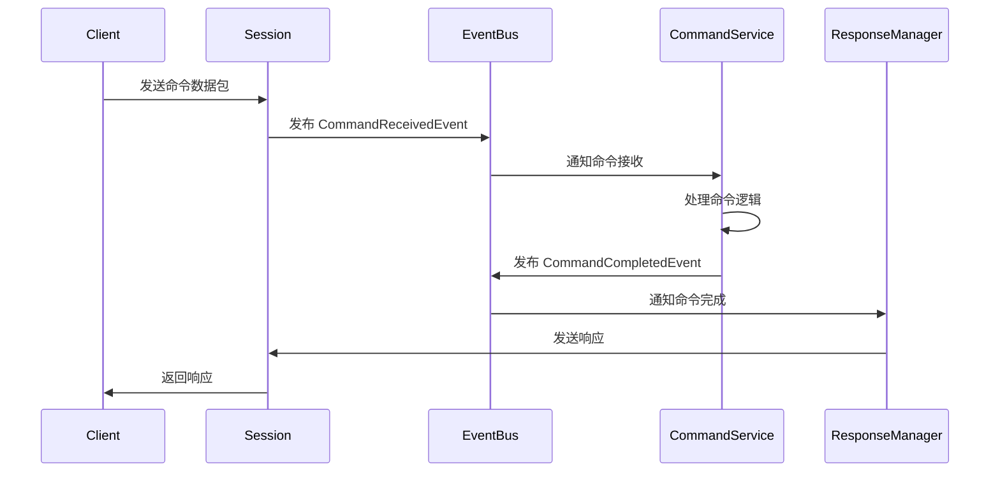
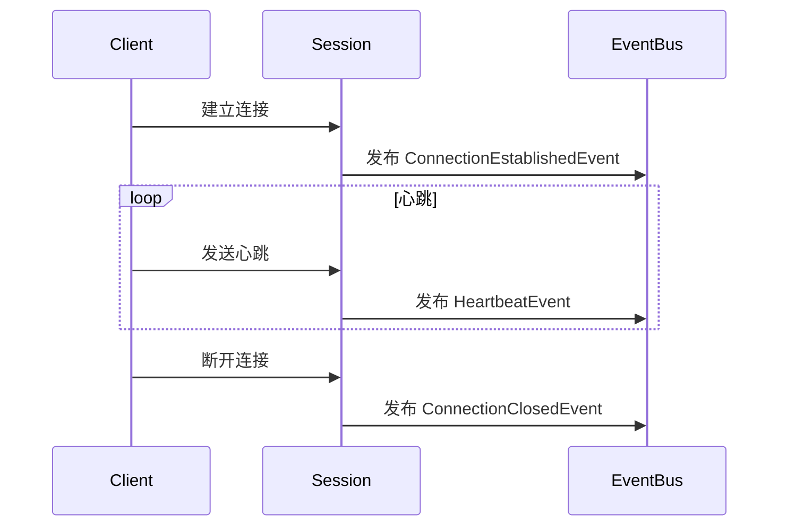

# 事件驱动架构 (Event-Driven Architecture)

## 概述

本项目已成功重构为事件驱动架构，解决了Session和Command系统之间的循环依赖问题。通过事件总线实现组件间的解耦，提高了系统的可扩展性和可维护性。

## 架构设计

### 核心组件

#### 1. 事件总线 (EventBus)
- **位置**: `internal/core/events/event_bus.go`
- **功能**: 负责事件的发布、订阅和分发
- **特性**: 
  - 异步事件处理
  - 支持多个处理器订阅同一事件
  - 线程安全
  - 优雅关闭

#### 2. 事件定义 (Events)
- **位置**: `internal/core/events/events.go`
- **事件类型**:
  - `CommandReceivedEvent`: 命令接收事件
  - `CommandCompletedEvent`: 命令完成事件
  - `ConnectionEstablishedEvent`: 连接建立事件
  - `ConnectionClosedEvent`: 连接关闭事件
  - `HeartbeatEvent`: 心跳事件

#### 3. Session管理器
- **位置**: `internal/protocol/session/manager.go`
- **功能**: 管理连接生命周期，发布相关事件
- **事件发布**:
  - 连接建立时发布 `ConnectionEstablishedEvent`
  - 收到命令时发布 `CommandReceivedEvent`
  - 收到心跳时发布 `HeartbeatEvent`
  - 连接关闭时发布 `ConnectionClosedEvent`

#### 4. Command服务
- **位置**: `internal/command/service.go`
- **功能**: 订阅命令事件，处理命令逻辑
- **事件订阅**:
  - 订阅 `CommandReceivedEvent`
  - 处理完成后发布 `CommandCompletedEvent`

#### 5. Response管理器
- **位置**: `internal/protocol/session/response_manager.go`
- **功能**: 订阅命令完成事件，发送响应
- **事件订阅**:
  - 订阅 `CommandCompletedEvent`
  - 将响应发送给对应的连接

## 事件流程

### 命令处理流程



### 连接生命周期事件



## 使用示例

### 1. 创建事件总线

```go
ctx := context.Background()
eventBus := events.NewEventBus(ctx)
defer eventBus.Close()
```

### 2. 设置Session的事件总线

```go
sessionManager := session.NewSessionManager(idManager, ctx)
if err := sessionManager.SetEventBus(eventBus); err != nil {
    log.Fatalf("Failed to set event bus: %v", err)
}
```

### 3. 设置Command服务的事件总线

```go
commandService := command.NewCommandService(ctx)
if err := commandService.SetEventBus(eventBus); err != nil {
    log.Fatalf("Failed to set event bus: %v", err)
}

// 启动命令服务（开始监听事件）
if err := commandService.Start(); err != nil {
    log.Fatalf("Failed to start command service: %v", err)
}
```

### 4. 自定义事件处理器

```go
// 订阅自定义事件
handler := func(event events.Event) error {
    switch e := event.(type) {
    case *events.CommandReceivedEvent:
        log.Printf("Received command: %v", e.CommandType)
    case *events.ConnectionEstablishedEvent:
        log.Printf("Connection established: %s", e.ConnectionID)
    }
    return nil
}

if err := eventBus.Subscribe("CommandReceived", handler); err != nil {
    log.Fatalf("Failed to subscribe: %v", err)
}
```

## 优势

### 1. 解耦设计
- Session和Command系统不再直接依赖
- 通过事件总线进行通信
- 组件可以独立开发和测试

### 2. 可扩展性
- 新组件可以轻松订阅现有事件
- 支持多个处理器处理同一事件
- 便于添加新的业务逻辑

### 3. 可维护性
- 清晰的职责分离
- 事件驱动的调试更容易
- 代码结构更加清晰

### 4. 性能优化
- 异步事件处理
- 避免阻塞调用
- 支持并发处理

## 测试

运行事件系统测试：

```bash
go test ./internal/core/events/...
```

## 注意事项

1. **事件顺序**: 事件处理是异步的，不保证严格的顺序
2. **错误处理**: 事件处理器中的错误会被记录但不会中断其他处理器
3. **资源清理**: 确保在关闭时正确取消事件订阅
4. **事件类型**: 使用类型断言时要注意事件类型匹配

## 未来扩展

1. **持久化事件**: 支持事件持久化到存储
2. **事件重放**: 支持事件重放功能
3. **分布式事件**: 支持跨节点的分布式事件总线
4. **事件监控**: 添加事件处理的监控和指标
5. **事件版本**: 支持事件版本管理和兼容性 